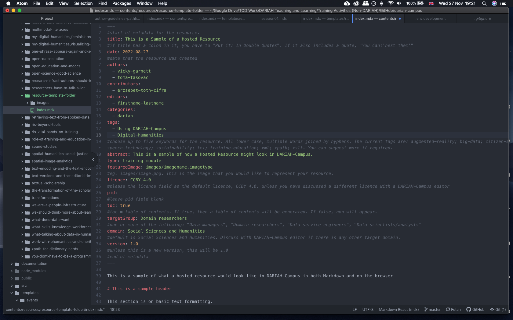
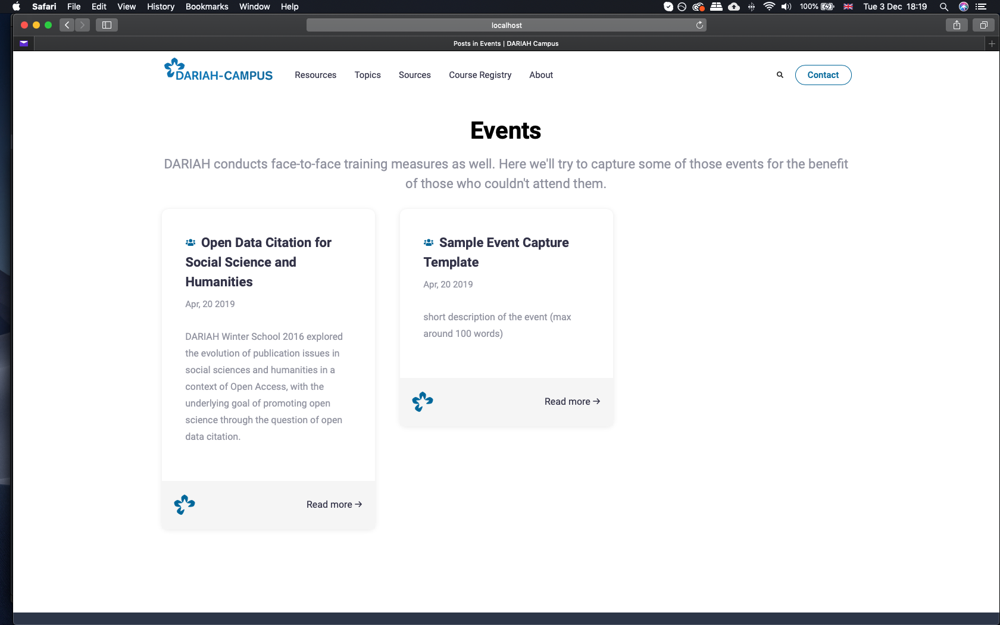

When you work on your own learning resource, you will work locally, on your computer, in the locally cloned fork of DARIAH-Campus.

To help you start working on your contribution in Markdown, we have created templates that you can use.

## Starting with a template

### Hosted resource

Once you have set up DARIAH-Campus on your computer, you can use the `resource-template-folder` as a basis for your contribution.

You can find this template folder in your local working copy in the ‘templates’ folder i.e: `dariah-campus > templates > resources > resource-template-folder`


**Copy** (do not ‘drag and drop’) the entire folder, and then **paste** it into the ‘resources’ folder:


Once you have compied the template to your local ‘resources’ folder, you can start editing. You can see an example of the `index.mdx` file here:



Within this file, you will write all the content you want to include in your resource. If you need a little more assistance in how to format this, or to include certain elements, such as videos, images, or tables, please take a look at our ‘Writing in Markdown’ guide in the ‘GitHub Workflow section.

When you have your content in the index.mdx file, save it, and if you are running a local version of DARIAH-Campus in your browser, you should see your event appear in the ‘Resources’ page, as in here:


Once you are happy with your draft hosted resource, you can submit it to the DARIAH-Campus team via GitHub.

### Pathfinder

Once you have set up DARIAH-Campus on your computer, you can use the `pathfinder-template-folder` as a basis for your contribution.

You can find this template folder in your local working copy in the ‘templates’ folder i.e.

`dariah-campus > templates > resources > pathfinder-template-folder`


**Copy** (do not ‘drag and drop’) the entire folder, and then **paste** it into the ‘resources’ folder in your fork


When you have these templates in your local ‘resources’ fork, you can start editing. You can see an example of the edited `index.mdx` file here:


Within this file, you will write all the content you want to include in your resource. If you need a little more assistance in how to format this, or to include certain elements, such as videos, images, or tables, please take a look at our ‘Writing in Markdown’ guide in the ‘GitHub Workflow section.

When you have your content in the index.mdx file, save it (although we also recommend saving this iteratively in your GitHub editor as a matter of course), and if you are running a local version of DARIAH-Campus in your browser you should see your event appear in the ‘Resources’ page, as in here:


Once you are happy with your draft hosted resource, you can submit it to the DARIAH-Campus team via GitHub.

### Event

Once you have set up DARIAH-Campus on your computer, you can use the `event-template-folder` as a basis for your contribution.

You can find this template folder in your local working copy in the ‘templates’ folder i.e.

`dariah-campus > templates > events > event-template-folder`


**Copy** (do not ‘drag and drop’) the entire folder, and then **paste** it into the ‘content/events’ folder in your fork.


When you have these templates in your local ‘events’ fork, you can start editing. You can see an example of the edited `index.mdx` file here:


Within this file, you will write all the content you want to include in your captured event. If you need a little more assistance in how to format this, or to include certain elements, such as videos, images, or tables, please take a look at our ‘Writing in Markdown’ guide in the ‘GitHub Workflow section.

When you have your content in the index.mdx file, save it (although we also recommend saving this iteratively in your GitHub editor as a matter of course), and if you are running a local version of DARIAH-Campus in your browser you should see your event appear in the ‘Events’ page, as in here:



Once you are happy with your 'Captured Event', you can ‘commit’ it via GitHub to the DARIAH-Campus team.

## Creating content

### Setting the Metadata for Citation

The metadata of your resource is important as it forms the basis of the **citation** recommendation that you will see at the top of all the training resources. In order to ensure that this citation is correct, you will need to make sure you have the following information to hand:

- The Title of Your Resource
- The names of any authors, contributing authors or editors of your resource
- The 'type' of training resource it is, e.g. 'training module', 'video'
- The URL for where the resource is currently located. This is called the '**remoteUrl**' in the metadata (this only applies for External Resources)
- The date your training resource was originally published. This is called the '**remotePublicationDate**' in the metadata (this only applies for External Resources)
- The name of the organisation, or project that your resource comes from e.g. 'PARTHENOS-EU'. This is called the '**remotePublisher**' in the metadata (this only applies for External Resources)

You can see how these metadata items fit into the citation below: 

The specific metadata that is required for your resource type is given at the top of all the index.mdx files in our template folders (see above), and it also comes with some guidance notes to help you find the information you need. There are more metadata fields for you to fill in, but these metadata fields above are particularly important for the citation.

### Writing in Markdown

DARIAH-Campus content needs to be written in Markdown. This can seem intimidating if you have not done it before, but there are many online guides to getting started with Markdown. For instance, Programming Historian have an excellent introduction, [Getting Started with Markdown](https://programminghistorian.org/lessons/getting-started-with-markdown).

Text must be provided in a text editor such as Atom, TextWrangler, TextEdit, or Notepad++ rather than in a word processor such as MS Word.

The templates provided in the previous section should help you get started, but we'll be happy to provide more guidance at any stage of the preparation and submission process.

### Multimedia

#### Images

Learning resources benefit from images to break up the text and for illustrative and instructive purposes. The exact nature and content of these images is flexible according to the type and topic area of your learning resource. They can range from photographs; to infographics; diagrams; maps; screenshots and more. These images should be incorporated into the body of your resource using the following code:

```markdown

```

The path or URL to the image asset is in parentheses. The text in square brackets is the alt text.

To add a link to an image, enclose the Markdown for the image in brackets, and then add the link in parentheses.

```markdown
[](https://linktotheimage.eu)
```

We ask authors to use intelligible file names that either indicate the content of the image (data-reuse-diagram.png) or indicate which figure it is within the module (research-infrastructures-fig-1.png). Prepare either .png or .jpg and upload at largest possible size. Check image reuse rights and choose content in the public domain and under Creative Commons licenses. Provide a descriptive figure caption, including source for third-party images, and other information such as shelfmark where relevant.

#### Videos

Videos are welcomed, since they provide vital contextual information on a subject and/or step-by-step guidance to complete exercises and practical task. To include a video as part of your material, you can upload it to the DARIAH-Campus YouTube channel, or link to the video on your own channel. These videos are included into the body of your material using the following code:

To insert a YouTube video, use the following code:

```jsx
<VideoCard
  title="Title of the Video"
  id="SI3u9nu7YEY"
  image="images/imagename.jpg"
/>
```

- the "id" is the part of the url after "v=" and before "&". So, for "https://www.youtube.com/watch?v=SI3u9nu7YEY&t=164s" it is: "SI3u9nu7YEY".
- "image" allows you to choose a screenshot that will appear until the learner clicks the play button.

There are other options for inserting videos; guidance for these can be found in the [Sample-resource template](https://github.com/DARIAH-ERIC/dariah-campus/tree/master/templates)

Any video published on the DARIAH-Campus YouTube Channel is covered by a Creative Commons Attribution-NonCommercial-ShareAlike 4.0 International (CC BY-NC-SA 4.0). We ask that any externally-hosted videos that you produce as part of your materials are also licenced for reuse.

If linking to third-party videos, insert the video using the above code, and provide the full details as a caption in your course text, in the following format: "Title, Source, URL (Licence)".

## Self-assessment activities

Self-assessment activities such as online tests or quizzes enliven the learning process; address different learning styles; and provide opportunities to expand upon the course content in the classroom or independently. These can include quizzes; exercises; assignments; questions to consider in a group discussion; practical step-by-step tutorials guiding learners through a task; and much more. Since the technical guidelines for including this kind of material will vary according to their nature, the DARIAH-Campus editorial team will be happy to discuss your requirements as you develop your resource.

## Language and readability

Where writing in English, keep an international audience in mind and avoid idioms and colloquialisms where possible. We are open to submissions in languages other than English. We are committed to inclusiveness, and welcome new additions to the editorial and reviewing team, in order to expand our reach. Please contact us via the DARIAH Helpdesk, if you would like to be a part of this team.

## Openness and Licencing

DARIAH-Campus learning materials are licensed under a Creative Commons CC BY-SA licence. This ensures that they are available for free; can be re-mixed and repurposed; and are easy to combine with other materials and courses. The integrity of the resource is ensured under the ‘Attribution’ requirement, whereby re-users must give appropriate credit, provide a link to the license, and indicate if changes were made.
