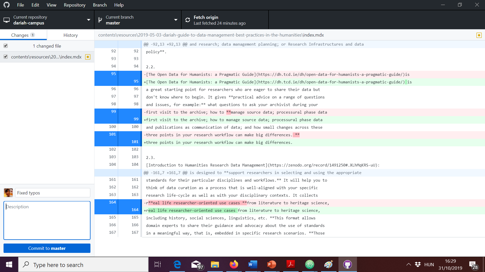

DARIAH-Campus uses GitHub for its editorial workflow.

Once you start working on your contribution, you should make sure you get into the habit of regularly syncing your local clone with the remote clone and the original repository, as well as committing (saving) your work both to your local clone and your remote server.

## Saving your contribution

This may sound coumplicated, but is actually quite logical. Once you have done it several times, it will become like second nature to you:

1. **Fetch origin**. Before you start a working session on your computer, make sure you "fetch origin":  This will update your local fork with possible changes you've made to your "origin", i.e. your fork on GitHub.com. This is important if you're, for instance, working on more than one computer.
2. **Merge from upstream**. Also, before you start your working session, you should merge from upstream by going to Branch > Merge into current branch > Select upstream/master and then clicking on "Merge upstream/master into master"  This will update your local fork with the changes that may have been submitted to the "upstream" DARIAH-CAMPUS, i.e. the original repository owned by DARIAH.
3. Do your work. On how to set up a new learning resource see USING TEMPLATES. TODO!
4. Save changes in Atom
5. Go to GitHub Desktop. You can see your recent changes are reflected in the Changes Tab: 
6. Write a short commit message for the changes you want to submit. You can leave the Description field emtpy: 
7. **Commit your work.** Click on "commit to master". This will save your initial work to _your_ fork _locally_.
8. **Push to your fork.** Click on "Push origin". This will save your work to _your_ fork _remotely_.  After you push, you can go to your fork on GitHub and click on "Commits". You will see that your changes have been committed to your fork on GitHub.com.

You can repeat the above as many times as you want while working on your learning resource. None of the changes you commit and push as described above will be submitted to the DARIAH-CAMPUS editors.

## Submitting your contribution

Once you're ready to submit, follow these steps:

1. Open GitHub Desktop and make sure you have no uncommitted changes in the Changes tab.
2. **Create a pull request.** Go to Branch > Create Pull Request. 

   - A new window will open in your Browser. Click on the green button "Create pull request" 

   - If necessary, change the commit message. You don't have to leave a comment. **Make sure** that you have checked the checkbox "Allow edits from maintainers" that allows the DARIAH-Campus editors to make any necessary changes to your pull request. Click on the green button "Create pull request".  This will alert the editors that you have submitted a contribution for publication.
