<SideNote type="note">

We recommend that if you aren't familiar or confident using GitHub directly, then you use the [Content Management System](/docs/using-the-content-management-system). However, if you want to use GitHub directly, the following guide should take you through the various steps.

</SideNote>

## Setting Things Up

DARIAH-CAMPUS learning resources are

- written in **Markdown**, a lightweight markup language with easy-to-learn, plain-text formatting syntax; and
- hosted on **GitHub**, a popular repository hosting service based on the open-source version control software called git.

To develop content for DARIAH-CAMPUS, you should:

- use a text editor that supports Markdown. If you don't already use one, we recommend Atom.
- be familiar with our GitHub submission and editing workflow.

In this chapter, we'll help you:

- set up Atom as your text editor
- get a copy of DARIAH-Campus on your computer so that you can work on your contribution locally
- show you how to run DARIAH-Campus on your computer so that you can preview your contribution to see exactly what it would look like once it's published on DARIAH-Campus.

### Setting up Atom

If you don't already use a Markdown-enabled text editor but wish to create content for DARIAH-CAMPUS, you may want to use Atom, a customizable, cross-platform open-source text editor.

If you already use a Markdown-enabled editor, you should continue to do so. We're providing the instructions how to set up Atom only for those who are new to Markdown. You should stick to the tools you know (and hopefully like).

1. Download and install [Atom](https://atom.io).
2. Open Atom.
3. Go to Atom > Preferences (if you are on a Mac) or File > Settings (if you are on Windows). Then click on Install: 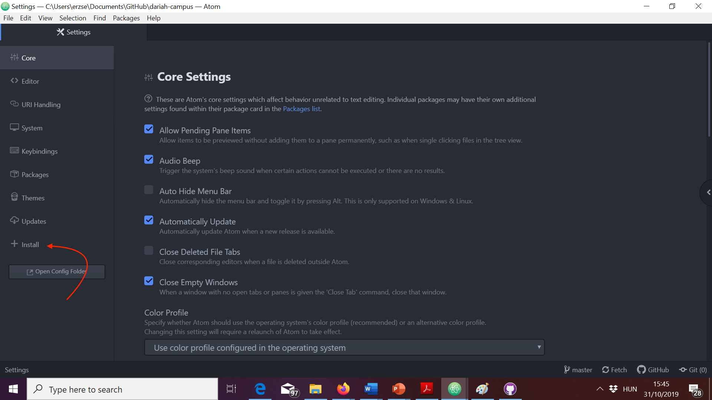
4. Make sure the "Packages" tab next to the search field is selected. Then type "mdxjs" in the search field and wait for results to show up. You should see a package called language-mdxjs in the results. Click on install. 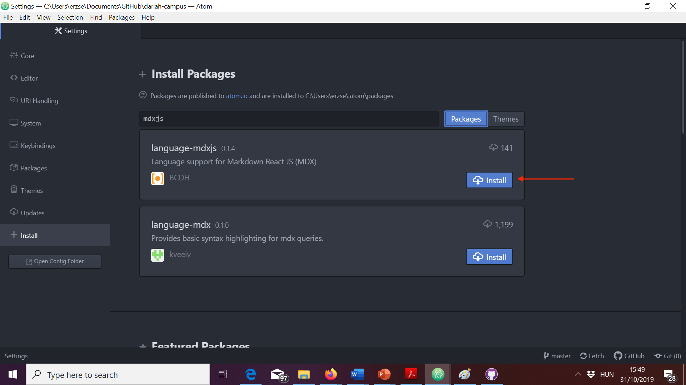
5. In the search field, type: "Markdown Preview Enhanced". Install markdown-preview-enhanced.
6. Once the install finishes, click on Settings: 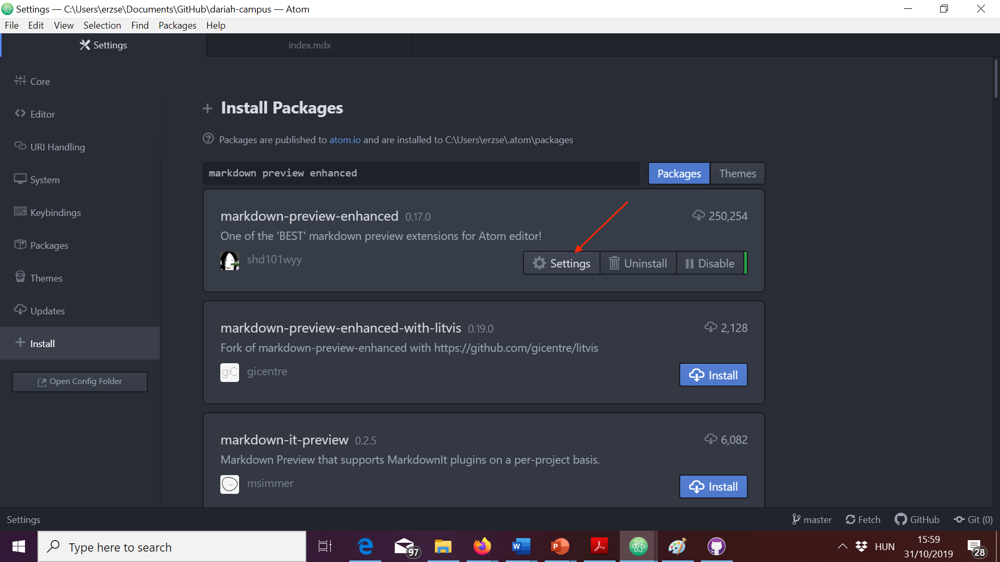
7. Once you open the settings for Markdown Preview Enhanced, you should see something like this: 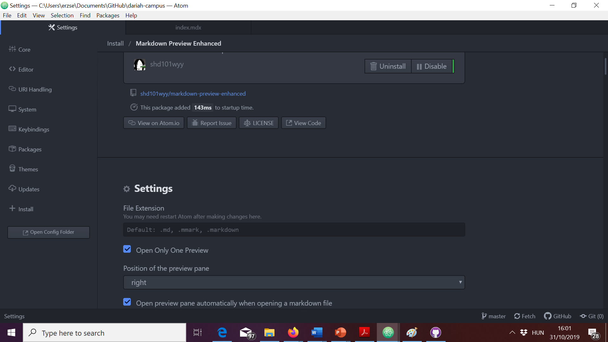
8. Click on the File Extension input field in Settings and type `, .mdx` after `.markdown` like this: 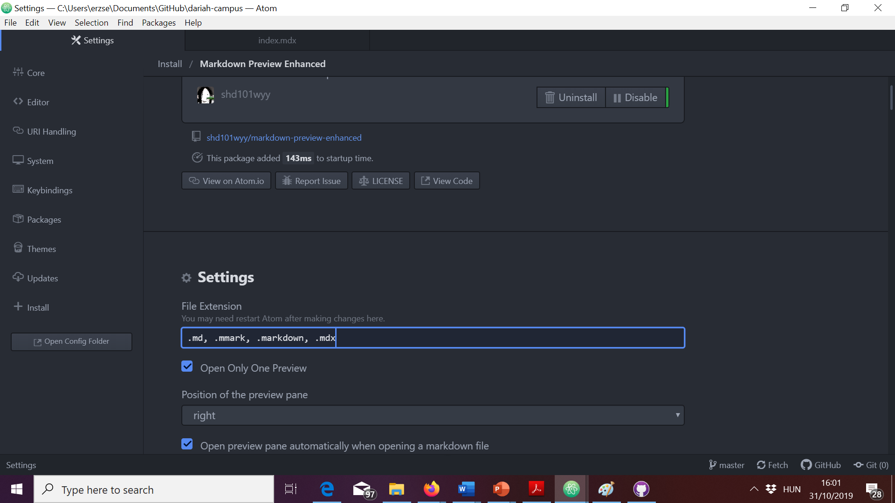
9. Uncheck the check box next to "Break On Single New Line": 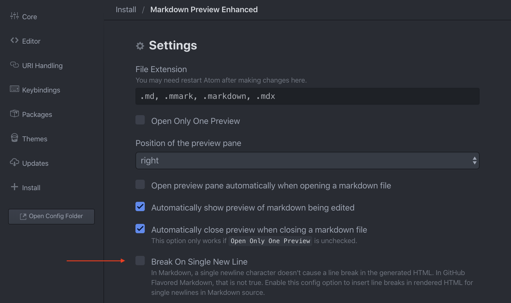 You don't need to hit save.
10. Finally, go back to "Install", search for and install "Toolbar Markdown Writer".
11. Atom will ask you if you want to install dependencies, click on "Yes": 

You should now have a functioning environment in Atom for your work on new DARIAH-CAMPUS learning resources.

### Setting up DARIAH-Campus locally

1. If you haven't used GitHub before, make sure you [sign up](https://github.com/join) for a free account before you proceed.
2. Make sure you're logged in on GitHub.com.
3. Download and install [GitHub Desktop](https://desktop.github.com) on your computer.
4. Open GitHub Desktop on your computer.
5. Authenticate your GitHub Desktop application with your GitHub credentials by following these [instructions](https://help.github.com/en/desktop/getting-started-with-github-desktop/authenticating-to-github).
6. In your browser, go to [https://github.com/DARIAH-ERIC/dariah-campus](https://github.com/DARIAH-ERIC/dariah-campus) and click on "fork". 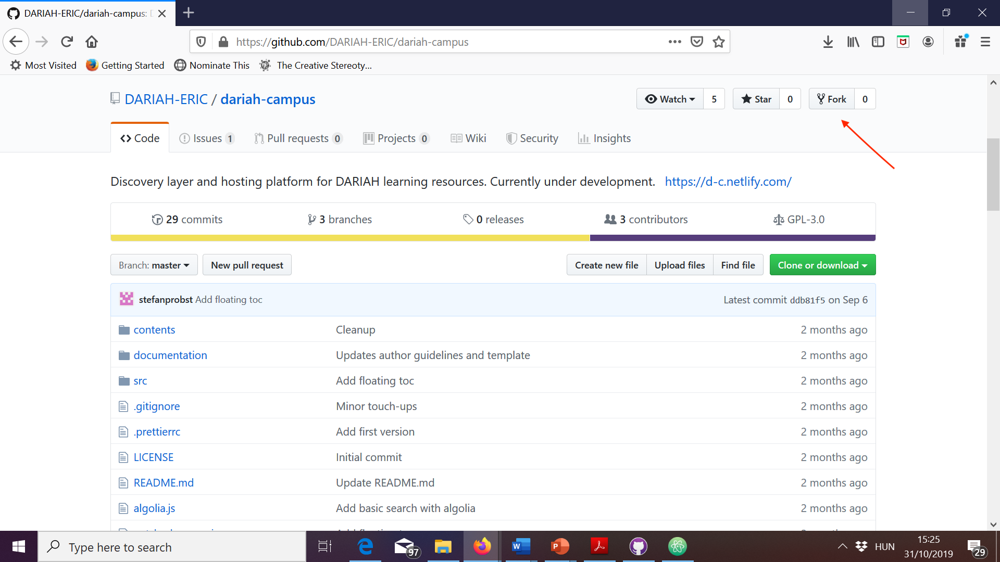
7. If you are a contributor to various organizational repositories, GitHub may ask you to select where you would like to fork dariah-campus. Make your choice. 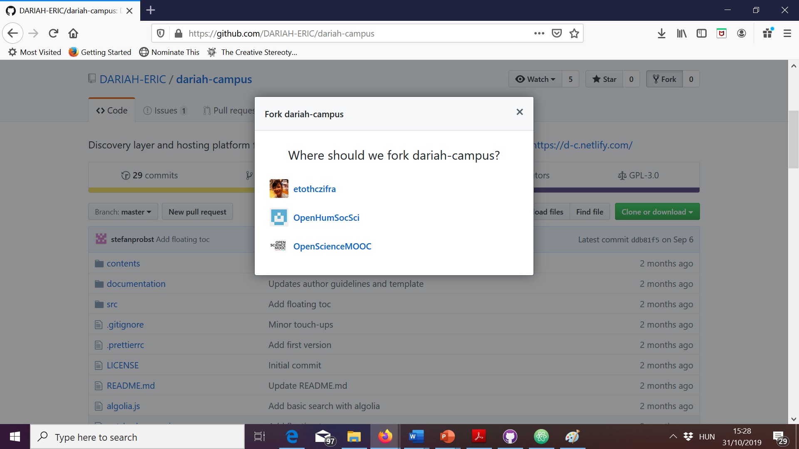
8. Once the forking finishes, you will be taken to your own personal fork of DARIAH-CAMPUS. To make sure you are in the fork, check out that your user name (or the name of the organizational repository youo selected in step 7 above) is displayed in the upper left corner. 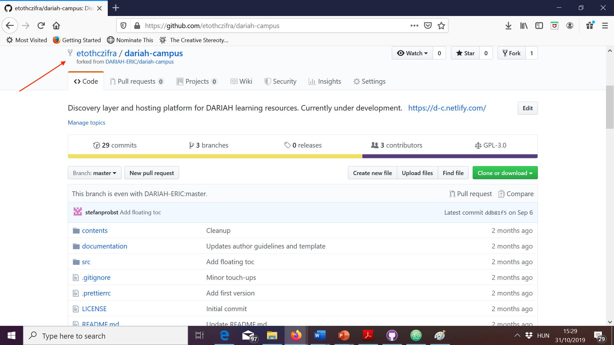
9. Click on "Clone or download", then select "Open in Desktop". 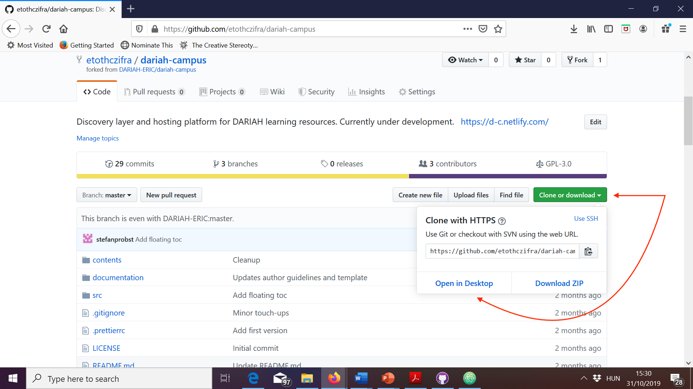
10. In GitHub Desktop, choose where you want to save the cloned DARIAH-CAMPUS fork on your computer. 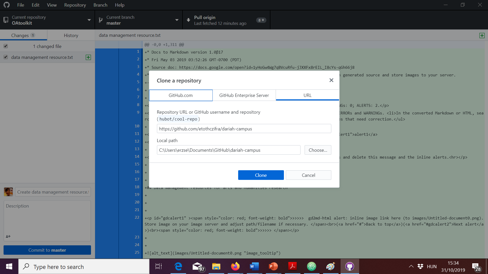
11. The first time you do this, it may take a couple of minutes, but don't despair, things will be quicker after the initial clone. Once you finish cloning your fork, you should see something like this: 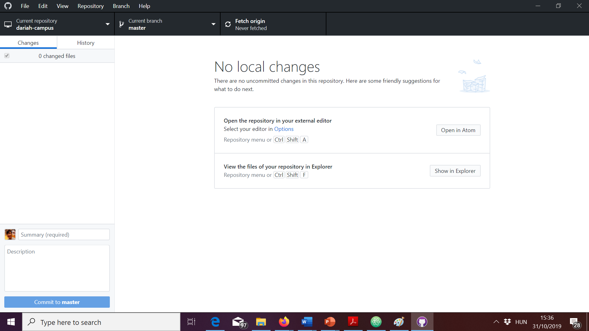
12. To get to the folder with DARIAH-CAMPUS on your computer, click on Open in Atom (or your preferred editor, if you already set it up).

### Previewing DARIAH-Campus locally

#### Instructions for Mac-users

1. Open up Terminal (usually found in 'Utilities' on a Mac).
2. Go to `https://brew.sh/`
3. Select the 'Install Homebrew' link and paste it into Terminal
4. You will be prompted for a password in Terminal: enter your laptop password. The installation will begin.
5. Next, type: "`brew install node`" into Terminal and hit 'return'
6. Then, you need to install 'Yarn'. Type "`brew install yarn`" into Terminal, and hit 'return'.

Now that you have yarn installed on your system, you will be able to use it to install all the packages you need to run DARIAH-Campus locally on your computer. To do this:

1. In Finder, go to the folder in which you cloned your DARIAH-Campus fork.
2. In Terminal, type "`cd`" to change directory (also note, be sure to add a space after 'cd'), then
3. Drag and drop the folder from Finder into Terminal _on the same line as “cd “_. This will automatically write the full path ('breadcrumb') to the DARIAH-Campus folder in Terminal.
4. Then type "`pwd`" (path to working directory) in Terminal and hit 'return' This will show the correct breadcrumb trail to the folder to make sure you have the right one.
5. Type "`yarn install`" into Terminal (remember to hit 'enter'). Installation may take a while if you haven't installed this before. There is a progress bar on the bottom of Terminal that shows you how far along you are.

Now that you have all the packages you need to preview DARIAH-Campus, you can start the server and build the site like this:

1. In Terminal, go to your local DARIAH-Campus folder (see previous steps 1, and 3 in the previous section for how to do this)
2. Type "`yarn dev`" (+ enter). This build the whole site locally and start a server to run it in. This may also take a little while.
3. Once the build process is complete, you will be able to view DARIAH-Campus in the browser using the link given to you in the terminal, which will look like this: ⠀ `http://localhost:3000/`
4. Copy the url given in Terminal into your browser, which will give you the DARIAH-Campus home page. _Any saved edits you make to the DARIAH-Campus .mdx files in your editor will automatically be shown in your browser._

#### Instructions for Windows users

1. Download node.js from [https://nodejs.org/en/download/](https://nodejs.org/en/download/)
2. Run node.js installer
3. Open 'command line' and check node version by typing: `node -v`
4. Download yarn from [https://yarnpkg.com/lang/en/docs/install/#windows-stable](https://yarnpkg.com/lang/en/docs/install/#windows-stable)
5. Type `Run yarn installer` (enter)
6. Check yarn version: `yarn --version`
7. Install the necessary pacakges by typing `yarn install` (+ enter)
8. In GitHub desktop, make sure that you have the most up-to-date version of DARIAH-Campus. To do this, follow the instructions above to 'Fetch Origin' and 'Merge' it to your local branch
9. Once any changes from the DARIAH-Campus 'main' on GitHub has been merged to your local branch, navigate to inside the dariah-campus directory (where the file package.json is located) in your file manager.
10. Run: `yarn dev`. This will build the entire website and launch a server to run it in on your computer. Once the build process is complete, you can:
11. Navigate to `localhost:3000` in your browser to preview DARIAH-Campus. _Any saved edits you make to the DARIAH-Campus .mdx files in your editor will automatically be shown in your browser._

> **REMEMBER!** Any changes you make in Atom will only show up on your local version, but will not make any changes to the actual live version of DARIAH-Campus. This is useful if you want to try out a few things before updating. However, it's important to remember that if you WANT to make changes to the live version, you will need to 'commit' them, 'push origin' and then 'create a pull request' so that the DARIAH-Campus editors can approve the changes.

## Doing the Work

When you work on your own learning resource, you will work locally, on your computer, in the locally cloned fork of DARIAH-Campus.

To help you start working on your contribution in Markdown, we have created templates that you can use.

### Starting with a template

#### Hosted resource

Once you have set up DARIAH-Campus on your computer, you can use the `content/templates/resource` folder as a basis for your contribution.

You can find this template folder in your local working copy, i.e: `dariah-campus > content > templates > resource`

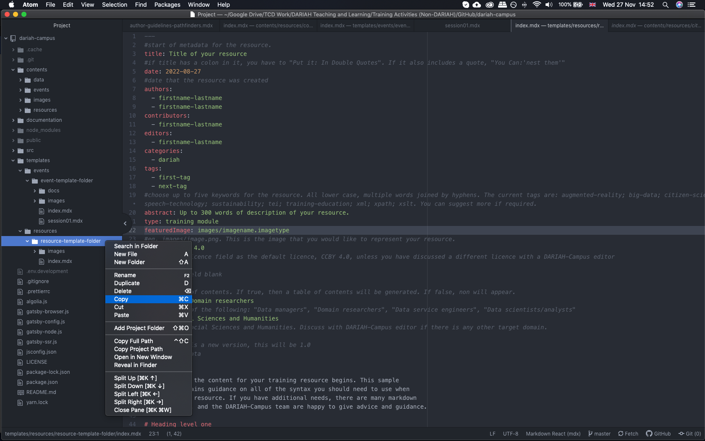

**Copy** (do not 'drag and drop') the entire folder, and then **paste** it into the `content/posts` folder:

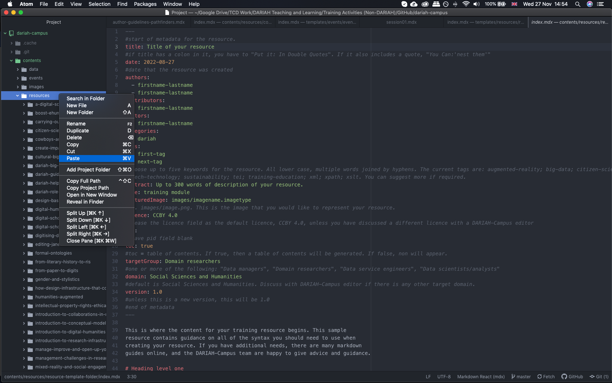

Once you have copied the template to your local `content/posts` folder, you can start editing. You can see an example of the `index.mdx` file here:

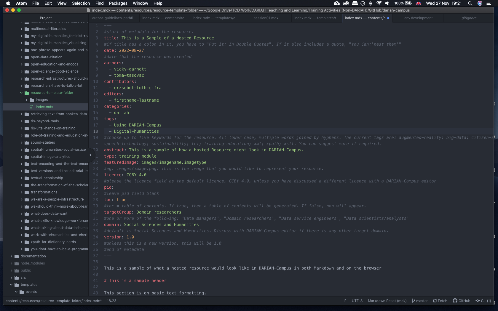

Within this file, you will write all the content you want to include in your resource. If you need a little more assistance in how to format this, or to include certain elements, such as videos, images, or tables, please take a look at our ["Writing in Markdown" guide](#writing-in-markdown) in the GitHub Workflow section.

When you have your content in the `index.mdx` file, save it, and if you are running a local version of DARIAH-Campus in your browser, you should see your event appear in the 'Resources' page, as in here:

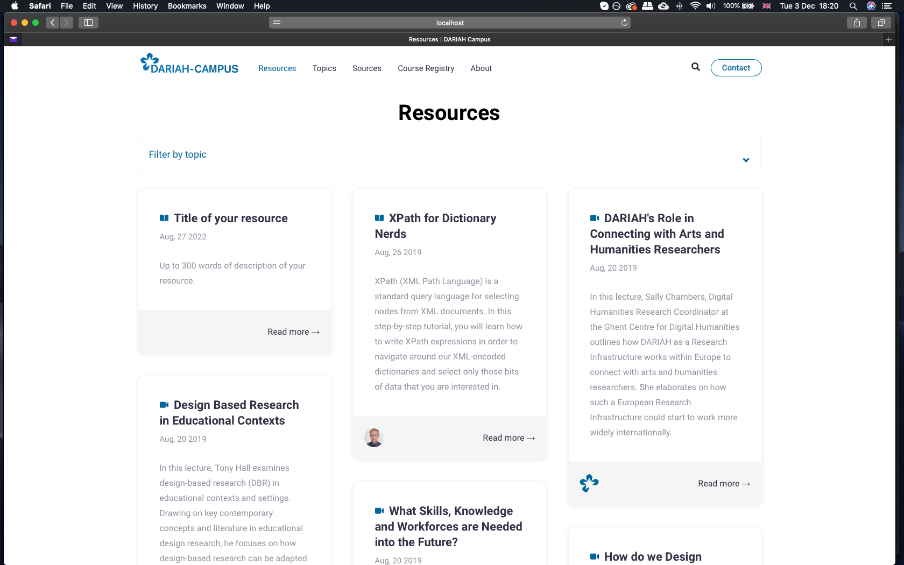

Once you are happy with your draft hosted resource, you can submit it to the DARIAH-Campus team via GitHub.

#### Pathfinder

Once you have set up DARIAH-Campus on your computer, you can use the `content/templates/pathfinder` folder as a basis for your contribution.

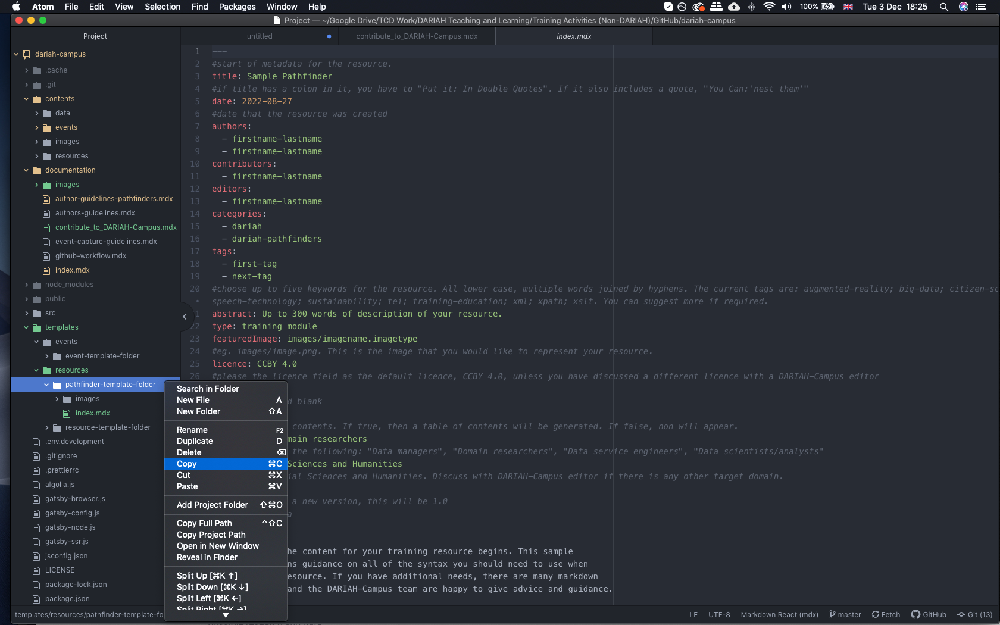

**Copy** (do not 'drag and drop') the entire folder, and then **paste** it into the `content/posts` folder in your fork

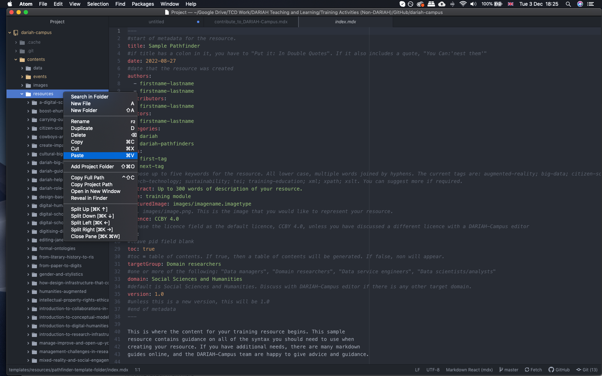

When you have copied the template to your local `content/posts` folder, you can start editing. You can see an example of the edited `index.mdx` file here:

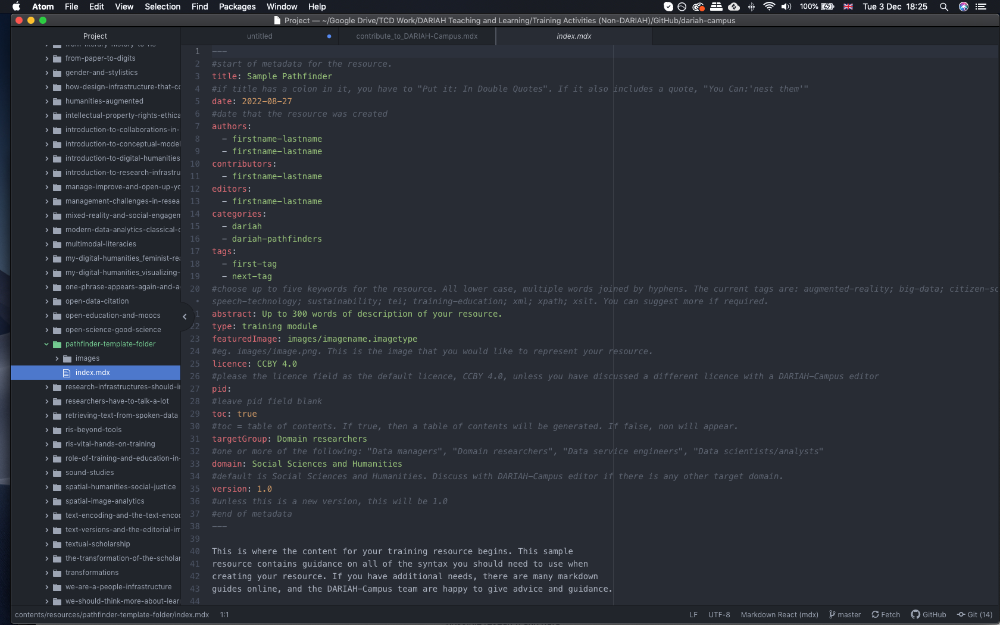

Within this file, you will write all the content you want to include in your resource. If you need a little more assistance in how to format this, or to include certain elements, such as videos, images, or tables, please take a look at our ["Writing in Markdown" guide](#writing-in-markdown) in the 'GitHub Workflow section.

When you have your content in the `index.mdx` file, save it (although we also recommend saving this iteratively in your GitHub editor as a matter of course), and if you are running a local version of DARIAH-Campus in your browser you should see your event appear in the 'Resources' page, as in here:

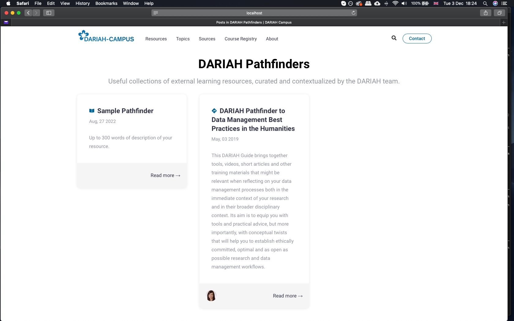

Once you are happy with your draft hosted resource, you can submit it to the DARIAH-Campus team via GitHub.

#### Event

Once you have set up DARIAH-Campus on your computer, you can use the `content/templates/event` as a basis for your contribution.

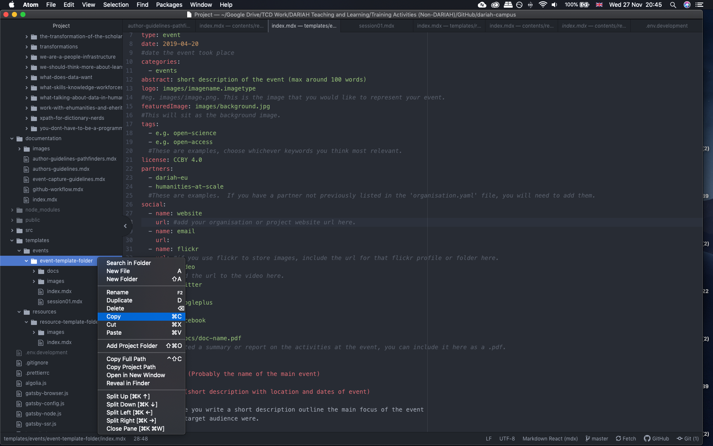

**Copy** (do not 'drag and drop') the entire folder, and then **paste** it into the `content/events` folder in your fork.

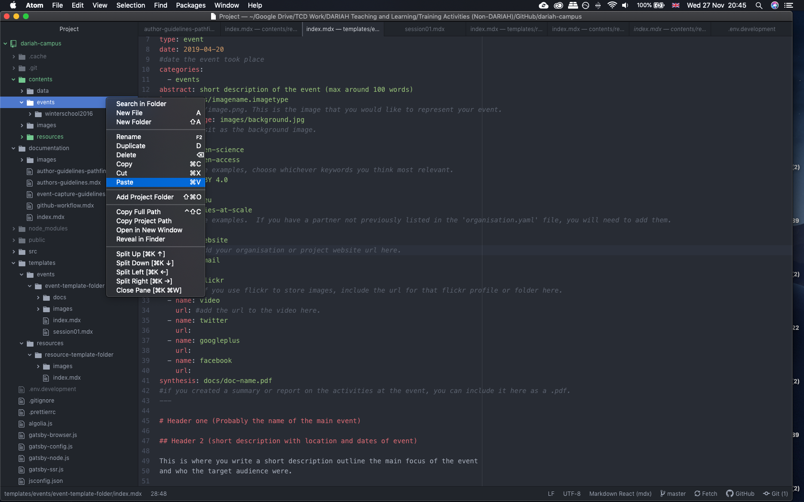

When you have copied the template in your local `content/events` folder, you can start editing. You can see an example of the edited `index.mdx` file here:

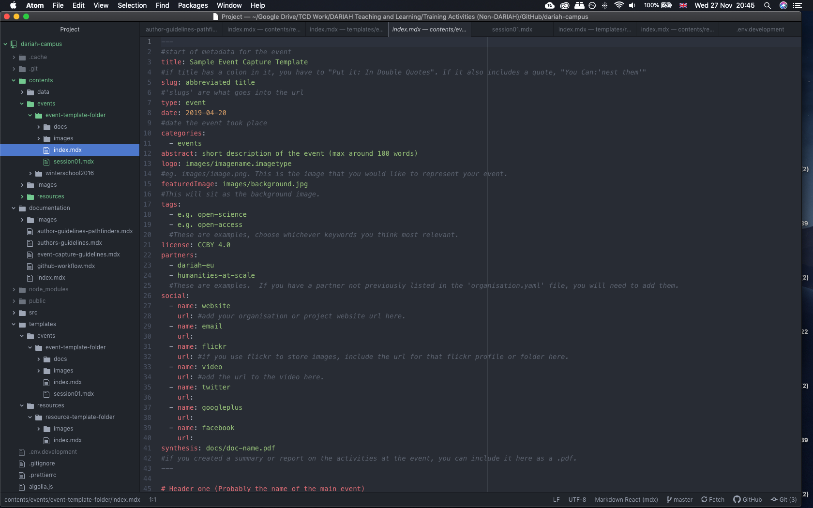

Within this file, you will write all the content you want to include in your captured event. If you need a little more assistance in how to format this, or to include certain elements, such as videos, images, or tables, please take a look at our ["Writing in Markdown" guide](#writing-in-markdown) in the 'GitHub Workflow section.

When you have your content in the `index.mdx` file, save it (although we also recommend saving this iteratively in your GitHub editor as a matter of course), and if you are running a local version of DARIAH-Campus in your browser you should see your event appear in the 'Events' page, as in here:

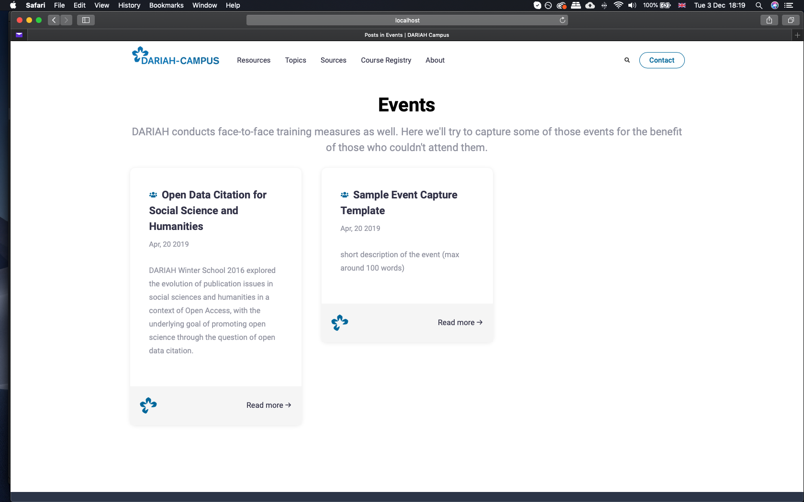

Once you are happy with your 'Captured Event', you can 'commit' it via GitHub to the DARIAH-Campus team.

### Creating content

#### Setting the Metadata for Citation

The metadata of your resource is important as it forms the basis of the **citation** recommendation that you will see at the top of all the training resources. In order to ensure that this citation is correct, you will need to make sure you have the following information to hand:

- The Title of Your Resource
- The names of any authors, contributing authors or editors of your resource
- The 'type' of training resource it is, e.g. 'training module', 'video'
- The URL for where the resource is currently located. This is called the '**remote.url**' in the metadata (this only applies for External Resources)
- The date your training resource was originally published. This is called the '**remote.date**' in the metadata (this only applies for External Resources)
- The name of the organisation, or project that your resource comes from e.g. 'PARTHENOS-EU'. This is called the '**remote.publisher**' in the metadata (this only applies for External Resources)

You can see how these metadata items fit into the citation below: 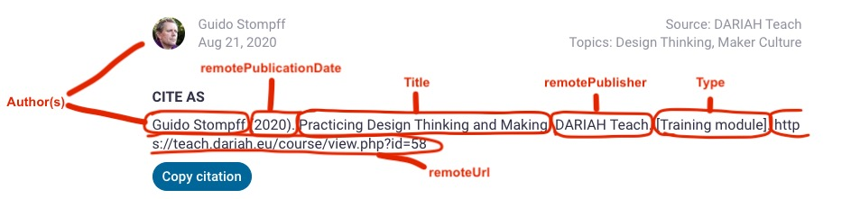

The specific metadata that is required for your resource type is given at the top of all the `index.mdx` files in our template folders (see above), and it also comes with some guidance notes to help you find the information you need. There are more metadata fields for you to fill in, but these metadata fields above are particularly important for the citation.

#### Writing in Markdown

DARIAH-Campus content needs to be written in Markdown. This can seem intimidating if you have not done it before, but there are many online guides to getting started with Markdown. For instance, Programming Historian have an excellent introduction, [Getting Started with Markdown](https://programminghistorian.org/lessons/getting-started-with-markdown).

Text must be provided in a text editor such as Atom, VS Code, TextWrangler, TextEdit, or Notepad++ rather than in a word processor such as MS Word.

The templates provided in the previous section should help you get started, but we'll be happy to provide more guidance at any stage of the preparation and submission process.

#### Multimedia

##### Images

Learning resources benefit from images to break up the text and for illustrative and instructive purposes. The exact nature and content of these images is flexible according to the type and topic area of your learning resource. They can range from photographs; to infographics; diagrams; maps; screenshots and more. These images should be incorporated into the body of your resource using the following code:

```markdown

```

The path or URL to the image asset is in parentheses. The text in square brackets is the alt text.

To add a link to an image, enclose the Markdown for the image in brackets, and then add the link in parentheses.

```markdown
[](https://linktotheimage.eu)
```

We ask authors to use intelligible file names that either indicate the content of the image (data-reuse-diagram.png) or indicate which figure it is within the module (research-infrastructures-fig-1.png). Prepare either .png or .jpg and upload at largest possible size. Check image reuse rights and choose content in the public domain and under Creative Commons licenses. Provide a descriptive figure caption, including source for third-party images, and other information such as shelfmark where relevant.

##### Videos

Videos are welcomed, since they provide vital contextual information on a subject and/or step-by-step guidance to complete exercises and practical task. To include a video as part of your material, you can upload it to the DARIAH-Campus YouTube channel, or link to the video on your own channel. These videos are included into the body of your material using the following code:

To insert a YouTube video, use the following code:

```jsx
<VideoCard
  title="Title of the Video"
  id="SI3u9nu7YEY"
  image="images/imagename.jpg"
/>
```

- the "id" is the part of the url after "v=" and before "&". So, for "https://www.youtube.com/watch?v=SI3u9nu7YEY&t=164s" it is: "SI3u9nu7YEY".
- "image" allows you to choose a screenshot that will appear until the learner clicks the play button.

There are other options for inserting videos; guidance for these can be found in the [Sample-resource template](https://github.com/DARIAH-ERIC/dariah-campus/blob/main/content/templates/resource/index.mdx?plain=1).

Any video published on the DARIAH-Campus YouTube Channel is covered by a Creative Commons Attribution-NonCommercial-ShareAlike 4.0 International (CC BY-NC-SA 4.0). We ask that any externally-hosted videos that you produce as part of your materials are also licenced for reuse.

If linking to third-party videos, insert the video using the above code, and provide the full details as a caption in your course text, in the following format: "Title, Source, URL (Licence)".

### Self-assessment activities

Self-assessment activities such as online tests or quizzes enliven the learning process; address different learning styles; and provide opportunities to expand upon the course content in the classroom or independently. These can include quizzes; exercises; assignments; questions to consider in a group discussion; practical step-by-step tutorials guiding learners through a task; and much more. Since the technical guidelines for including this kind of material will vary according to their nature, the DARIAH-Campus editorial team will be happy to discuss your requirements as you develop your resource.

### Language and readability

Where writing in English, keep an international audience in mind and avoid idioms and colloquialisms where possible. We are open to submissions in languages other than English. We are committed to inclusiveness, and welcome new additions to the editorial and reviewing team, in order to expand our reach. Please contact us via the DARIAH Helpdesk, if you would like to be a part of this team.

### Openness and Licencing

DARIAH-Campus learning materials are licensed under a Creative Commons CC BY-SA licence. This ensures that they are available for free; can be re-mixed and repurposed; and are easy to combine with other materials and courses. The integrity of the resource is ensured under the 'Attribution' requirement, whereby re-users must give appropriate credit, provide a link to the license, and indicate if changes were made.

## GitHub Workflow

DARIAH-Campus uses GitHub for its editorial workflow.

Once you start working on your contribution, you should make sure you get into the habit of regularly syncing your local clone with the remote clone and the original repository, as well as committing (saving) your work both to your local clone and your remote server.

### Saving your contribution

This may sound complicated, but is actually quite logical. Once you have done it several times, it will become like second nature to you:

1. **Fetch origin**. Before you start a working session on your computer, make sure you "fetch origin": 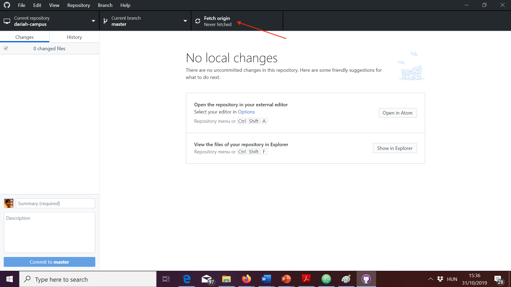 This will update your local fork with possible changes you've made to your "origin", i.e. your fork on GitHub.com. This is important if you're, for instance, working on more than one computer.
2. **Merge from upstream**. Also, before you start your working session, you should merge from upstream by going to Branch > Merge into current branch > Select upstream/main and then clicking on "Merge upstream/main into main" 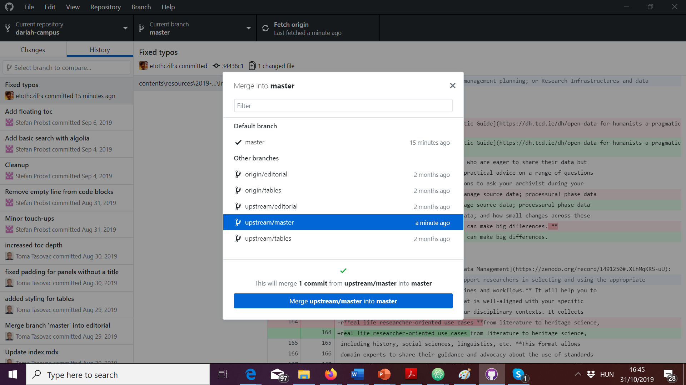 This will update your local fork with the changes that may have been submitted to the "upstream" DARIAH-CAMPUS, i.e. the original repository owned by DARIAH.
3. Do your work.
4. Save changes in Atom
5. Go to GitHub Desktop. You can see your recent changes are reflected in the Changes Tab: 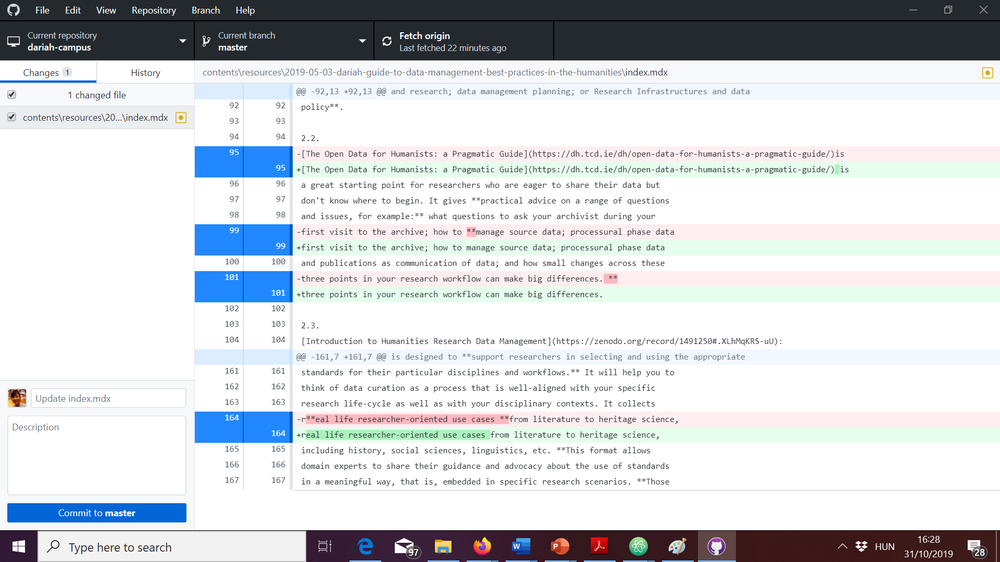
6. Write a short commit message for the changes you want to submit. You can leave the Description field emtpy: 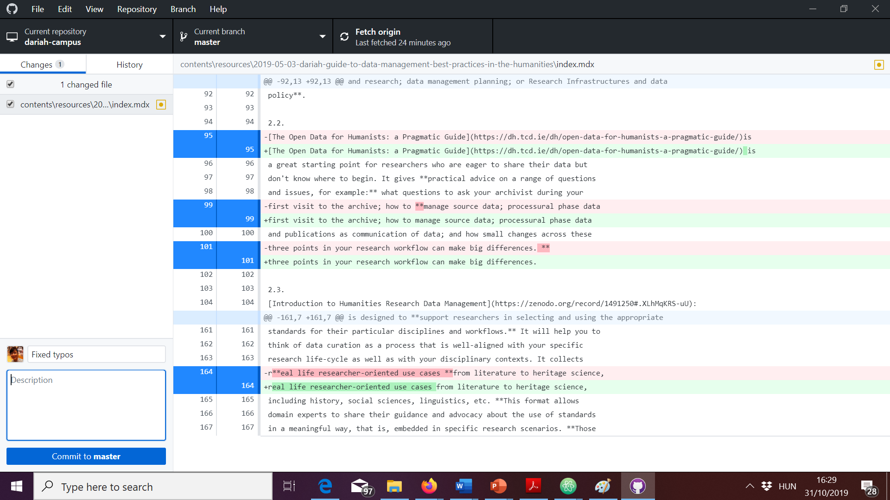
7. **Commit your work.** Click on "commit to main". This will save your initial work to _your_ fork _locally_.
8. **Push to your fork.** Click on "Push origin". This will save your work to _your_ fork _remotely_. 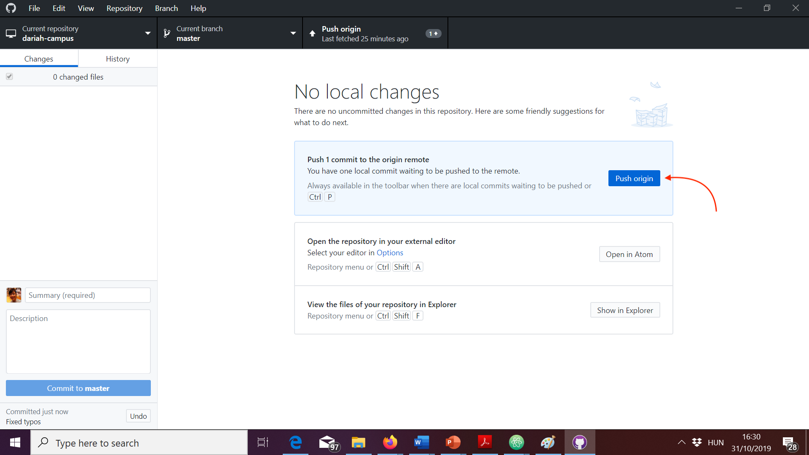 After you push, you can go to your fork on GitHub and click on "Commits". You will see that your changes have been committed to your fork on GitHub.com.

You can repeat the above as many times as you want while working on your learning resource. None of the changes you commit and push as described above will be submitted to the DARIAH-CAMPUS editors.

### Submitting your contribution

Once you're ready to submit, follow these steps:

1. Open GitHub Desktop and make sure you have no uncommitted changes in the Changes tab.
2. **Create a pull request.** Go to Branch > Create Pull Request. 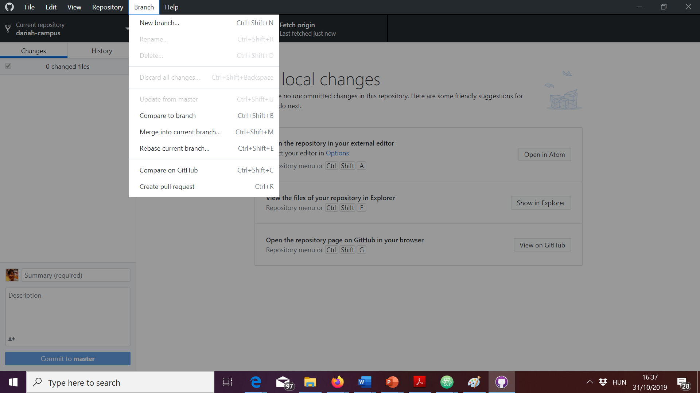

   - A new window will open in your Browser. Click on the green button "Create pull request" 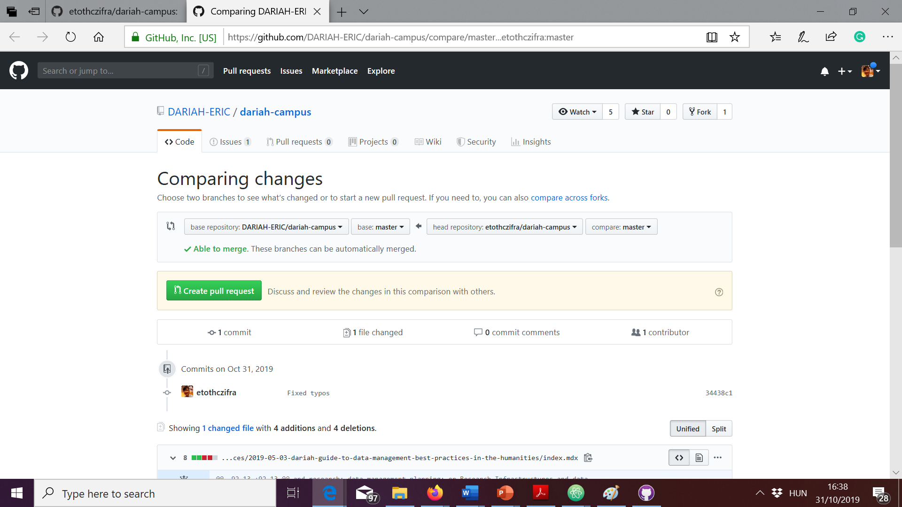

   - If necessary, change the commit message. You don't have to leave a comment. **Make sure** that you have checked the checkbox "Allow edits from maintainers" that allows the DARIAH-Campus editors to make any necessary changes to your pull request. Click on the green button "Create pull request". 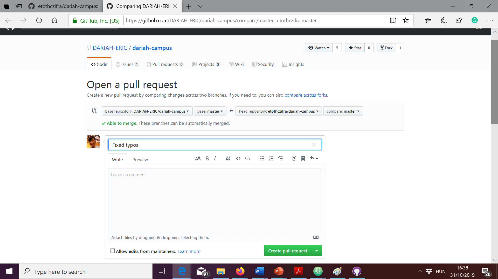 This will alert the editors that you have submitted a contribution for publication.
