# Using the DARIAH-Campus Content Management System

## Step 1 - Proposing a new resource

Before making a start on your new resource, you will need to send us a proposal. To do this, please visit our [Proposing a Contribution page](/docs/proposing-a-contribution).

## Step 2 - Submitting a new resource

Once your proposal has been submitted, and the basic information you need has been put into the repository, you can start to build up your resources.

1. Go to [DARIAH-Campus CMS](https://campus.dariah.eu/admin) and log in using your GitHub account.
2. You will be asked to allow the system access to your GitHub account.
3. You will then reach the homepage of the Content Management System, which looks like this:

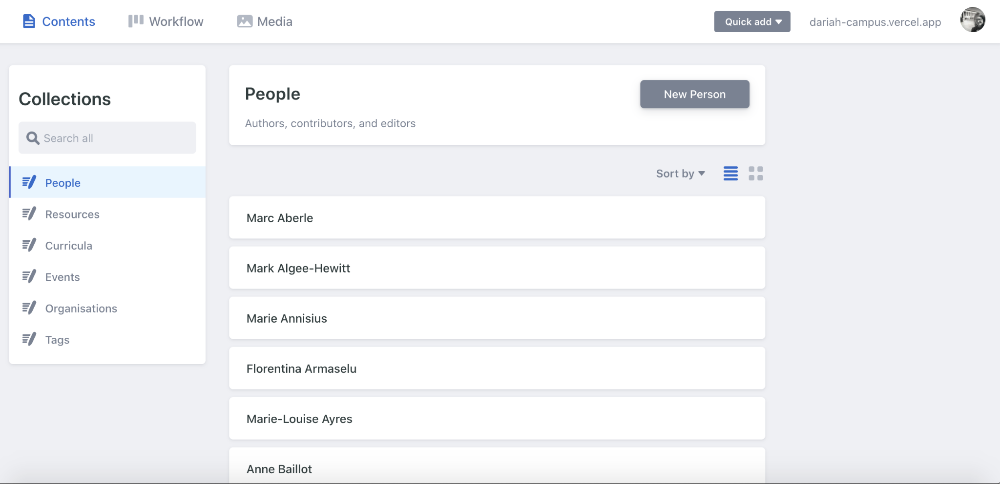

Along the top you will see three main menu items: 'Contents', 'Workflow' and 'Media'.

The 'Contents' page allows you to create new resources, combine items to create a curriculum, or submit new names to the 'People' list. The menu on the left-hand side will bring you to these different options.

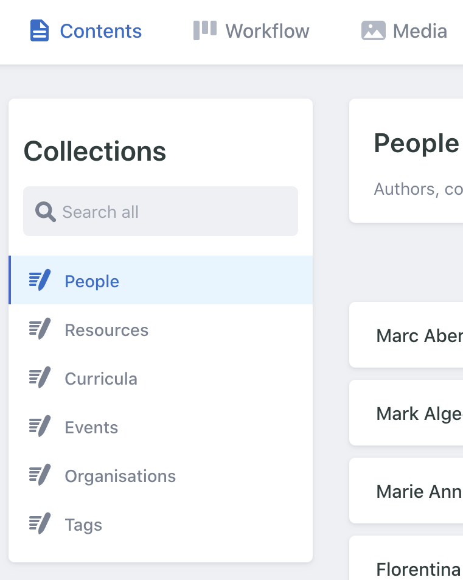

The 'Workflow' page shows you what you have saved as a draft (in the left-hand column), and what you have sent for publication that is waiting to be approved by the administrators (on the right-hand side). More on this later.

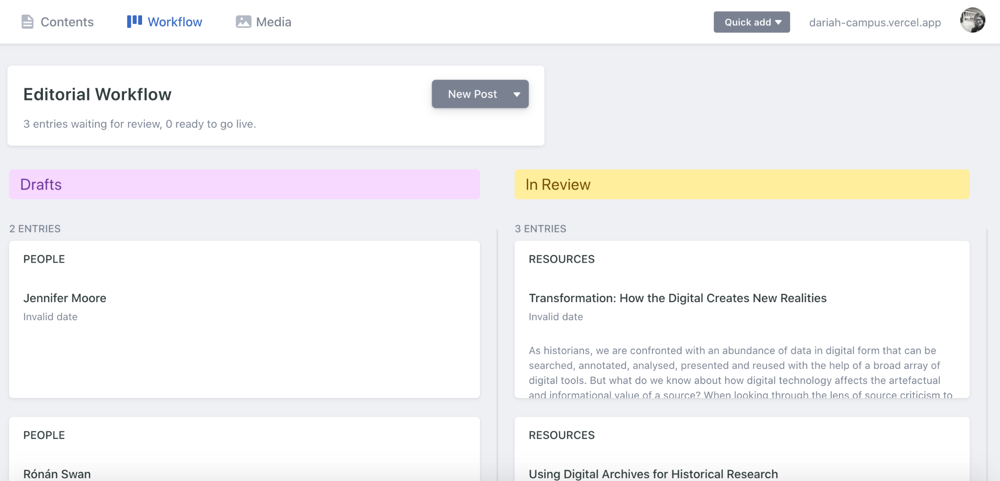

The 'Media' option brings forward a pop-up with media items shared by all resources on the DARIAH-Campus site. You won't need to use this option, though, as you will upload any media you need directly to your resources.

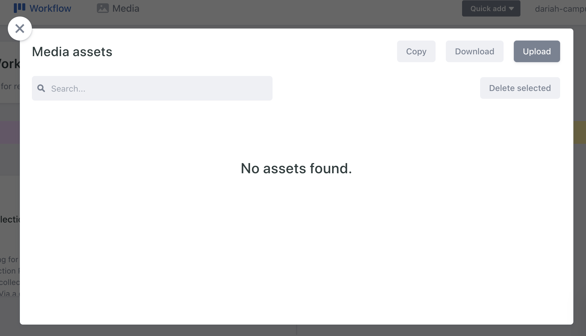

Returning to the 'Contents' tab - this is where you will do most of the initial work.

### Step 2.1 Updating your 'people'

The first thing you will see here is the 'People' tab, and the option to create a 'new person'. Ideally you will have already completed step one, and therefore will not need to do this. However, be sure to scroll down through the list to check that all your authors are in this list. This is a good opportunity to add an image to their profile as well, so that this appears on the DARIAH-Campus listing properly.

1. Find the person you want to update. Click on their profile, and you will be taken to a form to complete.
2. In the 'Image' field, you will see the option to 'Add Image'. Click on this, and the 'Media' pop-up window will appear.
3. It is likely you won't see any images in there, but you can upload an image from your computer. We recommend that you choose an image that has 1:1 dimensions, i.e. square, as these sit better in the circle frame built into the system.
4. Once you have selected your image, and clicked 'open', the media pop up window will then show the image, and you can then click to 'choose image' (the green button). When you click on this, the pop-up window disappears, and your selected image will then be previewed as a thumbnail image in the 'Image' field.
5. Make sure that you click on the 'save' button at the top, and then click on the 'set status' button to move it from 'draft' to 'in review'. You can then go back to the main page by clicking on the arrow in the top left-hand corner.

### Step 2.2 - Adding a new resource

Back in the 'Contents' menu, you can select 'Resources' from the left-hand menu. This will then give you a list of all the current resources, as well as the option to add a 'New Resource'.

1. Click on 'New Resource'.

2. This will bring you to a page with a form with two columns: a form on the left hand side, and a preview panel on the right. As you add items, you will see that the preview panel will start to display them so you can see how they will show up on the main DARIAH-Campus site.

3. In the 'Authors' field, you will see you have the option to use a drop-down menu, or to start typing a name in and let the system search for you.

<SideNote title="Please note" type="info">

Only people who have already been previously published to DARIAH-Campus will be in this list. It is for this reason that we ask you to submit all names to us as part of step 1. You cannot type in names free-hand in this field, as the system will not allow it.

</SideNote>

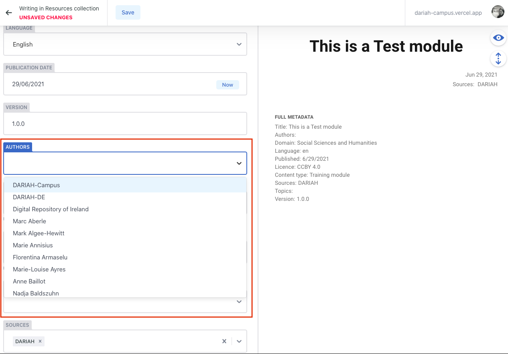

Once you have selected your authors (and if required: 'Contributors' and 'Editors') you will see a name and their thumbnail image in a circle frame show up in the preview pane.

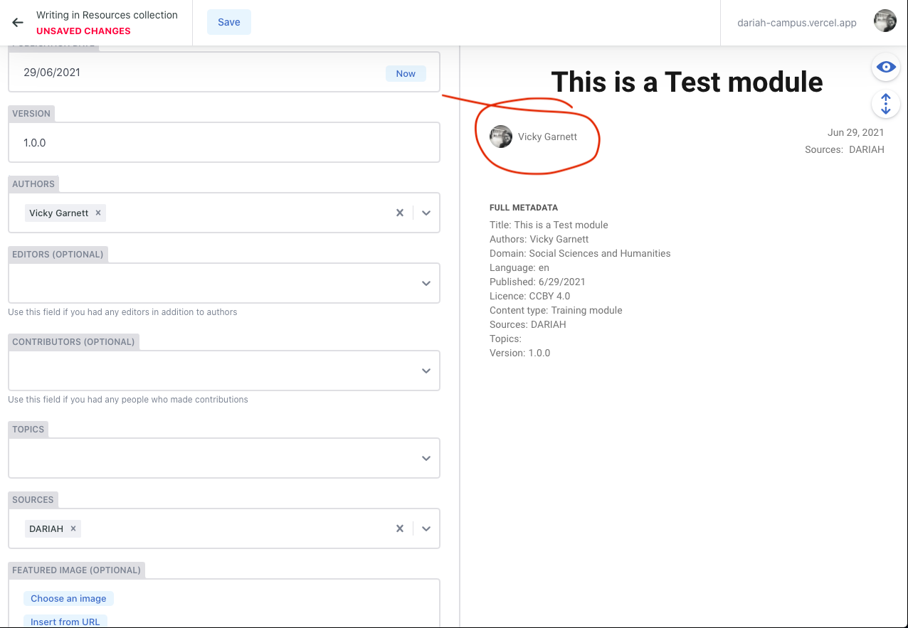

4. In the 'Topics' field, you can also select from a drop-down list. We recommend that you try to be as selective as you can with picking your topics, so that those seeking resources can be certain that the resources they seek are directly relevant. The average is usually around 2 or 3 topics per resource, and we have found this works quite well.

As with the 'Authors' field, you can either use the drop-down menu, or type your topic in to let the system search for you.

5. 'Sources' are by default listed as 'DARIAH'. If you think that you are going to have a large number of resources added to DARIAH-Campus, then you can speak to us about setting up a channel within the 'Sources'. However, if this is among the first of the resources you will be submitting, we ask you to leave this as 'DARIAH' for now, and we can discuss the option of adding a dedicated source for you. Resources can then be switched over to your source channel retrospectively.

6. You can add a 'Featured Image' here if you'd like to. This will then put your image at the top of the resource. Adding an image here will once again give you a pop-up media window in which to add your images from your computer, or insert from a URL. A preview will then appear in the preview pane.

7. The 'Abstract' is a required field, as this is what shows up in the listings of resources on the main DARIAH-Campus page. You will not see a preview of this here, so it's important that you make sure everything in this is correct, check for any spelling errors and/or typos. The abstract should be no longer than around 50 words, and should indicate to a potential student what they will learn within the resource.

8. The 'Content' field is where you will type the main text for your resource. Within this, you can add images, format your text with headings, include hyperlinks and add calls to action. Some items, though, are required depending on what you are submitting. Within this, you have the option to edit either in 'Rich Text' (the default option) or to use Markdown. We recommend that if you are not familiar with Markdown, you use the Rick Text option.

The following walk-through is specific to the Rich Text option, but even if you choose to use Markdown, there are some requirements. These are listed at the end. Users can toggle between Rich Text and Markdown, which can be a useful feature, particularly when it comes to the resource type templates.

First, though, is a walk through what the different buttons mean, going from left to right.

| Button | Description |
| --- | --- |
| 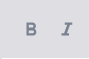 | The first two buttons are the **bold** and _italic_ options. |
|  | The third button `<>` option is for if you want to include any inline code. This is useful if you want to showcase some code or syntax. |
|  | The fourth button is to add a URL to your content. |
|  | The fifth button allows you to add different heading types, and a drop-down menu is also offered here. |
|  | The sixth allows you to put some of your text into a 'quote' format |
| 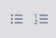 | The seventh and eighth buttons offer either bulleted or numbered lists. |
|  | The last option, the + button, provides the fields needed for the different types of resource that you want to publish. |

A full guide to the resources types and how to use them in the Contents field is below.

9. The 'Domain' field is optional, and is preset to 'Social Sciences and Humanities', so you don't need to enter anything here.

10. The 'Target Group' field has also been preset to 'Domain researchers'

11. The 'Content Type' field allows you to select what kind of resource you are providing. This then sets the correct logo type for your resource in the abstract

12. The 'Licence' field is preset to 'CC-by 4.0', as this is the default option as recommended by the DARIAH Reuse Charter.

13. The 'Remote Host' field says that it is optional, but this is a REQUIRED field if you are linking out to your resource on an external website. This field should be filled in if you are using the 'External Resource', or a 'VideoCard' option in the contents field (these are explained further below).

Within this field, you are required to provide information for:

a) The name of the publisher (could be a project, and institution or an organisation) b) The date that the resource was published originally c) The URL to the resource

14. The 'Show Table of Contents' field is also optional, but highly recommended if you are creating a 'hosted resource' to allow users to navigate more easily through your resource.

#### The Resource Types in the Contents field

When you select one of these resource types, an additional set of fields will appear for you to complete. If you decide that you don't want that particular resource type after all, you can simply delete it.

##### Side-note

This option allows you to add an in-text note for your users. We have provided a few different options for you, including 'Warning', 'Tip', or simply 'Note'. You can change the title of the side-note if you like, or you can leave it with its default title, which corresponds with the note type.

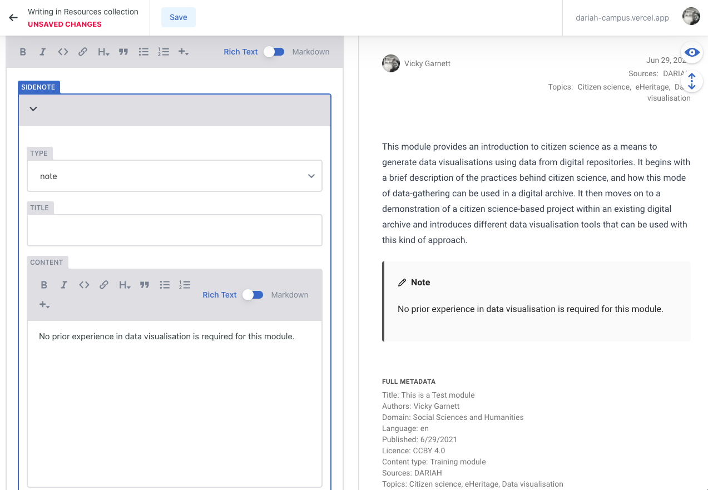

##### VideoCard

This is a required resource type if you are linking to a video on YouTube, Vimeo or Nakala. You can select the provider from a drop-down list.

a) The 'Video ID' can be found usually at the end of the URL for the video. In the case of YouTube, for example, this is typically around 11 or so characters in length, usually made up of lower and upper case letters.

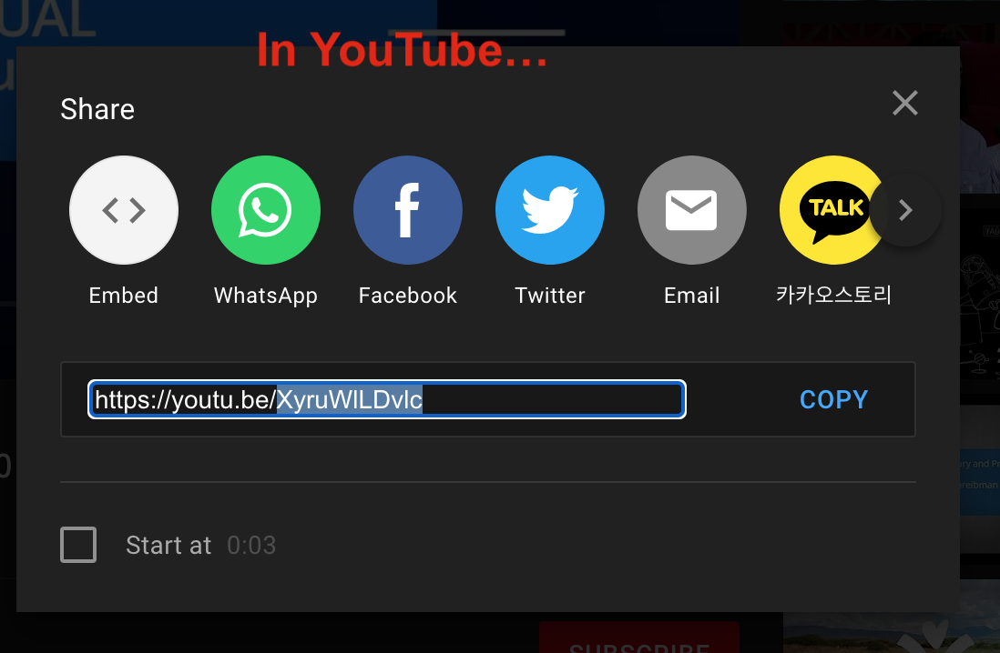

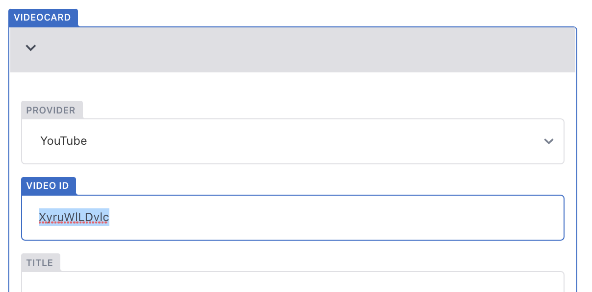

b) Add the title of the video into the 'Title' field

c) In the 'Subtitle' field, this is where you add your 'call to action'. We recommend "Click Here to View".

d) You will need to add an image to this. We recommend a screengrab from the video, or if you used a thumbnail in YouTube or Vimeo you can also add that here.

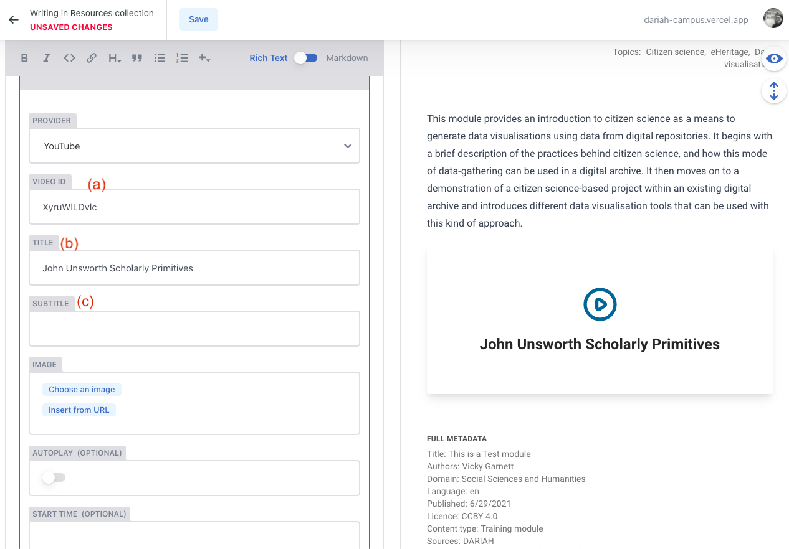

Note: Images will not show up in the Preview Pane, so don't panic if you can't see them.

e) If you want the video to start automatically, you can toggle the option

f) If you have a specific start-time in the video that you want people to see, you can enter that in this field.

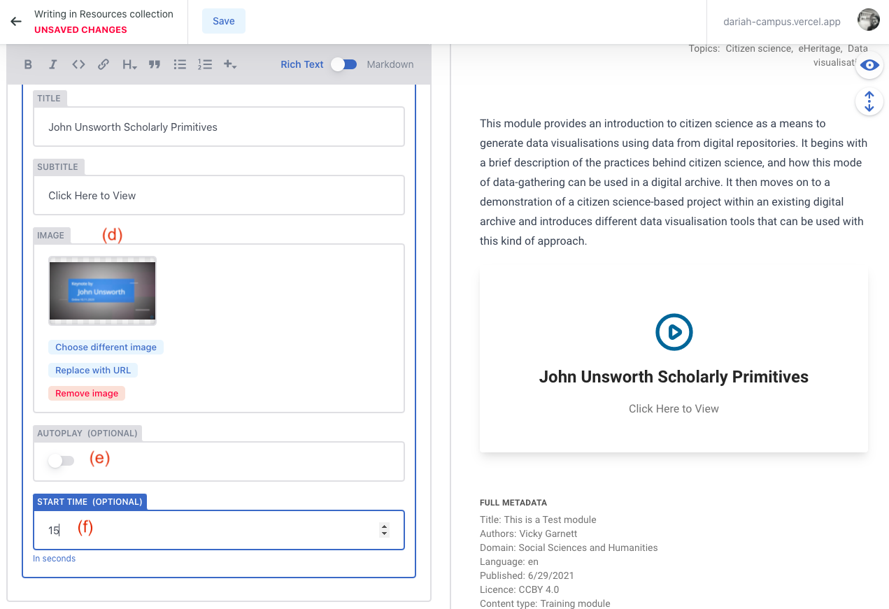

##### Code Block

The 'Code Block' option is useful if you want to show a certain piece of code as part of the module. This might be in a guide to using a tool, or walking through certain steps in some other coding environment. It has a similar function to the 'inline code' option in the main editing bar, but this specifically pulls the code out and highlights it in a box on the page.

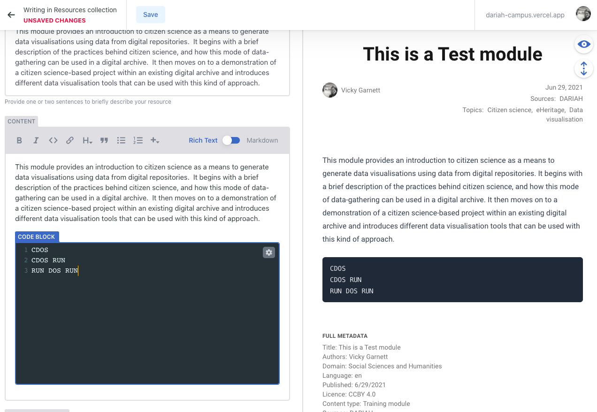

##### Quiz

The 'Quiz' option allows you to create a quiz or self-assessment either at the end of a section or the end of the entire resource. The current options available are either to ask questions with multiple choice answers, or to create something using an XML code editor. If you are not confident in using code, we recommend that you try to format your questions to Multiple Choice to keep it simple.

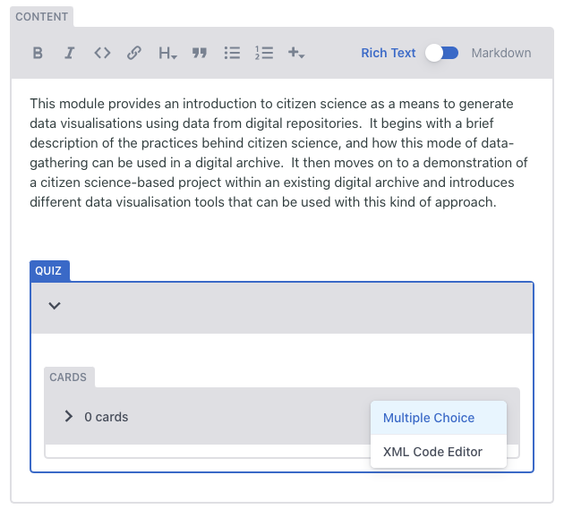

With a Multiple Choice quiz, you enter the question, and then create as many options as you want. You can then select one (or more) of them as the 'correct answer'.


You can test if your quiz is working in the Preview Pane by selecting one of the responses and clicking the 'validate' button. If the answer is correct it will turn green, if it's wrong, the button will turn red. It is probably worth adding a 'side note' here to let users know this (see above).

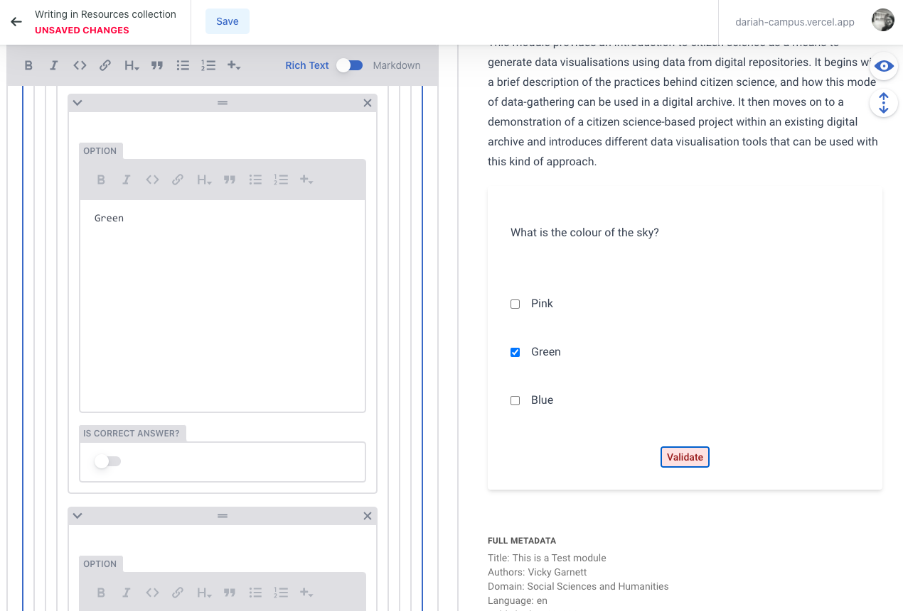

##### ExternalResource

This is a required resource type if you are linking out to a resource that is hosted on a different website (e.g. a project or institutional website).

a) In the 'Call to Action' field, you can simply type over the "\<PLEASE ENTER NAME OF RESOURCE\>" text with the name of your resource.

b) In the 'URL' field, add the link to your resource. This will ensure that the 'Go to this resource' button you can see in the preview panel sends them to the right place.

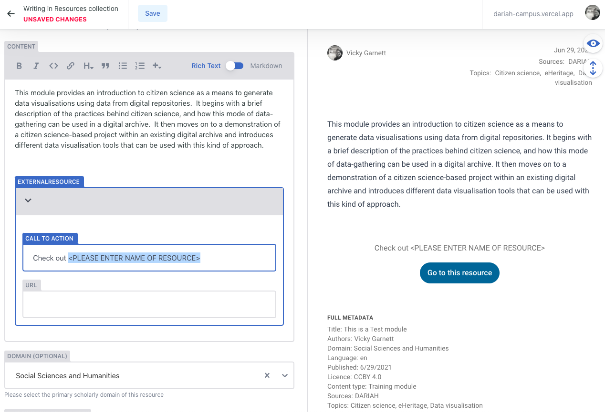

##### Video

The 'Video' option is a bit different to the 'Video Card' option as it allows you to embed a video within the content of the resource you are writing. This is particularly useful if you are creating a new 'Hosted' resource directly on DARIAH-Campus, and want to embed a video to illustrate or demonstrate an issue or provocation.

a) Select your video host (YouTube, Vimeo or Nakala)

b) Enter the video ID. The 'Video ID' can be found usually at the end of the URL for the video. In the case of YouTube, for example, this is typically around 11 or so characters in length, usually made up of lower and upper case letters.

c) You can include a caption for the video to let users know what they are looking at.

d) If you want the video to start automatically, you can toggle the option

e) If you have a specific start-time in the video that you want people to see, you can enter that in this field.

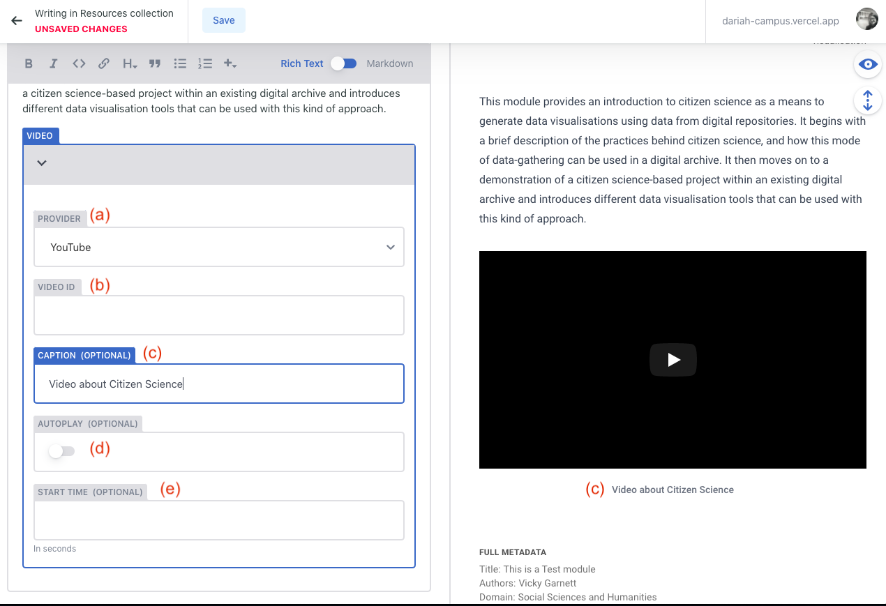

##### Image

You can use this to include an image as part of your content. This is useful for both 'External Resources' and if you are creating a new resource to be hosted on DARIAH-Campus. The procedure for adding an image is much the same as that for a 'Featured Image', where a pop-up media window will appear for you to upload to an image on your computer, or via a URL.

You are also asked to provide Alt Text to briefly describe the image, and you are also asked to add a title, which acts as a caption to the image.

NOTE: Currently, you will not be able to see the image in the Preview Pane. Instead you will see the icon for a 'broken' image. However, if you can see your image in the left-hand field, the image will upload to the final resource.

##### Combining Resources

If you are putting together a new Hosted Resource, you can combine as many of these Resource Types as you like. Here you can see an example of different resources combined to create a video and a quiz with sidenotes:

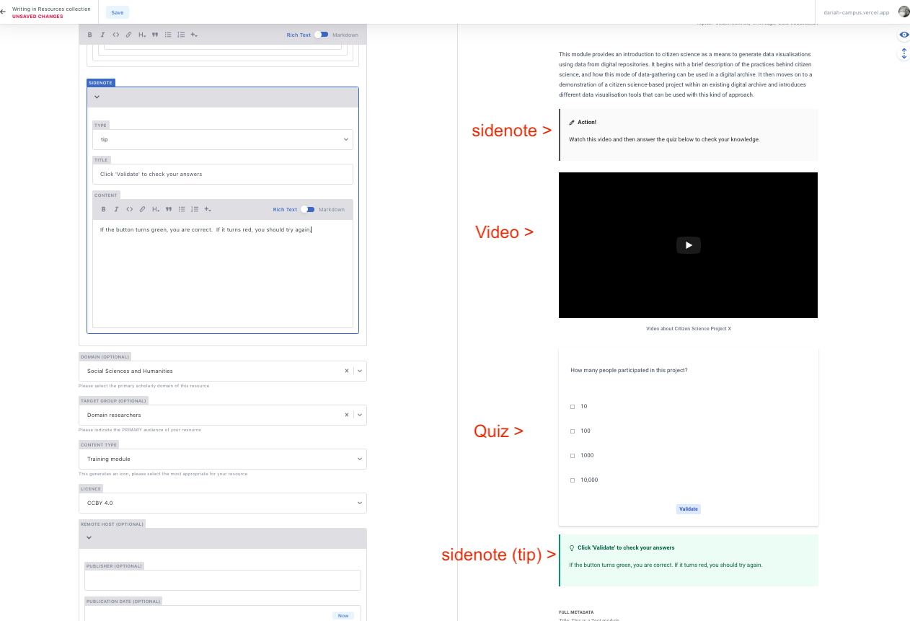

#### The Resource Types in the Contents field

Requirements for all Resource Types

In addition to ensuring that your formatting is correct, and that you have the resource types entered into the system as you'd like them, you also need to make sure that you have included Learning Outcomes to your resource. These should be two to four learning outcomes listed as bullet-points to help the user know whether or not this is going to meet their needs. The standard format for these is:

```
Learning Outcomes (formatted as Heading level 2)

After using this resource you should:

- Learning outcome 1
- Learning outcome 2
- Learning outcome 3
```

In markdown, this will be:

```markdown
## Learning Outcomes

By the end of this module/resource/video users should:

- Learning outcome 1
- Learning outcome 2
- Learning outcome 3
```

Note: To ensure no formatting errors occur when copy and pasting, it is recommended that you copy and then first paste this into a plain text editor, and then copy and paste the plain text into the markdown editor. This is particularly important for the bullet points, which should be '\[space\]-\[space\]content'

#### Using Markdown to enter Content

If you prefer to use Markdown to write your content, this is also possible. There is still the same requirement for entering Learning Outcomes (a markdown version is available above for reference).

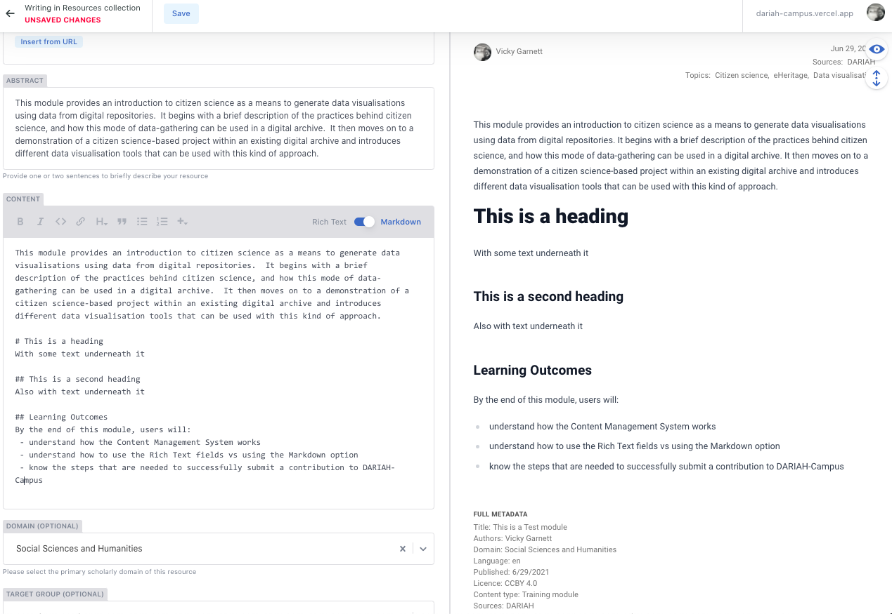

When using the Markdown option, the formatting buttons will no longer be available to you. This includes the 'Resource Type' button. However, if you want to ensure that you are using the correct markdown for the resource type, you can toggle between the Markdown and Rich Text editor.

For example, if you want to get the in-house style for the 'External Resource', you can toggle to Rich Text editor, select 'External Resource' from the '+' menu and enter the required information (see 1), and then toggle back to the Markdown editor. The inserted code for this resource type is there (see 2), and you can continue typing your content as required.

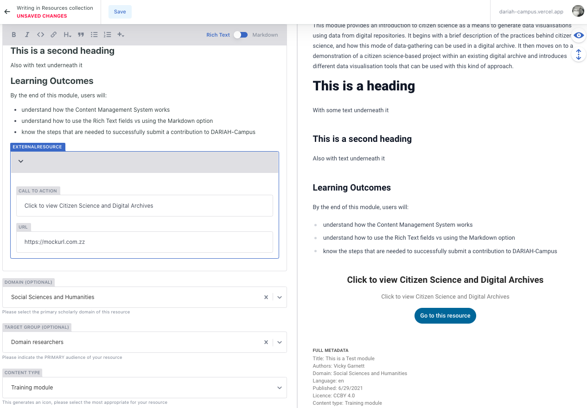

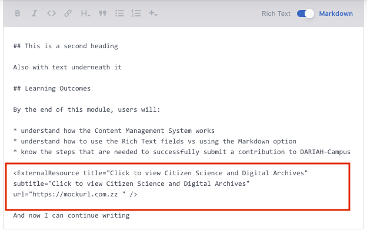

#### Submitting your new resource for publication

Once you have the content all as you want it to be, it always pays to do one last check of the metadata fields, and the content to make sure there are no typos.

1. Save your work by hitting the 'save' button at the top (see image below).

At this point, you have two options.

2a) If you're absolutely sure that you don't need to make any more changes to this, you can go to the 'set status' button in the top right, and select 'In review'. This will push the resource into the queue for publishing.

2b) If you have other things to work on, or for any reason want to check back on another resource you have created, you can click on the arrow in the top left-hand corner. Make sure that the message next to the arrow says 'CHANGES SAVED'. If you have left one of the required fields blank, this will tell you with an error and mark the required field border as red.

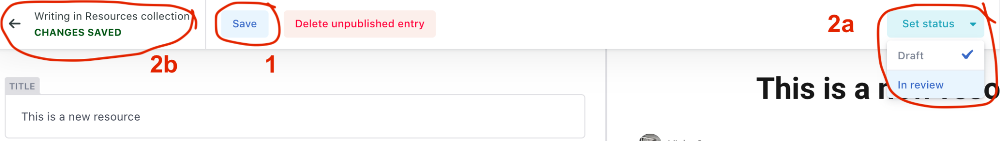

3. After either step 2a or 2b, you can check in on your new resource (draft or in review) by clicking on the 'Workflow' menu option along the top bar. This will bring you through to the 'Editorial Workflow' space, where you can look at your current drafts, and also your items in review.

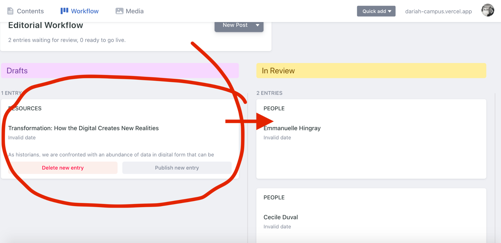

### Step 2.3 Adding a new 'Event'

1. From the main 'Contents' page, select the 'Events' option from the left-hand menu.

2. Click on 'New Event'. This will bring you through to the event editor, where you will see two columns: the editor on the left-hand side, and a preview pane on the right.

3. Start entering your event details into the editor, and you will see the preview of the content on the right-hand side.

Most of the fields are self-explanatory, but we have a few recommendations for you below:

4. For the 'Featured Image', we recommend you try to use an image that is not too busy, and doesn't have any text on it. This is because the 'Title' text is layered over the top, and becomes difficult to read if there is too busy a background behind it. Instead, we recommend an image that has a large amount of one colour without too much contrast, such as a sky, or a wall. Where this isn't possible, adding a gradient using image editing software (e.g Photoshop) can help to make the title stand out.

Making the title text clearer is not only more comfortable on the eye, but it also makes it much easier for those with visual impairments to read the text clearly.

5. The 'Abstract' won't appear in the preview pane, this will instead be used in the main 'resources' page (see the image below).

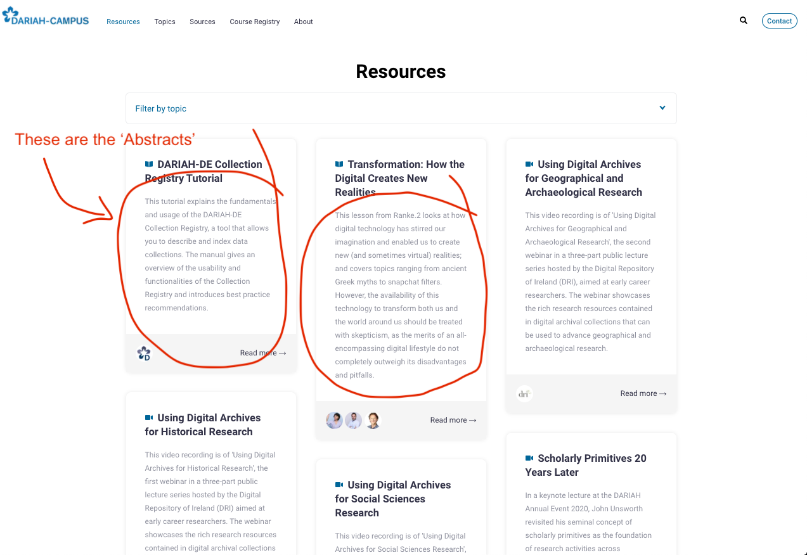

6. The 'Short Description' field allows you to add some of the headline information about the event. We recommend you include the name of the event, the location where it took place, and the date here.

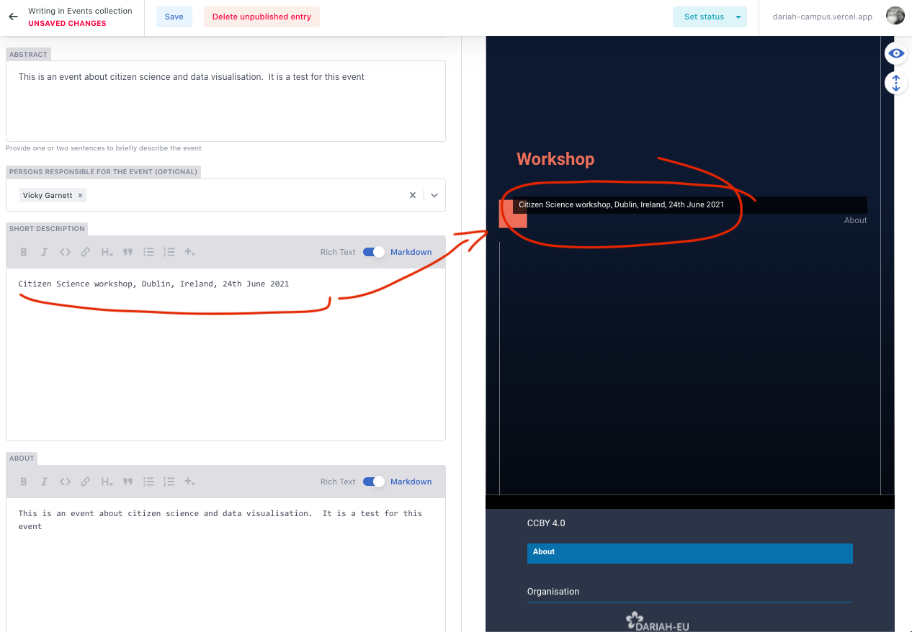

7. The 'About' field is another field that doesn't show up in the Preview Pane. This is because this is a pop-up window on the main site. This field can be used to provide a bit more context for the event, give details about the organisation committee, any funding that was received to support the training event, a link to a project website, and if you want to you can also include a list of attendees. An example of this from one of the existing events is given below:

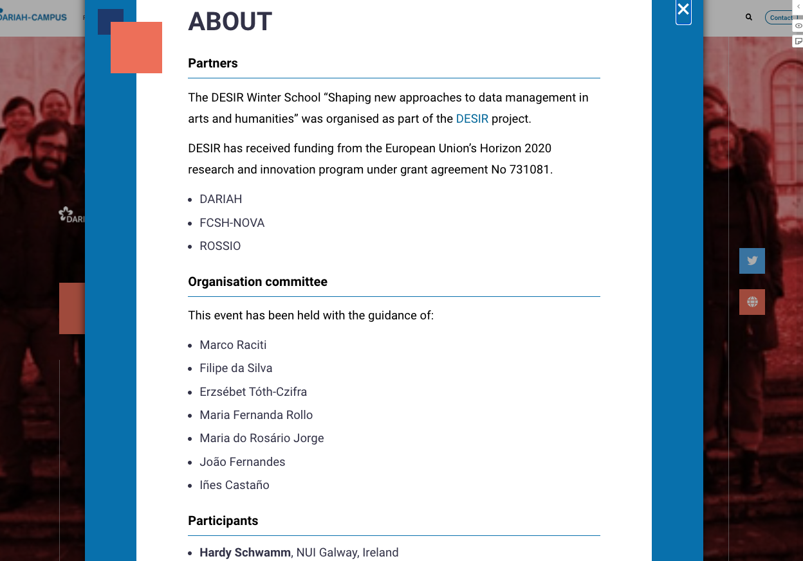

8. The 'Synthesis' field is where you can upload any reports or proceedings from the event.

9. Adding Sessions

The 'Sessions' field allows you to add sessions to your event. Typically, one session is one presentation. Within this field you are asked to provide:

a) the Title of the presentation

b) the Speaker (again, the names of all speakers should have been included in the initial proposal so that we could ensure they are available for you to include here)

c) the 'Content' field can be used to provide an abstract or summary of the presentation. You can also include any videos or links to external materials that are hosted elsewhere. For more information on how to do this, look at the 'Resource Types' described above.

d) the 'Synthesis' field in this section can be used to include any presentation slides. These can be uploaded directly, or a URL from a repository (e.g. Zenodo, HAL, etc) can also be inserted.

e) You'll notice that a 'Session' is also added to the front page of the event

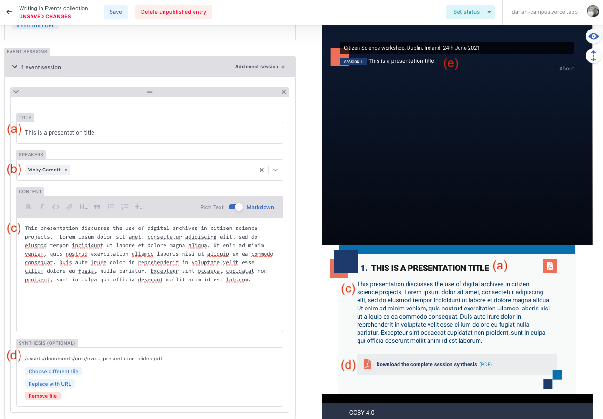

You can add as many sessions as you need to in this manner.

10.Once you're happy with your event, click the 'save' button in the top-left hand corner of the screen. It is recommended that you periodically 'save' your content as you go along, to make sure you don't lose anything. This is particularly useful if you need to leave your computer for any length of time.

11.Once the event is saved, if you are entirely happy with it, you can move it on to Review' to publish by clicking on the 'Set Status' button in the top right-hand of the screen and clicking on 'In Review'. Alternatively, once the event is saved, you can click the arrow in the top left-hand corner to create more resources. You can return to change the status by clicking on 'Workflow' in the top menu, and clicking on the draft event.

## Step 3 - Creating a Curriculum

It's possible that once you have a few items in DARIAH Campus that fit a theme, or were created as part of a wider training programme, you may want to create a curriculum. This allows you the opportunity to 'link' your items in DARIAH-Campus to show users how your resources fit together. This also enables users to find your materials more quickly.

To create a curriculum, from the home page, navigate to 'Curricula' on the left-hand menu

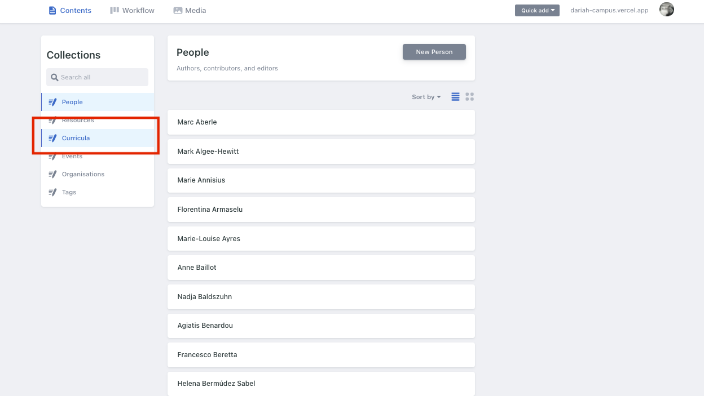

You will then see the option to create a 'New Curriculum' in the centre panel. Click on this, and you will then be brought to the familiar two-panel editing area to create the Curriculum.

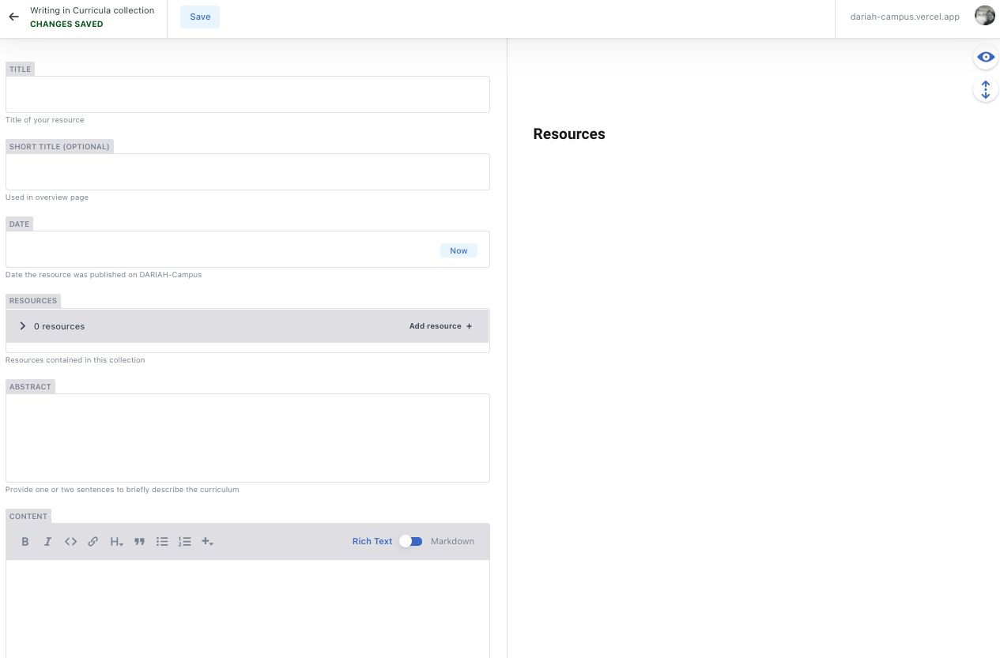

You will need to give your Curriculum a name. We recommend something that incorporates the entire Curriculum, but that is still short enough to remain memorable.

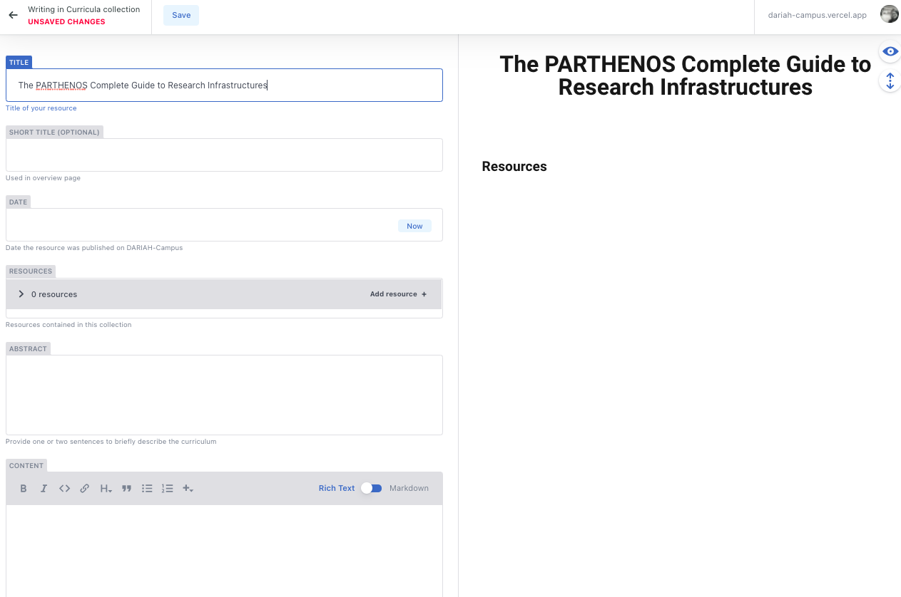

Add a short title, and click to set the 'Date' field to 'Now'.

### Adding Resources

The Resources you want to include in your Curriculum can be selected from the existing list of published materials on DARIAH-Campus.

To start adding resources to your Curriculum, click on the 'Add Resource +' option on the right of the 'Resources' field.

HINT - It is perhaps useful to have a list of all the resources you want to include in your Curriculum handy so that you can make sure not to forget anything!

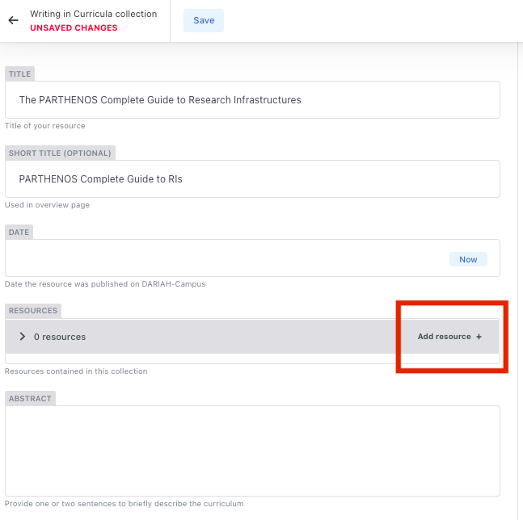

This will bring up an extra box with a drop-down list for you to select items. You can use this button to add more resources.

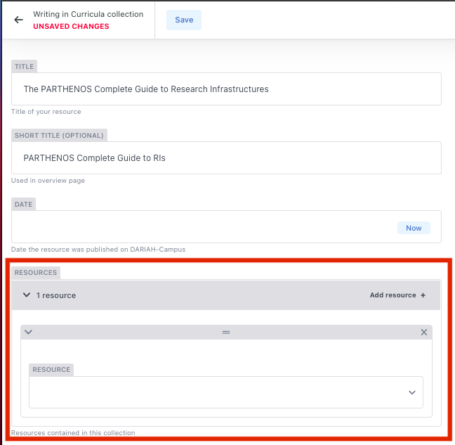

You can also type the name of your resource to search for the right one:

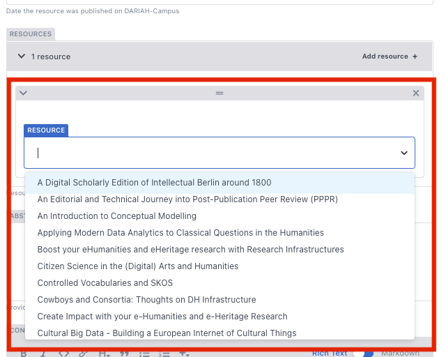

You can change the order of the resources in the Curriculum if you need to by clicking and holding on the grey top-bar of the resource box, and dragging it to the position in the list you want it to go.

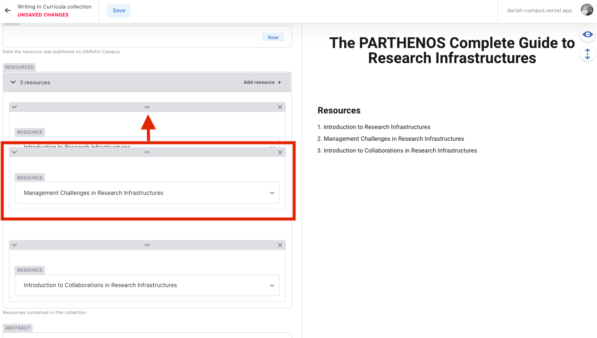

### Describing your Curriculum

#### Abstract

Once you have your resources linked to your curriculum, you then need to provide a brief abstract to describe the Curriculum, giving an outline of the course overall. This will not show in the preview, as this will appear on the main 'Resources' page.

#### Content

The 'Content' field is where you can add more information, provide the Learning Outcomes, and give users a better idea of the structure of the curriculum as a whole. The information you provide in the 'Content' field will show in the preview pane on the right-hand side.

Don't forget your Learning Outcomes!

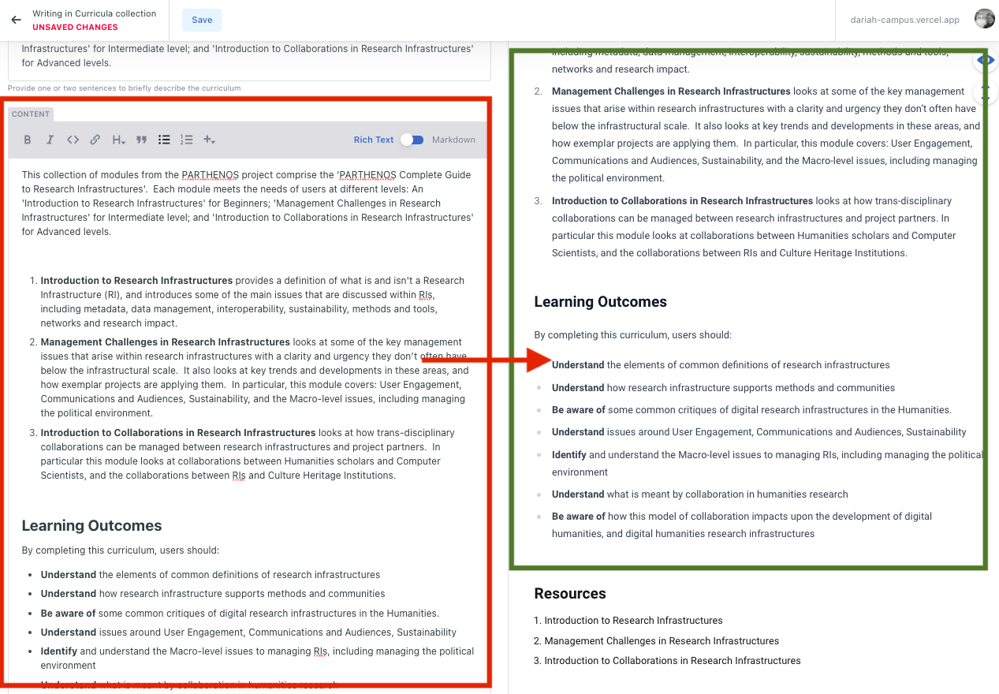

### Save and publish!

When you are happy with your content and description of the curriculum, you can 'save' your content as before in the top left-hand of the screen (1). For best practice, though, it is advisable to save your content as you write it, particularly if you have a lot to write!

If you are completely happy with your content, you can then click on 'Set Status' in the top right hand of the screen, and tick the 'In Review' option (2).

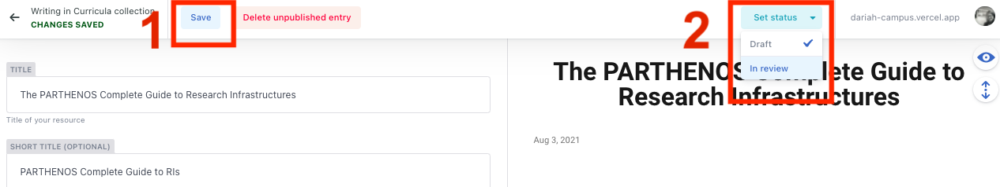

If you would like to check over this or have other items to write, you can return to the main page by clicking on the arrow in the top left-hand corner.

When you are ready to send your curriculum for review to publish, you can then click on 'Workflow' to bring you to the two-panel screen showing your current drafts and your items that are under review. At this point you can click on a draft to make any further changes you need to. You also have the option to delete a resource if you no longer want it.

NOTE - the 'Publish new entry' button is not available.

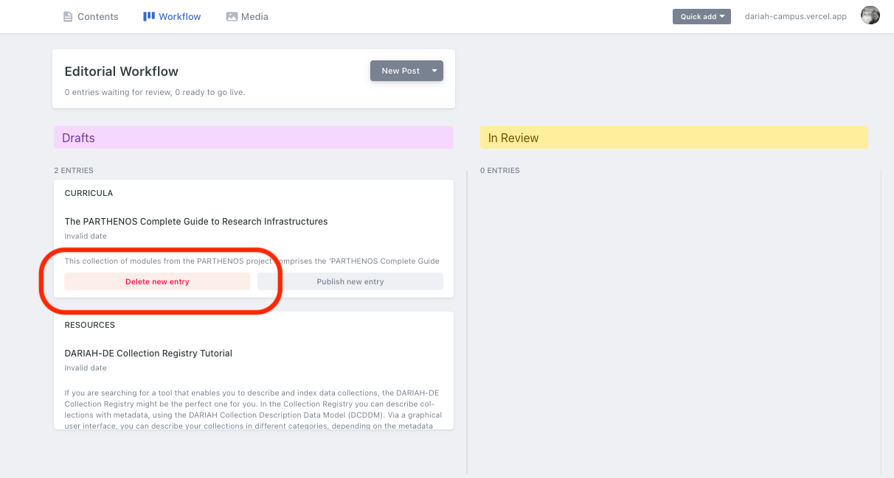

To publish an entry, click on it to go back through to the editing screen. As before, you can then click on the 'Set Status' option at the top right-hand of the screen, and click on 'In Review'. When you return to the Workflow page your curriculum will then move to the 'In Review' panel on the right hand side.

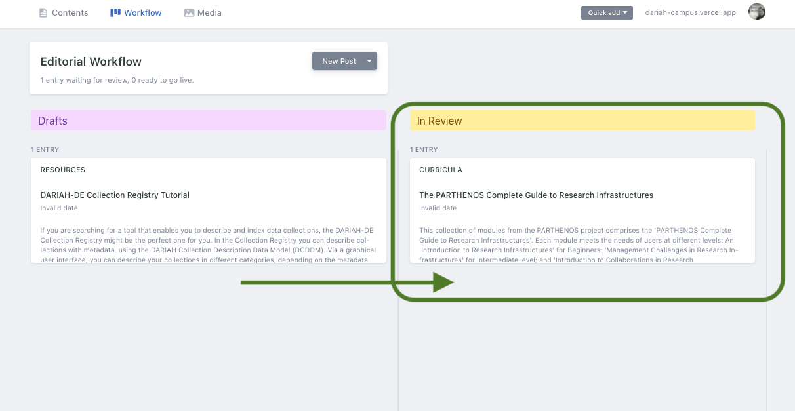
