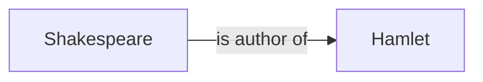
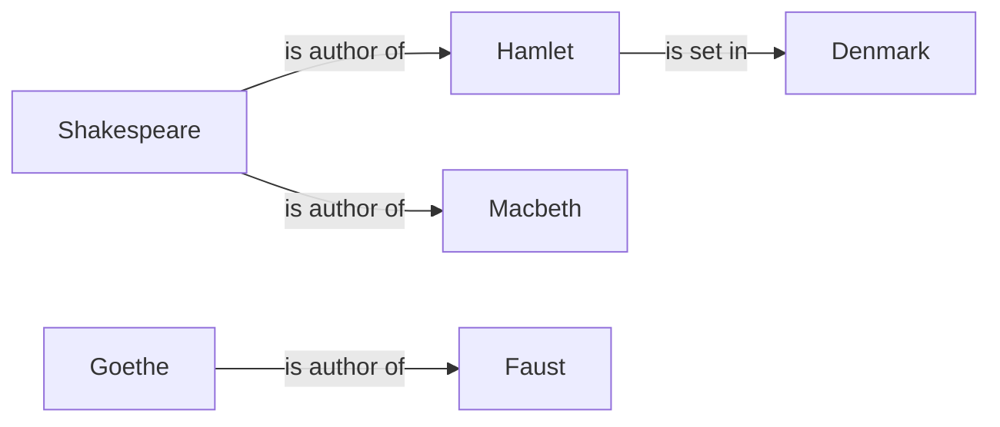
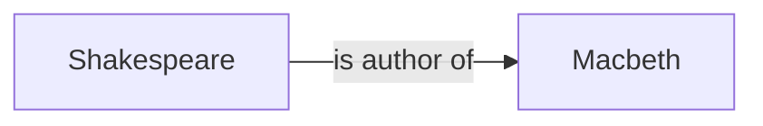

This article gives a very short introduction to the basic concepts of the **Semantic Web** and **Linked Open Data (LOD)**, including a crash course in **SPARQL**, a query language for LOD. This will be followed by a hands-on part applying SPARQL on the data in the CLSCor Catalogue.

## Learning Outcomes

After completing this module, learners will be able to:

* Define the principles of Linked Open Data
* Explain the terms *RDF*, *SPARQL* and *Ontology*
* Write your own simple SPARQL queries and query the CLSCor Catalogue
* Explain advanced SPARQL functions and federated queries

<Disclosure title="About This Material">
  This training material was originally produced for the CLS INFRA Training School in Vienna in June 2024. You can find more information about the project and the training school as well as recordings of the individual sessions [here](https://campus.dariah.eu/resources/events/explore-cor-using-programmable-corpora-in-computational-literary-studies).

  The CLSCor Catalogue is one outcome of the EU-funded CLS INFRA project, namely an exploration platform gathering information about literary corpora and applicable tools. The metadata on both corpora and tools was harmonised and mapped to a specifically designed data model which will be addressed later in this article and serves as the base for our upcoming LOD exercises.
</Disclosure>

## Linked Open Data

Linked Open Data (LOD) refers to a method of ”publishing structured data on the Web” [\[1\]](https://www.w3.org/wiki/LinkedData) so that it can be interlinked and become more useful. The concept builds on the principles of the Semantic Web, where data is given meaningful links that allow it to be connected across different domains and platforms. LOD consists of open datasets that are published in a machine-readable format, allowing computers to easily discover and process the data.

The main principles of LOD include:

* **Use URIs (Uniform Resource Identifiers):** Every data entity (like a person, place, or object) is identified by a unique URI, which allows anyone to refer to or link to that entity.
* **Use HTTP URIs:** By using HTTP URIs, the data can be looked up over the web to get additional information about the entity.
* **Provide useful information:** When users look up a URI, it should return meaningful information, usually in formats like RDF (Resource Description Framework; the term will be explained in the upcoming sections).
* **Link to other URIs:** To enable data integration across different datasets, entities should be linked to other relevant entities using their URIs.

LOD allows for the creation of a web of interlinked data that facilitates new ways of browsing, querying, and discovering information. The result can be visualized and explored at [https://lod-cloud.net/](https://lod-cloud.net/):

<Figure src="/assets/content/assets/en/resources/hosted/introduction-to-lod/lod-cloud.svg" alt="Image of the large nodes in the linked open data cloud" alignment="center">
  This figure represents LOD on the internet, colour-coding different domains and showing their connections. For an interactive version of the cloud, you can visit [https://lod-cloud.net/clouds/lod-cloud.svg](https://lod-cloud.net/clouds/lod-cloud.svg).
</Figure>

## Resource Description Framework (RDF)

[RDF (Resource Description Framework)](https://www.w3.org/RDF/) is a standard model for representing data in the semantic web. It allows us to describe resources (entities, concepts, or things) using **triples**, which consist of a **subject**, **predicate**, and **object**.

For instance, a simple triple could be:

> William Shakespeare (subject) is the author of (predicate) Hamlet (object).



Following the principles of the semantic web, the entities within a triple are identified using URIs. In a more formal syntax, namely the Terse RDF Triple Language (**TTL** or **Turtle** 🐢), the above triple could then look as follows:

```turtle
<http://example.org/William_Shakespeare> <http://example.org/is_author_of> <http://example.org/Hamlet> .
```

Since the triples in an RDF graph are directed, we read the TTL statements from left to right:  Shakespeare is the author of Hamlet, but Hamlet is not the author of Shakespeare.

Multiple triples can be used to form a **knowledge graph** and extend our knowledge base even further, e.g.:



In the above graph, some entities appear in a similar context. "Shakespeare" and "Goethe" refer to *authors* while "Hamlet", "Macbeth" and "Faust" all refer to *literary work*. These *classes* of nodes within our graph can be used to further formalize its structure by means of an **ontology**.

## Ontologies

Ontologies provide the structured framework that allows us to define the relationships between different concepts in a domain. In the context of the Semantic Web, an ontology is a formal specification of the **classes** (types of things), **properties** (relationships), and **constraints** that describe the data within a specific knowledge domain. Simply put, the ontology describes, what kind of things are in our world (classes), how these things relate to one another (properties) and what kinds of relations are (or are not) possible (constraints).

By defining these elements, ontologies enable consistency, interoperability, and shared understanding of data across different systems. In our Shakespeare example, an ontology might specify that an author (class) writes (property) a book (class), helping systems understand how these entities are related. The class constraints in the example specify, that any subject of the `<is author of>` property is an `<author>` and that any object is a `<book>` (or `<literary work>` in general). They would also allow us to add information on **class hierarchy**, e.g. defining that every `<author>` is also a `<person>`. Through these constraints, ontologies enable us to reason over data and infer new knowledge, making them a powerful tool for organizing and connecting complex information in the semantic web. Our basic Shakespeare triple (Shakespeare → is author of → Hamlet) could hence be used to infer that:

1. Shakespeare is an author.
2. Shakespeare is also a person.
3. Hamlet is a literary work.

## SPARQL (SPARQL Protocol and RDF Query Language)

Once a knowledge graph is filled with triples, one may wonder how to ask it for specific information. This can be done using [SPARQL](https://www.w3.org/TR/rdf-sparql-query/), a query language designed for the Semantic Web. It provides a powerful means of querying RDF datasets, enabling users to retrieve, manipulate, and update data. It is similar in syntax and structure to **SQL**, but it is designed specifically for querying RDF datasets.

### Basic Structure of a SPARQL Query

SPARQL uses pattern matching to find unknown values in a graph. It allows us to formulate questions like "Shakespeare is the author of \_\_\_", retrieving all entities in the graph that fill the gap. The placeholder used to indicate the underline is called a **variable** and usually starts with a "?" while the rest of the name can be chosen freely, e.g. `?work`. Using the knowledge graph from before, `?work` can stand for both, Hamlet and Macbeth, since we have two matching triples in the graph:


and



A very simple SPARQL query only consists of two clauses:

* `SELECT` clause: Specifies the variables to retrieve.
* `WHERE` clause: Contains the pattern to match in the RDF graph.

A pseudo query asking for Shakespeare's work could then look like this:

```sparql
SELECT ?work
WHERE {
    <Shakespeare> <is author of> ?work.
}
```

<Callout kind="important">
  Note that `?work` is really just a made-up name; the same query would also work with `?variable`, `?some_work`, or `?x` instead.
</Callout>

<Callout kind="tip" title="Would You Like to Code Along?">
  You can try out the following SPARQL queries yourself using the <Link link={{"discriminant":"external","value":"https://atomgraph.github.io/SPARQL-Playground/"}}>SPARQL Playground</Link>. Just paste the following Turtle representation of our demo data into the upper left textbox ("RDF input") and enter your SPARQL queries in the textbox in the upper right corner.

  <Disclosure title="RDF Input for our First Queries">
    ```turtle
    <http://example.org/William_Shakespeare> <http://example.org/is_author_of> <http://example.org/Hamlet> .
    <http://example.org/William_Shakespeare> <http://example.org/is_author_of> <http://example.org/Macbeth> .
    <http://example.org/Hamlet> <http://example.org/location> <http://example.org/Denmark> .
    ```
  </Disclosure>

  The corresponding graph looks as follows:

  ```mermaid
  graph LR;
    accTitle: Multiple triples forming a graph
    accDescr: A diagram displaying multiple connected nodes as a knowledge graph.
    s["`Shakespeare
    <sub>Author</sub>
    `"]-->|is author of| h["`Hamlet
    <sub>Work</sub>`"];
    s-->|is author of| m["`Macbeth
    <sub>Work</sub>`"];
    h-->|is set in| l["`Denmark
    <sub>Location</sub>
    `"];

  ```
</Callout>

Remember that RDF encourages us to use URIs to identify the entities in our dataset. In order for our query to succeed, we hence have to use the exact same URIs that we used to define our graph:

```sparql
SELECT ?work
WHERE {
    <http://example.org/William_Shakespeare> <http://example.org/is_author_of> ?work.
}
```

The long URLs look a bit bulky. We can shorten them by introducing a `PREFIX` clause at the beginning of our query:

```sparql
PREFIX ex: <http://example.org/>

SELECT ?work
WHERE {
    ex:William_Shakespeare ex:is_author_of ?work.
}
```

The `WHERE` clause also allows to define multiple relations in the graphs that have to be fulfilled by the result set. For example, we could query the data for work by Shakespeare that is set in Denmark:

```sparql
PREFIX ex: <http://example.org/>

SELECT ?work
WHERE {
    ex:William_Shakespeare ex:is_author_of ?work.
    ?work ex:location ex:Denmark.
}
```

There are more clauses that can be used within our queries. The complete list, including those we already know, looks as follows:

1. `PREFIX` clause (optional): Shorten the URIs by defining prefixes that replace them in the queries.
2. `SELECT` clause: Specifies the variables to retrieve.
3. `FROM` clause (optional): If we have multiple graphs available in our dataset, we can optionally restrict the graph from which to select.
4. `WHERE` clause: Contains the pattern to match in the RDF graph.
5. `FILTER` clause: Adds conditions to filter results based on criteria.
6. `ORDER BY, GROUP BY, LIMIT, OFFSET, ...`: These clauses can be used to modify and specify your query further (e.g. group results by a particular variable, limit query, etc.)

<Figure src="/assets/content/assets/en/resources/hosted/introduction-to-lod/anatomy-of-a-query.svg" alt="Anatomy of a SPARQL query" alignment="stretch">

</Figure>

As we learned earlier, SPARQL can not only be used to retrieve (`SELECT`) data, but also to update and describe it. There are four types of SPARQL queries:

* **SELECT** : returns values based on some query pattern
* **CONSTRUCT** : returns a new graph consisting of new triples. The new graph does not overwrite the current graph but is returned as RDF triples.
* **ASK** : returns a yes/no answer, e.g. do any entities with given property exist
* **DESCRIBE** : provides information about a resource, without explicitly stating the query pattern. The query processor determines the result set.

### SPARQL Endpoints

All our freshly acquired SPARQL knowledge only becomes useful when we can apply it to real data. This is where **SPARQL endpoints** come into play.

A SPARQL endpoint is a web service that allows users to query an RDF dataset via the SPARQL query language. These endpoints are crucial for querying large and complex datasets, such as those hosted by organizations like [Wikidata](https://query.wikidata.org/) or [DBpedia](https://dbpedia.org/sparql).

Of course, our CLSCor catalogue also offers an endpoint to query the dataset: [https://clscor.io/sparql](https://clscor.acdh.oeaw.ac.at/sparql). We will use this endpoint in the upcoming hands-on section.

## Hands-on: Let's SPARQL the CLSCor Catalogue

### Details about CLSCor

RDF data is usually stored in databases that are specialized for triples, so-called **triple stores**. The data in the CLSCor catalogue is stored in a triple store called [Blazegraph](https://blazegraph.com/). The store is connected to the semantic knowledge platform [Researchspace](https://researchspace.org/) that is used to provide a frontend application for our data at [https://clscor.io](https://clscor.io).

We will not cover all the details about the ontologies used in the CLSCor catalogue (they can be viewed [here](https://clscor.acdh.oeaw.ac.at/resource/?uri=http%3A%2F%2Fwww.researchspace.org%2Fresource%2Fassets%2FOntologies\&semanticSearch=N4IgZiBcDaC6A0IBOBTAzgVwDYBcrAF9EATAQx1LRRzSjkVKwEsBzAOwFsU29JQAVKCAAi5UgDoAsqQCeAIxQhEANXwEiIFklIAHABYBlAMYB7HSgMpSSI3vwhBkEWKmyFSkKr7qCQA)), but only look into single classes that are relevant for now:

* crmcls:X1\_Corpus: a corpus within our dataset, e.g. [ELTEC](https://clscor.acdh.oeaw.ac.at/resource/?uri=https%3A%2F%2Fclscor.io%2Fentity%2F135083e3e8)
* crmcls:X2\_Corpus\_Document: a document within a corpus, the expression of some literary work, e.g. [The Time Machine](https://clscor.acdh.oeaw.ac.at/resource/?uri=https%3A%2F%2Fclscor.io%2Fentity%2F07d8623fb0)
* crm:E39\_Actor: human actors, mostly [authors](https://clscor.acdh.oeaw.ac.at/resource/?uri=app%3AAuthors) of corpus documents

The triples stating that "The Time Machine" is a corpus document within the ELTEC corpus would then look as follows:

```
# [The Time Machine] [has type] [X2_Corpus_Document]
<https://clscor.io/entity/07d8623fb0> <http://www.w3.org/1999/02/22-rdf-syntax-ns#type> <https://clscor.io/ontologies/CRMcls/X2_Corpus_Document>.

# [ELTEC] [has part] [The Time Machine]
<https://clscor.io/entity/135083e3e8> <http://www.cidoc-crm.org/cidoc-crm/P148_has_component> <https://clscor.io/entity/07d8623fb0>.
```

All *"incoming and outgoing"* triples for every entity  are listed in the \[Source] tab in detail views of the catalogue, see for example [Theodor Fontane](https://clscor.acdh.oeaw.ac.at/resource/?uri=https%3A%2F%2Fclscor.io%2Fentity%2F62b7c18a8f).

### [Querying the CLSCor Catalogue](https://clscor.acdh-dev.oeaw.ac.at/sparql)

<Callout kind="tip" title="Try It Out">
  You can code along and try out all queries in this section using the SPARQL interface at [https://clscor.io](https://clscor.acdh.oeaw.ac.at/sparql). Feel free to remove the initial content of the query input, including the prefixes - we will fill in all necessary text ourselves.
</Callout>

Let's send our first SPARQL queries to the CLSCor catalogue. We start with a list of all corpora:

```sparql
SELECT ?corpus
WHERE {
 ?corpus a crmcls:X1_Corpus .
}
```

Note that we are using the prefix `crmcls` within the query. The SPARQL interface should be clever enough to infer this prefix automatically and prepends its definition to the query while typing. If not, we can simply add the line manually:

```sparql
PREFIX crmcls: <https://clscor.io/ontologies/CRMcls/>
```

The result is a list of URIs, all of which refer to a corpus in the dataset. If we now want to see their labels, i.e. the names of the corpora and documents, we click on the "Fetch Labels" button on the right side.&#x20;

If we are interested in the corpus documents per corpus, we can query for the property `P148_has_component` from corpus to corpus document:

```sparql
PREFIX crmcls: <https://clscor.io/ontologies/CRMcls/>
PREFIX crm: <http://www.cidoc-crm.org/cidoc-crm/>

SELECT ?corpus ?document WHERE {
  ?corpus a crmcls:X1_Corpus.
  ?corpus crm:P148_has_component ?document.
  ?document a crmcls:X2_Corpus_Document.
}
```

This returns a long list of results, one row for each document along with the corresponding corpus. If we are just interested in the number of documents, we can use the aggregate function `COUNT` instead. Note that this also requires us to add a `GROUP BY` clause to the end of the query, telling the triple store that we are interested in the number of documents *per corpus*.

```sparql
PREFIX crmcls: <https://clscor.io/ontologies/CRMcls/>
PREFIX crm: <http://www.cidoc-crm.org/cidoc-crm/>

SELECT ?corpus (COUNT(?document) as ?count) WHERE {
  ?corpus a crmcls:X1_Corpus.
  ?corpus crm:P148_has_component ?document.
  ?document a crmcls:X2_Corpus_Document.
}
GROUP BY ?corpus
```

We can even sort our results by appending an `ORDER BY` clause to the query:

```sparql
PREFIX crmcls: <https://clscor.io/ontologies/CRMcls/>
PREFIX crm: <http://www.cidoc-crm.org/cidoc-crm/>

SELECT ?corpus (COUNT(?document) as ?count) WHERE {
  ?corpus a crmcls:X1_Corpus.
  ?corpus crm:P148_has_component ?document.
  ?document a crmcls:X2_Corpus_Document.
}
GROUP BY ?corpus
ORDER BY ?count
```

Congratulations! You just completed your first SPARQL queries in the wild. This might be a good time to pause reading for a moment and play around with your queries a little more before we continue with some advanced functions.

<Callout kind="note" title="SPARQL Exercise">
  <Diagram link>
    <DiagramCodeBlock>
      ```mermaid
      graph LR;
        accTitle: Simplified version of the CLSCor ontology
        accDescr: A diagram displaying the property paths from X1_Corpus to E39_Actor.
        crmcls:X1_Corpus-->|crm:P148_has_component| crmcls:X2_Corpus_Document;
        crmcls:X2_Corpus_Document--> |crm:P148i_is_component_of| crmcls:X1_Corpus
        crm:E39_Actor-->|crm:P14i_performed| lrm:F28_Expression_Creation;
        lrm:F28_Expression_Creation-->|crm:P14_carried_out_by| crm:E39_Actor;
        lrm:F28_Expression_Creation-->|lrm:R17_created| lrm:F2_Expression;
        lrm:F2_Expression-->|lrm:R17i_was_created_by| lrm:F28_Expression_Creation;
        lrm:F2_Expression-->|lrm:R4i_is_embodied_in| crmcls:X2_Corpus_Document;
        crmcls:X2_Corpus_Document-->|lrm:R4_embodies| lrm:F2_Expression;
      ```
    </DiagramCodeBlock>
  </Diagram>

  If you are interested in a little SPARQL exercise, try to retrieve the authors for every corpus document. The diagram above will help you with the required properties and classes.

  We will use a similar query in the next chapter on advanced SPARQL functions.
</Callout>

## Advanced SPARQL Functions

Now that we know the basic concepts of SPARQL and have formulated our first successful queries, we are ready for some more advanced functions. We will start with some commonly used functions, e.g. `BIND` and `FILTER`, followed by concepts that you are less likely to encounter in the wild: query federation and nested queries.

Let's take a look at all the authors in our dataset. They are modeled as E39\_Actors. We can hence retrieve them using the following query:

```sparql
SELECT ?author WHERE {
  ?author a crm:E39_Actor.
}
```

We probably want their labels (i.e., their names), too:

```sparql
SELECT ?author ?authorName WHERE {
  ?author a crm:E39_Actor;
          rdfs:label ?authorName.
}
```

Not all actors in the dataset are actually authors of corpus documents. You might also find some staff members of our institute in there, since they are mentioned in the metadata of the corpus table. To exclude them, we extend the query to include only actors who created an F2\_Expression.

```sparql
SELECT ?author ?authorName WHERE {
  ?author a crm:E39_Actor;
          rdfs:label ?authorName;
          crm:P14i_performed/lrm:R17_created ?expression.
  ?expression a lrm:F2_Expression.
}
```

You might notice the **property path** `crm:P14i_performed/lrm:R17_created` in the query above. If you take a look at the [knowledge graph](https://clscor.acdh-dev.oeaw.ac.at/resource/?uri=https%3A%2F%2Fclscor.io%2Fentity%2F593f8e88-a) from Actor to Expression, you will see that there is actually an F28\_Expression\_Creation in between. Since we don't need this at the moment, we can skip the node and chain the two properties leading to/from the Expression\_Creation.

If we take a look at the results of our query, you will see that we actually retrieve more than just the authors' names. Their labels include their lifespan and class: `Shakespeare, William (1564-1616) [Actor]`. To extract the first and last name from this label, we can use the `REPLACE` function in SPARQL and `BIND` its result to a new variable:

```sparql
SELECT ?author ?nameWithoutParentheses WHERE {
  ?author a crm:E39_Actor;
          rdfs:label ?authorName;
          crm:P14i_performed/lrm:R17_created ?expression.
  ?expression a lrm:F2_Expression.

  # Remove the brackets and the class name,
  # bind the result to a new variable called ?nameWithoutClass
  BIND(REPLACE(?authorName, " \\[.*?\\]", "") AS ?nameWithoutClass)

  # Remove the parentheses, the timespan and optional spaces,
  # bind the result to a new variable called ?nameWithoutParentheses
  BIND(REPLACE(?nameWithoutClass, " ?\\(.*?\\) ?", "") AS ?nameWithoutParentheses)
}
```

The `REPLACE` function uses **regular expressions** to match the string that we want to replace. If you need help with Regex, you can find a cheat sheet [here](https://images.datacamp.com/image/upload/v1665049611/Marketing/Blog/Regular_Expressions_Cheat_Sheet.pdf) and website that helps you debugging your Regex [here](https://regex101.com/).

You can also use regular expressions to `FILTER` your results, e.g. all authors starting with the letter A:

```sparql
FILTER REGEX(STR(?nameWithoutParentheses), "^A")
```

Now that we removed all the additional information, let's try to transform the names from "LastName, FirstName" to "FirstName LastName". We can do this by creating **groups** (using parentheses) in a regular expression and rearranging them in our `REPLACE` function:

```sparql
BIND(REPLACE(?nameWithoutParentheses, "^(.*?), (.*?)$", "$2 $1") AS ?transformedName)
```

Our final query should now look like this:

```sparql
SELECT ?author ?authorName ?transformedName WHERE {
  ?author a crm:E39_Actor;
          rdfs:label ?authorName;
          crm:P14i_performed/lrm:R17_created ?expression.
  ?expression a lrm:F2_Expression.

  # Remove the brackets and the class name,
  # bind the result to a new variable called ?nameWithoutClass
  BIND(REPLACE(?authorName, " \\[.*?\\]", "") AS ?nameWithoutClass)

  # Remove the parentheses, the timespan and optional spaces,
  # bind the result to a new variable called ?nameWithoutParentheses
  BIND(REPLACE(?nameWithoutClass, " ?\\(.*?\\) ?", "") AS ?nameWithoutParentheses)

  # Rearrange first name and last name using Regex groups
  # bind the result to a new variable called ?transformed name
  BIND(REPLACE(?nameWithoutParentheses, "^(.*?), (.*?)$", "$2 $1") AS ?transformedName)
}
```

You can also sort the results by appending `ORDER BY ?variableName` to the end of your query. The variable you use for sorting is up to you: `?authorName` should sort the results by last name and `?transformedName` by first name if everything works properly:

```sparql
SELECT ?author ?authorName ?transformedName WHERE {
  ?author a crm:E39_Actor;
          rdfs:label ?authorName;
          crm:P14i_performed/lrm:R17_created ?expression.
  ?expression a lrm:F2_Expression.

  BIND(REPLACE(?authorName, " \\[.*?\\]", "") AS ?nameWithoutClass)
  BIND(REPLACE(?nameWithoutClass, " ?\\(.*?\\) ?", "") AS ?nameWithoutParentheses)
  BIND(REPLACE(?nameWithoutParentheses, "^(.*?), (.*?)$", "$2 $1") AS ?transformedName)
}
ORDER BY ?authorName
```

### Federated Queries - Wikidata Enrichment

If you have ever worked with semantic web technologies, [Wikidata](https://www.wikidata.org/) is probably familiar to you. It is a huge knowledge base with hundreds of millions of entries - including many authors that are also part of the CLSCor dataset. How nice would it be to link our entities to those in Wikidata?

Luckily, Wikidata also has a [SPARQL endpoint](https://query.wikidata.org/). Let's see if we can find one of our authors there: William Shakespeare.

<Callout kind="important" title="Important Note">
  The following queries will be executed in the [Wikidata Query Interface](https://query.wikidata.org/) (not the CLSCor interface) unless mentioned otherwise. Wikidata has its own data model, including properties and classes that differ from those in CLSCor. This also affects our SPARQL queries, e.g. when querying for *persons*, we will now use `wd:Q5` instead of `crm:E39_Actor`. Click <Link link={{"discriminant":"external","value":"https://www.wikidata.org/wiki/Wikidata:WikiProject_Ontology"}}>here</Link> for more details on the Wikidata ontology and [here](https://gitlab.clsinfra.io/cls-infra/wp567/clscor/-/blob/main/model/CLSCorDataModel.ttl?ref_type=heads) for the CLSCor ontology.
</Callout>

A naive first approach leads to no results:

```sparql
SELECT * WHERE {
 ?subj rdfs:label "William Shakespeare".
}
```

Wikidata requires us to define the label's language by appending `@en` to the name:

```sparql
SELECT * WHERE {
 ?subj rdfs:label "William Shakespeare"@en.
}
```

Now we get 44 results, including an [Australian singer](https://www.wikidata.org/wiki/Q6173965), an [American football player](https://www.wikidata.org/wiki/Q8018308) and [portraits](https://www.wikidata.org/wiki/Q55008051) depicting the author. Let's first restrict the results to **persons**. Human beings have the identifier `Q5` in Wikidata. The `instance of` property is called `P31`. Using the following query, we can now limit our result set to 11 human beings called "William Shakespeare":

```sparql
SELECT * WHERE {
 ?subj rdfs:label "William Shakespeare"@en;
       wdt:P31 wd:Q5.
}
```

Note that we use the prefix `wdt:` for properties and `wd:` for entities here.

To find the one among these 11 Shakespeares who is actually an author, we can look for the **occupation** (P106) called **"writer"** (Q36180).

Looking at the [list of occupations](https://www.wikidata.org/wiki/Q692#P106) of our "target" Shakespeare, we'll see that there is actually more than one occupation assigned to him. The entry at the top, highlighted in green is *playwright*. This entry has the `preferred rank` in Wikidata and will be the only one returned when querying this instance using `wdt:P106`. In order to also search the other occupations, we can use a different prefix together with another **property path**: `p:P106/ps:P106`.

```sparql
SELECT * WHERE {
 ?subj rdfs:label "William Shakespeare"@en;
       wdt:P31 wd:Q5;
       p:P106/ps:P106 wd:Q36180.
}
```

Yay, now there is only one Shakespeare left. That's the one we were looking for. We can now use Wikidata to retrieve additional information about him, e.g. his description:

```sparql
SELECT * WHERE {
 ?subj rdfs:label "William Shakespeare"@en;
       wdt:P31 wd:Q5;
       p:P106/ps:P106 wd:Q36180;
       schema:description ?description.
}
```

Our result list grows tremendously again. It looks like we got descriptions in a variety of languages. To limit the list to the English description, we can make use of the `wikibase:label` Service:

```sparql
SELECT * WHERE {
 ?subj rdfs:label "William Shakespeare"@en;
       wdt:P31 wd:Q5;
       p:P106/ps:P106 wd:Q36180.

  SERVICE wikibase:label {
      bd:serviceParam wikibase:language "en".
      ?subj schema:description ?description.
  }
}
```

Now, we should get one result: `English playwright and poet (1564–1616)`.

#### Query Federation from our CLSInfra Instance

We now know

1. how to retrieve and transform the names of all the authors in the CLSCor dataset, and
2. how to query Wikidata for an author's description based on their name.

It is finally time to combine these two skills and query wikidata for a description of all the authors in our dataset. To do this, we will write our first **federated query**.

SPARQL offers a practical functionality named `SERVICE` that allows us to send a query to another SPARQL endpoint and use the result within our own query.

Switching back to our [CLSCor SPARQL interface](https://clscor.acdh-dev.oeaw.ac.at/sparql), we paste our Wikidata query from before and wrap it in a `SERVICE` call to the Wikidata SPARQL endpoint like so:

```sparql
SELECT * WHERE {
  SERVICE <https://query.wikidata.org/sparql> {
   SELECT * WHERE {
     ?subj rdfs:label "William Shakespeare"@en;
           wdt:P31 wd:Q5;
           p:P106/ps:P106 wd:Q36180.

      SERVICE wikibase:label {
          bd:serviceParam wikibase:language "en".
          ?subj schema:description ?description.
      }
    }
  }
}
```

The interface will complain about unknown prefixes, since our system does not know the namespaces used by Wikidata. This can be solved by adding the following list of prefixes to the top of the query:

```sparql
PREFIX wd: <http://www.wikidata.org/entity/>
PREFIX wdt: <http://www.wikidata.org/prop/direct/>
PREFIX p: <http://www.wikidata.org/prop/>
PREFIX ps: <http://www.wikidata.org/prop/statement/>
PREFIX rdfs: <http://www.w3.org/2000/01/rdf-schema#>
PREFIX wikibase: <http://wikiba.se/ontology#>
PREFIX bd: <http://www.bigdata.com/rdf#>
PREFIX schema: <http://schema.org/>
```

If everything works correctly, we should get the same list of results as before, when we directly entered the query into the Wikidata interface. Congrats, you just wrote your first **federated query**.

Luckily, Wikidata knows more authors than just William Shakespeare. Let's enrich the list of transformed author names that we retrieved at the beginning with descriptions from Wikidata.
We...

1. want to retrieve all authors from the CLSCor dataset,
2. transform their names to the format "FirstName LastName",
3. forward these names to Wikidata to
4. retrieve a description for the corresponding author.

All we have to do is combine the author query

```sparql
?author a crm:E39_Actor;
          rdfs:label ?authorName;
          crm:P14i_performed/lrm:R17_created ?expression.
?expression a lrm:F2_Expression.

BIND(REPLACE(?authorName, " \\[.*?\\]", "") AS ?nameWithoutClass)
BIND(REPLACE(?nameWithoutClass, " ?\\(.*?\\) ?", "") AS ?nameWithoutParentheses)
BIND(REPLACE(?nameWithoutParentheses, "^(.*?), (.*?)$", "$2 $1") AS ?transformedName)
```

with our federation

```sparql
SERVICE <https://query.wikidata.org/sparql> {
  SELECT * WHERE {
    ?subj rdfs:label "William Shakespeare"@en;
          wdt:P31 wd:Q5;
          p:P106/ps:P106 wd:Q36180.

    SERVICE wikibase:label {
        bd:serviceParam wikibase:language "en".
        ?subj schema:description ?description.
    }
  }
}
```

and replace "William Shakespeare" with the variable `?transformedName`. Right? Almost.

You might end up with a line like this: `?subj rdfs:label ?transformedName@en;` that leads to an error message. We cannot append the @language tag to a variable but have to use another SPARQL function for that: `STRLANG`. This allows us to add a language tag of our choice to a string without having to use @. The result can then be bound to a new variable, let's call it `?transformedNameWithLanguage`:

```sparql
BIND(STRLANG(STR(?transformedName), "en") AS ?transformedNameWithLanguage)
```

The whole query now looks like this:

```sparql
SELECT * WHERE {
  ?author a crm:E39_Actor;
          rdfs:label ?authorName;
          crm:P14i_performed/lrm:R17_created ?expression.
  ?expression a lrm:F2_Expression.

  BIND(REPLACE(?authorName, " \\[.*?\\]", "") AS ?nameWithoutClass)
  BIND(REPLACE(?nameWithoutClass, " ?\\(.*?\\) ?", "") AS ?nameWithoutParentheses)
  BIND(REPLACE(?nameWithoutParentheses, "^(.*?), (.*?)$", "$2 $1") AS ?transformedName)
  BIND(STRLANG(STR(?transformedName), "en") AS ?transformedNameWithLanguage)

  SERVICE <https://query.wikidata.org/sparql> {
   SELECT * WHERE {
     ?subj rdfs:label ?transformedNameWithLanguage;
           wdt:P31 wd:Q5;
           p:P106/ps:P106 wd:Q36180.

      SERVICE wikibase:label {
          bd:serviceParam wikibase:language "en".
          ?subj schema:description ?description.
      }
    }
  }
}
```

<Callout kind="caution">
  The above query will timeout when you execute it. No worries, this is an expected behaviour. The reason for this is that internally, the `SERVICE` query is executed *before* anything else. `?transformedNameWithLanguage` is not bound at this point which means that Wikidata is retrieving all authors in their database - which is a lot and leads to an internal timeout.
</Callout>

Fortunately, there is a useful little helper that lets us specify which part of the query to execute first: query nesting.

#### Nested Queries

SPARQL allows us to wrap queries, i.e. `SELECT … WHERE { … }`, inside of other queries. These nested queries (also called "subqueries") allow to modularize complex queries into more manageable parts and also provide a means of controlling query execution order. Unification happens from inner to outer query level which means that the innermost query is executed first.

Let's take a look at an example. The following simple toy query features two variables, `?x` and `?y`:

```sparql
SELECT ?x ?y WHERE {

  VALUES ?x {1 2 3}

  #nested query:
  {
    SELECT ?y WHERE {
      VALUES ?y {"a" "b" "c"}
    }
  }
}

```

To keep the example short, we directly assign values to these variables using the keyword `VALUES` instead of matching a pattern of classes and properties like we did in our previous queries. `VALUES` provides a mechanism to add data to a query, in this case it assigns "a", "b" and "c" to the variable `?y` and 1, 2 and 3 to the variable `?x`. Feel free to try the query in a SPARQL interface of your choice.

<Disclosure title="Side Note: A Practical Use Case for VALUES">
  A cool practical use case for `VALUES` is to limit unification for a binding:

  ```sparql
  SELECT *
  WHERE {
    VALUES ?author {
      <https://clscor.io/entity/b131343253>
      <https://clscor.io/entity/3049ca6ae0>
    }
    ?author rdfs:label ?label
  }
  ```

  This statically unifies `?author` for the given URIs.

  The above behavior could also be achieved with membership testing.

  ```sparql
  SELECT *
  WHERE {
   ?author rdfs:label ?label
   FILTER (?author IN (
       <https://clscor.io/entity/b131343253>,
       <https://clscor.io/entity/3049ca6ae0>
     )
   )
  }
  ```

  The containment check version is radically less efficient though, since the processor has to check *every* label in the entire graph and compare it to the entities specified in the filter clause. Reducing the result set quickly is a key technique for writing efficient queries and `VALUES` can be a great tool for that.
</Disclosure>

The important part in this example query is the fact that the inner query will be executed first and hence `?y` will be bound before `?x`. This is exactly what we want to achieve for our federated query!

Wrapping the upper half of our original query in a subquery allows us to execute this part first and hence binding the variable `?transformedNameWithLanguage` before it is forwarded to Wikidata:

```sparql
SELECT DISTINCT ?authorName ?transformedName ?description WHERE {
  # This part is now nested and hence executed first:
  {
    SELECT * WHERE {
      ?author a crm:E39_Actor;
              rdfs:label ?authorName;
              crm:P14i_performed/lrm:R17_created ?expression.
      ?expression a lrm:F2_Expression.

      BIND(REPLACE(?authorName, " \\[.*?\\]", "") AS ?nameWithoutClass)
      BIND(REPLACE(?nameWithoutClass, " ?\\(.*?\\) ?", "") AS ?nameWithoutParentheses)
      BIND(REPLACE(?nameWithoutParentheses, "^(.*?), (.*?)$", "$2 $1") AS ?transformedName)
      BIND(STRLANG(STR(?transformedName), "en") AS ?transformedNameWithLanguage)
    }
  }

  SERVICE <https://query.wikidata.org/sparql> {
   SELECT * WHERE {
     ?subj rdfs:label ?transformedNameWithLanguage;
           wdt:P31 wd:Q5;
           p:P106/ps:P106 wd:Q36180.

      SERVICE wikibase:label {
          bd:serviceParam wikibase:language "en".
          ?subj schema:description ?description.
      }
    }
  }
}
```

The query targeting the local CLSCor instance is nested, which means that the CLSCor result set is generated first and its bindings are then projected to the federated query. As a result, you should see a list of authors in our dataset, their transformed names and the description that was fetched from Wikidata.

## Conclusion and Recommended Reading

Congratulations, you have completed this module on Linked Open Data. You know the principles of LOD, are familiar with RDF and the basic concepts of ontologies and you are able to write your own SPARQL queries - even with query federation to other triple stores!

If you are interested in further reading regarding knowledge graphs and the semantic web, we recommend the following books, articles and videos:

* Creator (PublicationYear). Title. Version. Publisher. ResourceType. Identifier
* Haslhofer, B., Antoine Isaac, A., Simon, R. (2018). Knowledge Graphs in the Libraries and Digital Humanities Domain. ArXiv:1803.03198 \[Cs], 1–8. Paper. [https://link.springer.com/rwe/10.1007/978-3-319-63962-8\_291-1](https://link.springer.com/rwe/10.1007/978-3-319-63962-8_291-1)&#x20;
* Hitzler, P. (25 January 2021). A review of the semantic web field. Communications of the ACM 64, Nr. 2: 76–83. Paper. [https://doi.org/10.1145/3397512](https://doi.org/10.1145/3397512)
* Studer, R., Benjamins, V. R., & Fensel, D. (1998). Knowledge engineering: Principles and methods. Data & knowledge engineering, 25(1-2), 161-197. Paper.
* Knowledge Engineering with Semantic Web Technologies by Dr. Harald Sack. Video tutorials. [https://www.youtube.com/playlist?list=PLoOmvuyo5UAcBXlhTti7kzetSsi1PpJGR](https://www.youtube.com/playlist?list=PLoOmvuyo5UAcBXlhTti7kzetSsi1PpJGR)

For additional information regarding SPARQL and its functionalities, we recommend:

* SPARQL 1.1 Overview. Website. [https://www.w3.org/TR/sparql11-overview/](https://www.w3.org/TR/sparql11-overview/)
* DuCharme, B. Learning SPARQL. Website. [http://www.learningsparql.com](http://www.learningsparql.com)
* Introducing SPARQL: Querying the Semantic Web. Website. [https://www.xml.com/pub/a/2005/11/16/introducing-sparql-querying-semantic-web-tutorial.html](https://www.xml.com/pub/a/2005/11/16/introducing-sparql-querying-semantic-web-tutorial.html)
