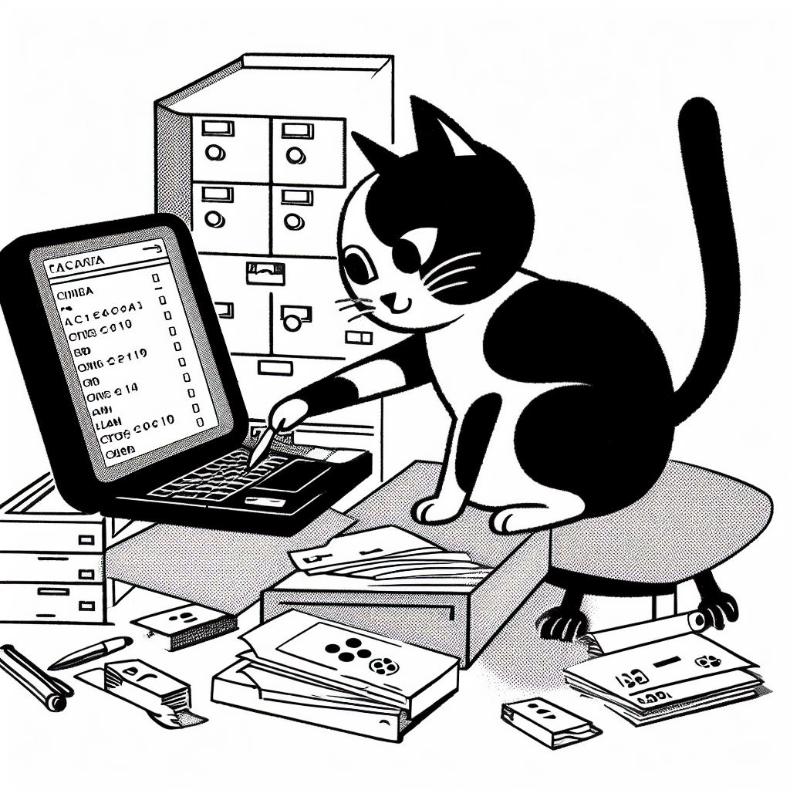
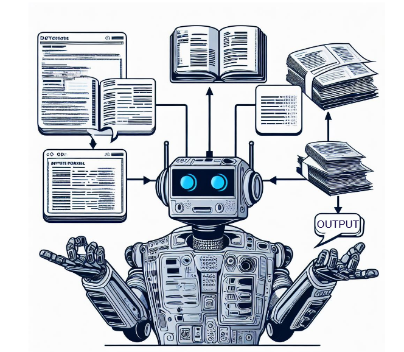

This session is dedicated to the reusability of the output of an ATR pipeline. It synthesises the output formats and draws on them for a presentation of reuse options in the spirit of Open Science.

This is the English version of this training module. The video is available with English, French and German subtitles.

Si vous souhaitez accéder à la version française du module, rendez-vous [ici](https://harmoniseatr.hypotheses.org/2996).

Die deutsche Version der u.s. Lerneinheit ist [hier](https://harmoniseatr.hypotheses.org/2600) verfügbar.

<Video provider="youtube" id="500dhVkBSx0" />

As a last step of your [ATR](https://harmoniseatr.hypotheses.org/glossary-atr#ATRID) journey, once your transcriptions are done, you probably want to keep working with what you have obtained. To do so, you will have to export your transcriptions. Beforehand, you need to choose an [end format](https://harmoniseatr.hypotheses.org/glossary-atr#EndFormatsID). Here, your choice relies on the kind of information you would like to keep and export.

### Why should I export my transcriptions?

We might ask: _Why_ do we export the transcription? There are various reasons for this. However, export is not necessary for all transcriptions. The most common reason behind an export is to create backups of the data because digital tools and servers are not a hundred percent reliable. Export can be done even with unfinished transcriptions when your project is still considered work in progress.

It is necessary to consider all software options before picking one as it is not always possible to change mid-work. In the cases where it is indeed possible to change, you will want to move your data from the current software to the one you want to migrate to. Similarly, by exporting the transcription, you can feed the data to another tool, which can be one of the reuse options.

Exporting can also be done to publish finished transcriptions, whether it is the whole corpus or simply a sample. Finally, if you want to transform your transcribed corpus, an export will be necessary. Although some kinds of exports already propose a transformation, it is essential to correctly choose your output.

### What are the output choices?

Depending on which software you choose for automatic text recognition, the appropriate option of output can vary. The two main types of export, plain text and layout, are usually met in every one of them, as one or multiple formats. Plain text represents the simplest export of a transcription, as it only provides the text that was manually transcribed, or predicted–and typically corrected. There are two formats for plain text, which are simple text files (.txt) or the DOCX version. The other type of export, the layout, is one that preserves all the information gathered during the whole process of automatic recognition, whether it is metadata, regions, lines, or masks from the segmentation and the text, as well as some additional annotations when the tool allows. The layout export provides an encoded version of the transcription, but depending on the format, the markup language is not the same. There are two kinds, a layout encoded in [HTML](https://harmoniseatr.hypotheses.org/glossary-atr#HTMLID), called [hOCR](https://harmoniseatr.hypotheses.org/glossary-atr#hOCR), and layouts encoded in XML, with specific vocabularies, called [PAGE](https://harmoniseatr.hypotheses.org/glossary-atr#PAGEID) XML and [ALTO](https://harmoniseatr.hypotheses.org/glossary-atr#ALTOID) XML. A third type of export can also be found sometimes, which is a PDF format, representing plain text but with layers, meaning the image is now available in [PDF](https://harmoniseatr.hypotheses.org/glossary-atr#PDFID) format and the segmentation or text recognition is available as layers embedded directly in the PDF.

There are myriads of export formats for different types of usage, and it can happen that you realise at a later stage that the choice you made initially was not the right one, and you discover that you don’t have the possibility to find your transcription again on the software you used. In such situations, some members of the community have created a helpful repository, which lists all the tools that exist to convert one end format to another–you can find the link for this repository [here](https://github.com/cneud/ocr-conversion).
