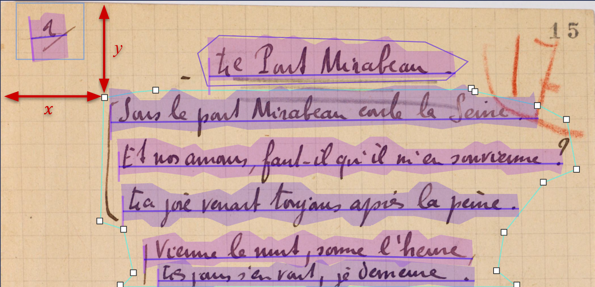
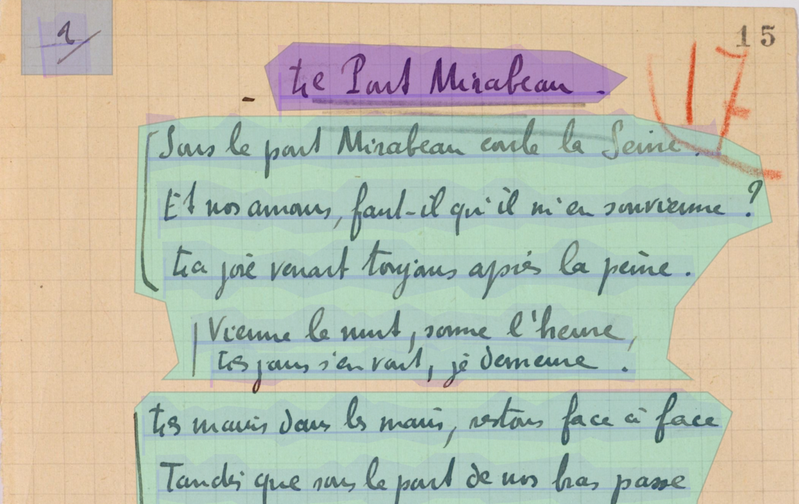
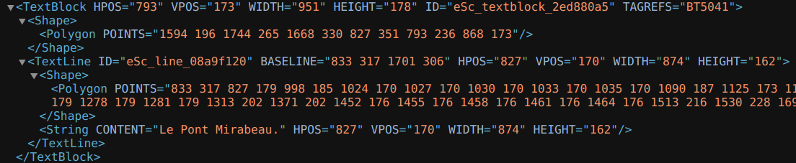
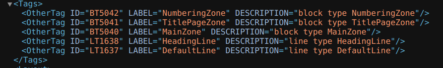
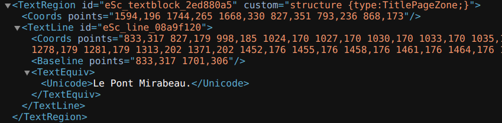

This session presents all the steps need for layout analysis, especially region or line segmentation, use of controlled vocabularies and choice of an output format. It also provides guidance in the choice of a specific solution depending on the project's shape and purpose.

This is the English version of this training module. The video is available with English, French and German subtitles.

Si vous souhaitez accéder à la version française du module, rendez-vous [ici](https://harmoniseatr.hypotheses.org/3487).

Die deutsche Version der u.s. Lerneinheit ist [hier](https://harmoniseatr.hypotheses.org/2450) verfügbar

### Learning Outcomes

After completing this resource, learners will be able to:

\- understand the parameters relevant to layout analysis

\- proceed to segmenting lines or regions

\- evaluate the usefulness of layout analysis for their ATR project

\- choose between a manual and an automatic annotation process

<Video provider="youtube" id="KQMy6uiXE-8" />

### 1. What is layout analysis?

Layout analysis refers to two processes: identifying the structure of a document, and localizing the lines of text. You can also find it referred to under the expressions segmentation, zoning, document analysis, or optical layout analysis. 

Layout analysis is a computer vision task wherein we generate a series of x and y coordinates corresponding to regions or lines drawn on the image. Sometimes, they are associated with a specific “label”, demonstrating a distinction between different types of regions or lines. 

Layout analysis can also include the computation of the reading order of the lines. For example, if you have a page with two columns of text, you may want to read the first column from top to bottom, followed by the second one from top to bottom. A bad reading order would move from the first line of the first column to the first line of the second column, then going back to the second line of the first column, etc.

### 2. How does region segmentation work?

Let us see first how region segmentation works. The components to identify in segmentation can include text blocks, images, tables, columns, headings, footers, etc. The goal is to segment the document into meaningful regions that can be further processed or analysed.

Let us take an example: we have below a poem called “Le Pont Mirabeau,” written by Guillaume Apollinaire at the beginning of the 20th century, whose manuscript, whose manuscript is kept at the French National Library1. We segmented and labeled all of the zones that feature semantic components with the help of an annotation software. The layout is relatively simple and we have drawn bounding boxes around the page numbers (in blue), the title (purple), and the stanzas (green). All of these elements are now annotated as text regions and have a label that corresponds to their function. 

Detected bounding boxes are usually rectangular (i.e. [YOLO models](https://github.com/ultralytics/ultralytics)) or polygonal (i.e. [Kraken](https://github.com/mittagessen/kraken) segmentation models).

### 3. What is a text line?

To understand how text line recognition works, we need to explain what is a text line in the context of Layout Anaysis. Inside segmented zones, there are lines of text. In most cases, when you segment a text line, two elements are extracted at once:

- A **baseline or a topline** (red), which defines a virtual line, passing through at least two points, on which the text is written or from which it is hanging;
- A **mask** (purple), which is a polygon (sometimes a rectangle), defined by at least three points, and which delimits the area of pixels containing the text of the line. The mask is usually automatically calculated by the automatic text recognition (ATR)automatic text recognition (ATR) system based on the baseline or topline coordinates.

, and mask (purple).")

### 4. How does line segmentation work?

When we perform line segmentation, we want to precisely detect text in an image, which is crucial as most of the current state of the art ATR machine learning models rely on correctly extracting text lines before transcribing them.

There are two approaches: 

- A baseline (or topline) is drawn either manually or automatically before the software calculates the corresponding polygon. 
- Or, a bounding box is drawn either manually or automatically around the line of text, meaning we only have a rectangular mask, without necessarily having a baseline.

### 5. What must be annotated and what must not?

How you decide to segment your images depends on your editorial and scientific goals. 

If we return to our example,we could have decided to segment all the verses in Apollinaire’s poem inside the different stanzas. We also voluntarily omitted elements that could have been segmented and labeled, namely the printed folio numbers, and the number written by hand in red. For the purposes of this tutorial, we have chosen to remain at the macrostructural level. 

### 6. Do you have to choose between region and line segmentation?

These two processes are not mutually exclusive, nor do they need to be performed simultaneously. Many segmentation models can do both at once, some are trained to do only one. In fact, if you want to simply perform automatic text recognition, identifying the regions on the document is completely optional while detecting text lines is mandatory for most transcription software. Therefore, segmenting the text document –before transcribing it– is the usual workflow performed by most ATR systems. However, keep in mind that this is a field that is evolving  quickly and segmentation-free systems, for instance, already exist, see Coquenet, Chatelain, and Paquet (2023).

### 7. Are there controlled vocabularies to label regions and lines?

An ontology can be envisioned as a predetermined list of standardized terms or phrases used to describe and categorize data. Every segmented zone can be annotated using a controlled vocabulary. It ensures that your data is:

- Consistent: everyone working on a document use the same terms to describe text zones,
- Searchable: searching and retrieving specific information is made easier with annotated documents,
- Interoperable: as the annotation is standardized, data sharing is facilitated,
- Reusable: ontology enables you to mutualise annotated data.

We recommend using the SegmOnto ontology, which is a controlled vocabulary to “describe the content of books or manuscripts pages, in order to homogenize the data required by layout analyser.” See: [https://segmonto.github.io/ ](<https://segmonto.github.io/ >)

Using the vocabulary offered by the SegmOnto ontology, you can standardize your labels when annotating the layout of your documents.

### 8. Why do we need Layout Analysis?

To understand why we need Layout Analysis, we need to distinguish between two things:

- the necessity of Layout Analysis for text recognition in particular, and 
- its usefulness to process the results of text recognition.

Indeed, ATR only generates the transcription, while the Layout Analysis provides us with more information to understand the structure of the resulting text. It can be very useful in reconstructing paragraphs, identifying the titles, etc.

### 9. Why do we need Layout Analysis for ATR in particular?

First and foremost, as we said earlier, text line segmentation is mandatory in most ATR systems. Without a good text line segmentation, transcription performances won’t be sufficient because lines will be missed, read in the wrong order or broken down into several lines.

Remember however, that recent advances in ATR have led to the creation of segmentation-free text recognition as well as text recognition performed at greater levels than lines, such as paragraphs or even whole pages.

10. How is it useful for downstream tasks?

Text region annotations are useful in the context of digitization and creating digital editions. It allows information extraction and document understanding. 

Raw text, as opposed to structured text, presents limitations for extracting and processing the information it contains. Without finely-structured content, we provide the machine with a degraded version of the document we want to process. We thereby limit its ability to reproduce the information extraction that we, as humans, would be capable of. Without spatial and logical information, the content becomes nothing more than a continuous text without hierarchy, especially when we are dealing with highly structured content such as glossed texts, tables, dictionaries, etc. Extracting the structure allows us to retain the semantic meaning embedded in the layout. 

Layout Analysis is mandatory to get to the text level, but also to the page level and document level. It allows us to get information about the document itself, namely, for downstream tasks like:

- facilitating the navigation inside a transcribed document, 
- reducing the scope of queries, 
- ignoring sections, 
- plugging different tools to process these regions depending on the content of the regions (i.e. applying information extraction tool in target zones), or 
- simply to represent the logical structure of a document.

### 11. What software has been designed for performing Layout Analysis?

Layout Analysis is often included in expert ATR software like [eScriptorium](https://escriptorium.inria.fr/) or [Transkribus](https://www.transkribus.org/en). But there are also tools designed only for Layout Analysis, such as [dhsegment](https://github.com/dhlab-epfl/dhSegment) and [LAREX](https://github.com/OCR4all/LAREX). Additionally, there are environments designed for any type of image annotation, including layout analysis, such as [Label Studio](https://labelstud.io/) or [Roboflow](https://roboflow.com/). 

Annotation analysis can be done manually by drawing bounding boxes and text lines, or by using machine learning models trained to do that task.

### 12. What are the technologies used by Layout Analysis software?

A segmentation model can learn how to segment text lines and regions, and how to label them according to an ontology of line types and region types, while manually annotating the training data.

There are usually four methods with which you can perform automatic layout analysis:

- with convolutional neural networks,
- with transformers,
- with object detection models,
- with heuristics or rule-based methods.

### 13. How do we save the results of Layout Analysis?

Annotations are stored using specific XML standards such as PAGE XML and ALTO XML (the Analyzed Layout and Text Object (ALTO) 4.2 schema specifications is accessible at [https://www.loc.gov/standards/alto/news.html#4-2-released](https://www.loc.gov/standards/alto/news.html#4-2-released)) and PAGE XML ([Pletschacher and Antonacopoulos 2010](https://www.zotero.org/google-docs/?1RptgO)). These two XML formats have their own schemas that intend to store the details of the layout of segmented documents in combination with the text resulting from automatic recognition. They work at the image level. Annotation files are automatically generated by ATR software.

Let’s take a closer look at the ALTO XML format with the annotations we made earlier. 

Here, we have a whole text zone represented in the ALTO format: the title of the poem. First, we have the **<textBlock>** element, with various attributes. The first three ones are indications on its position in the image. It also has an ID attribute, and a TAGREFS attribute. The latter is important because it is where its label is stored. Labels are indicated in the **<Tags>** element:

The TitlePageZone label has the ID BT5041. The value of the TAGREFS attribute has the same ID, which means that the **<textBlock>** is indeed, the title page zone.

Then, we have the **<Shape>** element corresponding to the annotated text zone. Then, we have the text line itself, here after it has been transcribed. First, the **<TextLine>** element captures all coordinate information, in addition to giving an ID to the baseline. Then we find again the **<Shape>** element, which now corresponds to the coordinates of the mask of the baseline. Then, we have the **<String>** element, which contains attributes related to the coordinates of the baseline, and its content obtained after transcription, with the CONTENT attribute. 

Let’s now take a closer look at the PAGE XML format:

Here, a **<TextRegion>** element stores the text region label and an ID. Then, the **<Coords>** element nested inside it gives information on the bounding box coordinates. Then, we have the **<TextLine>** element, which stores a **<Coord>** element as well, corresponding to the mask of the baseline, and a **<Baseline>** element, which is the baseline itself. The **<TextEquiv>** element is used for storing the text node obtained after transcription.

It is up to you to choose the format you prefer working with, but beware that ALTO XML is more widely used compared to PAGE XML. These two formats follow the rule of the XML language (elements tree, tags, attributes). Even TEI can be used to store layout information ([Scheithauer, Chagué, and Romary 2022](https://www.zotero.org/google-docs/?oxGLd6)), so choose the format that is best suited to your end goals (creating datasets, digital editions, etc.).

### 14. Let’s summarize that in a flowchart!

#### Manual annotation

Step 1: You have a corpus you need to segment before transcribing.

Step 2: You import your corpus into an ATR software.

Step 3: Your corpus is small and can be annotated manually.

Step 4, option 1: You don’t need to annotate the text regions

1. You annotate the text lines
2. Decide on the ontology you will use to label text regions
3. Label your text lines
4. You transcribe the text lines
5. And you can then export you data in ALTO XML or PAGE XML

Step 4, option 2: You want to annotate the text regions

1. You annotate the text regions and the text lines
2. Decide on the ontology you will use to label text regions
3. Label your text lines and your text regions
4. You transcribe the text lines
5. And you can then export your data in ALTO XML or PAGE XML

#### Automatic annotation

Step 1: You have a corpus you need to segment before transcribing.

Step 2: You import your corpus into an ATR software.

Step 3: Your corpus is too voluminous, you can use a model to annotate it

Step 4, option 1: You don’t need to annotate the text regions

1. You can use a segmentation model to segment the text lines
2. Decide on the ontology you will use to label text regions
3. If the segmented text lines are not good enough, you can correct them and re-train a new model with them as training data
4. Label your text lines and retrain a model with labeling examples so that the model learn to classify the text lines and the text regions
5. Then, you can transcribe the segmented text lines
6. And you can export them in ALTO XML or PAGE XML

Step 4, option 2: You want to annotate the text regions:

1. You can use a segmentation model to segment the text lines and the text regions
2. If the segmented text lines and/or text regions are not good enough, you can correct the data and train a new model with it
3. Label your text lines and retrain a model with labeling examples so that the model learn to classify the text lines and the text regions
4. Then, you can transcribe the segmented text lines
5. And you can export them in ALTO XML or PAGE XML
