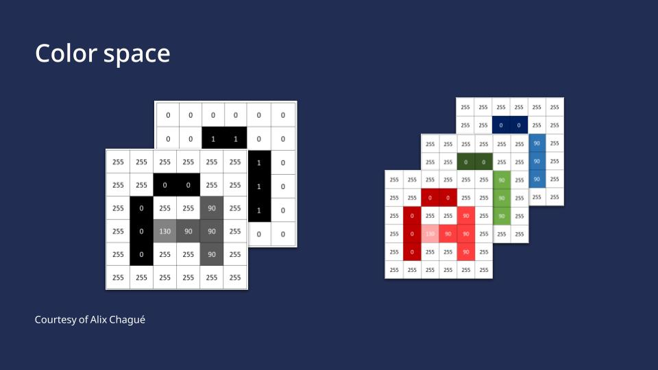
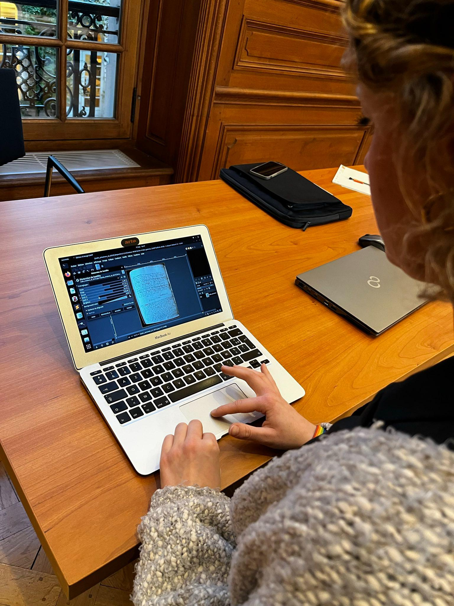

This tutorial is dedicated to image optimization as part of pre-processing. It covers the scanning process and what you need to be aware of while engaged in it. It looks at the possible image pre-processing steps such as cropping or dewarping as well as the potential difficulties that can arise in the pre-processing stage.

This is the English version of this training module. The video is available with English, French and German subtitles.

Si vous souhaitez accéder à la version française du module, rendez-vous [ici](https://harmoniseatr.hypotheses.org/3271).

Die deutsche Version der u.s. Lerneinheit ist [hier](https://harmoniseatr.hypotheses.org/3742) verfügbar.

### Learning outcomes

After completing this resource, learners will be able to:

\- identify the elements defining the quality of their scanned images 

\- improve them if necessary

\- assess if such an improvement phase makes sense for their project

\- get started with a software like GIMP

<Video provider="youtube" id="gndjz2YKQYI" />

### 1. Digitization Concepts

With the help of optical systems such as scanners, cameras or similar devices, a digital image can be created from an analogue original. Certain specifications such as resolution, color space and data format, need to be taken into account to ensure optimal text recognition later on. In many cases, your documents will already be digitized, but if not, there are a few things to keep in mind.

#### 1.1. Resolution

In digital pictures, everything starts with tiny dots called pixels. The amount of detail in a picture depends on how many of these pixels there are. You can measure this by counting how many pixels make up the length and width of the image. You can then work out how rich and detailed the picture is by looking at how many of these little dots are packed into it. In a nutshell, this means: The more pixels you have, the better the resolution of your image. This pixel count gives you an idea of all the small, detailed parts that make up the whole picture. Resolution is measured in dpi, or dots per inch. Your images for ATR should best have 300 to 400 dpi for an A4 page.

#### 1.2. Color Space

In general, you can do automatic text recognition regardless of the color space of your images. However, the results will be better with color images compared to black and white or grayscale images. In the past, scanning documents in bitonal (black and white) was a popular way to save memory space on the computer. Nowadays, memory isn’t as much of an issue, so we can focus on other aspects.

If you are scanning images yourself, make sure you are scanning in color. It is the most effective way of recognizing things in pictures, such as stamps or strange bleed-through effects, but also the script itself is much more clearer in color than bitonal. Color can also help to make things clearer – boosting contrasts or even flipping colors around can make details stand out. As a rule of thumb, what the human eye can read easier, AI will also read more effectively. Nonetheless, it is important to consider the environmental impact of our calculations. Processing data with lower dimensionality results in reduced energy consumption.

#### 1.3. File Format

For long-term archiving, formats such as TIFF or JPEG2000 are often recommended or even required by research funders. They are very rich and large file formats. However, for processing image files with ATR, though, formats such as JPG, PNG, or PDF work just fine. If you need to change an image format into another, you can use converters. We recommend [ImageMagick](https://imagemagick.org/index.php), which is open source and free of charge.

### 2. Image input pre-processing

At this point we would like to emphasize that pre-processing is optional and in some cases not necessary at all. If you’re lucky, you can start ATR straight away. This is usually the case if you receive your images from a cultural heritage institution. However, if you are faced with double-sided copies or crooked and poorly cropped images, you will have to go through what is called pre-processing. This can include according to needs adjusting brightness and contrast, cropping, splitting, rotating and dewarping. These steps are not always necessary and there is no right order, it depends on your document. Think of them as layers, to be applied as needed, in the required order

#### 2.1. Cropping and Page Separation

Cropping a messy image is very important in order to save time later on. You can use any graphic editor to crop. For our example, we will use [GIMP](https://www.gimp.org/downloads/), which is free and very easy to use. Select the crop tool and left-click on one corner of the image. Drag the cropping area to the opposite corner in order to crop the desired area. Press Enter. To separate pages, simply repeat this twice and save each separately.
