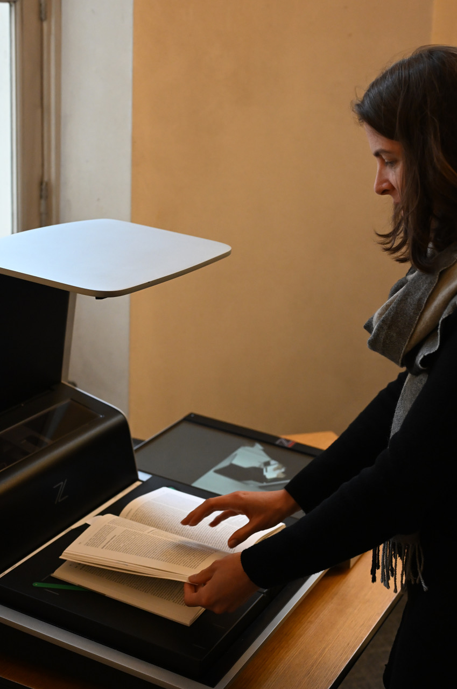
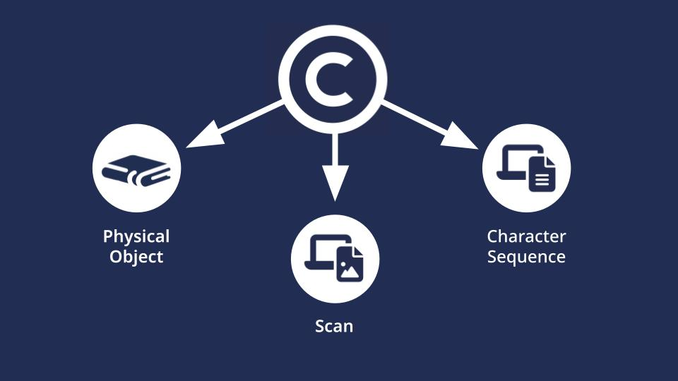
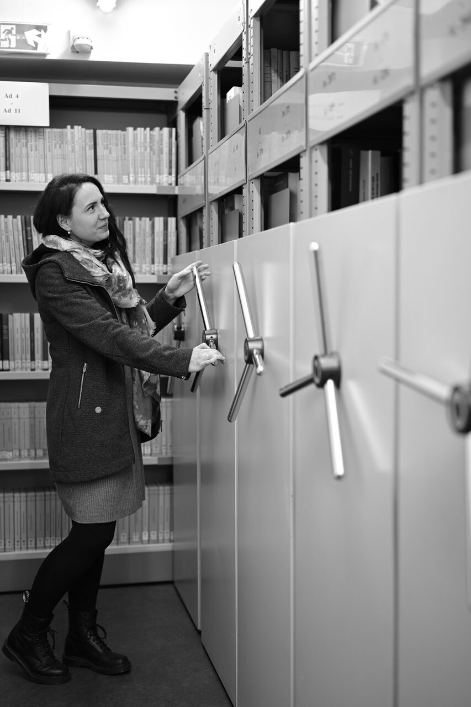
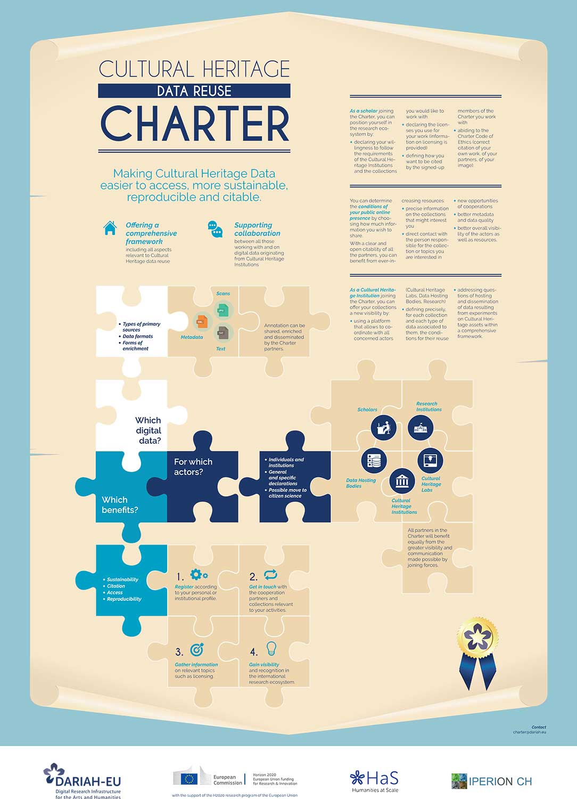

In this tutorial, you learn about the typical methods for obtaining high-quality scanned images, setting the stage for successful text recognition processes. It outlines obtaining digital copies from archives, digitisation needs, and copyright considerations. It also covers using online resources like Google Books and Internet Archive while navigating public domain copyright issues. Lastly, it highlights the [Heritage Data Reuse Charter](https://www.dariah.eu/activities/open-science/data-re-use/) for collaboration between cultural heritage institutions and researchers.

This is the English version of this training module. The video is available with English, French and German subtitles.

Si vous souhaitez accéder à la version française du module, rendez-vous [ici](https://harmoniseatr.hypotheses.org/3780).

Die deutsche Version der u.s. Lerneinheit ist [hier](https://harmoniseatr.hypotheses.org/2717) verfügbar.

## Learning Outcomes

After completing this resource, learners will be able to:

- Recognise the sources for acquiring suitable images for text recognition.
- Assess the quality of images in terms of their suitability for ATR.
- Implement strategies for collecting and organising images for processing.
- Apply basic techniques for scanning and digitizing textual materials.

<Video provider="youtube" id="HJrOYYiiUyg" />

Whether photographed in an archive or discovered in the digital collections of memory institutions like libraries or museums, for many humanities scholars, images of text sources form the basis of their academic work. Finding, creating and collecting images of textual material is often the first step in the research process. Let us show you some typical ways of acquiring scanned images.

Archives and other memory institutions offer a wealth of material that has not yet been digitized. If you are struggling to obtain digital copies of the documents you are interested in, visiting the institution and requesting the digitization of specific items may be necessary.

As most memory institutions – slowly but surely – move into the digital age, your digitization journey will usually begin in the comfort of your own home, searching through digital finding aids and preparing lists of the relevant institutions and archival materials to request for digital copies.

Once the archival staff has prepared the required files for you, your work of selecting relevant archival materials begins. It is rare that an entire archival folder will be relevant to you. Here, a careful selection might save not only the time of the archivists doing the digitization, but also your wallet.

Most archives and other memory institutions have clearly defined conditions under which digital copies of archival material can be provided and how they can be used. These rules may be part of a general contract between the user and the particular archive, but in the case of a larger digitization project it might be necessary to create a separate contract with project-specific rules.

Digitization of archival materials may be done directly by the user, but often the digitization is carried out by a specialized department within the archive or an external provider. In this case, the user should specify the preferred quality of the digitized material so that it can fit the criteria for the subsequent ATR process. This service is usually chargeable and the final price is based on the number of items digitized.

Once digitization has been done and the resulting scans have been delivered to you, your ATR journey can begin.

Even if visiting an archive might be a great and often joyful opportunity, sometimes sources that have entered the public domain can be found online on the [Internet Archive](https://archive.org/) or [Google Books](https://books.google.com/). These sources consist of a collection of scans with an added layer of optical character recognition (OCR) which is, in most cases, not of any usable quality. Both types of data are combined into a PDF that can be downloaded. 

## How about copyright and reuse?

However, it is typically not clearly indicated within Google Books what type of reuse or republication of the digital images is permitted. Instead, the scanned document is preceded by a page that clearly states that the document’s copyright is owned by Google. What does that mean for a source that is in the public domain?

The copyright here refers to the digital object, the image of the scan, not the analogue print, nor the textual content of the source. That means that if you are planning to use only the textual content of the source there is no copyright in your way. Whenever you do need to use or republish the scans there might still be fairly convenient way.

When Google Books accumulated the digital sources, they partnered with many cultural Heritage institutions (CHI), via individual contracts. Through several of these contracts that went public we know that the CHI obtains a digital copy of the scan that they can distribute to researchers. So if you find a relevant PDF on Google Books of which you need the copyright of the digital object clarified, identifying the partner institution for this particular scan from the Google Books metadata and asking for a permissive license from the CHI is a viable route. Typically, one should receive a response within a week.

## Relevant questions to ask…

To sum up, the relevant questions that you need to ask prior to using Google Books or Internet Archive sources are: What type of data do you need from the PDF? (Text/Para-Text/Digital Object) Are you planning to research the sources or are you planning to republish the sources (for example, as part of training data for other ATR projects)? Depending on your objectives, you may be satisfied with:

- Using the Google Books PDF directly
- Obtaining a permissive license from the partner CHI
- Creating an envelope data set that does not contain the actual copyrighted digital object but enriches it with quality annotation such as transcriptions and only references the copyrighted digital object.

With so many different stakeholders, pathways and decisions, navigating the ATR process can be overwhelming. That is why there are efforts from the community to simplify interactions and workflows in the future.

## Heritage Data Reuse Charter

When you are planning to publish your research outcomes, it might be helpful to consult the Heritage Data Reuse Charter, an initiative by DARIAH. The Charter contains six points on which cultural heritage institutions and researchers should agree upon when working together, including principles of

- **Reciprocity**: Do both Cultural Heritage Institutions and Researchers agree to share content and knowledge equally with each other, making use of data centers and research infrastructures?
- **Interoperability**: Cultural Heritage Data will be made accessible in a form that facilitates reuse of the data for research. Formats should work and be interoperable for both scholars and CHIs.
- **Citability**: Cultural Heritage data and any resulting research need to be fully citable to increase their visibility and impact. Relevant data citation standards should be applied.
- **Openness**: Cultural Heritage data should be shared under an open license whenever possible, taking into account existing copyright and any restrictions due to national legislation and privacy issues.
- **Stewardship**: Long-time preservation, persistence, accessibility and legibility of cultural heritage data should be a priority.
- **Trustworthiness**: The provenance of Cultural Heritage data and any consequent research should be clear, up to date, openly available and therefore trustworthy.

