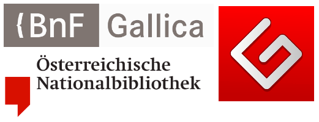

This resource recaps Automatic Text Recognition (ATR) process and concentrates on how to correct output from ATR pipelines. The last part is dedicated to the available software for post-ATR correction.

This is the English version of this training module. The video is available with English, French and German subtitles.

Si vous souhaitez accéder à la version française du module, rendez-vous [ici](https://harmoniseatr.hypotheses.org/2866).

Die deutsche Version der u.s. Lerneinheit ist [hier](https://harmoniseatr.hypotheses.org/2145) verfügbar.

### Learning outcomes

After completing this resource, learners will be able to:

\- have a comprehensive view of the ATR pipeline

\- assess their post-ATR correction needs

\- define the post-ATR correction method they want to use

\- choose the relevant software to that end.

### Automatic Text Recognition (ATR) in a nutshell

In the beginning there was nothing. And humans said, ‘Let there be automatic text recognition’. And so humankind created the ability to convert analog text, be it handwritten or printed, into digital copies. Automatic text recognition describes the convergent usage of [optical character recognition (OCR)](https://harmoniseatr.hypotheses.org/glossary-atr#OCRID) and [handwritten text recognition (HTR)](https://harmoniseatr.hypotheses.org/glossary-atr#HTRID). However, this important development was not achieved as fast as lightning.

OCR is aimed at treating printed media, such as books. This technology has only improved over time, and systems nowadays can have an [accuracy](https://harmoniseatr.hypotheses.org/glossary-atr#AccuracyID) of 99% in recognising text from printed documents. HTR, as the name suggests, is used for handwritten documents, such as letters. Both OCR and HTR enable the [digitisation](https://harmoniseatr.hypotheses.org/glossary-atr#DigitisationID) and preservation of historical documents, improve their accessibility, and allow for efficient data extraction. Human handwriting poses a challenge even for modern technology, as manuscripts encompass a near-endless range of fonts and styles. It is out of range for traditional approaches of pattern matching, which is the crux of OCR.

Evolving technologies have allowed for text recognition systems to now do both HTR and OCR simultaneously. Modern [models](https://harmoniseatr.hypotheses.org/glossary-atr#ModelID) can recognise printed as well as handwritten text and process segments in lines or entire paragraphs. Today, such systems are built into smartphones, allowing us to scan text from images. These technologies are especially appealing to historians, librarians, archival staff, and scholars in general who want to convert, analyse, store or maintain their documents in a novel way, adopting global digital trends.

### Three important projects using ATR

To begin with, let us explore three significant ATR projects that have made a lasting impact. These projects are [Gallica](https://gallica.bnf.fr/), [Austrian Books Online](https://www.onb.ac.at/digitale-angebote/austrian-books-online) (ABO), and [Project Gutenberg](https://www.gutenberg.org/). Gallica is the digital counterpart to the French national library (Bibliothèque nationale de France) founded in 1997. Austrian Books Online (ABO) is an ongoing mass-digitisation project started by the Austrian National Library, in which the Library’s historical book holdings are made available through a public-private partnership with Google. Project Gutenberg is a digital library that offers a diverse range of cultural texts in the form of eBooks. The archive includes more than 50,000 items, for example, Faust by Johann Wolfgang von Goethe or [Germinal](https://www.gutenberg.org/ebooks/5711) by Émile Zola, i.e. literature in the public domain, dating mostly from the 19th century and prior, depending on the copyright law of the country of origin of the work.

### Text recognition

What is text recognition, and how does it work? Depending on whether we look at OCR or HTR systems, the baseline functionalities of these systems differ. To recap, text recognition is the procedure of converting scanned images of text into a machine-readable text format. This can be done manually in a ‘double keying’ process, or it can be carried (semi-)automatically with the help of ATR systems and trained models.

Such models require the input of images of high quality in order to do so. A corresponding data pipeline for ATR, i.e. the classical workflow to follow when processing data, would include the preprocessing of images, the segmentation phase, the actual text recognition process, and a post-correction step. Modern models recognise segmented lines with the help of deep learning algorithms, which allows them to build a textual representation of the image input. These algorithms learn visual characteristics from such input. Depending on the project’s goals and background, you can use either existing models or train a new model that will fit your specific case. The transcription process–be it through ATR or manual transcription–will produce machine-readable text as the output.
