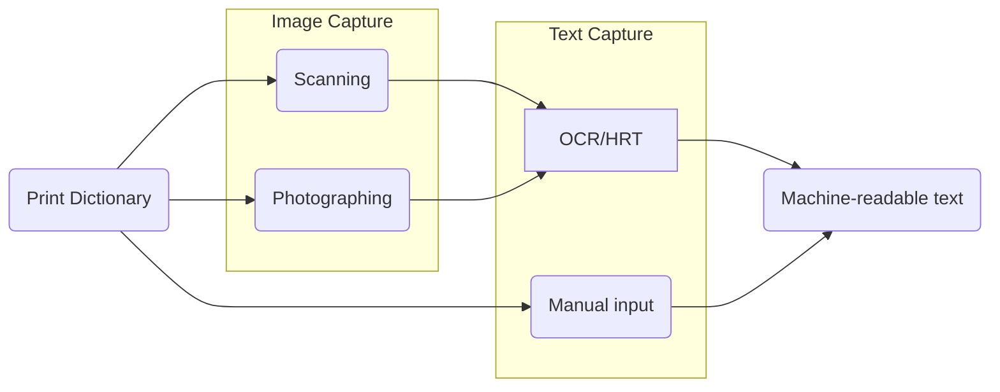

<SideNote type="danger" title="work in progress">
  This is not a final draft.
</SideNote>

This course will introduce the theories, practices, and methods of digitizing legacy dictionaries for research, preservation and online distribution by focusing on the process of converting paper-based dictionaries to electronic format through image capture, text capture, data modeling and data enrichment. In addition to explaining how various OCR and HCR tools can be used to extract text from images, the course will focus on analyzing, identifying and describing lexicographic data using markup languages such as XML in order to produce semantically structured datasets that can be easily queried, shared and transformed to different outputs. The course will be of interest not only to those who are converting legacy dictionaries, but also those who want to understand the principles and modes of representing structured lexicographic data, which will be a prerequisite for more advanced coursework on TEI Lex-0, OntoLex-Lemon, XPath and XSLT.

## Learning Outcomes

Upon completion of this course, students will be able to

- understand the challenges involved in converting paper-based dictionaries to digital format
- identify tools that can help with the conversion process
- appreciate the complexity of lexicographic data as structured data
- model simple dictionary entries and express them in XML

## testing footnotes

At the end of the course, students will be familiar with the principles and procedures involved in writing, editing, or compiling dictionaries, considering standards in different parts of their lexicographic workflows. [^1]

[^1]: For more information, see _D1.2 Best practises for lexicography – intermediate report_. 31.01.2020.

## testing quiz...

<Quiz>
  <Quiz.Card validateButtonLabel="Check your answer">
    <Quiz.MultipleChoice>
      <Quiz.Question>
        Is `<person name=Noah/>` a valid XML element?
      </Quiz.Question>

      <Quiz.MultipleChoice.Option>
        Valid
      </Quiz.MultipleChoice.Option>

      <Quiz.MultipleChoice.Option isCorrect>
        Invalid
      </Quiz.MultipleChoice.Option>

      <Quiz.Message type="correct">
        Yes! Attribute values must be quoted.
      </Quiz.Message>

      <Quiz.Message type="incorrect">
        No! Attribute values must be quoted.
      </Quiz.Message>
    </Quiz.MultipleChoice>
  </Quiz.Card>
</Quiz>


## Introduction: why digitize in the first place?

The Library of Alexandria -- one of the wonders of the Ancient World, was founded in the fourth century B.C. by Ptolemy I Soter. Its first librarian, Demetrius of Phalerum, had a utopian dream of collecting everything that has ever been written. It is estimated between 400,000 and 700,000 scrolls were housed at the library during its peak days. The library obtained new holdings both through royal gifts _and_ by copying originals. According to Galen, a prominent Greek physician and philosopher, ships anchored at the port of Alexandria were obliged to surrender their books for immediate copying. The Library of Alexandria was the largest and most important library of its time. Until in burned down.

While the destruction of the Library of Alexandria is to this day seen as a symbol of tragic loss of knowledge and culture, it is by no means a singular incident in history. Wars, civil unrest and natural disasters, but sometimes also mere accidents, continue to destroy and damage the human record. A 2004 fire in the Duchess Ana Amalia Library in Weimer destroyed some 50,000 volumes of which 12,500 are considered irreplaceable.

 CC-BY-SA-3.0 E.Herzel [https://commons.wikimedia.org/wiki/File%3ABrand_Anna_Amalia_22.30Uhr.JPG](https://commons.wikimedia.org/wiki/File%3ABrand_Anna_Amalia_22.30Uhr.JPG)

Digitization is not a cure for all ills and should not be embraced all too hastily as a replacement for proper preservation strategies. Yet there is no doubt that digital objects contribute to both the preservation and accessibility of cultural heritage. From an institutional point of view, the opportunities created by digital resources "for learning, teaching, research, scholarship, documentation, and public accountability" (Kenney and Rieger, 2000, 1) are immense.

The following list (based on Deegan and Tanner, 2002) succinctly summarizes some of the advantages of digitization:

- immediate access to high-demand and frequently used items
- easier access to individual components within items (e.g. articles within journals, or individual entries within a dictionary)
- ability to recirculate out-of-print items
- potential to display items that are in inaccessible formats (large volumes, maps etc.)
- 'virtual reunification' - allowing dispersed collections to be brought together
- ability to enhance digital images in terms of size, sharpness, color contrast, noise reductional etc.
- potential to conserve fragile objects while presenting surrogates in more accessible forms
- potential for integration into teaching materials
- enhanced searchability, including full text
- integration of multimedial content

There are, however, also reasons that speak against digitization: lack of adequate funding or institutional support, unresolved copyright issues, the risk of damaging precious objects, unpredictable costs of long-term storage of the digital files themselves (see Hughes, 2004, 50-2). Institutions and projects usually cannot digitize _everything_. It is therefore very important to plan and carefully select the material that is to be digitized.

The digitization boom that began in the mid-1990s dramatically altered the way we engage with immaterial cultural heritage; lexicographic heritage has been no exception. It is by now well-established that digitization can increase the use value of a historical dictionary, especially in global, networked environments. Many projects have been initiated to create electronic editions of printed lexicons, yet practitioners in the field of digitizing dictionaries still face numerous technical, methodological and interpretative challenges.

The goal of this course is to equip you with the basic knowledge necessary to understand these challenges and to help you make good use of available tools and methods in your own projects.

In the rest of this course, we'll look at various steps involved in planning and implementing a dictionary digitization project.

## Digitization workflow

The digitization workflow for lexicographic resources can be divided in six stages:

1. planing
2. image and text capture
3. data modeling
4. data enrichment
5. publication
6. maintenance

The importance of the planing phase in any digitization project can hardly be overestimated.

The goal of the planing phase is to determine the overall project scope, identify the priorities and minimize project risks.

When you start a digitization project, you should make sure that you are prepared both conceptually and in terms of how you want to organize the project.

### Conceptual phase

You should be prepared to:

- perform a structural analysis of the dictionary or dictionaries which are to be digitized
- define project goals, results and priorities (often starts with brainstorming)
- write up system requirements (design of the digital publication depending on the target user groups and anticipated user needs, determination of navigational and search possibilities, hypertextualization, user interaction)
- determine adequate digitization techniques and methods (image capture, image capture + OCR, full text capture etc.)
- choose equipment (which scanners or photo equipment) and output formats
- draw up local guidelines that contain all of the above information

### Organizational phase

In the organizational phase, you should make sure to:

- choose your staff and decide whether to outsource some of the project activities
- establish a clear workflow (who is responsible for what, procedures)
- set a schedule (keeping in mind risk factors)
- prepare a budget, which will cover

  - personnel expenses for scanning, quality control, preparation and reworking of the material, training
  - infrastructure costs (e.g. scanner, software solutions, databases, IT support)
  - licensing costs for image processing and full-text recognition (OCR)
  - special costs involving the handling of the original (bound, loose-leaf, special formats)
  - online presentation (IT solutions and support)
  - maintenance costs

Digitization projects require both knowhow and modern technology. The individual requirements, project scope and resources available (personnel, funding, infrastructure etc.) determine whether and to what degree external service-providers should be used.

One shouldn't, however, underestimate the amount of work involved in outsourcing: as in any project, an outsourced digitization project needs to be thoroughly prepared, with very clear and detailed instructions and system requirements, contractual and financial agreements.

In any case, the planning phase is essential for funding applications, and for the successful implementation of a project.

**Exercise.** As you work your way through this course, you should work in parallel on a planning document for a dictionary digitization project of your own. We highly recommend that you do this even if you are not currently involved in a digitization project, because it will help you understand better the digitization process itself as well as help you develop skills that you can apply in real-life digitization projects.

At the end of the project planning phase - or, rather, at the end of this course, your planing document should contain:

- an overview of the project background
- an overall vision and a mission statement
- a clear and concise description of the project and its target audience
- overview of what should be archived (midterm and longterm goals)
- an overview of project activities

  - what steps need to be taken to achieve project goals
  - criteria for success
  - milestones
- an evaluation framework
- a maintenance workflow
- a sustainability plan

It is often useful to start with smaller, pilot projects to get a taste of the challenges involved. If you are planning to digitize a multi-volume dictionary, for instance, it is certainly worthwhile to start small: with one volume, or even part of a volume. Pilot projects can reveal previously unforeseen complications and difficulties, and can help with cost estimates.

### Funding

The project description and a budget is a basis of a funding application. Funding should be sought after strategically and be part of an institutional digitization strategy.

A concise application requires a clear understanding of the the project vision and goals. If you are unclear about what you are trying to achieve in your digitization project, it is very unlikely that you will be able to convince your funding agency that they should fund your project. With historical dictionaries, it is especially important to contextualize them and explain why they matter to your target audience.

Furthermore, there are some practical, non-lexicographic tips that you should keep in mind:

- writing good grant applications takes a lot of time and effort. Do not waste your time on applications where you have little or no chance to succeed
- study the call for grants very carefully in order to be sure that your project fulfills the grant criteria
- if available, study the applications that were successful in the same call before
- study _extremely_ carefully the funding agency's instructions: make note of the deadlines, application requirements (structure, maximum number of pages, font, font size etc.) Make sure to include all the required documents (budget calculations, letters of commitment, CVs etc.)
- should you have a prototype or results of a pilot study, make sure to make them available to the grant evaluators.

## Capturing lexicographic data

Not all digital objects are created equal. We can distinguish two types of methods for creating digital representations of lexical resources:

1. image capture
2. text capture

**Image capture** refers to the process of recording the visual representation of the text by means of digital cameras and scanners and its subsequent delivery to the user as digital image. Digital images are nowadays quite easy to produce and deliver over the Internet but their usability, especially when it comes to lexicographic material, is limited due to a lack of search capabilities.

**Text capture** refers to the transposition of image-based textual content into a sequence of alphanumerical characters, which can be accomplished either by human operators who retype the original text; or, automatically, by using an optical character recognition (OCR) or handwritten character recognition (HRT) software to convert images into machine-readable (and, ultimately, searchable) strings.

TODO: render image before publishing



TODO: do i include post-correction in the graph?

### Image capture

Which type of scanner is suitable for a particular project depends on the nature of the original document (type, condition, format etc.) and the scope of the project. For sensitive documents, the choice of equipment and components should be coordinated with an expert.

When digitizing print dictionaries, you are most likely to choose between a document scanner and a reflected light scanner ("a book scanner").

The following tables, prepared by the Library of the Swiss Institute of Technolgy at Zurich, describe the pros and cons of document and so-called reflected light scanners (or "book scanners"):

#### Document scanners

| Pros                                                                                                      | Cons                                                                                 |
| --------------------------------------------------------------------------------------------------------- | ------------------------------------------------------------------------------------ |
| Scanning of individual, unbound pages                                                                     | Cutting-up of the documents                                                          |
| Extremely rapid processing with a high efficiency level (up to approx. 50 pages/minute), automatic feeder | Limited scan quality                                                                 |
| Software enables further processing steps (e.g. conversion into PDF)                                      | Not suitable for documents that are challenging from a conservational perspective    |
| Simple to operate                                                                                         | Errors possible in the form of a double page feed                                    |
|                                                                                                           | Adverse effect on the reader unit through dust particles (can deteriorate over time) |

#### Book scanners

| Pros                                                                                      | Cons                                                                          |
| ----------------------------------------------------------------------------------------- | ----------------------------------------------------------------------------- |
| Scanning of bound documents                                                               | Limited throughput due to manual operation                                    |
| Style sheets up to A0 (depending on type of scanner)                                      | When working without an attachment, the document needs to be open 180 degrees |
| Book cradle to help position the book optimally                                           | The attachment slows down the scanning process                                |
| Special attachments enable gentle scanning at an opening angle of up to (min.) 90 degrees |                                                                               |
| Simple to operate                                                                         |                                                                               |
| Simultaneous creation of different derivatives (e.g. JPEG) besides the master file (TIFF) |                                                                               |

To select the right device, you should pay equal attention to the image quality (sharpness, color, resolution etc.) and the protection of the original that is being scanned.

#### File formats

The IMPACT Best Practice guide on Image Capture recommends the following standards for file formats:

- For sources containing text with colour illustrations or backgrounds: TIFF or JPEG2000, resolution 300 ppi, bit depth 24, no compression, lossless
- For sources containing text with black-and-white illustrations (pictures or shades of grey): TIFF or JPEG2000, resolution 300 ppi, bit depth 8, no compression, lossless
- For sources containing text with or without line drawings: TIFF or JPEG2000, resolution 400 ppi, bit depth 1, no compression. If necessary for storage purposes, lossless compression is recommended.

_Please note in all cases that a bit depth of 8 and a resolution of 400ppi is the minimum recommended where Optical Character Recognition is to be applied. For very small text, a resolution of 600ppi is recommended._

According to current best practices, image masters of greyscale or color images should be archived in uncompressed TIFF format. For Internet publishing, JPEG and PNG are recommended.

##### Key terms

**Bit depth**: The bit depth of an image refers to the number of bits used to describe the colour of each pixel. Greater bit depth allows more colours to be used in the colour palette for the image. 1 bit per pixel will allow black and white, 8 bits per pixel will allow 256 colours, 8 bits per colour component in a RGB image (24 bit) will allow 16777216 colours.

**PPI: Pixels** (or points) per inch. A measurement used to describe both the spatial resolution of a digital image and the physical size of an image printed from it. An image that has a higher number of pixels per inch will show more detail than one which has fewer pixels per inch.

**Resolution:** Spatial resolution, normally expressed as the number of pixels per linear unit e.g., 300 ppi (pixels per inch)

**RGB:** An additive colour model in which red, green and blue light is combined to create colours, combining full intensities of all three makes white. Digital cameras, scanners and monitors use RGB to record and display colours.

#### Image optimization

Optimisation is the term used in digitisation to refer to the processes by which original digital images are altered to fit their final purpose.

Depending on the overall purpose of a project, optimization may include the following[^1]:

[^1]: See Image Optimisation. An IMPACT Briefing paper.

- optimization of image size: cropping (to remove unwanted areas on the page), orientation (to enable machine readability and OCR);
- optimization of image tonality: white balance, levels and curves;
- cleaning up: removing marks, spots, correcting other image problems;
- addition new descriptive data: or editing of automatically captured data, to fit with internal application standards;
- conversion of original image format into desired, or access, formats;
- change of color depth to required access standard;
- sharpening of image

For OCR purposes, one doesn't necessarily need a full color representation of the image, and so pages are often converted to a grayscale or bitonal color depth:

> In greyscale, each pixel represents one of 256 shades of grey, while in a bitonal image each pixel is assigned one of two values representing black or white. While both of these methods will allow an image to be stored in a smaller digital space (and thus allow more images to be stored overall), the images themselves can suffer from information loss due to the approximation of colour values in the image.
>
> Working with bitonal images is generally held to be the most efficient practice. Converting a colour or greyscale image to bitonal format is referred to as binarisation. Approaches to binarisation typically fall into one of two categories. “Global” methods treat each pixel independently, converting each to black or white based on a single threshold value. If a pixel’s colour intensity is higher than the global threshold it is assigned one value, otherwise it is assigned the opposite value. By contrast, “local” methods make use of the colour information in nearby pixels to determine an appropriate threshold for a particular pixel.

#### Further reading

JISC Digital Media; 2008-2011; the Joint Information Systems Committee: http:// [www.jiscdigitalmedia.ac.uk/](http://www.jiscdigitalmedia.ac.uk/) Retrieved 10.03.2011

Digital Imaging Primer; Gueguen, G; 2007; Office of Digital Collections and Research at the University of Maryland: [http://www.lib.umd.edu/dcr/publications/DigitalImagingPrimer.pdf](http://www.lib.umd.edu/dcr/publications/DigitalImagingPrimer.pdf) Retrieved 10.03.2011

Technical Standards for Digital Conversion of Text and Graphic Materials; 2007; Library of Congress: [http://memory.loc.gov/ammem/about/techStandards.pdf](http://memory.loc.gov/ammem/about/techStandards.pdf) Retrieved 12.02.2010

Preservation Imaging Handbook; Metamorfoze, the Dutch National Programme for the Preservation of Paper Heritage: [http://www.metamorfoze.nl/methodiek/preservationimaging.html](http://www.metamorfoze.nl/methodiek/preservationimaging.html) Retrieved 10.03.2011

### Text capture

There are three ways to capture full-text content:

1. **Optical character recognition (OCR)** is a process of converting image-based text into machine-readable and editable text
2. **Manual input** is a process in which typists are employed to manually retype the text of a document
3. **Handwritten text recognition (HRT)** - is a process in which special software tools are used to convert handwritten text into machine-readable and editable text.

All three procedures require manual corrections and are cost-intensive.

#### Optical character recognition

There are numerous challenges that could affect the process of text capture when dealing with old print dictionaries: the quality of the original print, captured image quality, complex layouts, use of different language and scripts (not just Greek, Cyrillic and Latin, for instance, but also historical scripts such as Fraktur for Latin scripts, or Old Church Slavic Cyrillic), use of special characters in the text etc.

Mistakes in optical character recognition negatively effect information retrieval and further processing of data (in terms of, for example, word and sentence segmentation).

##### To OCR or not?

Before you invest time and effort into OCRing your dictionary, you should consider:

- whether OCR is at all feasible
- which OCR program should you use: trainable or omnifont?
- what should be the output format of your OCR?

Some texts are totally  un-ocr-able, while some can in principle be recognized, but the quality will be too bad to make it worthwhile to even try.

 OCRing this Serbian-German dictionary produces mostly gibberish

Fortunately, there are also numerous dictionaries, especially the more modern ones, which can be handled well by OCR.


For the dictionaries that are good candidates for OCR, the particular requirements of the project will influence the decision whether to OCR or not, and what OCR engine to use.

If you are planning to put the scanned images of your dictionary online and use the underlying OCR for full-text search, a less than perfect text capture might not be an issue. If, however, you are planning to implement extensive searching in an XML-encoded dictionary, you will need good quality OCR, with post-correction.

###### Which OCR?

OCR products can be divided into two main types:

- 'omnifont' engines, which know about many existing typefaces, but are difficult to adapt to a new one; and the
- 'trainable' egines, which can learn to recognize new fonts, but may be very hard to teach.

There are four main OCR products available that you could consider for your project:

- ABBYY FineReader (commercial, omnifont)
- Omnipage (commercial, omnifont)
- Tesseract (open source, trainable)
- Ocropus (open source, trainable)

If you have a script (for instance, Glagolitic) which is not supported by the omnifont engines, trainable OCR is the only option, but the process is far from obvious.

It is beyond the scope of this course to teach you how to train an OCR engine, but there are resources out there that could help you in this area:

- information on training Tesseract in the EMOP project  with the Franken+ tool can be found at: [http://emop.tamu.edu/node/47](http://emop.tamu.edu/node/47), [http://emop.tamu.edu/node/54](http://emop.tamu.edu/node/54).
- More information on the Franken+ tool  is at: [http://dh-emopweb.tamu.edu/Franken+/](http://dh-emopweb.tamu.edu/Franken+/).
- There is also a paper on this subject:  Early Modern OCR Project (eMOP) at Texas A&M University: Using Aletheia to Train Tesseract , [http://dl.acm.org/citation.cfm?id=2494304](http://dl.acm.org/citation.cfm?id=2494304)

For a discussion of the differences between (limited) training with an omnifont engine and extensive font training with Tesseract, you could also consult this study: [http://lib.psnc.pl/dlibra/doccontent?id=358](http://lib.psnc.pl/dlibra/doccontent?id=358).

###### What to expect?

How well does OCR work? You can judge yourself based on the following examples coming from the participants of the 2015 [ENeL Training School](http://www.elexicography.eu/events/training-schools/lisbon-2015/).

The screenshots are from the [Transkribus Transcription Platform](http://www.transkribus.eu). The OCR has been performed by the finereader SDK, either offline, or from the Transkribus tool itself.

**Linde**  Example 1. Linde Dictionary: decent OCR by the ABBYY Cloud OCR service.

**Czech-Polish Dictionary**  Example 2. Czech-Polish dictionary: here also the OCR result is quite decent.

**Rechnik malyj**  Example 3. Rechnik Malyj: the German OCR works a bit, the (old style) Cyrillic is useless.

**Mikloshich**  Example 4. Mikloshich, Old Slavonic-Greek dictionary: again, the old-style Cyrillic is hopeless.

**Serbian Etymological Dictionary**  Example 5. Serbian Etymological Dictionary: The OCR of modern Cyrillic is of acceptable quality

**Grimm**  Example 6. Grimm: OCR is reasonable, but could have been better with a higher resolution image.

**Bernolak**  Example 7. The Bernolak dictionary: rather bad OCR.

**Warsaw Dictionary**  Example 8. The Warsaw dictionary.

A quick run of some pages of a dictionary can give you a first impression of the quality of OCR. For thorough evaluation, ground-truth evaluation material should be produced, i.e. a correctly transcribed sample of the dictionary you want to OCR, so that it can be compared with the raw OCR results.

#### Handwritten character recognition

Recognition of the hand-written text presents even grater challenges. The usual OCR software tools are not equipped to recognize handwritten texts because the writing in handwritten manuscripts is less consistent and because individual letters are much more difficult to isolate. Still, handwritten text recognition (HRT) is an active area of academic and professional inquiry.

It is beyond the scope of this course to explore this area. If you are intersted, we recommend that you check out [Transkribus](https://transkribus.eu) and their [How-to guide](https://transkribus.eu/Transkribus/docs/How%20to%20use%20TRANSKRIBUS-0.1.7.pdf).

TODO: Add info on eScriptorium! Perhaps some videos on both Transkribus and eScriptorium...

#### Manual input

The procedure of retyping the original text can be accomplished by single, double or tripple keying.

All types of manual input require additional correction measures for quality assurance.

Double or tripple keying require two or three independent transcriptions of the same text by different operators. It is particularly well suited to historical texts, which often exhibit deficiencies like poor master copies or other difficulties such as spelling variation or complex text structures.

When texts are retyped two or three times, it is possible to compare them using text comparison tools such as:

- [diff](https://en.wikipedia.org/wiki/Diff_utility)
- [cmp](https://en.wikipedia.org/wiki/Cmp_(Unix))
- [FileMerge](https://en.wikipedia.org/wiki/Apple_Developer_Tools#FileMerge)
- [WinMerge](https://en.wikipedia.org/wiki/Beyond_Compare)
- [Beyond Compare](https://en.wikipedia.org/wiki/Beyond_Compare)
- [Microsoft File Compare](https://en.wikipedia.org/wiki/Microsoft_File_Compare)

These tools highlight the differences in the manually entered versions of the texts and allow the user to select the correct version. The logic behind the double or tripple keying process is that individual operators are unlikely to make the same mistake. Hence, it is easier to spot the mistakes then when the text is entered only once.

Providers of data entry services using the double-keying method generally advertise accuracy rates around 99.95% to 99.98%. The "DFG Practical Guidelines on Digitization" (DFG 2009, 11) even foresee accuracy rates of 99.997%, resulting in "virtually error-free texts."

**Case Study.** For a case study about the use of double-keying in the preparation of texts of the German Text Archive (Deutsches Textarchiv), read: Susanne Haaf, Frank Wiegand, and Alexander Geyken, "Measuring the Correctness of Double-Keying: Error Classification and Quality Control in a Large Corpus of TEI-Annotated Historical Text", Journal of the Text Encoding Initiative \[Online], Issue 4 | March 2013, Online since 02 March 2015, connection on 07 March 2017. URL : [http://jtei.revues.org/739](http://jtei.revues.org/739) ; DOI : 10.4000/jtei.739

**Exercise.** Retype one dictionary entry in plain text format and ask a classmate or friend to do the same. If you happen to be the world's most accurate typist, feel free to enter a non-obvious mistake or two.

Then use the online diff tool [Mergely](http://www.mergely.com/editor) to compare the two samples. The tool will easily let you spot the differences, as in following the screenshot:

 Comparison of a double-keyed entry with highlighted differences

#### References

- Federal Agencies Digitisation Guidelines Initiative: [www.digitizationguidelines.gov/](http://www.digitizationguidelines.gov/)
- Informationen über Digitalisierung und OCR-Techniken: [www.digitisation.eu](http://www.digitisation.eu)
- Joint Information Systems Committee (JISC) Digital Media Service bietet Anleitungen zur Digitalisierung: [www.jiscdigitalmedia.ac.uk](http://www.jiscdigitalmedia.ac.uk)
- DFG: [http://www.dfg.de/formulare/12_151/12_151_de.pdf](http://www.dfg.de/formulare/12_151/12_151_de.pdf) (in German)
- Hughes, Lorna M.: Digitizing Collections. Strategic issues for the information manager. London 2004. (Digital Futures Series).
- Robson, Stuart/McDonald, Sally/Were, Graeme/Hess, Mona: 3D recording and museums. In: Digital Humanities in Practice. London 2012, S. 91-115.
- Terras, Melissa: Digitization and digital resources in the humanities. In: Digital Humanities in Practice. London 2012, S. 47-70.

## Modeling and enriching lexicographic data

**Data modeling** refers to the process of explicitly encoding the structural hierarchies and the scope of particular textual components: in the case of lexicographic data, this usually involves marking up both the macrostructure of the dictionary and the microstructure of individual entries (lemmas, grammatical information, senses etc.)

A marked-up text increases the information density of the digital surrogate and paves the way for the implementation of more advanced faceted navigation and targeted search capabilities (for instance, retrieving all nouns whose etymology indicates particular linguistic origins; or retrieving all instances of a particular lexeme when it appears in dictionary examples stemming from a particular author).

The granularity of lexicographic data modeling depends on the goals of the project and how the data modeling will be performed (manually, automatically or semiautomatically).

**Data enrichment** refers to the process of encoding additional information that specifies, extends or improves upon the information already present in the lexicographic resource.

Data enrichment covers not only metadata _about_ the dictionary itself (structured information that can then, for instance, become part of a library catalogue), but also, various bits of information that can be added to the dictionary content, for instance: expansion of abbreviations, geolocations of place names, etc.

### What is a model?

A model is a selective representation of an object or a process with an essentially epistemological goal: to use “a likeness to gain knowledge of its original” (McCarty 2007: 392). Following Geertz, McCarty distinguishes between two different types of models -- models of and models for:

> A model of something is an exploratory device, a more or less ‘poor substitute’ for the real thing (Groenewold 1961:98). We build such models-of because the object of study is inaccessible or intractable, like poetry or subatomic whatever-they-are. In contrast a model for something is a design, exemplary ideal, archetype or other guiding preconception. Thus we construct a model of an airplane in order to see how it works; we design a model for an airplane to guide its construction. (McCarty 2002: 393)

The two types of models have different trajectories: the former takes an existing object and creates its likeness, whereas the latter creates a vision of an object that is yet to be created. One is an interpretation, the other — a projection. In either case, a model is an abstraction from the object it represents: it can never be equal to the object itself.

A data model of a dictionary is both a model-of and a model-for: it is an interpretation of the way the lexicographic source is structured _and_ it is a projection of some of the functionalities that an electronic edition of the given dictionary could have. For instance, if you want to make sure that your users can eventually retrieve all words of Latin origin in your dictionary, you have to make sure that your dictionary entries containing etymological information consistently mark up etymons from Latin in a way that they can be automatically retrieved.

Computers are incredibly efficient machine, but not very smart on their own. Without additional input, a computer can't tell a lemma from a cross-reference or an etymology: for the computer, all words in a dictionary entry are just strings of characters. Whether "Latin" refers to the name of an ancient language or one part of the Americas, or a particular quarter in Paris is not exactly self-evident to non-humans. If we want to get meaningful results from old dictionaries, we need to teach the computer to distinguish between things that we ourselves recognize in them. But let's not be too harsh on poor, old computers either: what we recognize in dictionary entries is no intrinsic, intuitive knowledge: it's acquired for ourselves too.

Imagine you were an alien from the Hollywood blockbuster "Arrival". Amy Adams, who plays a linguist trying to decipher your extraterrestrial language, presents you with a page from a dictionary. What you would make of it? Probably very little. All you would see would be different shapes without any meaning.

 Aliens in "Arrival" use logograms to communicate

Unlike an alien, a computer will know that your dictionary file consists of words -- because a text editor that contains the text of your dictionary has been programmed to recognize words as strings of characters delimited by spaces. It will probably also be smart enough not to count periods as parts of words, so that if you double-click a word followed by a comma, it will probably select only the word. But that's about it. If all you have is plain text of a dictionary, all the words in that file will be treated the same by the computer. And you know very well that a dictionary entry is a hierarchical space. Different positions in this hierarchy are associated with different types of information. And only if you tell the computer: a Latin word starts here and ends there, or a translation equivalent starts here and ends there, will you be able to do type-specific searches and retrieve entries only based on their Latin origins or translation equivalents.

### Textual Hierarchies

A dictionary is a kind of text. It's a specific kind of text, but it is text nonetheless: print dictionaries are mostly made of words, and these words as they appear on paper are ususally differently styled from each other. The main word in the entry -- lemma -- is usually bold, whereas examples, for instance, can be set apart from the rest of the text by cursive. Different dictionaries use different presentational styles to make it easier for their readers to find and extract particular bits of information that they are looking for. But despite the variety of styles used, all dictionaries share a hierarchical model of organizing information.

This is, in fact, something that can be said of most texts. Whether we draw our source of inspiration from Russian _matryoshkas_ or Chinese boxes, we all know how structural 'nesting' works in books: a book may consist of chapters, a chapter may consist of sections, each section may contain a separate title and several paragraphs. Inside paragraphs we may find, for instance, lists etc. These content objects fit neatly into one another, from the smallest (a letter or a word) to the largest (a book or monograph), with a myriad of other nested units in between (sentences, paragraphs etc).

 Help! I'm trapped inside a text. CC BY 3.0 J. Ronald Lee

While this theory was instrumental for conceptualizing the practice of text encoding, it never fully accounted for the problem of **overlapping hierarchies**. Overlapping hierarchies break the neatly nesting pattern described above. For example, a metaphor in a poem may cut across two or more lines. The creators of the OHCO theory concede that this may be more than a technical issue and that it may point to some of the thorniest issues surrounding text encoding as an intellectual endeavor.

Textual editors such as Jerome McGann, D.F. McKenzie and Peter Schillingsburg had been developing different understandings of text. They found the OHCO model was too simplistic a model to represent complex works, particularly literary. Essentially they argued that texts can have multiple structures and diverse meanings, some outside the text itself. Narrative events may span many paragraphs and indeed may overlap. Verse drama contains dialogue lines (speeches), metrical lines, and sentences. But these sentences and metrical lines overlap in the case of enjambment or when a character begins talking and another interrupts. All these hierarchies have equal claim to representation.

When it comes to dictionaries, however, we're actually quite lucky. Not only because dictionaries, among a certain group of individuals, make great bedtime reading material, but because dictionaries are prime examples of **structured data**.

Dictionary entries are, by conventions of the genre, already hierarchical. If you think of a prototypical dictionary entry as a box, you will realize that it's a box containing several smaller boxes: a lemma, grammatical information and a 'senses box'. A sense box contains one or more individual senses. Inside each sense, we may find a definition and an example.

Unlike some of our colleagues who are eternally damned to ponder the overlapping hierarchies in poetry, for instance, dictionary encoders will most likely never encounter this problem.

### Textual Markup

For centuries textual scholars have made choices in disambiguating marks on page, in deciding how to format text as it migrates from one form to another, to show changes in a work over time, be they authorial (i.e. created by the author of the work) or by other agents (editors, relations, friends, or unknown scribes).


In the eighteenth and nineteenth centuries as print became the de facto medium in which to transmit en masse the textual record, be it for pleasure (the rise of the novel), for religious purposes (the reproduction of sacred texts and commentary), for or political purposes (as a way of defining the new nation states and their peoples by their literary inheritance), so too the need arose for individuals to adjudicate on the version of the text to be published, what introductory material might be included, or which texts should be group together and published as collections.

As publishing became an industry in its own right, a text might pass through many hands before it was published. Long before the invention of computers, markup was used to annotate a text to instruct a compositor or typist how a particular passage should be printed or laid out.

Examples, familiar to proofreaders and others, include a caret to add in extra text, special symbols for passages to be omitted or printed in a particular font, and so forth. Even today, although texts are now, by and large set through soft type on a computer (as opposed to hard type which was done manually with slugs for each character) when publishers return proofs to authors or editors, it is still the norm to print out the proofs and use these same symbols to indicate what changes need to be made to the text.

With the rise of computers to generate text (either for print  or electronic publication) the term markup was extended to cover all sorts of special codes to govern formatting, processing and analysis.

#### Types of markup

As mentioned in the previous section, markup languages are used to add information to data. Data can be anything, it could be the settings of a computer program, it could be entries in a dictionary or a library catalogue, it could be prose texts or poetry. Markup languages provide a way to describe this data. Markup languages should be distinguished from programming languages. Markup does not, in itself, process or style text. It must be used in conjunction with either a programming or scripting language, such as XSLT or CSS.

Take HTML for example. HTML is the language in which most of the pages on the internet are delivered in. HTML tags (such as `<p>...</p>` or `<h1>...</h1>` are used to structure the text (paragraphs, titles, footnotes, etc), to add in other media, such as images, audio, or video files. Browsers can interpret these HTML tags to process the text so that it not only appears on your monitor, but links via hyperlinks to other pages, displays images in the appropriate place and the appropriate size, etc.

HTML and LaTeX are examples of **presentational** or **procedural markup languages**. They are used primarily to indicate how text and data is supposed to be processed by a software. For instance, HTML developers are primarily concerned with how something looks in the web browser. However, in recent years with the development of HTML5, HTML has becomes more similar to **descriptive or semantic markup**. This kind of markup language describes the type of data that is encoded, e.g. an address, a pizza menu, or a stanza of a poem. The benefit of this kind of markup is that it can be better understood by software such as search engines. A typical example of a descriptive markup language is the Text Encoding Initiative (TEI). Markup is typically not visible to the reader of electronic text. Rather, it serves as instructions for software to process text.

TODO Add video component: [https://www.youtube.com/embed/MwT4GB-AXbQ](https://www.youtube.com/embed/MwT4GB-AXbQ)

#### Мarked-up vs. plain text

As mentioned previously, markup languages both inherit characteristics from earlier print-based markup practices, while extending and augmenting those practices for electronic reading, analysis, and distribution. Markup can be expressed, as we saw previously, via handwritten characters or symbols. For computer-based processing, the markup or annotation vocabulary must be itself expressed in machine readable form in a standardised manner.

But why, you might ask, do we even need markup? Why not simply use plain text? Plain electronic texts, such as txt-files downloaded from online archives such as Project Gutenberg, usually do not contain any markup. For a human reader this tends not to be a problem as long as she knows the language, writing system, and genre conventions.

Take a look at the following image of a piece of writing in which all the characters have been replaced with Xs.


Most readers of Indo-European languages will recognize the genre type, without needing to read the content. Why is that?

We learn how to read texts, how to distinguish individual words, and how to interpret words in the context of their linguistic structure. Even if texts are written without spaces between the words or without punctuation in so-called _scriptura continua_, a human reader, used to this writing system, can to identify words and sentences and hence discern their meaning.

Similarly, Cross-Hatch writing, a common convention in the Eighteenth Century to save money on post, in which the author of the letter would write horizontally across the page, and then when she reached the bottom of the page, would turn it vertically and write across the previous writing.


Ancient manuscripts written in scriptura continua and 18th-century cross-hatch letters prove that humans can adapt to writing conventions that lack white space and/or punctuation. For computers, however, plain text is more difficult to process, particularly when features of individuals words (such as parts of speech), grammatical constructs, or structures of meaning within a text need to be taken into account

Markup is an important enhancement that expands the potential of electronic texts. Markup languages tend to be human readable (i.e they do not need to be compiled like programming languages) as well as descriptive. For example, this fragment of HTML indicates that there are two headings, and the first is more major:

```html
<h1>Textual markup</h1>
<p>Some text.</p>
<h2>Мarked-up vs. plain text</h2>
<p>Some other text.</p>
```

Early forms of electronic markup languages were used in the 1960s. In a humanities context, the software COCOA used a form of markup language that was very influential. COCOA was used for the analysis of texts and to generate indexes of words and concordances. These texts had to be prepared and enriched with markup for annotation and meta information (for further information, see Hockey 27-30). The following fragment shows a short example from a dramatic text. Author of a work, the Title of the work, the Act, and Scene, etc. could be encoded and processed with COCOA:

```xml
<W SHAKESPEARE> <T HAMLET> <A 1> <S 1><C HAMLET>
```

Compare this with the following example in LaTeX, a language used to describe documents for typesetting. LaTex has been developed since the 1970s and is one of the most frequently used languages for typesetting in the print industry. For instance, the above HTML example could be written LaTeX in the following way:

```latex
\begin{document}
\chapter{Textual markup}
\section{Мarked-up vs. plain text}
\end{document}
```

Markup languages are used to enrich plain text with information which is readable by both humans and machines. The previously mentioned HTML and XML, the language we will learn in this course, both derive from SGML (Standard Generalized Markup Language). SGML became an international standard in 1986 and is based on an earlier language called GML (Generalized Markup Language). SGML is not an encoding scheme per say, 'but a syntax or a framework within which encoding tags can be defined (Hockey 33). SGML, and hence XML as well, provide a set of conventions in which communities of practice can describe tags, and hence the concepts that are important to capture in their view of texts and textuality. All the languages derived from SGML follow the same convention, specifically angle brackets to distinguish the annotation, known as tags, from the primary text. Recall the above HTML example:

```html
<h1>Textual markup</h1>
<h2>Мarked-up vs. plain text</h2>
```

There is always an opening tag (e.g. `<h1>`) and a closing tag (e.g. `</h1>`) indicating the start and the end of a heading. The only difference between an opening and a closing tag is the slash `/` which appears after the opening angle bracket in the closing tag. It's not exactly what Freud had in mind when he wrote of the "narcissism of small differences", but this small difference does matter a lot. We'll see why in the rest of this course.

## XML as a markup language

XML (or eXtensible Markup Language), like SGML before it, defines a set of rules for encoding texts. Unlike a natural language, which consists of identifiable and definable words, XML, on its own, gives you an apparatus for _creating_ "words" or what we in XML lingo call _elements_.

Let's say you need to encode this person's address:

```
Samuel Johnson
123 Dictionary Lane
London
United Kingdom
```

XML does not prescribe element names for you. It simply tells you how to create them. So you could for instance do something like this:

```xml
<name>Samuel Johnson</name>
<address>123 Dictionary Lane</address>
<city>London</city>
<country>United Kingdom</country>
```

or like this:

```xml
<person>Samuel Johnson</person>
<street>123 Dictionary Lane</address>
<locality>London</locality>
<countryName>United Kingdom</countryName>
```

The XML encoding still successfully describes the encoded data and there are probably numerous other ways of naming these elements. The first that comes to mind would be `<personWhoWasRudeToOldLadies>Samuel Johnson</personWhoWasRudeToOldLadies>`. If you don't know the anecdote, ask around.

For humans using various element names may not make a difference because we realize that `<name>` or `<person>` and even the outrageous `<personWhoWasRudeToOldLadies>` all refer to the same thing: the first line of a person's address, containing the name of the person. However computers typically work by matching strings, thus the elements `<name>`, `<person>` and `<personWhoWasRudeToOldLadies>` represent three different things, as unrelated as `<somebody>`, `<dog>` and `<fish>`.

To help enforce uniformity in element naming and syntax, SGML used a language called  **Document Type Definition (DTD)**. DTDs are a set of rules that specify what elements are used in an SGML/XML document, how frequently they can be used, at which position in the document hierarchy etc. In the context of dictionaries, a DTD would contain rules that would tell you: an entry _must_ contain a lemma, _can_ contain grammatical information, and _can_ contain one or more senses. A dictionary entry is imaginable without grammatical information, but not without a lemma. Similarly, a dictionary entry can contain one or more senses, but it doesn't have to, because instead of senses, we may encounter a cross-reference.

DTDs represent an abstract model for structuring document, while providing a mechanism for a an individual or community to develop an appropriate vocabulary of element names that suits the data they are encoding. In due course, the W3C, the organization that monitors and develops HTML and XML standards, developed a rules-based language specifically for XML documents written in XML syntax. While DTDs can still be used with XML, the more powerful and flexible **XML Schema** and **RelaxNG** are nowadays more commonly used to constrain the contents of XML documents and to introduce order into the chaos of language.

It is beyond the scope of this course for you to learn how to write your own schemas, but we will be using schemas specifically developed for dictionaries in order to mark up lexicographic data.

### XML and its advantages

XML is a specification of the World Wide Web Consortium (W3C). As discussed in the previous section, XML is a metalanguage and can be used to create custom markup languages that conform to the basic rules of XML. The entire XML specification can be found on the W3C website at [https://www.w3.org/XML/](https://www.w3.org/XML/)

Today, XML is used in the world of technology and in particular on the Internet. For instance, XML-based markup languages such as XHTML, an XML version of HTML, SVG, a standard to describe graphics, and RDF, a standard that is central to the semantic web, are essential building blocks of the Internet today. Since 2004, the encoding recommendations of the Text Encoding Initiative (TEI) use XML.

XML was originally developed as a standard for data exchange over the web. Its main advantages are:

- device independence
- machine and human readability
- clear separation of data and visual presentation.

#### Device independence

One of the main advantages of XML is its high degree of interoperability. XML data can be used by different programs on different platforms. XML files are simple text files and are not platform or software dependent. Consequently, an XML document can be written on a Mac, stored on a Linux server and downloaded to a Windows PC. All these operating systems are able to read an XML file. At the same time, XML can be used to exchange data between different programs. For instance, since Microsoft Word introduced its xml-based document format, Word documents can be viewed and edited by other software such as LibreOffice.

#### Machine and human readability

Another advantage of XML is that it can be written, read and altered by humans as well as computers. No special software is required to access the data in XML documents. A simple text editor such as Notepad, Vi or TextEdit can be used to open and edit XML documents.

For instance, before Microsoft Word used XML, it was very difficult to rescue your data from a corrupted Word document. Now, XML content of a Microsoft document can easily be extracted and viewed with a simple text editor. The following video will show you how you can open a Microsoft Word document and read its XML content. Try to follow it on your own computer and stop the video if necessary. Instead of a Microsoft Word document, you could also try the exercise with a LibreOffice document.

TODO: add video? maybe? [https://www.youtube.com/embed/cYGy9Zt__lk](https://www.youtube.com/embed/cYGy9Zt__lk)

#### Separation of data and presentation

The third major advantage of XML documents is that XML promotes a clear separation of data and its visual presentation. This enables the possibility, for instance, of exchanging "pure" data without superfluous information about font sizes, colors or textual alignment. On the one hand, this reduces file size overhead and is an advantage for the exchange of huge amounts of data over networks. On the other hand, it allows for the presentation of the same data in different formats.

#### Fine-grained searchability

TODO: Briefly explain and point to XPATH tutorial.

#### Transformability

Using an XML parser, a software developed to access and manipulate XML documents, the same underlying data can be used in multiple and very different presentation scenarios: the same XML document can be convert to a PDF, a Microsoft Word document.


TODO: Briefly explain and point to XSLT tutorial

## XML: Building blocks and basic rules

Within an XML document, data is contained within elements. Elements have a **start-tag** and an **end-tag**. Start and end tags consist of an element name, which is a string of text such as 'lexicographer', and a delimiter indicating the beginning and end of a tag. XML tags are delimited from the stored "raw" data by use of angle brackets. The left angle bracket `<` is used to indicate the beginning of an XML tag, whereas the right angle bracket `>` is used to indicate the end of a tag.

As we mentioned earlier on, the only difference between a start tag and and end tag is the use of a slash. The following would be an example of an XML element describing a person by his profession. The content of the element, or in XML parlance, PCDATA (Parsed Character Data) 'Samuel Johnson' appears between the start- and end-tags:

```xml
<lexicographer>Samuel Johnson</lexicographer>
```

A special case are so-called **empty elements**. Empty elements do not contain PCDATA, and one tag functions as both the start and end tag. Empty elements are typically used as milestones. The XHTML element `<br/>` which indicates line breaks would be typical of this. This structure is frequently necessary to indicate where breaks occur in a source text (e.g. a page or section break in a book or an article).

### Rules for element names

XML element names:

- must start with a letter or underscore
- can contain letters, digits, hyphens, underscores and periods
- are case-sensitive.

The following table shows examples of valid XML names:

| Example                                 | Why is it valid?                                                            |
| --------------------------------------- | --------------------------------------------------------------------------- |
| `<_newElement></newElement>`            | Element names must start with a letter or underscore                        |
| `<newElement></newElement>`             | Element names are case-sensitive, start and end tag have to match           |
| `<my.new_Element-1></my.new_Element-1>` | Element names can contain letters, digits, hyphens, underscores and periods |

Invalid element names lead to XML documents that are not well-formed. An XML processor will not process the data, but instead indicate an error message. The following table shows examples of illegal XML element names:

| Example                       | Why is it invalid?                                                |
| ----------------------------- | ----------------------------------------------------------------- |
| `<1Element></1Element>`       | Element names cannot start with a digit, hyphen or period         |
| `< Element /> </ Element>`    | Element names cannot start with an initial space                  |
| `<newElement></Newelement>`   | Element names are case-sensitive and start and end tag must match |
| `<xmlElement></xmlElement>`   | Element names cannot start with the string xml, XML, Xml, etc     |
| `<new Element></new Element>` | Element names cannot contain whitespace                           |

### Attributes

Another building block of XML documents are attributes. Attributes are a way to add additional information in the form of name-value pairs to an XML element. Attributes modify, refine, or further delineate elements. If elements are thought of as nouns, attributes can be likened to adjectives. Attributes have to be placed after the element name of the start tag and they are separated by a whitespace from the element name. In the following example the attributes `@type`, `@born` and `@died` store additional information about the XML element `<person>`:

```xml
<person type="harmless-drudge" born="1709" died="1784">Samuel Johnson</person>
```

whereas in this example modify the element `<word>` by providing it with a lemma attribute:

```xml
<word lemma="see">saw</saw>
```

Sometimes it is difficult to decide if data should be stored as an attribute value or within an element. A clear benefit for storing information within an element is that data can be structured further by nesting other XML elements or with attributes. This cannot be done with an attribute value. The benefit of attributes is that they can be useful to describe an element and its content further.

For attributes, there are similar naming rules to elements. Names must start with a letter or underscore, they can contain letters, digits, hyphens, underscores, and periods, but cannot contain whitespace. Attribute values have to be quoted, they can contain alphanumeric characters, whitespace and various other characters such as period, hyphen, underscore, comma, etc. However, you have to be careful using single and double quotes. If single quotes are used as attribute value delimiter, they are not allowed in the value string. If double quotes are used as attribute value delimiter, they are not allowed in the value string. The following table contains examples of valid use of attributes.

| Example                                                            | Why is it valid?                                                                                                                                                 |
| ------------------------------------------------------------------ | ---------------------------------------------------------------------------------------------------------------------------------------------------------------- |
| `<newElement attribute1="attribute value: 1" />`                   | Attribute name may contain digits, but cannot start with a digit. Attribute values may contain whitespace, punctuation and alphanumeric characters in any order. |
| `<person name='Noah Webster'/>` or `<person name="Noah Webster"/>` | Single quotes or double quotes can be used as delimiter of attribute values.                                                                                     |
| `<address owner="Noah's address" />`                               | Single quotes can be used within a value string, but only if they are not also used as delimiters.                                                               |
| `<sentence spoken='He said: "go"!'/>`                              | Double quotes can be used within a value string, but only if they are not delimiters.                                                                            |

Incorrect attribute syntax leads to XML data that is not well-formed. An XML processor will not process the data, but instead indicate that there is an error. The following table shows examples of illegal attribute names and values:

| Example                                               | Why is it invalid?                                                                                         |
| ----------------------------------------------------- | ---------------------------------------------------------------------------------------------------------- |
| `<person name=Noah />`                                | Attribute values must be quoted.                                                                           |
| `<person name="Noah' />` or `<person name='Samuel"/>` | Mismatch between the quote delimiters.                                                                     |
| `<sentence spoken="He said: "go"!" />`                | If double quotes are used as delimiters of a value string, they cannot be used in the value string itself. |
| `<address owner='Noah's address'/>`                   | If single quotes are used as delimiters of a value string, they cannot be used in the value string itself. |
| `<person first name="Noah" />`                        | An attribute name cannot contain whitespace characters.                                                    |
| `<person 1stname="Robert" />`                         | Attribute names must start with a letter or underscore.                                                    |
| `<person name="Samuel" name="Sammy" />`               | An element cannot have multiple attributes with the same name.                                             |

### Processing instructions

Processing instructions contain instructions for an XML processor specifying what version of XML is used, what character encoding and/or what schema should be used to validate the XML document. Processing instructions can be easily recognized because they are written in the first lines of an XML document. Processing instruction do not have a start- and end-tags. However, they do have attributes to store information. For instance, the following processing instruction is the XML declaration and should be at the beginning of every XML document. It declares that this document is encoded according the XML standard using XML version 1.0 and the character encoding UTF-8:

```xml
<?xml version="1.0" encoding="UTF-8"?>
```

### Character entities

Five characters that are used to distinguish mark-up from data, such as angle brackets (for elements), single and double quotes (for attributes) and ampersand (for named entities), get special treatment in XML. This is because our friendly XML processor is very picky: it when it sees a quote character at the beginning of the attribute value, it already knows that the next quote character will be end-delimiter of that same attribute value. But what if you absolutely insisted on having the same quote character inside the attribute value?

We can achieve that by using so-called character entity references. Character entity references are special sequences of characters which, taken as a whole, tell the processor that they should be interpreted as a different character.

Character entity references begin with `&` and end with a semicolon. The following list shows what Entities have to be used instead of the five illegal characters:

| Character | XML entity |
| --------- | ---------- |
| `<`       | `&lt;`     |
| `>`       | `&gt;`     |
| `&`       | `&amp;`    |
| `'`       | `&apos;`   |
| `"`       | `&quote;`  |

### Nesting elements

The XML specifications require that within an XML document all elements have to be nested within a so-called root element. If you take the simple example of a dictionary, the root element could be `<dictionary>`. Nested within the root element you could then have many `<entry>` elements. A very basic structure might look something like this:

```xml
<?xml version="1.0" encoding="UTF-8" ?>
<dictionary>

    <entry>
        This is the first entry!
    </entry>

    <entry>
        This is the second entry!
    </entry>

</dictionary>
```

In this example, all `<entry>` elements are nested within `<dictionary>` element which is the root element of this XML document. Furthermore, each address entry can other have elements nested in it. Each entry could then contain other elements:

```xml
<entry>
        <lemma>lexicographer</lemma>
        <grammar>noun</grammar>
        <sense>
          <definition>A harmless drudge.</definition>
          <example>Some lexicographers are mad!</example>
        </sense>
    </entry>
```

### Well-formed vs. valid XML

As we have already seen, XML documents are essentially text documents containing data and explicit markup. Markup adds structure and semantic information to the original data. XML processing software expects basic rules to be followed that distinguishes data from markup. If you are familiar with HTML, XML will seem quite similar.

The World Wide Web Consortium (W3C), a community of organizations that develop web standards for core languages of the WWW (including HTML, CSS and XML) are responsible for the [XML specification](https://www.w3.org/XML/). XML processing software expects XML documents to be structured following these rules, and any divergence causes what is known as a parsing or syntax error.

There are five key rules that need to be respected in order to write a **well-formed XML** document:

1. XML documents must have a single root element
2. All XML elements must have a closing tag
3. XML tags are case sensitive
4. XML elements must be properly nested
5. XML attribute values must be quoted

**Valid XML**, on the other hand, is a document that has additional constraints. In addition to being well-formed, a valid XML document adheres to the a set of rules as defined by a Document Type Definition (DTD) or a schema. A parser, which is a piece of software that understands XML syntax, will check your documents for conformity in terms of the rules of well-formedness, and if your document calls a DTD or a schema, the parsing editor will also check that your document abides by additional constraints, which include element and attribute names, where in the document elements and attributes can be used, and how frequently elements can be used.

### Relationships between elements

TODO: in this section, i need to trasnfer some of the intro stuff from the xpath tutorial then refer back to here from there

Conceptually, the structure of an XML document is a tree structure. The root element, forms the basis of the XML tree and all other element nodes, attribute nodes and text nodes reach out like braches and leaves. Visually this could be represented as a tree graph:


Moreover, various relationships between elements exist. In the **child-parent relationship** one element (the child) is nested inside another element (the parent). In the following example, the element `<lemma>` is nested in the element `<entry>`. Consequently, `<lemma>` is the child of `<entry>` and `<entry>` the parent of `<lemma>`.

```xml
<entry>
  <lemma>lexicographer</lemma>
</entry>
```

A **sibling relationship** means that elements (the siblings) have the same parent element. For instance, in our example, the elements `<lemma>`, `<grammar>` and `<sense>` have the same parent element `<entry>` and are hence siblings to each other.

```xml
<entry>
        <lemma>lexicographer</lemma>
        <grammar>noun</grammar>
        <sense>
          <definition>A harmless drudge.</definition>
          <example>Some lexicographers are mad!</example>
        </sense>
    </entry>
```

`<definition>` is a child element of `<sense>` and a sibling of `<example>`.

As we have already seen, children are elements that are immediately nested within their parents. But XML hierarchy goes deeper: `<definition>` is a child of `<sense>` and hence also a **descendant** of `<entry>`. `<entry>`, on the other hand, is the **ancestor** of `<definition>`.

These relationships provide a powerful structure for other software, as well as other XML-standards, such as XPath and XQuery, to navigate the tree structure for formatting, for searching, and for extracting information from the XML document instance. We will be returning to these relationships later in other courses, so make sure you remember what they stand for.

## Introducing oXygen XML Editor

This is all fine and dandy, but how does one _actually_ work with XML files in an XML editor? In this section, we'll show you how to create a new XML file, insert an unmarked dictionary entry in it, and then mark it up. You will learn how to check that your document is well-formed, and then format-and-indent it — all this using an XML editor called [oXygen](https://www.oxygenxml.com). 

oXygen is commercial software, so it does require a licence. If you're just starting and want to check it out, you can obtain a trial license. Needless to say, you do \_not\_ have to use commercial software to work with XML. There are open-source alternatives. Many general-purpose text editors such as [Atom](https://atom.io), [Visual Studio Code](https://code.visualstudio.com) or [jEdit](http://www.jedit.org), that are free, offer XML support. 

### Creating a new file

1. Start up the oXygen XML Editor 
2. Select File > New and make the contents of the New Document folder visible by clicking on it. Alternatively, type in "xml" in search field. 

   <Figure src="http://i.imgur.com/le073Bh.png">

   </Figure>
3. Select "XML Document". Doing this should open up a blank document with an XML declaration `<?xml version=”1.0” encoding=”UTF-8”?>` added. One thing you will notice, however, is a red marker in the right margin of your document, and an error message at the bottom reading "A well-formed document requires a root element." 

   This is something that you should know by now anyway, if you have been following this course. An empty XML document does not have a root element and is therefore not well-formed. So let's add some XML like this:

   ```xml
   <dictionary kind="my-first-ever">
     <entry>

     </entry>
   </dictionary>
   ```

   Once you do add the above, the error about your file being not well-formed will dissappear, the red marker in right margin will turn to green, and oXygen will purr with happiness. Ok, the last bit won't happen, but oXygen will keep track of your XML file all the time, letting you know when things go frong. 

### Formatting and indenting XML

When you paste some text or some XML into your newly created document in oXygen, it may appear all on one line. But don't worry: this doesn't mean, you will need to edit your XML while infinitely scrolling to the right. You can tell oXygen to reformat your XML so that it fits better in your window:

1. Click on the "Fromat and indent" icon or select Document > Source > Format and indent. 
2. As a result, your XML will be reformatted for your viewing pleasure. 

You can format and indent any time while working on your XML files.

### Creating a TEI file in oXygen

oXygen comes with pre-built templates for various frameworks, including TEI. To create a new TEI file:

1. Select File > New from the menu
2. Type "tei" in the search field
3. Double-click on the template called _All_ in the TEI5 folder

A new TEI file will be created for you with a rudimentary structure consisting of `teiHeader`, `text` and `body` elements.

### Fold and unfold

XML in general, and TEI, in particular, are verbose languages.  It takes quite a bit of programmatic yadda-yadda-yadda to encode lexical data in a way that describes each and every component in it in an explicit, machine-readable way. So for the overtired, human eyes, there may be too much stuff to look at. 

When working with a large document, the folding support in oXygen XML Editor can be used to collapse some element content leaving only those that you need to edit in focus. Expanding and collapsing works on individual elements. Expanding an element leaves the child elements unchanged.  Foldable elements are marked with a small triangle on the left side of the editor panel and you can use that triangle to quickly collapse or expand them.


The folds are persistent in oXygen. The next time you open the document the folds are restored to their last state.

**Exercise.** If you right-click the folding triangle, you will discover several useful fodling actions that should be self-explanatory. Make sure to check them out. 

### Automatic validation

We already saw above an example in which oXygen complained about an XML document which was not well-formed. By default, oXygen will also automatically check for validation errors. The [Enable automatic validation option](https://www.oxygenxml.com/doc/versions/24.1/ug-editor/topics/preferences-editor-document-checking.html#preferences-editor-document-checking__enable-auto-validation) in the [Document Checking preferences page](https://www.oxygenxml.com/doc/versions/24.1/ug-editor/topics/preferences-editor-document-checking.html#preferences-editor-document-checking) controls whether or not all validation errors and warnings will automatically be highlighted in the editor panel.

The automatic validation starts parsing the document and marking the errors after a [configurable delay](https://www.oxygenxml.com/doc/versions/24.1/ug-editor/topics/preferences-editor-document-checking.html#preferences-editor-document-checking__delay-after-event) from the last key typed. Errors are highlighted with underline markers in the main editor panel and small rectangles on the right side ruler of the editor panel. Hovering over a validation error presents a tooltip message with more details about the error. 


### Smart editing

oXygen includes _smart editing_ features to help you edit XML documents in Text mode. These include, for instance:

- **Closing tag auto-expansion** - This feature helps save some keystrokes by automatically inserting a closing tag when you insert a complete start tag and the cursor is automatically placed in between the start and end tags. For instance, after entering a start `<entry>`, the corresponding closing `</entry>` is automatically inserted and the cursor is placed between the two (`<entry>`|`</entry>`. 
- **Auto-rename matching tag** - When you edit the name of a start tag, Oxygen XML Editor will mirror-edit the name of the matching end tag. This feature can be controlled from the [**Content Completion** option page](https://www.oxygenxml.com/doc/versions/24.1/ug-editor/topics/preferences-content-completion.html#preferences-content-completion__auto-edit-matching-tag). 
- **Auto-breaking the edited line** - The [**Hard line wrap** option](https://www.oxygenxml.com/doc/versions/24.1/ug-editor/topics/preferences-editor-format.html#preferences-editor-format__hard-line-wrap-li) automatically breaks the edited line when its length exceeds the maximum line length [defined for the format and indent operation](https://www.oxygenxml.com/doc/versions/24.1/ug-editor/topics/preferences-editor-format.html#preferences-editor-format__line-width-ph).
- **Double-click** - A double-click selects certain text, depending on the position of the click in the document:

  - If the click position is on a start tag or end tag, then the element name is selected.
  - If the click position is immediately after the opening quote or immediately before the closing quote of an attribute value, then the entire attribute value is selected.
  - Otherwise, a double-click selects contiguous text.
- **Triple-click** - A triple-click selects entire regions of text, depending on the click position:

  - If the click position is on a start or end tag, then the entire tag is selected, including the start and end tags, and the content in between.
  - If the click position is after a start tag or before an end tag, then the entire content of the element without the start and end tags is selected.
  - If the click position is before a start tag or after an end tag, then the entire tag is selected, including the start and end tags, and the content in between.
  - If the click position is immediately before an attribute, then the entire attribute and its value are selected.
  - If the click position is in between the opening and closing quotes of an attribute value, then the entire attribute value is selected.
  - Otherwise, it selects the entire current line.

**Exercise.** Test all of the above smart features and make sure you understand what they're about. 

Keep in mind, there is a lot more to learn about oXygen. If you're interested, make sure to check out a DARIAH-Campus course on TODO: add link. 

## Publication

We've spent quit a lot of time talking about the central and most challenging aspects of the digitization workflow -- capturing and modeling lexicographid data. But let's not forget that after all that work is done, it is important con sider how the work will be shared and maintained upon completion.

By publication, we refer to making digitized (and, hopefully, structurally annotated) lexicographic data available to its target group(s).

Here, we need to distinguish between two types of sharing:

1. sharing the source file (dictionary data in the non-proprietary format such as plain text or XML); and
2. making the dictionary content available in a software environment (application to be installed on your computer or a web-application)

These are very different modes of publication. Software products allow consultation of a dictionary, which is sufficient for most casual users, but would not be enough for users who want to perform complex, advanced queries, or those who want want, for instance, to compare several dictionaries in terms of lexical coverage.

It is therefore recommended, whenever possible and whenever copyright laws allow it, to share the source of your digitized dictionary data either via your own institutional repository or a public one such as [GitHub](https://github.com).

The creation of user interfaces and storage of digitized lexical datasets in databases is beyond the scope of this course.

## Maintenance

Your project funding may run out, but the data you have produced will need attention even beyond the official project end.

That's why the maintenance phase of your project is so important. You need to have provisions for:

- soliciting and responding to feedback
- correcting mistakes and fixing bugs
- long-term archiving

A project which does not have sustainability provisions beyond the end of the grant period cannot be considered a success.

## Where next?

TODO: This section will point in the direction of other courses in the ELEXIS Curriculum, especially TEI, Ontolex Lemon, Mastering oXygen, XPATH and XSLT for Nerds. For publication: Publex. For transformation also elexifier etc. lexonomy ... in fact it would make sense to do it also from within the relevan sections above.