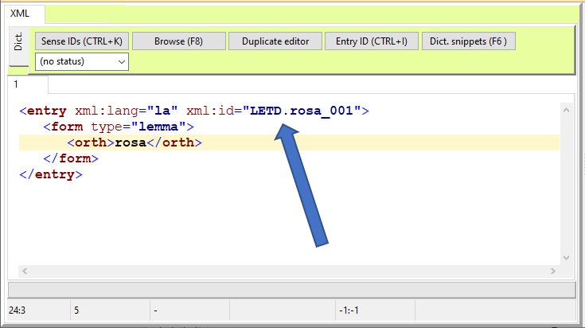
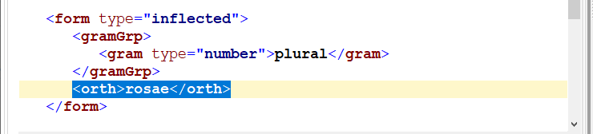

This course introduces lexicographers to the CLARIN Research Infrastructure and highlights language resources and tools useful for lexicographic practices. The course consists of two parts. In Part 1,  you will learn about CLARIN, its technical and knowledge infrastructure, and about how to deposit and find lexical resources in CLARIN. In Part 2, you will become acquainted with CLARIN tools that can be used to create lexical resources.  

## Target audience

Linguists, professional lexicographers, students and graduates in related disciplines, lecturers teaching lexicography.

## Learning Outcomes

Upon completion of this course, students will be able to

- appreciate importance of FAIR and Open data and the role of research infrastructures to ensure that lexical data is correctly preserved
- deposit their lexical resource on a CLARIN DSPACE type of repository (such as ILC4CLARIN), with the appropriate metadata, understand the versioning of resources, cite their resource appropriately
- search for and locate existing lexical resource within the CLARIN infrastructure (VLO, Resource Families)
- create a simple lexical resource by means of LexO, a collaborative editor of OntoLex-Lemon resources
- build a simple lexical resource (in TEI) with the [&lt;TEI&gt;enricher](https://howto.acdh-dev.oeaw.ac.at/de/resource/posts/a-very-concise-guide-to-creating-lexical-resources-with-%CB%82tei%CB%83enricher)

## Prerequisites

This course requires basic knowledge of Lexicography, which can be acquired from the **Introduction to Dictionaries** and the **Introduction to Corpus-Based Lexicographic Practice** courses.
In addition to this, we recommend doing the course **Modeling Dictionaries in OntoLex-Lemon** before starting Part 2 of this course. Finally, if you are interested in learning more about the topics of Part 1 of this course, we suggest continuing with **Lexicography in the Age of Open Data**, and **Standards for Representing Lexical Data: An Overview**.

## The CLARIN infrastructure

### What is CLARIN

CLARIN stands for "Common Language Resources and Technology Infrastructure". It is a research infrastructure that embodies the long-term vision of making the language resources and tools from all over Europe accessible online. It is organised as a distributed network of centres, offering resources, services and domain specific knowledge.

Currently, CLARIN provides easy and sustainable access to digital language data (in written, spoken, or multimodal form) for scholars in the social sciences and humanities, and beyond.  CLARIN also offers advanced tools to discover, explore, exploit, annotate, analyse or combine such data sets. CLARIN provides [several services](https://www.clarin.eu/content/services), such as access to language data and [tools to analyze data](https://www.clarin.eu/content/language-resource-switchboard), and [offers a research data depositing service](https://www.clarin.eu/node/3773), as well as direct access to [knowledge about relevant topics](https://www.clarin.eu/node/4061) related to (research on and with) language resources.

Exercises:

- To learn more, see the CLARIN website, and in particular the [About](https://www.clarin.eu/content/about-clarin) section. 
- For a short intro, see [CLARIN 101](https://www.youtube.com/watch?v=XS-bo2rLTsg&list=PLlKmS5dTMgw2XgWNuzQtGn_twUm-SHIL9&index=1) - a 3 minutes intro into CLARIN

From the legal point of view, CLARIN is an [ERIC](https://ec.europa.eu/info/research-and-innovation/strategy/strategy-2020-2024/our-digital-future/european-research-infrastructures/eric_en), a European Research Infrastructure Consortium. Member countries contribute to the ERIC financially and in kind, for instance by hosting one of the over 60 CLARIN centres. 

See also this [Overview of CLARIN Centers](https://www.clarin.eu/content/overview-clarin-centres)

Researchers from member countries have access to a number of services and opportunities, which will be explored in this course.

**Exercise**:

- Search the CLARIN portal to find out whether your country is part of CLARIN, who is the National Coordinator, whether there are CLARIN centres near you.

### Technical Infrastructure

Before beginning, please watch the following video:

<Video provider="youtube" id="YvZ9Y_uyr7M" />

CLARIN is organised as a networked federation of [centres](https://www.clarin.eu/content/clarin-centres) located in various countries: language data repositories, service centres and knowledge centres, with single sign-on access for all members of the academic community in all participating countries. 

Tools and data from different centres are interoperable, so that data collections can be combined and tools from different sources can be chained to perform complex operations to support researchers in their work.

Interoperability is achieved by central services, accessible from the CLARIN portal, which allow one to discover and use resources made available and hosted by the various centres. 

The [Virtual Language Observatory - VLO](https://www.clarin.eu/content/virtual-language-observatory-vlo) provides a means of exploring language resources and tools. Its aim is to provide an easy to use interface, allowing for a uniform search and discovery process for a large number of resources from a wide variety of domains. Facets make it easy to explore and access available resources. 

The VLO searches for metadata only. To enable researchers to search for specific patterns across collections of data, CLARIN developed [Content Search](https://www.clarin.eu/content/content-search), a search engine that connects to the local data collections that are available in the centres. The data itself stays at the centre where it is hosted – therefore the underlying technique is called federated content search.  The search engine summarizes and displays what is available. An easy next step is to go to the centre's specialised search interface to perform a more sophisticated query.

Finally, the [Language Resource Switchboard](https://www.clarin.eu/content/language-resource-switchboard) is a tool that helps you to find a matching language processing web application for your data. After uploading a file or entering a URL, you can select which task to perform. The Switchboard will then provide you with a list of available CLARIN tools to analyze the input. Crucially, the Switchboard can also be activated from data found from the VLO.

Exercises:

- Explore the VLO (later  we will see how to search for lexical resources in the VLO) and the Content Search
- Try to upload a short text in your language on to the [Switchboard](https://switchboard.clarin.eu/), to see what resources are available 

### Knowledge Infrastructure

The mission of the CLARIN Knowledge Infrastructure (KI) is to ensure that the knowledge and expertise available  within CLARIN do not exist as a fragmented collection of unconnected bits and pieces, but are made accessible in an organized way to the CLARIN community and to the Social Sciences and Humanities research community at large. We will not go into the details of the [CLARIN Knowledge Infrastructure](https://www.clarin.eu/content/knowledge-infrastructure). For more information see the relevant section of the CLARIN portal, but just provide the elements that are more relevant for the purposes of this course.

[CLARIN Knowledge Centres](https://www.clarin.eu/content/knowledge-centres) (abbreviated K-centres) are a cornerstone of the CLARIN knowledge infrastructure. K-centres are institutions that have agreed to share their knowledge and expertise on one or more aspects of the domain covered by the CLARIN infrastructure. They all have a helpdesk that will respond to requests within 2 working days. Some offer on-line courses, some offer best-practice documents, some offer guidance in getting access to and using data and tools, some are willing to host receivers of CLARIN mobility grants, and there are many more models in which the expertise is offered and shared. 

Another important source of information on Language Resources is the [Resource Families initiative](https://www.clarin.eu/resource-families). The aim of the CLARIN Resource Families initiative is to provide a user-friendly overview per data type of the available language resources in the CLARIN infrastructure aimed at the needs of researchers from digital humanities, social sciences and human language technologies. The overviews are meant to facilitate comparative research and the listings  are sorted by language.

In addition, CLARIN offers an extensive collection of [Video Lectures](http://videolectures.net/clarin/).

Other useful CLARIN initiatives are:

- The [Digital Humanities Course Registry](https://dhcr.clarin-dariah.eu/info) is a curated platform that provides an overview of the growing range of teaching activities in the field of digital humanities worldwide. It is maintained as a joint effort of two European research infrastructures: CLARIN-ERIC and DARIAH-EU. 
- The [Standard Committee (SC) ](https://www.clarin.eu/governance/standards-committee)and a [Committee for Legal and Ethical Issues (CLIC)](https://www.clarin.eu/governance/legal-issues-committee), which provide advice and guidance in their respective areas of competence.

Finally CLARIN has developed a number of [funding and support instruments](https://www.clarin.eu/content/funding-opportunities) which are meant to address strategic priorities that require cross-country collaboration, exchange of expertise, training or mobility. 

If you have a new project, and are looking for information and expertise on a specific topic **_remember_** that **_all researchers_** from CLARIN member and observer countries can: 

- contact a K-centre to ask for relevant information
- apply for a mobility grant to visit a centre
- avail themselves of other support instruments, for instance to organise events
- get in touch with the SC and CLIC representatives for information on standards and legal issues - notice that members of the CLARIN standard committee have been involved in the ELEXIS project and have extensive expertise on lexical resources. 
- finally, get in touch with your CLARIN National Coordinator and national centres

Use the CLARIN KI to find useful information for your lexicography project or training

Exercises

- Use the [keyword based search](https://vonweber.nl/cgi/kcentres_search.cgi) to find information on K-centres with expertise in your area
- Search for online courses from your country in the [DH course registry](https://dhcr.clarin-dariah.eu/info)

### CLARIN and FAIR, Open Data

The [FAIR data principles](https://www.force11.org/group/fairgroup/fairprinciples) state that language resources, like all research data, have to be Findable, Accessible, Interoperable, Reusable. Even though CLARIN has been in existence for a longer period than the FAIR data principles themselves, the core values of CLARIN – facilitating the reuse of language data and tools for research – align very closely with FAIR. CLARIN was a FAIR case ‘avant la lettre’.

Exercise:

- [Read on the CLARIN portal](https://www.clarin.eu/fair) how the CLARIN services can help you make your Lexical resources and other Language Resources FAIR

In particular, CLARIN deposit services are crucial to adhere to good principles of [Open Science](https://ec.europa.eu/info/research-and-innovation/strategy/strategy-2020-2024/our-digital-future/open-science_en). 

- Many CLARIN centres are [certified](https://www.clarin.eu/content/certified-centres), thus ensuring long term preservation of data and the adherence to shared data curation practices
- The [CLARIN Service Provider Federation ](https://www.clarin.eu/content/federated-identity)allows users to access protected data stored on a CLARIN centre with  Single Sign On, that is with your institutional login
- Moreover, CLARIN centres will advise you on the best choice of [license](https://www.clarin.eu/content/licenses-and-clarin-categories) for your data, to ensure maximum visibility and will help you to make your data as open as possible.

**Remember**, while institutional repositories can be very useful to keep all of your scientific production in one place, depositing in disciplinary repositories such as clarin centres is recommended to ensure the visibility of your data to the most relevant communities. In the case of CLARIN, the visibility to the broader DH community is ensured by the VLO.

Finally, the adherence to Open Science principles is now more and more a requirement for funded projects, especially at the European Level. A [Data Management Plan](https://www.eosc-hub.eu/deliverable/d16-data-management-plan) (DMP), that is to say a document that specifies how research data will be collected, processed, monitored and catalogued during the project lifetime - is required for Horizon Europe projects too. 

Exercises:

- [Read on the CLARIN portal](https://www.clarin.eu/content/support-eu-funded-projects) how CLARIN can help you with your project and DMP
- Learn more about FAIR data and Open Science in the course "Lexicography in the Age of Open Data" TODO: ADD LINK (Toma) 

### Searching for resources and information in the CLARIN infrastructure

We have seen that the CLARIN [VLO](https://vlo.clarin.eu/) is a sort of meta catalogue that gives access to all resources from the various centres. Metadata from repositories in the CLARIN network are harvested on a weekly basis, so when a new resource is deposited in one of them, it will become almost immediately visible from the VLO. Note that different centres use different but interoperable metadata profiles. 

- You can find out more about metadata and CLARIN on the [website](https://www.clarin.eu/faq-page/275). 

Let us see now how to make a search on the VLO, and more specifically how to find how many digitised dictionaries are present and in which languages and formats:

- First of all, go to the [VLO](https://vlo.clarin.eu/) home page and click on the button "Take a quick tour". You will be guided through all of the main search functions
- Then go back to the home page, click "See all records" to activate the faceted search
- First run a free text query for "French dictionary", you can see that results are not very precise. Sometimes you obtain bilingual resources or even resources that are not in French
- With a [faceted search](https://vlo.clarin.eu/search) you can be more precise. Try first to select [ResourceType = Dictionary](https://vlo.clarin.eu/search?15&fq=resourceClass:Dictionary&fqType=resourceClass:or). Only a few resources appear. Why? Because many of the resources from the previous search are not classified as "Dictionary", but as "Lexical Resources". Now try [ResourceType = lexicalResource](https://vlo.clarin.eu/search?15&fq=resourceClass:lexicalResource&fqType=resourceClass:or). 
- You can combine various resource types in one query. Such as ResourceType = [lexicalResource+LexicalResource+Dictionary](https://vlo.clarin.eu/?2&fq=resourceClass:lexicalResource&fq=resourceClass:Lexical+resource&fq=resourceClass:Dictionary&fqType=resourceClass:or)
- However, the concept of Lexical Resource is broader than that of Dictionary, so your search will yield resources such as worlists, WordNets, etc. Try to add the free text search now, to[ filter only those resources that  are called "Dictionary"](https://vlo.clarin.eu/?2&fq=resourceClass:lexicalResource&fq=resourceClass:Lexical+resource&fq=resourceClass:Dictionary&fqType=resourceClass:or&q=dictionary)
- You can now use the Language facet to explore all the languages for which a dictionary is present in CLARIN
- Select for instance the [Concise Dictionary of Latvian](https://vlo.clarin.eu/record/https_58__47__47_hdl.handle.net_47_11372_47_LRT-476_64_format_61_cmdi?19&count=304&docId=https_58__47__47_hdl.handle.net_47_11372_47_LRT-476_64_format_61_cmdi&fq=resourceClass:lexicalResource&fq=resourceClass:Lexical+resource&fq=resourceClass:Dictionary&fqType=resourceClass:or&index=31&q=dictionary), access the [resource](http://www.tezaurs.lv/lvv/) or go to the [landing page](https://lindat.mff.cuni.cz/repository/xmlui/handle/11372/LRT-476) on the Lindat repository; you can see that in this case the record does not contain a downloadable file. The resource can only be accessed online
- Select now the[ LMF Contemporary Arabic dictionary](https://vlo.clarin.eu/record/https_58__47__47_hdl.handle.net_47_11372_47_LRT-1944_64_format_61_cmdi?26&q=Dictionary&fqType=resourceClass:or&fq=resourceClass:Dictionary&fq=resourceClass:lexicalResource&fq=resourceClass:Lexical+resource&fqType=languageCode:or&fq=languageCode:code:ara&index=2&count=35), also hosted by Lindat. By accessing the [landing page](http://hdl.handle.net/11372/LRT-1944), you will find the downloadable file at the bottom of the record. As stated in the description, the format is XML, following the [LMF standard](https://www.iso.org/obp/ui/#iso:std:iso:24613:ed-1:v1:en) 

Explore further:

- Check how many other resources are available in XML format
- Which  language has more dictionaries in the VLO after English? Where do these resources come from? Use the button "Show more facets" to explore different values of the "Data Provider" facet

Corpora and concordancers can also be useful resources for lexicographers. The VLO allows you to search for this type of resource too. You can follow a similar strategy as the one described above. Searching for Finnish corpora you will find for instance the "[Corpus of Finnish Magazines and Newspapers from the 1990s and 2000s, Version 2](http://urn.fi/urn:nbn:fi:lb-201711241)", which is made available by Fin-CLARIN via the [Korp](https://korp.csc.fi/) interface. 

- Explore the aforementioned corpus and many others from Korp
- A lot more concordancers are available within CLARIN, and many of them are accessible from the Content Search. Explore the [collocations of "affaire/Affaire" in German and French corpora](https://contentsearch.clarin.eu/?&query=affaire#).

As these exercises have shown us, the VLO gives access to a large number of resources. Faceted  searches allow expert users to refine their criteria and run very specific queries. It may be a bit difficult to get a quick overview of a given type of resource. For this reason, the [Resource Families project](https://www.clarin.eu/resource-families) was launched.  It collects resources from CLARIN centres and also other relevant resources by type; additional metadata are added and the resulting lists are collected in easy to explore pre-compiled lists.  

Currently overviews are available of 12 corpora families, 5 families of lexical resources, and 4 tool families.

- Check the Resource Family "[Dictionaries](https://www.clarin.eu/resource-families/dictionaries)". Do you find all the resources that were retrieved from the previous VLO queries?
- Which dictionaries can be accessed online and which also downloaded? 
- Some resources are integrated in fully fledged lexicographic environments. Explore for instance the [Digital Dictionary of the German Language (DWDS)](https://www.dwds.de/)'s web page.

The CLARIN knowledge infrastructure also contains useful information on lexicographic tools and resources.

- You can use the[ K-centres search function](https://vonweber.nl/cgi/kcentres_search.cgi) and type in "Dictionaries", to find all the k-centres with lexicographic expertise 

Finally, you can also explore the [Tour De CLARIN](https://www.clarin.eu/Tour-de-CLARIN), an  initiative that aims to periodically highlight prominent resources, tools, research outcomes, events from a particular CLARIN national consortium or centre.

- Open the pdf for volume 1 and search for "Dictionaries". What do you find?
- What is the "Viennese Lexicographic Editor" ?

### Depositing Services

As we have seen, in order to fully adhere to the principles of Open Science, your data must be deposited in a certified repository. To help researchers to store their resources (e.g. corpora, lexica, audio and video recordings, annotations, grammars, etc.) in a sustainable way, many of the CLARIN centres offer a depositing service. They are willing to store the resources in their repository and assist with the technical and organisational details. This has a wide range of advantages:

- Long-term archiving: a storage guarantee can be given for a long period (up to 50 years in some cases)
- Resources can be cited easily with a [persistent identifier](https://www.clarin.eu/content/persistent-identifiers) (PID)
- The resources and their metadata will be integrated into the infrastructure, making it possible to search them efficiently.
- Password-protected resources can be made available via institutional login.
- Once resources are integrated in the CLARIN infrastructure, they can be analyzed and enriched more easily with various linguistic tools (e.g. automated part-of-speech tagging, phonetic alignment or audio/video analysis).

Here is what you have to do to deposit your lexical resource on a CLARIN repository. This step-by-step guide is imagined for a small project. For larger projects please contact the CLARIN centre beforehand. 

**Find your repository** from the list of certified [CLARIN depositing services](https://www.clarin.eu/content/depositing-services).  

**Check** on the repository's web page whether you have the right to deposit and what are the resources. For instance, the CLARIN Slovenia repository ([CLARIN.SI](https://www.clarin.si/repository)) contains a statement with the conditions and terms of use. It also contains an explanation of [why the CLARIN.SI repository is a good choice](https://www.clarin.si/repository/xmlui/page/faq#why-should-i-submit-my-data-into-your-repository).

**Is the data in the right format?** Your lexical resource should be deposited in a standard format (TODO link with "Standards for Representing Lexical Data: An Overview"), and provided with the correct documentation. Some repositories only accept some types of language resources, or some standards. For instance the French CLARIN centre [Ortolang](https://www.ortolang.fr/information/presentation) recommends XML, TEI, LMF, MAF and SYNAF.

**Choice of license**. CLARIN repositories can provide help in the choice of the license; they will respect your choice of license but will encourage you to choose an open one if possible. You can also use the [CLARIN license calculator](https://www.clarin.eu/content/clarin-license-category-calculator).  

How to deposit. Various CLARIN repositories use different software, for this reason there is not a single guide to depositing data. However, many CLARIN centres use [CLARIN DSpace](https://github.com/ufal/clarin-dspace). Depositing in any such centre is very easy to do. 

- Read the excellent deposit [tutorial](https://www.clarin.si/repository/xmlui/page/deposit) on the CLARIN Slovenia repository; other centres using CLARIN dspace have similar pages ([see the Italian one](https://dspace-clarin-it.ilc.cnr.it/repository/xmlui/page/deposit)) 
- Explore the way in which various types of lexical resources are deposited and described on the  [ILC4CLARIN repository](https://dspace-clarin-it.ilc.cnr.it/repository/xmlui/discover?filtertype=type&filter_relational_operator=equals&filter=lexicalConceptualResource)

Once the lexical resource is deposited on the repository, it will become searchable via the VLO as well, usually in a few days. 

**Citation**: you should note down the PID (CLARIN uses _handles_) that your resource has been assigned, and use it to cite the resource in your papers, CV, and professional website. You should encourage others to use the preferred citation form including the PID. By doing so, you can track citations of your data, for instance by searching on Google Scholar. 

- Check the citations of resources from the [Lithuanian repository](https://clarin.vdu.lt/xmlui/), by running a [Google Scholar query](https://scholar.google.com/scholar?start=20&q=%2220.500.11821%22&hl=en&lr=&as_sdt=0,5) on the repository's prefix. 
- To know more about this topic, watch the recordings of the [SSHOC Workshop: Data Citation in Practice](https://www.sshopencloud.eu/events/sshoc-workshop-data-citation-practice). You will also learn about another very useful CLARIN service, the [Virtual Collections Registry](https://www.clarin.eu/content/virtual-collections). 

**Versioning:** check what is the versioning policy of the repository. CLARIN repositories normally operate on a strict versioning policy. Every time you change your data a new version should be submitted, no matter how small the change. Old versions continue to exist, but point to new ones. 

- Check this resource on the Lindat CLARIN repository, which is currently replaced by a [more recent one](http://hdl.handle.net/11234/1-3186), as the page shows.  

  > Hajič, Jan and Hlaváčová, Jaroslava, 2016, MorfFlex CZ 161115, LINDAT/CLARIAH-CZ digital library at the Institute of Formal and Applied Linguistics (ÚFAL), Faculty of Mathematics and Physics, Charles University, [http://hdl.handle.net/11234/1-1834](http://hdl.handle.net/11234/1-1834).

**Remember.** Data can be available in various formats. It is important to learn to distinguish between the information contained in a given lexical resource, and the various formats and modes it is accessible in. 

- Consider the Resource "Italwordnet". See in the VLO how it is available in various formats ([query here](https://vlo.clarin.eu/?0&q=italwordnet)). Then check out the [online browsing interface](http://www.ilc.cnr.it/iwndb_php/). 

Only when a lexical resource is downloadable in its source format, so that the user can perform any query on it, can it be considered fully open.

## Using CLARIN Tools for lexicography

### **LexO-lite: what is and who is it for**

LexO-lite (simply LexO from now on) is a collaborative web editor for easily building and managing lexical and terminological resources in the context of the Semantic Web. The adoption of Semantic Web technologies and the Linked Data paradigm is driven by the need to ensure the construction of resources that are interoperable, shareable and reusable by the scientific community. LexO's primary objective is to enable lexicographers, scholars and humanists to create a resource ex novo where information can be easily manually curated by humans, that is fundamental for collecting reliable, fine-grained, and explicit information. LexO attempts to make the OntoLex-Lemon model accessible to all those who do not have technical skills, allowing for the adoption of new technological advance in the Semantic Web by Digital Humanities. The tool allows for information to be easily manually curated by humans. LexO is a free and open source project and its source code can be downloaded from [here](https://github.com/andreabellandi/LexO-lite).

### **Installation**

Users can compile and install LexO on their own machine, by following the instructions reported in [here](https://github.com/andreabellandi/LexO-lite/wiki/LexO%E2%80%90lite-Installation-Guide). This implies you will run the most recent version of the LexO code, which will not  necessarily be a stable version.

### **Current limitations**

LexO is not a funded project. From the technological point of view, it is based on an open source Java library called OWL-API. However, a solution that implements a persistence strategy based on triple stores is more indicated for medium/large-sized data. For this reason, we called this tool version **LexO-lite**. The suffix lite refers to the limited ability to manage small-sized lexica, typically domain terminologies and specialized lexica. A full version of LexO that will be capable of managing large-scale resources in currently in progress.
Please notify bugs or issues on the [project github page](https://github.com/andreabellandi/LexO-lite).

### **Tool description**

The main interface of LexO is depicted in the following figure. 

The leftmost column contains four tabs and a browsing component with a simple search box where the list of the elements contained in the selected tab is displayed. Specifically, by clicking on the first tab, users can view all the lexical entries of the dictionary, represented by their canonical written form and accompanied by information about the part-of-speech and the language. The second tab provides all the inflected forms listed in alphabetical order. In the case of multilingual resources, lemmas and forms can be filtered by language. The Documentation tab is dedicated to enumerating the texts of the corpus from which terminology is extracted. Finally, the Ontology tab contains the conceptual part of the lexicon. All the information relating to the element selected in the browsing component is visualised in the rightmost column. 

The figure above shows the information displayed when selecting the greek lexical entry _τετράγωνον_ ('square' in English): in the red box the main information concerning the lemma, such as grammatical category, gender and number are illustrated; in the blue box you will find the description of the forms occurring in the reference text. The senses are described in the yellow boxes. 
As far as the Documentation tab is concerned, LexO shows the metadata panel of the selected text; the Ontology tab instead lists the concepts belonging to a reference ontology that would have been previously uploaded.

Since LexO allows users to create resources in a collaborative way, it defines three kinds of user profiles i.e., administrator (edit rights and users management), user (edit rights), viewer (browsing only). The system allows administrators to validate a lexical entry by means of the “verified” checkbox in the lemma box, in such a way that it can no longer be modified by users that are not administrators. This functionality makes it possible to implement a sort of revision process, for the final export of the resource in the OntoLex-Lemon model, which can be done by means of the Export button at the bottom of the toolbar. In this way, the resource is ready for publication according to the linked data policies.

In the following, the functionalities of LexO will be described in detail, by means of suitable video tutorials. 

### Video tutorials

**How to create LexO's users.** [Link](https://screencast-o-matic.com/watch/crlrIZV2sp1)

This video shows the management of the users' profiles.

**How to create lexicon languages.** [Link](https://screencast-o-matic.com/watch/crlrICV2s53)

This video shows the languages creation process.

**How to edit a lexical entry, referring to the OntoLex-Lemon _core_ module.** [Link](https://screencast-o-matic.com/watch/crlrbkV2M2F)

This video shows the management of the core module

**How to edit a lexical entry, referring to the OntoLex-Lemon _vartrans_ module.** [Link](https://)

The following video shows the management of the variation and translation module

**How to edit a lexical entry, referring to the OntoLex-Lemon _synsem_ module.** [Link](https://)

The video shows the management of the syntax and semantics module

**How to describe the semantics of a lexical entry.** [Link](https://)

The video shows how to refer a lexical entry to an external ontology 

**The lexical entry dictionary view.** [Link](https://)

The  video shows the dictionary-like view of LexO 

### &lt;TEI&gt;enricher

A tool for quickly creating a dictionary in accordance with the Guidelines of the Text Encoding Initiative (TEI), ideally in the Lex-0 flavour.

#### Introduction

This tutorial is supposed to teach interested novices how to quickly create a dictionary in accordance with the Guidelines of the Text Encoding Initiative (TEI), ideally in the Lex-0 flavour. It makes use of a tool that was created in the framework of the [VICAV project](https://www.oeaw.ac.at/acdh/projects/vicav) at the [Austrian Centre for Digital Humanities and Cultural Heritage](https://www.oeaw.ac.at/acdh/) (ACDH-CH). The intention was to work with examples conformant to TEI Lex-0. However, this tutorial is not meant as an instruction to the encoding but to the usage of the described tool. Furthermore, it is not a complete documentation of the software but will concentrate on the key features needed to understand the basic functionalities in writing a digital dictionary.

##### Institutional framework

The [Viennese Corpus of Arabic Varieties](https://www.oeaw.ac.at/acdh/projects/vicav) (VICAV) is a project cluster collecting and creating digital language resources for Arabic dialectology. It is an initiative of the ACDH-CH of the Austrian Academy of Sciences (OeAW) and the Institute for Near Eastern Studies of the University of Vienna. Contrary to its name, the endeavour has over time developed a focus on lexical resources.

##### The &lt;_TEI_&gt;_Enricher_ tool

The tool that has been used for many years to create lexical resources in the VICAV projects is the **Viennese Lexicographical Editor (VLE)**, an XML editor providing specialised functionalities to compile digital dictionaries and to streamline the lexicographic editing process. It is a standalone Windows application that allows lexicographers to work collaboratively on the Internet. It is built on XML and cognate technologies such as XPath, XQuery, XSLT and XML Schema. While, in principle, it can process any XML-based format, it has a number of features that are geared towards the use of lexical data which are encoded according to the Guidelines of the Text Encoding Initiative.

VLE incorporates several specialised modules which have emerged from particular needs in various projects. One of these is the integrated 'book reader', allowing to efficiently work with books in the form of scanned images and thus to easily navigate sources used during the dictionary compilation. This is also quite useful in retro-digitising historical dictionaries. Another built-in tool that is used to access external data, is the integrated Internet browser which allows to directly work with corpora, other dictionaries etc. available through web applications. This module has also been used in integrating example sentences in the various dictionaries. VLE visualises all lexicographic data making use of freely configurable XSLT styles. It can check the integrity of the XML data (well-formedness) and also verify the validity of the input against XML schemas. It performs versioning on the entry level, storing a time-stamped copy on the server every time a record is saved. VLE works as part of a client-server architecture which in recent versions was built with the free and easy-to-use XML database BaseX as backend. It has been freely available and can be [downloaded from the ACDH-CH website](https://www.oeaw.ac.at/acdh/projects/vicav).

In recent months, we have started to integrate important parts of VLE's functionality into another XML editor which by contrast to VLE has been programmed making use of the freely available compiler LAZARUS. This was meant as a step to make the development more sustainable. The XML editor has so far been called  &lt;_TEI_&gt;_Enricher_.

&lt;_TEI_&gt;_Enricher_ is a so-far experimental XML editor geared towards the easy production of TEI documents. It has not only been used to create but also enrich TEI documents. It helps to work on standoff annotations, provides functions to chunk and tokenise texts and has built-in functions to work with geo locations. It was first developed in a project creating linguistic teaching resources written in TEI.

A focus of the work on this tool has also been the teaching of XML and TEI. It has been designed to make particular steps of text production as transparent as possible. By contrast to other tools, XSLT is pre-configured so that students can easily start to transform what they code right from the beginning. It can be used to train a wide range of text-technological skills such as XML, XSLT, HTML, CSS, etc.

In the TEI world, lexical resources are viewed as special types of text. Enhancing the tool with functionalities from the dedicated dictionary writing application can therefore be seen as a natural next step in the development of the  &lt;_TEI_&gt;_Enricher_.

<SideNote type="note" title="A final word of caution">
  Bear in mind that both the program and its documentation are work in progress
  and as such are incomplete and prone to change. To keep things simple, we only
  deal with the single-user version of  &lt;_TEI_&gt;_Enricher_. While setting-up the XML
  database BaseX and configuring it is also pretty straightforward, it still
  adds some complexity to the issue which is not needed when only wanting to
  look at the basic workings of digital dictionary writing.
</SideNote>

#### Creating a Lex-0 dictionary

The following paragraphs will walk you through the process of creating a bilingual dictionary with  &lt;_TEI_&gt;_Enricher_. We will focus on the procedure rather than the involved encoding as there already exists excellent material on [TEI Lex-0](https://dariah-eric.github.io/lexicalresources/pages/TEILex0/TEILex0.html). As an example we furnish a few sample entries that might be seen as the start of a Latin-English dictionary.

##### STEP 1: Obtaining and setting-up the program

Like VLE,  &lt;_TEI_&gt;_Enricher_ is a standalone Windows application. You can download it from the [VICAV project website](https://www.oeaw.ac.at/acdh/projects/vicav) of the ACDH-CH. There is no need to install anything, just unpack the zip file in a folder where you have reading and writing rights.

##### STEP 2: Starting the program

Having unpacked the programme to a directory of your choice, you can start it by double-clicking on the executable (file with exe extension): `tei_enricher.exe`. You might consider putting a link on the desktop if you intend to make use of it regularly.

##### STEP 3: Creating a dictionary set-up

To create a dictionary, go to the _New dictionary_ tabsheet by pushing the _Create new dictionary_ button. This will take you to a tabsheet where you have to fill in some basic information about the dictionary you intend to create. The form helps you to fill in the information the program uses for the set-up of a working environment. Most of the data you are expected to enter is self-explanatory. The following image shows the example we will work with in the following chapters.

In the TEI world, languages are identified with language 'tags' that follow the [IETF BCP 47 specification](https://tools.ietf.org/rfc/bcp/bcp47.txt). To ease finding the right one, the program provides several lists containing the ISO-639 language codes. To switch between the lists, simply choose a list from the combobox on the right side of source and target language.

Then, push the three buttons on the bottom of the form from left to right. Unless there is a need to change the templates, you don't need to do anything. The program has just set up the environment for you, copying the dictionary template, the transformation styles (xsl), the schema files (xsd) and an XML file ending in `_xprofile.xml` into the target directory.

#### Creating dictionary entries

##### STEP 1: Open the new dictionary

Having created the document into which the dictionary data is going to be stored, we can proceed to create entries for the dictionary. Once you have pushed the _Save new dict._ button, the program takes you to the file explorer. You will see a directory with two XML files in it: the dictionary and the dictionary profile.

To open the dictionary, click the file ending in `_xprofile`. This is the file that gives the program all the information it needs, enabling you to work on the dictionary. The profile is also a TEI encoded document containing configuration data needed by the editor. You could also open the dictionary file as a text, which, however, would make working on it much more cumbersome.

##### STEP 2: Find the entry templates ...

When the profile is loaded, the editor appears displaying a three-way structure: the left side (1) is the XML editor, the central part (2) is used to navigate the dictionary data and the right side (3) is used for editing any meta-data and visualising the entries.

When opening the editor for the first time, you might not see all the components. You may have to enlarge the window and there are splitters inside the window to adjust the width of the three areas. The program will remember the size of the window when you open it in following sessions.

Now, we are going to create our first dictionary entry. Everything in the program is based on templates. Of course, you can also type in whatever you need manually. However, simply copying predefined code snippets is a much easier and safer approach. The entry templates are to be found in the right-side section (3). Click on the tabsheet _Dict._ and then on _Entry templates_.

What you see here, is a list of TEI code snippets representing prototypical entries from with which dictionary entries can be created. These templates are stored in the profile. The list will have to be adapted to the particularities of your needs. Each template has a name attribute displayed in the listbox on the left side, which is used to insert a template into the dictionary.

##### STEP 3: ... and insert the first entry

Let us now create a new entry. For the sake of practice, let's take the simplest template with the name generic, which has almost no content. Double-click on the line in the listbox on the left side. The next image displays what you should see now.

Now you can start to work on the lexical data. Insert the lemma inside of the `<orth>` element.

After this, you might want to create a more meaningful ID for the entry. Push the button _Entry ID_ to create a new ID.

This ID is made up of an identifier of the dictionary (LETD=Latin English Trial Dictionary), which is based on the template defined in the configuration tabsheet of the profile: right editor side, _Dict._ tabsheet, _Dict. Config_.

##### STEP 4: Populating an entry

Next, we need to add more information to the entry: we avoid typing but insert predefined code snippets instead, as we did before when creating the entry.  &lt;_TEI_&gt;_Enricher_ allows to quickly insert such snippets either by choosing from a list of snippets (F6 key) and inserting them into the text (F5 key) or by typing hash delimited codes identifying particular predefined snippets.

###### Dealing with grammatical information

In TEI Lex-0, word class is encoded in `gramGrp/gram[@type="pos"]`. The word _rosa_ is a noun and it is feminine. To find an appropriate snippet, let's look at the list of code snippets which can be found on the _Dict. snippets_ tabsheet. To get there, simply click on the _Dict. snippets_ button or trigger the _goToDictSnippets_ function (per default F6 key).

The snippets have two attributes that are relevant for the functioning of the program. The `n` attribute (arrow 1) contains an abbreviation that can be used with hashes on the left and right side to avoid navigating to go the _Dict. snippets_ tabsheet. When typing the string `(n=noun)` in the XML editor, the program attempts to substitute this string with the template carrying the attribute `n="n"`. Consequently, typing `v` with hashes around would insert the snippet for the word class verb. Alternatively, you can also double-click in the listbox on the left side of the snippets list (arrow 2) or click on the button that pops up when you navigate in the templates (arrow 3).

Consequently, we receive the following result.

Mind the string in the templates which indicates where the program will put the cursor after the insertion. &lt;_TEI_&gt;_Enricher_ is performing some rudimentary formatting. Mind that this often is far from perfect and might differ from what you would like to see.

Inserting the genus of the noun works along the same lines: Simply put the cursor in the line after the word class information and type gf encircled by hashes.

")

This will result in the substitution the result of which is displayed in the next illustration.

")

###### Inserting a plural form

We do not attempt to discuss the TEI Lex-0 system as there is very good [documentation](https://dariah-eric.github.io/lexicalresources/pages/TEILex0/TEILex0.html) available already. However, to proceed with complete entries, we give examples of the most important constituents of dictionary entries in TEI Lex-0.

Plural forms are indicated in `<form>` elements.

###### Inserting senses

An indispensable part of bilingual lexicography are translation equivalents. These are put in `<sense>` elements. Mind the _Sense IDs_ button on top of the editor. Senses must have unique IDs.

###### Inserting an etymology

Let us finish with the etymology snippet. To demonstrate this, a second entry is created.

###### Viewing the data

One of the important features of &lt;_TEI_&gt;_Enricher_ is that it allows to instantly visualise the XML. This is achieved by means of XSLT styles that convert the TEI encoded text into HTML and display it in the browser of the editor. To trigger this transformation the function _browseDictEntry_ is used (per default F8 key).

The XSLT can easily be adjusted to various purposes. The tabsheet on the left side of the _Browser_ tabsheet contains the data which can be edited. Any changes are applied immediately to the data. How to edit the XSLT language is however beyond the scope of this tutorial.

##### STEP 5: Inserting examples

In the dictionaries of the VICAV family, examples constitute a case in its own right. They are usually not inserted directly into the `<entry>` elements but referenced via pointer elements that contain IDs to address them. To make this clear, a short notice on the macro structure of the VICAV dictionaries: they are made up of two divisions inside the body element of the dictionary, the first division `div[type="entries"]` contains all entries irrespective of being single or multiword entries and the second division `div[type="examples"]` contains all the examples. The rationale behind keeping example sentences apart from the entries is to allow the reuse of the examples in different parts of the dictionary, thus creating a more flexible structure. The macro structure of the dictionaries looks like this.

We first create an example.

To copy this reference into the respective entry, we use the function _createExamplePointer_ (F11 key) to get the data into the clipboard. Then we go to the entry _loquor_ 'to speak', find the right position to insert and paste it there using CTRL+V. In the VICAV dictionaries, these references are usually inserted at the end of a `<sense>` element.

&lt;_TEI_&gt;_Enricher_ automatically inserts the example in the output stream when browsing the entry _loquor_.

##### STEP 6: Saving the data

You can save the dictionary with the function _saveDocument_ which is called per default pressing the shortcut keys CTRL+S. Whenever the file is saved, the program creates a backup that is located in a subdirectory backup of the current directory.

##### STEP 7: Accessing existing data

The functionality to work on local data instead of in the client-server architecture has actually been one of the latest enhancements of the tool. Except for ease of use and therefore being well-suited for teaching purposes, it is also a useful scenario when there is a need to speed-up processes. The capability to work on a local XML file, and not on data in a remote database, comes in very handy when one wants to edit larger amounts of data. Accessing the data directly in the DOM tree on your machine is much faster than any data transfer via HTTP or other such mechanisms.

The navigation within the dictionary is accomplished via the middle section of the editor. There are two controls: a selector for the scope (arrow 1) and a query control for text (arrow 2). To get all entries, simply put the cursor in the query control and push the Enter key. For our small example dictionary the result looks like this.

Where to look for particular strings in the dictionary is defined in the list of query templates. These are simple xPath expressions into which the string from the query control is inserted. The templates are selected via the label.

#### Some details on the editor

##### Working with the text

The tool does not come with much sophisticated XML editing functionality. It is therefore important to avoid much typing which is per se very error prone. Define what you need in the templates section and insert elements from there. Having inserted a start tag, the shortcut keys CTRL+F5 add the end tag. To select an element simply press the F9 key in the element.

CTRL+F9 will select only the contents of the element.

##### Checking well-formedness (CTRL+W)

When working on any XML document, it is very important to ensure that the document complies with the underlying specifications. The most fundamental degree of compliance within the basic rules of XML is called well-formedness. A well-formed document fulfils three conditions:

- It has a single root.
- Every start tag is followed by an end tag.
- All the elements in the document are properly nested.

'Properly nested' means that elements must not overlap, a start- and end-tag must be inside the 'parent' element. As with many functions in  &lt;_TEI_&gt;_Enricher_, you can either use the button in the top bar of the editor, use a keyboard shortcut (per default CTRL+W) or right click in the editor to select the respective item in the pop-up menu to start the check on the structural integrity of the document you are working on.

To try this functionality, simply remove a single tag from your try-out text and press CTRL+W. You will receive an error message and a position in the text; the latter information is not always helpful, as this is the position where the error shows, not necessarily where the problem started.

##### Validation (ALT+V)

When discussing which formats to use in data processing, validation has often been named as one of the strong arguments in favour of XML solutions. While the well-formedness test only checks the three basic XML rules (one root, every start tag has to be followed by an end tag and elements must be properly nested), validation also checks the vocabulary used. It makes sure that only permissible elements are used in the document and that they are in the right place. The validation check is performed against a so-called schema, a document that contains the specifications which define a particular type of document.

 &lt;_TEI_&gt;_Enricher_ can currently only deal with XML Schema files, it does not support Relax NG. This has got to do with the availability of tools and time constraints in programming the tool. The XML Schema file against which the validation is performed has to be indicated in the _Config._ tabsheet of the main form. There are two options: either you have a local schema on your computer or you get it from the Internet, ideally via the _[Text Encoding Initiative](https://tei-c.org/)_. When making use of this functionality, it is recommended to use slimmed-down schemas that only contain the elements necessary for the particular task. `TEI-all.xsd` will make the process slow and cumbersome.

##### Other checks

There are two more checks that can be applied to ensure the integrity of the dictionary data: the function _Check for duplicate IDs_ makes sure that every ID is used only once in the dictionary. _Check integrity of example ref's_ looks for references of examples that cannot be resolved. Both functions can be called by right-clicking in the editor and selecting the respective menu item.

## References

- Andrea Bellandi (2021). LexO: An Open-source System for Managing OntoLex-Lemon Resources. _Language Resources & Evaluation_. https://doi.org/10.1007/s10579-021-09546-4.
- Andrea Bellandi, Emiliano Giovannetti, Simone Marchi, Silvia Piccini, Flavia Sciolette (2021). Fostering the Collaborative Creation of Linguistic Linked Open Data with LexO, an Open Source Editor of Multilingual Lexicons and Terminologies. _Associazione per L'informatica Umanistica, Book of abstract_. http://amsacta.unibo.it/6712/1/AIUCD2021_BOA-versione3A.pdf
- Andrea Bellandi, Monica Monachini and Fahad Khan (2019). LexO: Where Lexicography Meets the Semantic Web. _Tour de CLARIN volume 2_. https://www.clarin.eu/blog/clarin-it-presents-lexo-where-lexicography-meets-semantic-web 
- Franciska de Jong, Bente Maegaard, Darja Fišer, Dieter Van Uytvanck & Andreas Witt (2020). Interoperability in an Infrastructure Enabling Multidisciplinary Research: The case of CLARIN. In Proceedings LREC 2020,  12th International Conference on Language Resources and Evaluation, ELRA. https://www.aclweb.org/anthology/2020.lrec-1.417/
- Monachini, Monica, e Francesca Frontini. CLARIN, l’infrastruttura europea delle risorse linguistiche per le scienze umane e sociali e il suo network italiano CLARIN-IT. IJCoL - Italian Journal of Computational Linguistics, Special Issue on NLP and Digital Humanities, 2, n. 2 (2016): 11–30.
  https://doi.org/10.4000/ijcol.387
- Mörth, Karlheinz. &lt;_TEI_&gt;_Enricher. Version 1.1.8._ Viennese Corpus of Arabic Varieties, Austrian Centre for Digital Humanities. (15.12.2021). [https://www.oeaw.ac.at/acdh/projects/vicav](https://www.oeaw.ac.at/acdh/projects/vicav).
- Phillips, A., ed., and M. Davis, ed. "Tags for Identifying Languages," BCP 47, RFC 5646, September 2009. [https://tools.ietf.org/rfc/bcp/bcp47.txt](https://tools.ietf.org/rfc/bcp/bcp47.txt). 
- TEI Consortium, eds. _TEI P5: Guidelines for Electronic Text Encoding and Interchange._ Version 4.3.0. Last modified: 31.8.2021. TEI Consortium. [http://www.tei-c.org/Guidelines/P5/](http://www.tei-c.org/Guidelines/P5/) (22.12.2021).
- Toma Tasovac, Laurent Romary et al. 2018. _TEI Lex-0 - A baseline encoding for lexicographic data. Version 0.9.0_. DARIAH Working Group on Lexical Resources. [https://dariah-eric.github.io/lexicalresources/pages/TEILex0/TEILex0.html](https://dariah-eric.github.io/lexicalresources/pages/TEILex0/TEILex0.html).