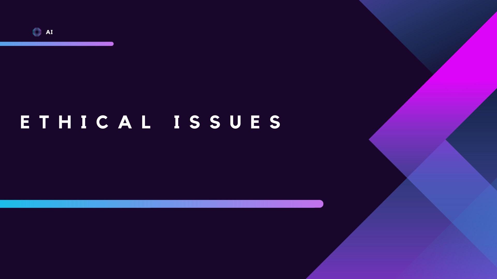
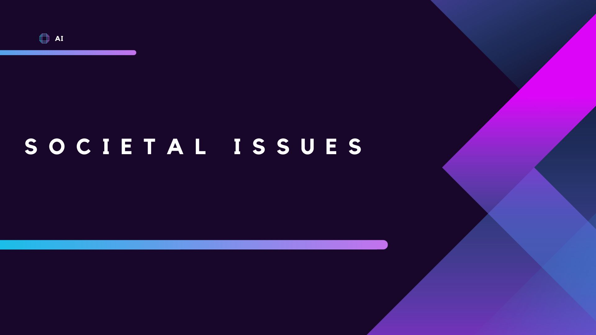
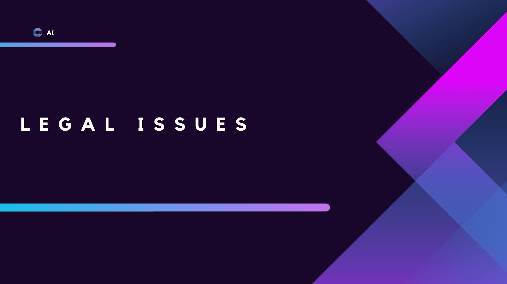

# Ethical, Societal and Legal Complexities of Artificial Intelligence

Throughout this resource, the potential risks, current state and case studies of real-world examples of the complexities of Artificial Intelligence will be detailed.  The resource is divided by ethical, societal and legal issues.

There will be examples explained for each particular complexity and then detailed case studies which will give the reader the ability to explore an external resource to learn more about the examples in each case study.

At the end of each of the three sections, there will be a short quiz to test the knowledge acquired in each section.

## Learning Outcomes

After completing this training resource, learners should be able to

- Think critically about both the benefits and drawbacks of the implementation of Artificial Intelligence in society

- Separate the current state of the complexities of Artificial Intelligence from the potential future risks

- Explore and gain familiarity with real world examples of issues surrounding Artificial Intelligence

# Ethical Issues

AI brings up questions about what is right and wrong in its use. It can contain biases and make decisions that affect people's lives. Awareness and discourse are needed to ensure AI is used in a way that is fair and respects human values. In this section of the resource, a wide array of potential ethical issues will be discussed to give the reader an idea of the future impact of Artificial Intelligence's implementation.  Then, a look at the current state of ethical issues will be discussed.  Finally, following a brief quiz, there will be case studies the reader can explore to observe the conceptual issues as they've already occurred across the globe.

## Potential Risks

**Bias and Fairness:** Artificial Intelligence algorithms are only as good as the data they are trained on. If the training data is biased, the Artificial Intelligence system may perpetuate or even amplify existing social inequalities. For example, biased facial recognition systems might misidentify certain racial or ethnic groups more frequently.

**Privacy and Surveillance:** Artificial Intelligence systems can process vast amounts of personal data, potentially leading to privacy infringements. As Artificial Intelligence becomes more sophisticated, there's an increased risk of surveillance, unauthorized access, and misuse of personal information.

**Autonomy and Accountability:** As Artificial Intelligence systems become more advanced, they may operate autonomously, making decisions without human intervention. This raises questions about who should be held accountable for AI-generated decisions and actions when something goes wrong.

**Lack of Transparency:** Many Artificial Intelligence algorithms, such as deep learning neural networks, can be complex "black boxes" that are difficult to interpret. The lack of transparency and explain-ability can make it challenging for users to understand how AI arrives at specific conclusions or recommendations.

**Job Displacement and Economic Inequality:** Artificial Intelligence and automation could lead to job displacement and create economic inequality if certain sectors or regions are more affected than others. The distribution of AI's benefits and its impact on the workforce remains a concern.

**Safety and Security:** Artificial Intelligence applications have the potential to be weaponized or manipulated maliciously. Ensuring that Artificial Intelligence systems are secure and cannot be easily exploited for harmful purposes is a significant ethical challenge.

**Moral Decision Making:** Teaching Artificial Intelligence systems to make moral decisions poses ethical dilemmas. Deciding what moral principles to embed in Artificial Intelligence and how to handle situations where moral choices conflict raises complex philosophical questions.

**Impact on Human Agency:** Artificial Intelligence systems that predict and influence human behavior might undermine individual autonomy and manipulate people's choices and actions without their awareness or consent.

**Artificial Intelligence in Warfare:** The use of Artificial Intelligence in military applications, such as autonomous weapons, raises ethical concerns about the potential for indiscriminate harm and the erosion of human responsibility in warfare.

**Long-term Consequences and Existential Risk:** Some researchers and thinkers worry about the long-term consequences of Artificial Intelligence development, including the potential for Artificial Intelligence systems to surpass human intelligence and the risks associated with creating superintelligent entities.

## Current State

**Bias and Fairness:** The issue of bias in Artificial Intelligence systems was a major concern. Many Artificial Intelligence applications, including facial recognition, hiring algorithms, and credit scoring, were found to exhibit biases against certain groups, perpetuating discrimination and social inequalities.

**Privacy and Surveillance:** Artificial Intelligence systems were increasingly used to process personal data, raising concerns about privacy violations and the potential for mass surveillance.

**Autonomous Weapons and Military Artificial Intelligence:** The development and deployment of autonomous weapons and Artificial Intelligence in military contexts were significant ethical issues, with concerns about the lack of human oversight and potential for increased harm.

**Accountability and Transparency:** The lack of transparency and explainability in Artificial Intelligence decision-making processes remained a challenge, making it difficult to understand how Artificial Intelligence arrived at particular outcomes and who should be held responsible for Artificial Intelligence-generated decisions.

**Job Displacement and Economic Impact:** As Artificial Intelligence and automation advanced, concerns about job displacement and economic inequality were prevalent, particularly in industries where Artificial Intelligence technologies were replacing human labor.

**Deepfakes and Misinformation:** The rise of Artificial Intelligence-generated deepfake videos and misinformation posed ethical challenges in terms of media manipulation, fake news, and potential harm to individuals and societies.

**Artificial Intelligence in Healthcare:** Ethical considerations were raised regarding the use of Artificial Intelligence in healthcare for tasks such as diagnosis and treatment recommendations, with concerns about data privacy, informed consent, and potential biases in medical decision-making.

**Manipulation and Persuasion:** The use of Artificial Intelligence-driven algorithms in social media platforms and advertising raised concerns about targeted manipulation and persuasion, potentially influencing people's beliefs and behaviors.

**Data Governance and Ownership:** The increasing reliance on data for training Artificial Intelligence models brought up questions about data ownership, access, and governance, particularly in cases involving sensitive or personal data.

**Ethical Artificial Intelligence Research and Development:** Ethical considerations within the Artificial Intelligence research and development community became more prominent, with efforts to promote responsible Artificial Intelligence practices and the integration of ethics into Artificial Intelligence development processes.

<Quiz>
  <Quiz.Card>
    <Quiz.MultipleChoice>
      <Quiz.Question>
        Where does the bias in AI derive from?
      </Quiz.Question>

      <Quiz.MultipleChoice.Option>
        The User
      </Quiz.MultipleChoice.Option>

      <Quiz.MultipleChoice.Option isCorrect>
        The Training Data
      </Quiz.MultipleChoice.Option>

      <Quiz.MultipleChoice.Option>
        The Algorithm
      </Quiz.MultipleChoice.Option>

      <Quiz.MultipleChoice.Option>
        The Coder
      </Quiz.MultipleChoice.Option>
    </Quiz.MultipleChoice>
  </Quiz.Card>
</Quiz>

## Case Studies

In order to see how some of these concepts have manifested around the world, please feel free to explore some of the case studies provided below.

<SideNote type="note" title="Autonomous Vehicles and Pedestrian Safety">
In March 2018, a self-driving Uber vehicle struck and killed a pedestrian in Tempe, Arizona. The incident raised concerns about the safety of autonomous vehicles and the need for human oversight during testing and deployment.

https://www.nytimes.com/2018/03/19/technology/uber-driverless-fatality.html
</SideNote>

<SideNote type="note" title="Facial Recognition Bias">
In 2018, Joy Buolamwini, an MIT researcher, found that some facial recognition systems from major tech companies were less accurate in identifying darker-skinned and female faces compared to lighter-skinned and male faces.

http://gendershades.org
</SideNote>

<SideNote type="note" title="Automated Hiring Bias">
In 2018, it was reported that Amazon developed an AI-powered recruiting tool that showed bias against female candidates, downgrading resumes that included terms like "women's" and penalizing applicants from women's colleges.

https://www.reuters.com/article/us-amazon-com-jobs-automation-insight-idUSKCN1MK08G
</SideNote>

<SideNote type="note" title="AI in Criminal Justice">
In 2016, ProPublica investigated the use of the COMPAS algorithm in the U.S. criminal justice system. The algorithm, used to assess the likelihood of a defendant reoffending, was found to have significant racial bias, leading to biased decisions in sentencing.

https://www.propublica.org/article/machine-bias-risk-assessments-in-criminal-sentencing
</SideNote>

<SideNote type="note" title="AI in Healthcare">
In 2017, Google's DeepMind was involved in a controversy when it partnered with the UK's National Health Service (NHS) to process patient data without explicit consent. The partnership raised concerns about data privacy and informed consent.

https://www.theguardian.com/technology/2017/jul/03/google-deepmind-16m-patient-royal-free-deal-data-protection-act
</SideNote>

Having explored various ethical dilemmas and AI-driven scenarios, one can see the nuances of right and wrong in AI applications. From fairness in algorithmic decisions to the preservation of individual privacy, the ethical dimensions of AI touch every aspect of our lives. It's vital to apply this understanding as AI continues to shape our ethical landscape, fostering an environment of responsibility and transparency.

# Societal Issues

AI has the power to reshape how we interact and live. It can both help and challenge social norms. As AI becomes more common, it's important for society to understand and manage its impacts in order to mitigate the negative impacts that may derive from its training data so that it's implementation is in alignment with where we want to be as a society in the future.

In this section of the resource, a wide array of potential societal issues will be discussed to give the reader an idea of the future impact of Artificial Intelligence's implementation.  Then, a look at the current state of societal issues will be discussed.  Finally, following a brief quiz, there will be case studies the reader can explore to observe the conceptual issues as they've already occurred across the globe.

## Potential Risks

**Job Displacement and Economic Inequality:** Artificial Intelligence and automation could lead to job displacement across various industries, potentially exacerbating economic inequality as certain sectors are more affected than others. Ensuring a just transition for workers and addressing the impact on income distribution is critical.

**Skills Gap and the Digital Divide:** The adoption of Artificial Intelligence may create a skills gap, where the demand for Artificial Intelligence-related expertise outstrips the supply. Unequal access to Artificial Intelligence technologies could widen the digital divide between regions or socio-economic groups, further marginalizing disadvantaged communities.

**Ethical Decision Making and Agency:** As Artificial Intelligence systems take on more decision-making roles, questions arise about how to imbue Artificial Intelligence with ethical principles and ensure that Artificial Intelligence respects human agency and values. Artificial Intelligence algorithms can perpetuate and amplify existing biases, leading to discriminatory outcomes in areas like criminal justice, hiring, and lending.

**Surveillance and Privacy Concerns:** The extensive use of Artificial Intelligence for surveillance purposes, both by governments and private entities, may raise serious privacy concerns and potential abuse of personal data.

**Autonomous Weapons and Warfare:** The development of Artificial Intelligence-driven autonomous weapons could raise ethical concerns about the potential for uncontrolled use and accountability in warfare.

**Artificial Intelligence and Addiction:** Artificial Intelligence-driven algorithms in entertainment and social media platforms may contribute to addiction-like behaviors and excessive screen time, particularly among vulnerable populations.

**Unemployment and Social Safety Nets:** Widespread job displacement due to Artificial Intelligence adoption may necessitate the restructuring of social safety nets to support those affected.

**Human-Machine Interaction and Social Isolation:** As Artificial Intelligence becomes more integrated into daily life, establishing appropriate and ethical human-machine interaction norms and guidelines becomes crucial. Increasing reliance on Artificial Intelligence and automation may lead to reduced human interactions and social isolation, potentially impacting mental health and well-being.

**Existential Risk:** Some researchers and thinkers express concern about the potential for Artificial Intelligence to surpass human intelligence, leading to existential risks that may require careful management and oversight.

**Deepfakes and Misinformation:** The rise of Artificial Intelligence-generated deepfake videos and misinformation can have significant societal consequences, leading to confusion, distrust, and the erosion of truth.

## Current State

**Ethics of Artificial Intelligence Development and Use:** The ethical considerations surrounding Artificial Intelligence research, development, and deployment were widely discussed, including issues related to transparency, accountability, and the ethical implications of Artificial Intelligence-driven decisions.

**Artificial Intelligence and Politics:** Concerns about the influence of Artificial Intelligence-driven misinformation on political discourse and election processes were prominent.

**Artificial Intelligence and Education:** The role of Artificial Intelligence in education and the potential impact on the workforce and learning outcomes were subjects of debate.

**Artificial Intelligence and Climate Change:** The potential for Artificial Intelligence to contribute positively to addressing climate change and sustainability was being explored, along with concerns about its environmental impact.

**Data Privacy and Security:** The use of Artificial Intelligence involved significant data collection and processing, raising concerns about data privacy, cyber security, and potential misuse of personal information.

**Artificial Intelligence Bias and Discrimination:** Concerns about bias in Artificial Intelligence systems, leading to discriminatory outcomes in areas such as hiring, lending, and criminal justice, were already prominent.

**Job Displacement and Economic Impact:** The potential for Artificial Intelligence and automation to displace jobs and impact certain industries was a significant societal concern. Discussions about re-skilling and workforce transition were ongoing.

**Artificial Intelligence and Surveillance:** The increasing use of Artificial Intelligence for surveillance purposes, both by governments and private entities, raised ethical and privacy concerns.

**Artificial Intelligence Content Moderation and Misinformation:** The use of Artificial Intelligence for content moderation on social media platforms and its role in combating misinformation and hate speech raised challenges related to freedom of expression and algorithmic biases.

**Artificial Intelligence in Criminal Justice:** Discussions about the use of Artificial Intelligence algorithms in predictive policing and sentencing, and the potential for bias and fairness issues, were ongoing.

<Quiz>
  <Quiz.Card>
    <Quiz.MultipleChoice>
      <Quiz.Question>
        Why does AI taking over jobs present such a societal issue?
      </Quiz.Question>

      <Quiz.MultipleChoice.Option>
        Creative jobs being taken over will lead to a lack of artistry
      </Quiz.MultipleChoice.Option>

      <Quiz.MultipleChoice.Option isCorrect>
        AI may progress with uneven job displacement furthering inequality
      </Quiz.MultipleChoice.Option>

      <Quiz.MultipleChoice.Option>
        Those who lose jobs to AI may not be able to be retrained
      </Quiz.MultipleChoice.Option>
    </Quiz.MultipleChoice>
  </Quiz.Card>
</Quiz>

## Case Studies

In order to see how some of these concepts have manifested around the world, please feel free to explore some of the case studies provided below.

<SideNote type="note" title="AI and Surveillance">
China's use of AI-driven surveillance and its social credit system, which scores citizens based on their behavior, raised significant ethical and privacy concerns.

https://thediplomat.com/2019/11/the-real-dangers-of-chinas-social-credit-system/
</SideNote>

<SideNote type="note" title="AI and Consumer Manipulation">
Exploring the ethical implications of AI-powered behavioral advertising and its potential to manipulate consumer behavior and choices.

https://www.wired.co.uk/article/behavioural-advertising
</SideNote>

<SideNote type="note" title="AI and Social Media">
Examining how AI algorithms can amplify online harassment and hate speech, leading to toxic online environments.

https://www.theguardian.com/technology/2020/oct/12/dark-side-of-social-media-misogyny-women-online-abuse
</SideNote>

<SideNote type="note" title="AI and Disinformation">
Research on how AI can be used to create and propagate disinformation, leading to misinformation campaigns and their potential impact on society.

https://cset.georgetown.edu/research/the-malicious-use-of-artificial-intelligence/
</SideNote>

<SideNote type="note" title="AI and Job Displacement">
Examining the potential impact of AI and automation on low-wage workers and vulnerable populations, and the need for policies to address economic inequality.

https://www.brookings.edu/research/automation-and-artificial-intelligence-how-machines-affect-people-and-places/
</SideNote>

After diving into case studies and examining the current state of AI in society, it's clear that AI's influence on social structures is profound. Understanding its impact on communication, relationships, and societal norms is essential. Being aware of  and debating these changes will empower us to harness AI's potential while mitigating its issues.

# Legal Issues

AI creates new challenges for our legal systems with questions arising that have never been considered before. From data privacy to responsibility for AI decisions, we need understanding and discussion in order to craft responsible laws. Keeping our laws updated and in keeping with the potential of technology will help ensure AI is used safely and responsibly.

In this section of the resource, a wide array of potential legal issues will be discussed to give the reader an idea of the future impact of Artificial Intelligence's implementation.  Then, a look at the current state of legal issues will be discussed.  Finally, following a brief quiz, there will be case studies the reader can explore to observe the conceptual issues as they've already occurred across the globe.

## Potential Risks

**Liability and Accountability:** Determining liability when Artificial Intelligence systems cause harm or make erroneous decisions without human intervention is a complex legal issue. Questions arise about who is responsible - the Artificial Intelligence developer, the user, or the Artificial Intelligence system itself.

**Data Privacy and Ownership:** The extensive use of Artificial Intelligence relies on vast amounts of data. Legal issues related to data privacy, consent, and ownership might become more complex as Artificial Intelligence systems collect and process personal information.

**Intellectual Property:** Legal challenges could emerge concerning Artificial Intelligence-generated works and inventions. Determining the ownership and copyright of Artificial Intelligence-generated content or patents could be contentious.

**Regulation of Artificial Intelligence Technology:** Developing a regulatory framework for Artificial Intelligence poses significant challenges. Striking a balance between fostering innovation and ensuring safety and ethical use is a complex legal endeavor.

**Artificial Intelligence in Healthcare and Medicine:** The use of Artificial Intelligence in medical diagnosis and treatment may lead to questions about medical malpractice, privacy, and the appropriate level of human oversight.

**Artificial Intelligence in Criminal Justice:** Artificial Intelligence systems might be used in predictive policing or risk assessment. Legal challenges could arise regarding the fairness, transparency, and potential bias of such systems.

**Security and Hacking:** The use of Artificial Intelligence in cyber-security may lead to legal issues concerning the accountability of Artificial Intelligence-powered security measures and potential misuse of Artificial Intelligence for hacking and cyber-attacks.

**Autonomous Weapons and Warfare:** Concerns about Artificial Intelligence-driven weapons and their regulation could lead to international legal debates regarding the use of lethal autonomous systems in warfare.

**Consumer Protection:** Legal issues may arise related to the transparency and disclosure of Artificial Intelligence systems in consumer products and services, particularly concerning potential biases or misleading functionalities.

**Robot Rights:** As Artificial Intelligence and robotics become more advanced, there could be discussions about the legal status of Artificial Intelligence entities, their rights, and their responsibilities.

## Current State

**Data Privacy and Security:** Data privacy laws, such as the European Union's General Data Protection Regulation (GDPR) and the California Consumer Privacy Act (CCPA), were already in effect to regulate the collection, storage, and processing of personal data by Artificial Intelligence systems.

**Algorithmic Bias and Discrimination:** The potential for Artificial Intelligence algorithms to exhibit bias and discriminate against certain groups was a significant concern. Some jurisdictions explored ways to address algorithmic bias and ensure fairness in Artificial Intelligence decision-making.

**Intellectual Property and Copyright:** Questions about copyright and intellectual property rights arose as Artificial Intelligence-generated content, such as art, music, and writing, became more prevalent. Determining the ownership and protection of Artificial Intelligence-generated works was a complex legal issue.

**Liability and Responsibility:** The allocation of liability and responsibility for Artificial Intelligence actions and decisions was a challenging legal question, particularly in cases where Artificial Intelligence systems operated autonomously without direct human oversight.

**Regulatory Frameworks:** Countries and regions were in the process of developing regulatory frameworks to address the unique challenges posed by Artificial Intelligence. Some focused on safety regulations for Artificial Intelligence in specific domains, such as autonomous vehicles.

**Autonomous Vehicles:** Legal issues concerning the deployment of autonomous vehicles were under scrutiny, including liability in accidents and the responsibilities of manufacturers and developers.

**Artificial Intelligence in Healthcare and Medicine:** Legal considerations in the use of Artificial Intelligence for medical diagnosis, treatment recommendations, and patient care included issues related to liability, informed consent, and medical malpractice.

**Intellectual Property Infringement:** Legal disputes arose over the use of Artificial Intelligence technology for intellectual property infringement, such as using Artificial Intelligence to create counterfeit products or infringing copyrighted content.

**Artificial Intelligence in Criminal Justice:** The use of Artificial Intelligence in predictive policing and risk assessment faced legal challenges related to transparency, fairness, and potential bias.

**Autonomous Weapons:** Discussions about the legal regulation and potential ban of lethal autonomous weapons were ongoing in international forums and organizations.

<Quiz>
  <Quiz.Card>
    <Quiz.MultipleChoice>
      <Quiz.Question>
        When an AI makes a decision which leads to injury or death, who is legally liable?
      </Quiz.Question>

      <Quiz.MultipleChoice.Option>
        The Developer
      </Quiz.MultipleChoice.Option>

      <Quiz.MultipleChoice.Option>
        The User
      </Quiz.MultipleChoice.Option>

      <Quiz.MultipleChoice.Option>
        The AI Itself
      </Quiz.MultipleChoice.Option>

      <Quiz.MultipleChoice.Option isCorrect>
        We have yet to determine a standard of legal liability
      </Quiz.MultipleChoice.Option>
    </Quiz.MultipleChoice>
  </Quiz.Card>
</Quiz>

## Case Studies

In order to see how some of these concepts have manifested around the world, please feel free to explore some of the case studies provided below.

<SideNote type="note" title="Facial Recognition and Privacy">
In 2020, Clearview AI, a facial recognition company, faced multiple lawsuits and legal challenges over privacy concerns. The company scraped billions of images from social media platforms without users' consent, raising questions about data privacy and the use of facial recognition technology.

https://www.nytimes.com/2020/05/29/technology/clearview-ai-lawsuit-privacy.html
</SideNote>

<SideNote type="note" title="AI and Copyright Infringement">
In a long-standing legal battle, Google and Oracle clashed over the use of Java APIs in Android's operating system. The case raised important questions about the fair use of APIs and the intersection of copyright law and AI-driven software development.

https://www.supremecourt.gov/opinions/20pdf/18-956_d18f.pdf
</SideNote>

<SideNote type="note" title="AI and Election Interference">
The Cambridge Analytica scandal in 2018 revealed how AI-driven data analytics were used to collect and manipulate user data for targeted political advertising, raising concerns about election interference and data privacy.

https://www.theguardian.com/news/2018/mar/17/cambridge-analytica-facebook-influence-us-election
</SideNote>

<SideNote type="note" title="AI and Intellectual Property">
In 2020, IBM filed a lawsuit against Airbnb, accusing the company of infringing on IBM's patents with its AI-powered technologies. The case highlighted the legal complexities in AI patent disputes.

https://news.bloomberglaw.com/ip-law/ibm-sues-airbnb-alleging-patent-infringement-over-tech-tools
</SideNote>

<SideNote type="note" title="AI in Education">
Proctorio, an AI-powered remote proctoring service, faced legal challenges related to data privacy and surveillance concerns. The software was used to monitor students during online exams, raising questions about privacy and data security.

https://www.vice.com/en/article/4ad3a8/universities-are-finally-pressuring-proctorio-to-stop-spying-on-students
</SideNote>

After analyzing current legal challenges, potential risks and a few real-world cases, the need for ongoing legal adaptations for AI should be clear. Laws that govern AI must be in a constant state of flux, adapting quickly and responsibly to new advancements and challenges. Staying informed will be crucial as AI tests legal boundaries in the future, ensuring that we maintain a balance between innovation and regulation.

# Conclusion

While AI's growth holds transformative potential, if we do not treat it with caution, it also has the potential to amplify biases, jeopardize privacy, and redefine human-machine interactions. As we grow along with AI, it is necessary to establish ethical frameworks and legal safeguards to ensure its saftey and usefulness. Engaging in debates and taking education on these complexities seriously will be integral to guiding AI towards a positive future.

## Interested in learning more?

For a broad look at the ethics surrounding Artificial Intelligence, look into "Artificial Intelligence and Ethics: An Introduction" by Mark Coeckelbergh. In this foundational work, Mark Coeckelbergh discusses topics such as machine autonomy, moral machine behavior, robot rights, and data ethics.

For those interested in the latest debates, discussions and developments related to AI, be sure to look into publications from institutions like the Stanford Institute for Human-Centered Artificial Intelligence (HAI) or the MIT Technology Review.
