\##Introduction
Geographical Text Analysis (GTA) is a relatively recent development in the approach to studying, analysing, and extracting the content of textual sources. Combining techniques from Natural Language Processing (NLP), Corpus Linguistics, and Geographic Information Systems (GIS), GTA offers a new methodology for employing these computational tools in Humanities research. The development of this methodology by researchers at Lancaster University builds upon the ‘distant reading’ approach coined by Franco Moretti in the field of Literature. With a focused interest in querying the geographic nature of textual sources, GTA focuses on the identification, manipulation, and analysis of spatial information on a large scale.

**The following points briefly summarise how this process works:**

1. Use of NLP techniques to automatically identify proper nouns (this may be augmented/refined through the use of ontologies designed specifically for a certain corpus/subject interest).
2. Assigning coordinates automatically to place-names in the corpus by matching these to place-names in a geographical dictionary or gazetteer, a technique called geoparsing.
3. Implementation of Corpus Linguistics techniques to reveal significant linguistic regularities or patterns. This is particularly important for verifying key concepts as they relate to individual places.
4. The mapping of identified data and, subsequently, the spatial analysis of this data using GIS software.

Each of these individual steps requires expertise in distinct fields. By bringing these techniques together, we have the opportunity to ask new, complex questions and reveal new insights into large corpora that would otherwise require years of close-reading. Of course, it is vital to recognise that the use of computational approaches in these circumstances is a complementary endeavour, and should not be viewed as a replacement to close-reading.

\##Learning Outcomes
After completing this module, learners will be able to:

- Use Recogito to georeference place names in two historical sources.
- Use other sources to locate coordinates for places unidentified within Recogito
- Convert textual data into a GeoPackage, which can be edited and cleaned with GIS software such as QGIS.
- Use and explore data from online gazetteers, such as GeoNames, and join it with their data.

## Putting these methods into practice

The following two case studies provide a brief insight into the application of the techniques of Natural Language Processing, Corpus Linguistics and Geographical Insformation Systems in practice:

### MAPPING THE LAKES: A Literary GIS

This pilot project at Lancaster University explored the use of GIS technology in furthering our understanding of the literature of space and place. Mapping out two historical textual accounts of journeys through the landscape of the Lake District in the UK, this project explored the processes, tools, and possibilities of Geographical Text Analysis.
Read more about the project: https://www.lancaster.ac.uk/mappingthelakes/

### DIGGING INTO EARLY COLONIAL MEXICO: A large-scale computational analysis of 16th century historical sources

This collaborative, interdisciplinary project brings together experts from three countries and institutions in the fields of History, Archaeology, Geography, and Computer Science. Their work combines techniques from Corpus Linguistics, Text Mining, NLP, Machine Learning, and GIS in order to analyse the Relaciones Geográficas, a large corpus of geographic reports produced in sixteenth-century New Spain. In doing so, its key objective is to advance and develop new computational approaches for the investigation and analysis of historical sources in particular.
Read more about the project: https://www.lancaster.ac.uk/digging-ecm/

#### FUTURE DEVELOPMENTS

A dedicated Geographical Text Analysis tool is currently in development as part of the aforementioned Digging Into Early Colonial Mexico project. The GTA tool – available later in 2021 – will streamline the process of identifying, georeferencing, processing, and mapping geographical information contained within textual sources in a non-specialist, user-friendly way. Users will be able to upload their own text, with each of the previously mentioned steps being computed automatically in the background, producing a dataset that can be both visualised within the tool and downloaded for further external analysis.
To keep up to date with progress of the GTA tool, follow the project on Twitter: [@DiggingCH](https://twitter.com/DiggingCH).

#### TUTORIAL BACKGROUND

Place names are the most widely used way of expressing a location. They occur in a wide range of different types of sources, from quantitative sources such as census data, where each row of data is referred to by place name, to unstructured texts such as a description of a journey or an official report. As such, place names are extremely important to humanities geographies. One of the major challenges in building a GIS database is often to convert place names into the precisely defined, coordinate-based locations required by spatial data in GIS.

Sometimes, place names refer to a specific and precisely defined administrative unit such as a municipality, district or county in census data. In these cases, polygons are usually the most suitable way of representing the places that the names refer to. More often, however, the location a place name refers to is vaguer. In phrases such as “Scarlet fever was prevalent in Manchester and Salford” or “Helm Crag is a high mountain near Grasmere” (place names are shown in italics) the places that the text is referring to are not precisely delimited, indeed, Grasmere can refer to either the lake or the village next to it. In these cases, a point is usually a much more satisfactory and convenient way of representing the location. The challenge, however, is to find coordinates for the place names.

Gazetteers can be particularly useful, if not crucial, for performing this task. A gazetteer can be thought of as a sort of ‘geographical directory’ that provides basic reference information about the geographical makeup of a country, a region, or even a continent. From a GIS perspective, a gazetteer must contain a minimum of place names and coordinates for those places. It may also contain additional information such as population size, areas, heights, feature types (town, mountain, river, etc.), and so on. Gazetteers are becoming increasingly available for free. In this exercise we will look at the GeoNames gazetteer (www.GeoNames.org) in particular, however, many other gazetteers are also available. We will also encounter GeoNames and some other gazetteers when we annotate place-names in a text within Recogito, an online annotation tool.

Google Maps, Google Earth and other online mapping tools also have large gazetteers behind them as part of their search facilities. These are not available to download but can be used to locate places individually if they are not in one of the publicly available gazetteers.

<SideNote type="tip" title="Tools and resources">
To complete this module, you will need to make sure you have the following downloaded and installed, or open on your computer:

- **QGIS**\
  Download the latest stable or Long Term Release (LTR) here: [https://www.qgis.org/en/site/forusers/download.html](https://www.qgis.org/en/site/forusers/download.html)
- **GeoNames Gazeteer**\
  Go to[ www.GeoNames.org](https://www.GeoNames.org)
- **Recogito.org**\
  Go to https://recogito.pelagios.org/ to create an account and access datasets
- **DARIAH-GTA.zip file** - available via [Zenodo ](https://doi.org/10.5281/zenodo.7740854)
</SideNote>

#### DATA SOURCES

The aim of this exercise is to georeference two sources. The first is a table derived from Samuel Taylor Coleridge’s 1802 Tour of the Lake District and already has coordinates. The second is an excerpt from William Wordsworth’s 1835 Guide through the District of the Lakes in the North of England, from which we will need to extract place-names and assign coordinates. To do this, we will use Recogito (an online annotation tool) and then find and correct any places that fail to be identified using Recogito.
Before getting started, make sure you download the DARIAH-GTA.zip file, then right click on it to ‘Extract all’ (or ‘unzip’ the file) somewhere on your computer, so that we can use the data within (all the shapefiles we need are in their own QGIS-Shapefiles.zip folder contained within DARIAH-GTA.zip – do not unzip QGIS-Shapefiles.zip) The following table provides a summary of all files contained within the DARIAH-GTA.zip file:

| File Name            | Description                                                                                                                                                                                                                                                                                                                                                                                                                                        |
| -------------------- | -------------------------------------------------------------------------------------------------------------------------------------------------------------------------------------------------------------------------------------------------------------------------------------------------------------------------------------------------------------------------------------------------------------------------------------------------- |
| GB.tx                | The UK data from Geonames.                                                                                                                                                                                                                                                                                                                                                                                                                         |
| readme.txt           | The readme file that accompanies GB.txt                                                                                                                                                                                                                                                                                                                                                                                                            |
| admin1CodesASCII.txt | GeoNames look-up table that provides metadata for the admin1_code field.                                                                                                                                                                                                                                                                                                                                                                           |
| Cole_other.csv       | A Comma Separated Values file giving the places that Coleridge mentions in his 1802 tour. **Pl_name** the place name as it appears in his text.**Visited** whether he visited it (Y), talks about it from a distance (N), or if this is unclear (U). **Date** and **cal_date** the date in two different formats. **St_name** a standardised version of the name as taken from a gazetteer. **Latitude** and **Longitude** taken from a gazetteer. |
| Wordsworth_Guide.txt | A text file that contains an excerpt from Wordsworth’s Guide, specifically the first chapter: ‘Directions and Information For The Tourist’, with references to many of the places discussed in the Guide. We will upload this text into Recogito for annotation. For the full text of Wordsworth’s Guide, click [here](https://romantic-circles.org/editions/guide_lakes/editions.2020.guide_lakes.1835.html).                                     |
| Lakes_towns          | A shapefile containing the names and locations of the major towns in and around the Lake District. **Town_name** is the name of the town, **Resident** names any famous writers that lived there. The source of this shapefile, its selection criteria and accuracy are not given.                                                                                                                                                                 |
| Main_Roads           | A line shapefile that shows the major turnpike roads of the period. **Route** gives the start and end points of each segment (‘Br.’ stands for ‘Bridge’). Again, the source, accuracy and selection criteria are not specified.                                                                                                                                                                                                                    |
| Lake_Cnty            | A polygon shapefile containing the three counties that made up the Lake District until reorganisation in the 1970s. **County** gives the county name.                                                                                                                                                                                                                                                                                              |
| Lakes                | A polygon shapefile containing the major Lakes in the Lake District. **Name** gives the name of the Lake.                                                                                                                                                                                                                                                                                                                                          |
| Coast                | A polygon shapefile containing part of the UK coastline, for reference.                                                                                                                                                                                                                                                                                                                                                                            |

#### THE GeoNames GAZETTEER

GeoNames is on online, freely available gazetteer, with which it is possible to view and download a variety of basic information about places (see www.GeoNames.org). GeoNames draws its information from a wide range of sources, the full list of which can be viewed by clicking here. In addition, GeoNames is an ‘open’ development, meaning that users may edit, correct and add new information to the existing database. At the time of writing this practical, the GeoNames database contains over 25 million geographical names, from all around the Earth. Geographical coordinates for locations are given in latitude/longitude measurements in the WGS84 (World Geodetic System 1984) geographic coordinate system.

The main user interface to GeoNames consists of a simple menu, as shown below:

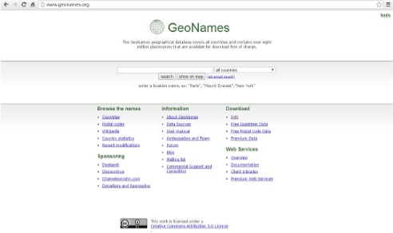

This interface is intended to aid users who wish only to look up information on a particular place; however, it is also possible to download all of the data for a particular country. In this practical, you will use the GeoNames ‘country file’ containing entries for the UK, **GB.txt**. This has already been downloaded to the DARIAH-GTA.zip file for you. Other country’s data is available by following the link to _Free Gazetteer Data_ under _Download_.

#### SUMMARIZED GUIDELINES FOR COMPLETING TUTORIAL

First, we will load the **Cole_other.csv** file into QGIS – this file already contains coordinates, so it is a straight-forward process to visualise this data in QGIS.

Next, we will take the **Wordsworth_Guide.txt** text excerpt and use a series of techniques to assign coordinates to the places referenced in the text. To do this, we will:

- Load **Wordsworth_Guide.txt** into Recogito.
- Use Recogito to annotate and assign coordinates to key place-names.
- Export our data from Recogito.
- Use other sources to locate coordinates for places unidentified within Recogito
- Convert our textual data into a GeoPackage.
- Edit and clean data within QGIS.
- Explore the GeoNames data and join it with our data.

#### STEP-BY-STEP INSTRUCTIONS

##### **1.	Georeferencing a table that contains coordinates**

The file **Cole_other.csv** is a Comma Separated Values file that contains places mentioned in Coleridge’s text together with some other information and, crucially, the latitude and longitude that the place names refer to. (It doesn’t matter whether these files are database tables, or text files such as csv or tab delimited, when you have information that has coordinates, loading it into QGIS, georeferencing it and saving it as a GeoPackage is easy.)

**a.	Check the file in Excel**

- Open Excel.
- Go to _File_ > _Open_, and then select _Browse_.

- When the dialog box appears, navigate to location where you saved the DARIAH-GTA folder earlier, and make sure to change the menu in the bottom right corner from _All Excel Files_ to _Text Files_ (see above).
- Click on **Cole_other.csv**.
- Press _Open_.
- Because this is a .csv file, a ‘Text Import Wizard’ will appear to guide you through opening this data in Excel. On Step 1, make sure that **Delimited** is selected under the ‘Original data type’, and that the ‘My data has headers’ box is ticked.

- Click _Next_ to proceed to Step 2, where you need to select your ‘Delimiters’: make sure **Comma** is selected. You can then click _Finish_ (leaving the defaults selected for Step 3).
- You should now see the contents of **Cole.csv** loaded in Excel. You will notice that the file contains two versions of place name. The first, **pl_name**, is the spelling from the text, the second, **st_name**, (meaning standardised name) is the spelling that appears in the gazetteer that was used to georeferenced this. The file also contains latitude and longitude, and a range of other data.
- When you are happy, close the file (you don’t need to save the file as we haven’t made any changes).

**b.	Opening files in QGIS**

- Open a new QGIS project and save it as GTA_Lakes.

  - **NOTE**: Make sure to keep saving your QGIS project regularly throughout the tutorial!
- All of the shapefiles we need are located in their own folder within the DARIAH-GTA folder we saved earlier. To open them, select the _Layer_ drop-down menu within QGIS, then _Add layer_ > _Add Vector Layer_

- This opens the ‘Data Source Manager’ – click the three small dots next to ‘Vector Dataset’ and navigate to the DARIAH-GTA folder you downloaded earlier, locate the **QGIS-Shapefiles.zip** file within the folder and click to _Open_ this file.

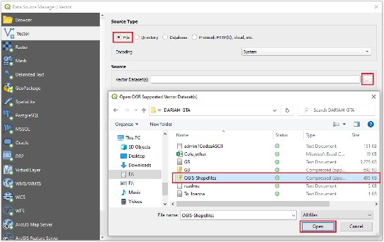

- Click _Add_ within the Data Source Manager. QGIS will then ask you which Layers you would like to add. **Select all** those that appear within the ‘QGIS-Shapefiles’ folder, as follows: (**Coast.shp**; **Lake_Cnty.shp**; **Lakes.shp**; **Lakes_towns.shp**; **Main_Roads.shp**)

- Click **OK**, and then close the Data Source Manager. All 5 of these layers should appear in your list of Layers at the bottom-left of your screen. You can close the Data Source Manager, and you should see something similar to the below:
- **NOTE**: If you wish, you can alter the appearance of your layers by double-clicking on the symbol in the ‘Layers’ list, or right-clicking on your layer, then selecting ‘Properties’.

**c. Creating a georeferenced file**

- We can now start loading our other data. Once again, select _Layer > Add Layer_ from the drop-down menu. This time, though, we will use **Add delimited text layer**.
- Navigate again to the DARIAH-GTA folder and open the **Cole_other.csv** file.

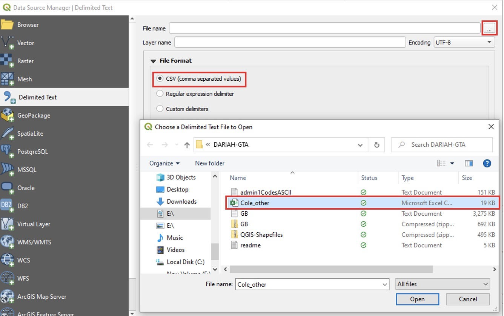

- You will then see the following options. QGIS will not allow you to load the data until you have selected a **CRS (Coordinate Reference System)**

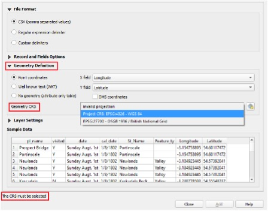

- Click on **Geometry Definition** to expand this section. You will see that QGIS should, by default, have assigned the ‘X field’ to **Longitude** and ‘Y field’ to **Latitude**. Double check that this is the case. Then, select the **Geometry CRS** drop-down menu. QGIS should have already detected a Coordinate Reference System from the shapefiles we previously added, so you can select **Project CRS: EPSG:4326 – WGS 84**. Once this is selected, click _Add_ to add these layers to your project.
- You will now see a series of extra points appear on your map. You can right-click on **Cole_other** in the list of layers at the bottom left, then select **Open Attribute Table** to see your data table within QGIS.

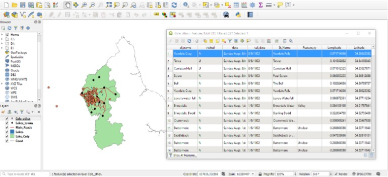

##### **2.  Georeferencing data that does not contain coordinates**

The file **Wordsworth_Guide.txt** is an excerpt taken from Wordsworth’s _A Guide through the District of the Lakes in the North of England_. The file contains the text from the first chapter ‘Directions and Information for the Tourist’. We are going to use **Recogito**, a free online annotation tool for texts and images, to identify and extract the place-names within.

**a.	Upload a text into Recogito**

- Open your web browser and go to the following URL: \[recogito.pelagios.org]. If you haven’t already, create an account now.
- When you are logged into Recogito, click on _New_, then select _File Upload_. You can then navigate to the DARIAH-GTA folder we have been working in and select **Wordsworth_Guide.txt**. You should now see the text we’ll be working with, as follows:

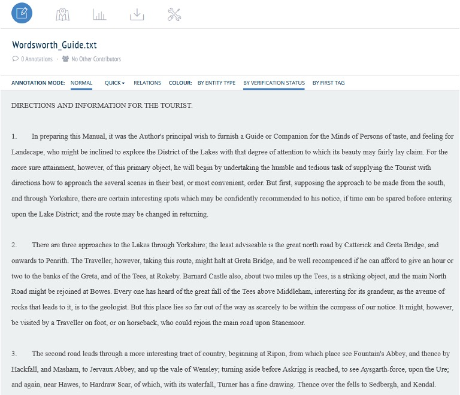

- As you can probably guess, this chapter excerpt contains lots of place-names for the Lake District and surrounding area. We are going to annotate these places within Recogito, and then extract this data for use in QGIS. Recogito also has an in-built gazetteer (which draws on various different sources, including GeoNames), which we can use to assign coordinates to the more well-known or obvious locations.

**b. Annotating in Recogito**

- Because we are only interested in annotating ‘place-names’ within our text, you can select the **QUICK** drop-down menu at the top, then select **Places**. This means that all of our annotations will automatically be classed as ‘places’ (so we won’t have to manually select ‘place’ each time we create an annotation).

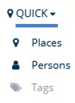

- For our first annotation, find Penrith at the beginning of the second paragraph. Click and drag with your left mouse button (or simply double-click over Penrith) The following pop-up will appear:

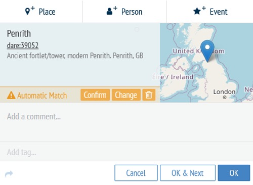

- Using its pre-loaded gazetteers, Recogito has identified an **Automatic Match** for Penrith. In this case, the automatic match is correct, so we can click **Confirm**. Make sure you then click **OK** to ‘save’ the annotation (otherwise, it will disappear!)
- Recogito uses multiple gazetteers, so the first ‘Automatic Match’ may not always be correct, or it may not be able to identify any match at all. To see what this looks like, annotate **Rokeby** (a few lines after Penrith)

- In this case, our annotation has mistakenly been identified as Rokeby, Australia. We can change this easily by clicking Change, then selecting Rokeby, United Kingdom:

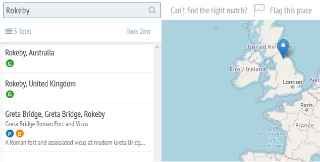

- When you have selected it, make sure you click **OK** on your annotation to save it.
- Whenever you create an annotation in Recogito, it will automatically search the rest of your text to see if there are any repeat occurrences. If so, you can re-apply your annotation. Find **Kendal** (at the end of the third paragraph) and annotate it. When prompted, click **YES** to apply your current annotation to future occurrences.

- The automatic match for Kendal may be incorrect, so make sure to change it to Kendal, England (as you did with Rokeby). When you have confirmed the place, Recogito will ask if you want to re-apply this change to future annotations. Select **YES**.

- Now that we have annotated a few places, click on the **Map View** at the top of the screen. You will be able to see that all three places now appear on our map. Furthermore, because Kendal appears three times in our text, it appears as a slightly larger ‘dot’ on our map to reflect its frequency in the text.

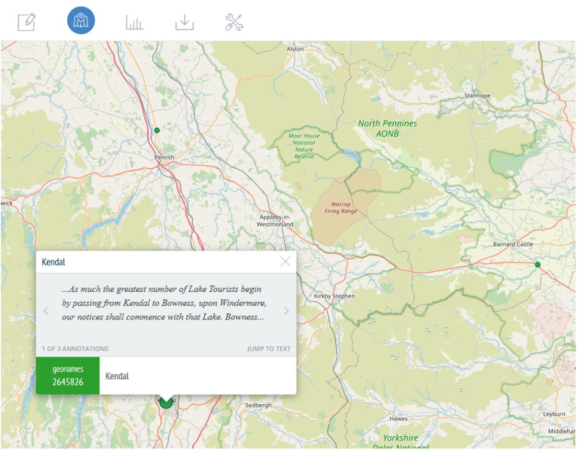

- When you have explored the **Map View**, return to the **Document View**.
- We will now annotate a place-name that is unlikely to retrieve an automatic match. Annotate **Hardraw Scar**. In this case, the text refers to a limestone gorge and a waterfall, both of which share the name ‘Hardraw’. This name does not appear in any of Recogito’s existing gazetteers. We still want to annotate this place though, as we are interested in any place-name with a geographic reference. We can assign coordinates to places like this at a later stage. For now, click the **small flag** to mark this place as unidentified.

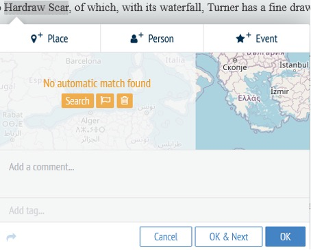

- Continue annotating place-names within the text until you have **at least 10** more **unique** place-names. Try to include a range of both **identified and unidentified** places as demonstrated above.

**c. Exporting data from Recogito**

- When you are happy with your annotations, check the Map View within Recogito to see how many places you have successfully georeferenced. You have likely identified quite a few places, but with some unidentified locations missing from the map. We will update these values manually outside of Recogito in the next step.
- First, we need to export our data from Recogito. Select **Download Options** from the top menu.

- Click to download the **.csv** file and save it on your computer. Name it **Wordsworth-Recogito**.

##### **3.Updating values and correcting errors**

We will now explore the process of making manual additions to our data, starting with locating coordinates using Google Maps and adding this to our Wordsworth-Recogito .csv file _before_ we load it within QGIS.

**a. Getting coordinates from a different source**

- Open the **Wordsworth-Recogito.csv** file in Excel, following the same process for opening a .csv that we used earlier.
- Familiarise yourself with the column headings (you may need to expand column widths to view the full text). The columns we are particularly interested in are **QUOTE_TRANSCRIPTION** (the extracted text from each annotation we made within Recogito), **LAT** and **LNG** (latitude and longitude coordinates), and **VERIFICATION_STATUS** (detailing whether we ‘verified’ the location within Recogito).

- Locate the row that contains annotation data for ‘Hardraw Scar’ (one of the first places we annotated within Recogito). You will notice that it does not have any latitude or longitude coordinates, and has been flagged as _‘Not Identifiable’_. We will now add data to this entry manually.
- You might remember that ‘Hardraw Scar’ is a geographic place-name for a limestone gorge (with the text also making reference to a waterfall named ‘Hardraw Force’), and it did not appear in any of Recogito’s gazetteers We therefore ‘flagged’ the place-name as **Not Identifiable**. We will now add coordinates to this place-name manually, using Google Maps.
- In a web browser go to: [http://maps.google.com](http://maps.google.com).
- Type “Hardraw Scar” into the search box in the top-left corner (do not use the auto complete options that appear). Click ‘search’ or press ‘return’ on your keyboard.
- You will be zoomed in to a point as shown below - you may want to zoom out to check that you are in approximately the right location.

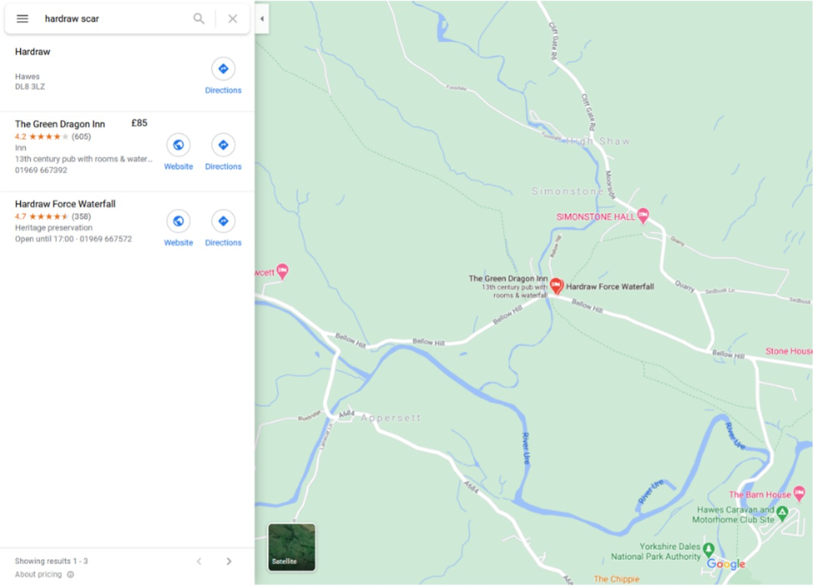

- You may notice that Google Maps, too, does not directly refer to ‘Hardraw Scar’
- This is one of the key challenges with disambiguating potentially more ambiguous places such as this. Where exactly should you place a precise ‘point’ to refer to a feature that may not be so precise? The same question can apply to large urban areas: should the point be at its geographic centre, or its commercial/social ‘city centre’? It is important to take these kinds of question into consideration when making decisions such as these, as your decisions may have consequences for your data further down the line.
- In this case, it is reasonable for us to equate Hardraw Scar with the Hardraw Force waterfall. To retrieve the coordinates, right click on the place-marker for Hardraw Force Waterfall on Google Maps. A sub-menu will appear, with the coordinates shown at the top.

  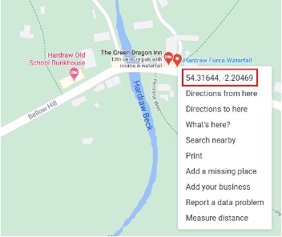
- Left click on the coordinates shown. This automatically copies the coordinates to your ‘clipboard’. Return to Excel and right-click (or Ctrl V on your keyboard) to paste the latitude and longitude coordinates into the respective LAT and LNG columns in your Wordsworth-Guide .csv.

We could then continue to update the values for all of our unidentified locations, but for the purposes of this tutorial, we will only add Hardraw Scar.

- Make sure you **save your changes** to the Wordsworth-Recogito.csv file.

We will now load this .csv into QGIS, using the same method from earlier in the tutorial.

- Return to your QGIS project and select **Layer > Add Layer >Add delimited text layer** from the drop-down menus at the top. Locate the .csv file we just downloaded and updated (Wordsworth-Recogito.csv), and follow the same procedure as in Step 1c. Make sure ‘X field’ is set to LNG (longitude) and ‘Y field’ to LAT (latitude)
- Depending on which places you successfully located within Recogito, you should see something similar to the map below, with Wordsworth’s places shown here in light blue:

  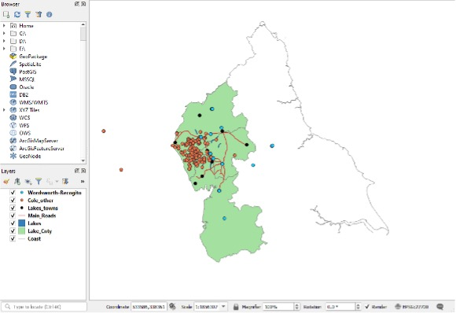
- It is likely that most of your annotations within Recogito were ‘unidentified’ places and, therefore, not all of your annotated places appear within QGIS. You can open the attribute table for your Wordsworth-Recogito layer to check this.

This means that we still have a number of places for which we do not have coordinates. We have already manually added coordinates to Hardraw Scar using Google Maps, but what if we want to make a change to our data now that we are working in QGIS? To do this, we need to transform **Wordsworth-Recogito** into a ‘GeoPackage’ (this is an open format file for GIS software, equivalent to a shapefile).

**b. Exporting data to a GeoPackage.**

Currently, **Wordsworth-Recogito** it is still just a .csv file, simply visualised as ‘vector’ data within QGIS. This means that it has limited functionality compared to a GeoPackage. We can change the symbology and open the attribute table, for example, but we will not be able to make any meaningful changes to it. We will transform this .csv into a GeoPackage now.

- Right-click on the Wordsworth-Recogito layer in your list of layers, and select **Export > Save Features As…**

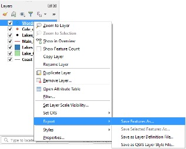

- Make sure the selected format is **GeoPackage**, then select the three dots next to ‘File name’ to choose where to save this new file on your computer, name it **Wordsworth-Recogito-GPKG**. Leave all the other settings as they are, and select **OK** when ready.
- You will now see another layer added to your map. It may look the same as the previous Wordsworth-Recogito.csv, but we can now do a lot more with this file.

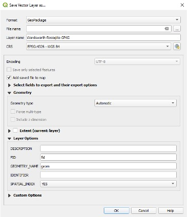

- To avoid any confusion, you can remove the previous Wordsworth-Recogito layer by right-clicking it in your Layers list and selecting Remove Layer.

**c. Editing point data with QGIS**\
Now that we can edit our data within QGIS, we are going to experiment with adding coordinates to one of our locations that currently has no ‘geometry’ within QGIS: i.e. those places in ‘Wordsworth-Recogito-GPKG’ that do not have coordinates.
To do this, we will use the **Advanced Digitizing Toolbar**. We need to open this toolbar by right clicking anywhere in the toolbars located at the top of your QGIS window, then ticking the ‘Advanced Digitizing Toolbar’ option. This can also be accessed by clicking V**iew > Toolbars > Advanced Digitizing Toolbar**.

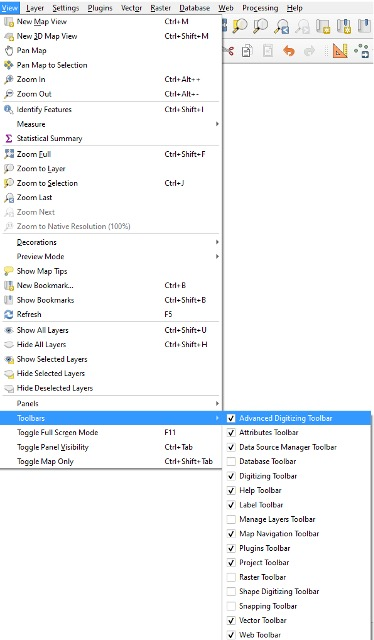

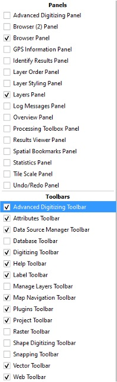

- Open the attribute table for your ‘Wordsworth-Recogito-GPKG’ layer. Left-click on the QUOTE_TRANSRIPTION column header to sort this data alphabetically by place-name. **Locate a place that does not have coordinates** (check the LAT and LONG columns). If it is a place with duplicate entries, don’t worry, just pick one ‘row’ or feature to work with for the next steps.
- Now left click on the pencil icon at the top left of the attribute table to **Toggle Editing**

  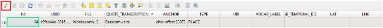

  - QGIS stores its geometry data separately from the attribute table that we are working with. This means that we cannot simply add our coordinates into the LAT/LONG columns in our attribute table. Instead, we are going to use the **Add Part** feature in order to create a geometry for a place that currently has no geometry.
  - Within the ‘Wordsworth-Recogito-GPKG’ attribute table, left-click on the row header for your chosen place-name (i.e. the Feature id, not the ‘fid’ column) and make sure that this highlights the entire row, as shown in red below:

    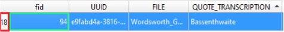
- Now that you have selected this feature, locate the **Add Part** icon in the Advanced Digitizing Toolbar that we opened earlier.

  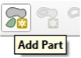
- Left-click on **Add Part**, and then left-click again anywhere on the map. This will immediately create a point for your selected feature, assigning it the coordinates of wherever you clicked your mouse.
- Now that we have attached a ‘geometry’ to our feature, we can **edit** this geometry and input our correct coordinates.
- Find the **Vertex Tool**, located in the editing toolbar towards the top of the screen. Left-click to select. This will allow us to edit the vertices of our layer – in this case, our points.

- Navigate to the point on your map that you just created, then hover over the point with your mouse and **right-click** on it. This opens the **Vertex Editor** at the bottom left of your screen, showing the point’s coordinate data.
- Using Google Maps again, as we did in Step 3a, search for your chosen location. When you have located it, copy the coordinates. Now open Notepad (or any text editor) and right-click to paste these coordinates there **before** inputting them into QGIS. \
  This is because the fields in QGIS’ attribute table will only allow you to paste a single coordinate value (e.g. 54.6676) and cannot accept the full coordinate with both x and y (e.g. 54.6676, -3.2269).
- Now that you have pasted the coordinates, copy the latitude and longitude coordinates one at a time and paste them into the ‘x’ and ‘y’ columns in the Vertex Editor.

  
- You will notice that your layer will immediately update, moving the point to your new coordinates.
- Now make sure you click the Save Layer Edits button at the top of your screen when you are done:

  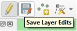
- You can now click the **Toggle Editing** icon to turn editing off. If you haven’t already saved your edits, QGIS will ask you if you want to save before turning editing off.

You now know how to edit coordinate data once it is within QGIS. You can use this same process, by using the Vertex Tool, to make changes to places with existing coordinates. For example, if we made a mistake within Recogito, accidentally georeferencing the wrong place (e.g. if we had confirmed Rokeby, Australia rather than Rokeby, UK in the first example), we could update these coordinates within QGIS using the Vertex Editor.

**d. Cleaning data in QGIS**\
Now imagine that we have assigned geometries and coordinates to all of our unidentified places (for the purposes of this tutorial, we won’t go through all of them). You may have already noticed that the attribute table for **Wordsworth-Recogito-GPKG** contains many duplicate entries for the same place (e.g. there are multiple rows with instances of Lake Windermere). Left-click on the QUOTE_TRANSRIPTION column header (to sort data alphabetically) to check this. These duplicates represent each individual instance of the annotation within our text. For visualising this data within GIS, however, we need it is more useful to remove these duplicates, cleaning our data. We will walk through this process now.

- To start manipulating our data, we need to open the **Processing Toolbox** in QGIS. To do this, you can select **Processing > Toolbox** from the drop-down menu at the top, or you can click on the ‘gear’ icon highlighted in red below:

  

  - The **Processing Toolbox** contains all of the tools available within QGIS to perform various data analyses.
  - When the Processing Toolbox appears on your screen, search for ‘duplicate’ in the ‘search’ bar. Double-click with the left mouse button to open the **Remove duplicate points** tool.

    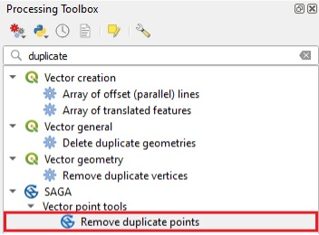
  - When the **Remove Duplicate Points** window opens, select your ‘Wordsworth-Recogito-GPKG’ layer for the **Points** option, then select ‘QUOTE_TRANSCRIPTION’ for the **Attribute** option. This tells the tool to search this column from our table to identify any duplicates.
  - Make sure to save this new layer to your computer, calling it **Wordsworth-Recogito-Points**. Leave all the other options as they are, and click **Run** when ready.

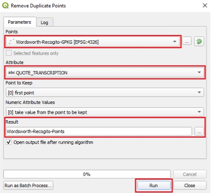

- When this new layer is added to your map, right-click to open its **Attribute Table**. You will now see the same table with far fewer entries, no duplicate locations, and an extra column (‘Duplicates’) that tells you how many duplicate values each unique location had (e.g. in the example below, there were 17 instances of the ‘Ambleside’ annotation, which are now all represented by a single point on our map).

You may have noticed that any of your features that did not have geometries (no attached coordinates) have also now been removed from your dataset and no longer appear in the attribute table. This is fine for the purposes of this tutorial, but think about the consequences of removing all places that you were unable to locate – what implications might this have for any future analysis/users of your data?

##### **4. Understanding Gazetteers**

For our last steps, we are going to take a look at the gazetteer data from GeoNames, one of the largest gazetteers used within Recogito. Most of the places you successfully georeferenced within Recogito back in step 2 were likely matched with data from the GeoNames gazetteer (you can check this by looking at the URI column in your attribute table – this contains the **Uniform Resource Identifier**, which tells us where the coordinates came from when annotating in Recogito).

It is helpful to understand how large datasets such as these are organised, so that we can manage this data (and our own creations) accordingly. We can then use this larger dataset to augment our own.

Within the DARIAH-GTA.zip file you downloaded earlier, you will find the **readme.txt** file. This was downloaded from the GeoNames site and is useful to understand both the content and structure of the gazetteer data file. Open the **readme.txt** file using WordPad (to do this, right click on the file in Windows Explorer, and select **Open with > WordPad**). You should see something like this:

Take a quick look through the entire file. The important points are:\
1. The table contains tab-delimited data:

2. The field names in the main ‘geoname’ table are listed:

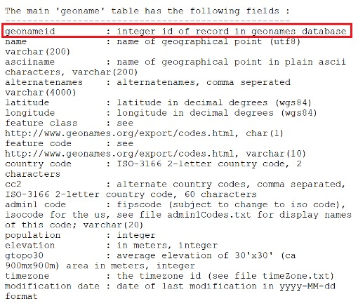

The “main ‘geoname’ table” referred to is in fact the gazetteer file for Britain, **GB.txt**, that has already been downloaded for you. Other points to note here are as follows:

- Each row refers to a field of information (see above). For example, ‘geonameid’ is the heading for the first field.
- In addition to the field heading, the information after the colon (:) provides some additional metadata about the content of the field. Thus, we are told that the entries in the ‘geonameid’ field are integer (numerical) identifiers.
- You will see that there are 19 separate fields in the gazetteer file. The most important ones are:

  - Three fields that contain place names (‘name’ is the basic one ‘ascii name’ and ‘alternatenames’ given varients on this)
  - Coordinate information (‘latitude’ and ‘longitude’)

Finally, note that latitude/longitude information is recorded as decimal degrees (WGS84).\
Leave this file open in the Wordpad window, while we take a look at the gazetteer file.

**a.	Explore the GeoNames data file**

Use Excel to open the file **GB.txt** using the techniques we learned in step 1. This time, it is a text file that is delimited using tabs, so make sure that you select **Tab** as the delimiter in step 2 of the Import Wizard (as shown below).

Once it is opened it should look similar to below. You may want to widen some of the columns to get rid of the “###” effect and reveal the data.

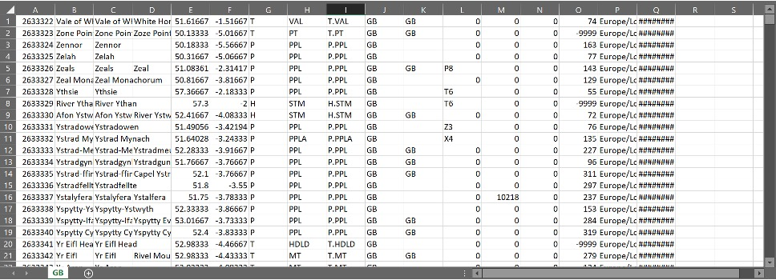

There are two things to notice. First, this file does not contain column headings, so you will need to add these as described below. Second, the file contains a lot of fields that you may not want – effectively everything after latitude, so from column G (“Feature Class” according to the metadata) onwards.

Although it is not essential, it saves time to delete many of these unneeded fields. To do this, highlight the fields by clicking on the heading for column G and dragging across to column Q. All of these columns should be highlighted. Now right-click on the column heading and click **Delete** on the menu that appears.

You now need to add a row containing column headings:

- You will first need to insert a new top row into the Excel file. Do this by highlighting the top row, right clicking, and clicking _Insert_.

  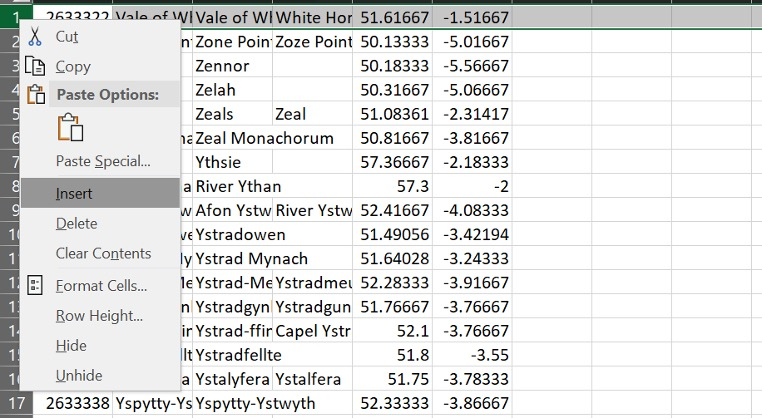

  - _Either_: Type the column names into cells A1, B1, etc. by hand.
  - _Or_: Copy each of the column headings from **readme.txt** and paste them into the appropriate column as shown below. Make sure you don’t include any extra ‘spaces’ at the start or end of the text in each cell.
  - If you did not delete the data after the coordinates you will also note that the field before _Country Code_ (which is a combination of _feature code_ and _feature class_) is undocumented. Give it whatever name you want.

  Field names in QGIS:

  1. QGIS (and GIS software in general) is not good at handling field names that contain certain characters, such as spaces. In the present case, this means that it would have difficulty in reading, for example, ‘field class’ (if you have not deleted it) as the title for one field. The easiest way to deal with this issue is to edit field names containing spaces, to remove the spaces – so, for example, ‘field class’ would be edited to ‘field_class’ or ‘fieldclass’. You also need to be careful that there are no spaces at the start or the end of the field name and that the field name does not start with a number or piece of punctuation.
  2. Similarly, QGIS does not like long field names. It may be worth shortening the fields to less than 10 characters. For example, ‘alternatenames’ might be better truncated to ‘altnames’.

  - Finally, save the file as a text file by clicking _Save As_ and selecting _Text (Tab delimited)_. Call the file **GB_Gaz.**
  - Close the file in Excel.

    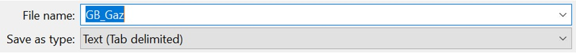

    **b. Load GeoNames data into QGIS and use it to update Wordsworth-Recogito.**
  - As in step 1c, you can add this new text file to QGIS by selecting **Layer > Add Layer >Add delimited text layer** and locating the **GB_Gaz file**. This time, however, we need to tell QGIS that this is a **tab delimited file** (rather than comma delimited). To do this, simply select **Custom Delimiters** under the File Format section, then select **Tab**. Click to add this data when you’re ready.

    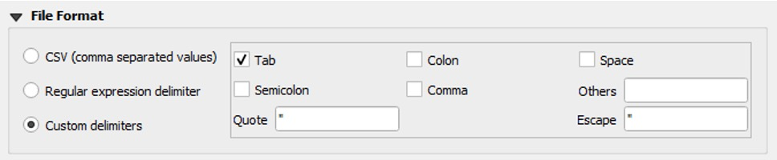

    - You should now be able to see all of the places from within the GeoNames file visualized within QGIS, covering all of Great Britain.

      

      - The vast majority of these places are not needed for our purposes, however. We can join our **Wordsworth-Recogito-Points** data to GeoNames’ **GB_Gaz** to create a new layer that combines this data.

        - First, open the **Processing Toolbox** again (as we did in Step 3c) This time, type ‘join’ into the search box and locate **Join attributes by field value** (under the ‘Vector general’ heading). Double-click on this.

          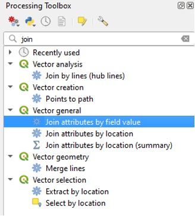

          - This will open the ‘Join Attributes by Field Value’ dialogue box. For **Input layer**, select **Wordsworth-Recogito-Points**, with the **Table field** as **QUOTE_TRANSCRIPTION** (this selects the column within Wordsworth-Recogito that contains the annotation you created within Recogito). For **Input layer 2**, select **GB_Gaz**, with **Table field 2** as **name**.

            - This tells the _Join Attributes_ tool to search both of these columns from each layer. It then extracts data from the second input layer whenever it encounters an exact match. This data is appended to our first input layer, to create a new layer that contains attributes from both our inputs.

            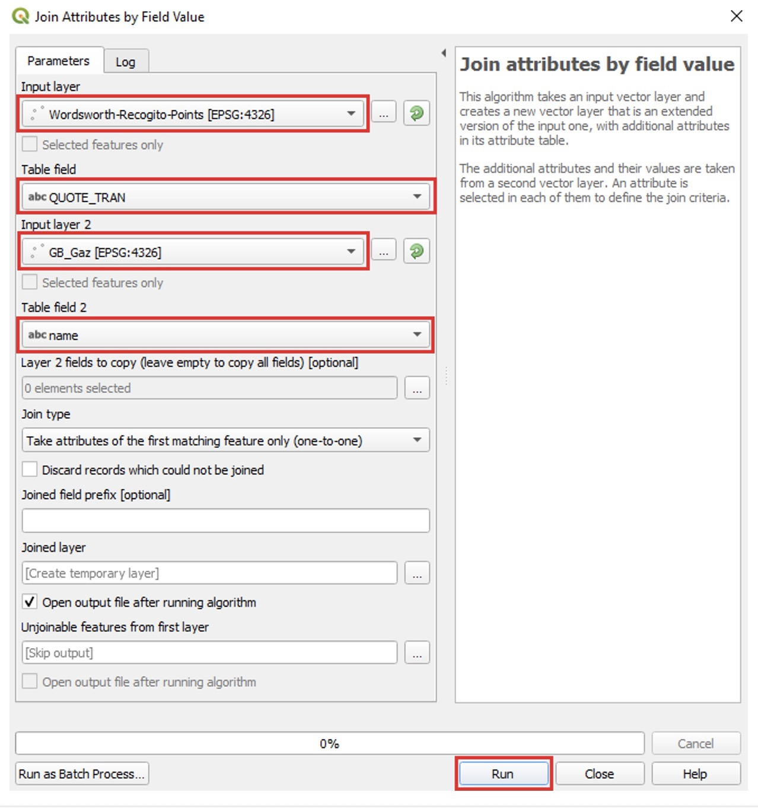
          - Leave all the other settings as they are, then click **Run**.
             Because we didn’t choose where to save this result, it will only exist as a **temporary file.** If you wished to save this layer after clicking ‘Run’, you can save it as a GeoPackage using the same technique we learned in step 3b.
          - This will add a new layer to your QGIS project called **‘Joined layer’**. As you might expect, this produces a point layer that (most likely) shows exactly the same locations that you were able to georeference within Recogito (mirroring your **Wordsworth-Recogito** layer). You can see this is the case on the example image to the right, with the larger red dots showing the **Joined layer**, and the lighter blue dots showing the **Wordsworth-Recogito** layer.

            - This is because the ‘Join’ that we just ran within QGIS essentially ran the same process that was working in the background when we annotated places in Recogito (searching for matching place-names), therefore producing the same results.

              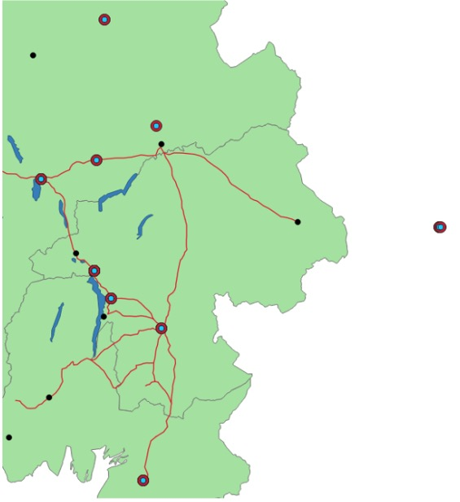

Whilst this hasn’t allowed us to locate any previously unassigned places in this instance, it has joined our two tables together, bringing additional information from GeoNames, such as the **alternativenames** column. Compare the differences yourself by opening the attribute tables for each layer, as shown below. (You can also ‘hide’ columns in your attribute table by right-clicking on the column headers and selecting **Hide**).

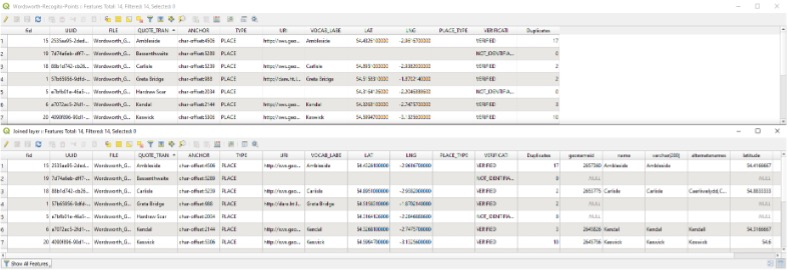

**Note:** it is also useful to notice that the ‘QUOTE_TRANSCRIPTION’ column from our Recogito data retains the place-name spelling as it appeared in our original source material. It is important to maintain this data, alongside the ‘normalised’ spellings that appear in gazetteers such as GeoNames. This allows users of your data (including yourself!) to keep track of any differences/alterations.

### FURTHER WORK AND THINGS TO CONSIDER

1. Compare the locations of the places named in Wordsworth-Guide with any locations of the same place name from Cole_other. Are these always the same? What might account for the differences? Might this have implications for analysis?
2. Consider what types of research question you could ask/answer with your Wordsworth and Cole datasets. What other spatial information might you need to answer more complex questions? How would you account for any places that you were unable to locate, and are therefore missing from your GIS dataset?
3. See if you can add an entirely new feature to any of your GeoPackage layers and populate its fields in the attribute table. Hint: this requires using the Digitizing Toolbars that we used in Step 3c.
4. Look back at the attribute table for the ‘Joined layer’ you created in the final step (the join of ‘Wordsworth-Recogito-Points’ and ‘GB_Gaz’). There are a lot of columns in this dataset now – what might the implications of this be? Would the column headings be understandable to someone else using your data?
5. Experiment with creating an attractive/functional map of your data by altering the symbology of each layer (accessed by double-clicking on the symbol in the ‘Layers’ list, or right-clicking on your layer, then ‘Properties’)

## RECAP

If you have a spreadsheet/.csv file that includes coordinates, loading it into QGIS is straightforward:

- Select **Layer > Add Layer > Add delimited text layer** to add the file into QGIS.
- Remember that this only visualises your data within QGIS, we would need to convert this file to a GeoPackage in order to make edits to it.
  If you have a text excerpt that you want to extract place-names from, you can use Recogito to both extract the place-name itself and assign coordinates to it using Recogito’s built-in gazetteers.
- Upload your text into **Recogito**.
- **Identify** and **annotate** place-names within Recogito, using the built-in gazetteers to **assign coordinates** to places where possible.
- When ready, **export your data** from Recogito in **.csv format**.
  If there are any places you were unable to identify within Recogito, or if you accidentally assign the wrong coordinates, you can fix these errors using various methods:

  - Before loading your exported **.csv** file from Recogito into QGIS, you can use other sources (e.g. Google Maps) to locate coordinates and manually add them to your .csv using Microsoft Excel.
  - You can load your .csv file into QGIS and convert it to a **GeoPackage**, enabling you to edit your data in various ways. To make any edits to your layers in QGIS, you first need to **Toggle Editing** to allow changes.
  - The **Add Part** feature of the **Advanced Digitizing Toolbar** allows you to add geometries to features in your data that did not have coordinates when you first loaded them into QGIS. You can then modify the coordinates of this feature using the **Vertex Tool**.
  - You can use the **Remove Duplicate Points** tool (located within the **Processing Toolbox**) to clean your dataset, which in this case included duplicate entries of place-names (reflecting the frequency of their occurrence within the original text).

It is also important to understand the structure of any datasets we might use – in this case, we looked closely at the GeoNames data file before we joined it with our own data:

- Once loaded in QGIS, you can use the **Join attributes by field value** tool to join two separate datasets by shared attributes.
