## Introduction

Getting access to the data on GitLab is different on all three operating systems. This post shows how to use the code editor VS Code with its graphical user interface for working collaboratively in Git with Windows, Mac and Linux.

## Learning Outcomes

After completing this learning resource, you will be able to:

- use code editor VS Code for working collaboratively in Git with Windows, Mac and Linux
- track changes in VS Code
- clone and push a remote repository from the code editor

<SideNote type="note">
  Before you can start using a code editor to work with Git repositories, please make sure that you install the following prerequisites:

  1. Git ([Git for Windows](https://gitforwindows.org), for other OS see the respective documentation)
  2. [Visual Studio Code](https://code.visualstudio.com/)
</SideNote>

## Starting our Editor with Add-Ons: Visual Studio Code

VS Code is an example for code editors. Using the command line or terminal instead has the same results. However, in a code editor, you can work in a graphical user interface.

<Tabs>
  <Tab title="Windows">
    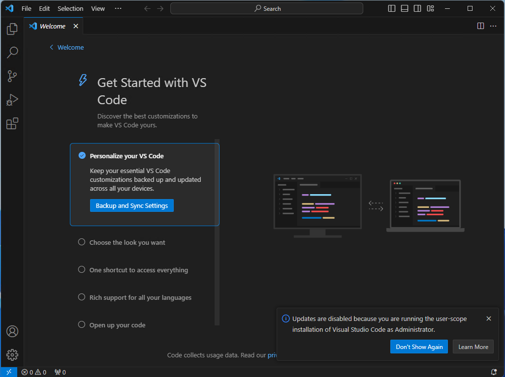
  </Tab>

  <Tab title="MacOS">
    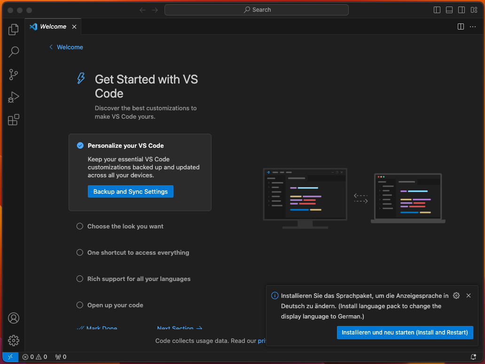
  </Tab>

  <Tab title="Linux">
    TBD
  </Tab>
</Tabs>

### Working with Git in the Editor

#### Cloning a Repository and Getting Data

For example we want to clone `teapot` from [https://github.com/acdh-oeaw/howto_trainingmaterials](https://github.com/acdh-oeaw/howto_trainingmaterials). The data at this location, in this repository, is marked as public. So you do not need to log into the Oeaw GitHub, but you need to be logged into your GitHub account that you set up to see the contents.

On the top right there is a `Clone` button which, when clicked, gives you two options `HTTPS` and `GitHub CLI`. We need the HTTPS option. On the right there is a copy to the clipboard button we can use.

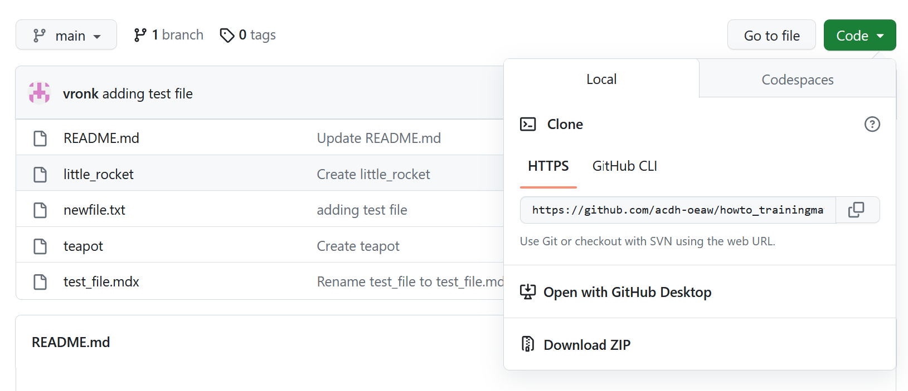

<SideNote type="note">
  Getting access to the data on [https://github.com/acdh-oeaw](https://github.com/acdh-oeaw) is different on all three operating systems.
</SideNote>

<SideNote type="note">
  <Tabs>
    <Tab title="Windows">
      You can paste the `https://...` of any Git repository from a server in the text field that appears when we click `Clone Git repository...` on the start screen of Visual Studio Code.

      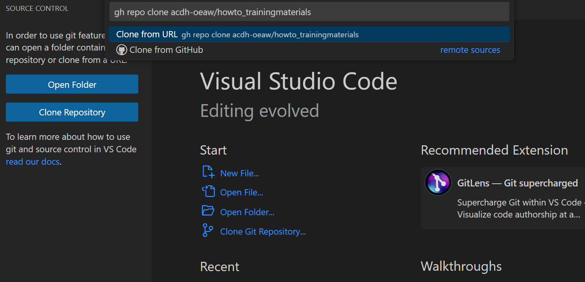

      After you hit enter a dialog appears asking you where to store the contents of the repository locally:

      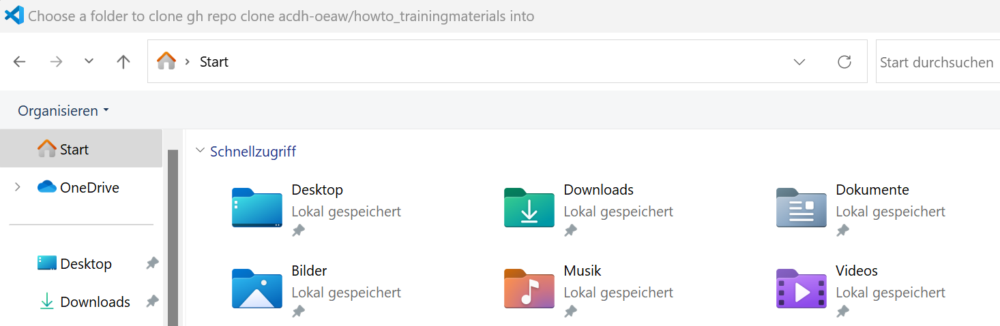
    </Tab>

    <Tab title="MacOS">
      You can paste the `https://...` of any Git repository from a server in the text field that appears when we click `Clone Git repository...` on the start screen of Visual Studio Code:

      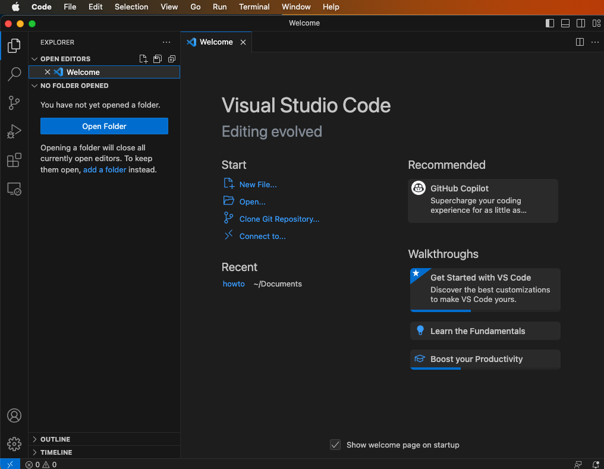

      On MacOS Visual Studio Code asks us for our username and password when we try to clone the repository the first time.

      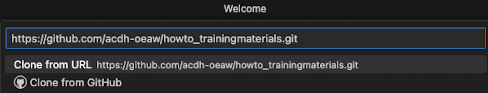

      These are passed to Git and Git saves them in the "keychain" which also for example *Safari* uses to save credentials.
    </Tab>

    <Tab title="Linux">
      On Linux Visual Studio Code asks us for our username and password when we try to clone the repository for the first time.

      If git-credential-libsecret is installed the username and password will be stored and Visual Studio Code will not ask us in the future. If it is not installed we have to type the password again next time we interact with the repository on the gilab server.
    </Tab>
  </Tabs>
</SideNote>

<SideNote type="tip">
  <Tabs>
    <Tab title="Public repository">
      For our public training materials repository like any other public repository this is all you need to do.
    </Tab>

    <Tab title="Private repository">
      <Tabs>
        <Tab title="Windows">
          If you happen to work with a private GitHub repository you will need to authenticate.

          The very first time for each web site like GitLab and GitHub in Windows, a dialog will open that asks us for user name and password.

          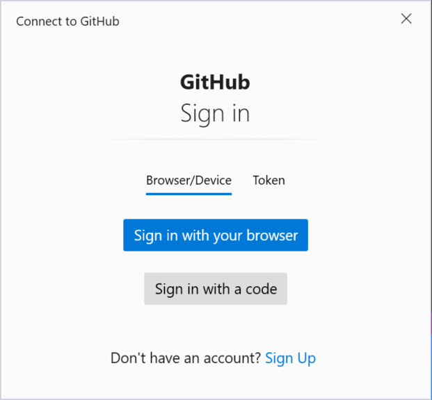

          We recommend to `Sign in with your browser`. A browser window will open for you to log in to GitHub. Once you're successfully authenticated, you can close the browser window.

          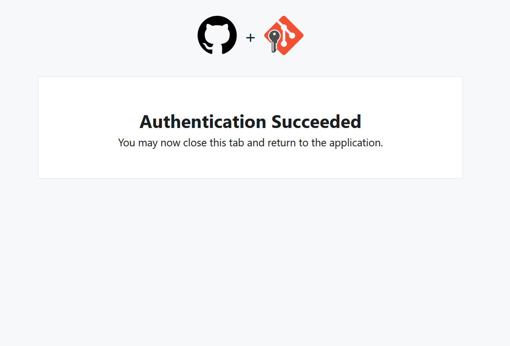
        </Tab>

        <Tab title="MacOS">
          If you happen to work with a private GitHub repository you will need to authenticate. Visual Studio Code will ask you if you want to sign in with GitHub:

          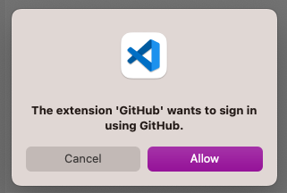

          This will open a dialog screen on GitHub.com:

          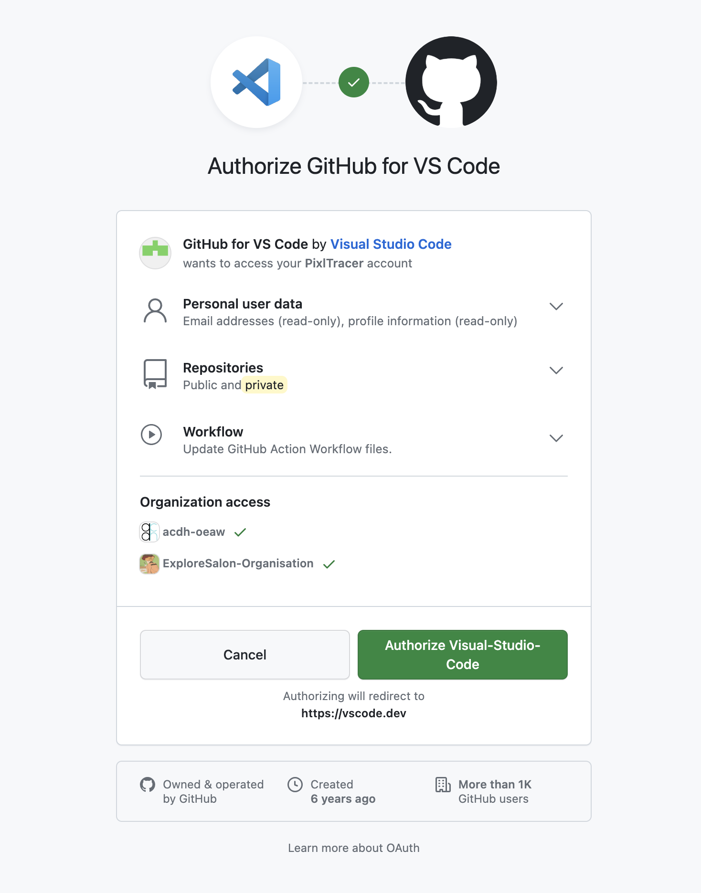

          After providing your password the browser asks if it may communicate with Visual Studio Code. Please allow that:

          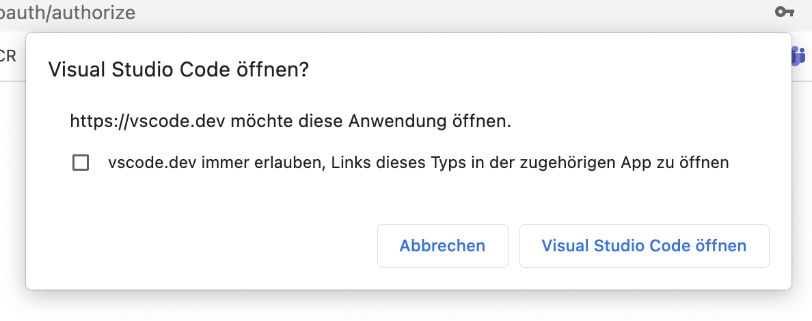

          And also Visual Studio Code asks if it may accept the message from the browser. Please allow that too:

          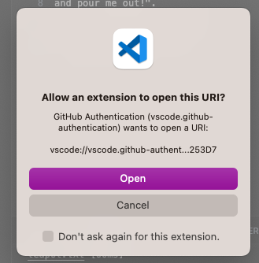
        </Tab>
      </Tabs>
    </Tab>
  </Tabs>
</SideNote>

At the end there is a little dialog in the bottom right corner, click open there:

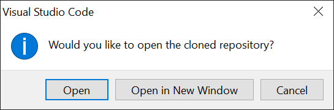

Because Visual Studio Code is a development environment where developers can execute code they just downloaded from somewhere on the internet, Visual Studio Code asks if we trust the current repository. Therefore, choose to "trust" the repository that you downloaded from a team you know.

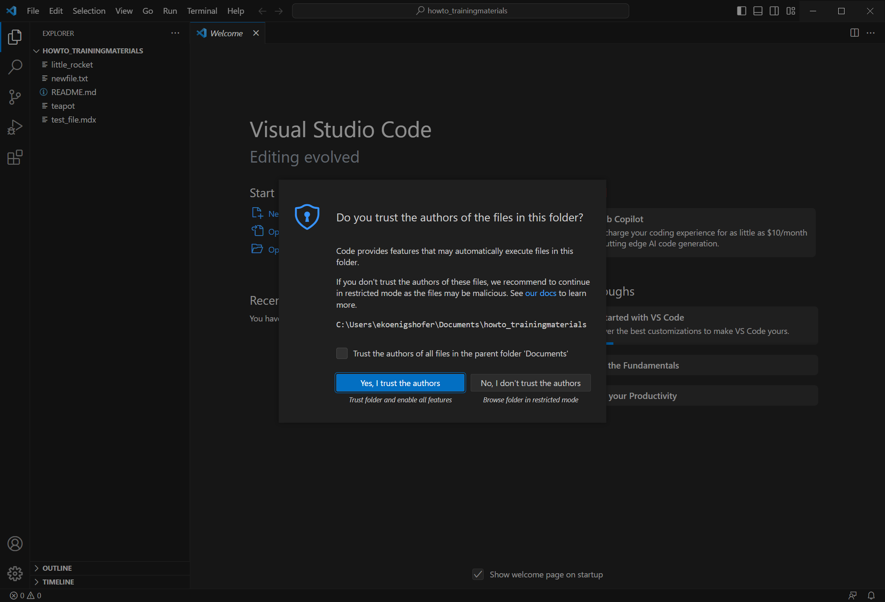

See our Git collaboration guide to learn more about [cloning a remote repository](/resource/posts/git-collaboration#cloning-a-remote-repository).

### Tracking Changes

Git is very helpful in tracking changes in a project.

Git can record which changes, to which documents, have been made when, and by whom. It allows to keep a detailed revision history of a project, because it can **save snapshots** - the **commits** - of a project at specific points in time, thus being open to review any time in the future.

Version control allows to save versions of content, restore previous versions, and compare different versions. This is especially beneficial when working with multiple documents, and when working in teams of more than one (potentially working on the same document).

Before uploading any changes, you want to track them locally. After cloning the howto_trainingmaterials, let's open the `teapot.txt` in Visual Studio Code. This is done while the uppermost icon on the left is selected (the two sheets, files).

We want to change something so we replace every `I` with `you` in the lyrics and add the line `You drink tea every day` at the end. Save this file version.

Now we can select the third mode from the top (three connected circles, the graph changes and branches make up in version control).

This only lists those files that we changed since we last made our changes permanent, committed (to) them. The `teapot.txt` is listed. If we click on it we get the following view:

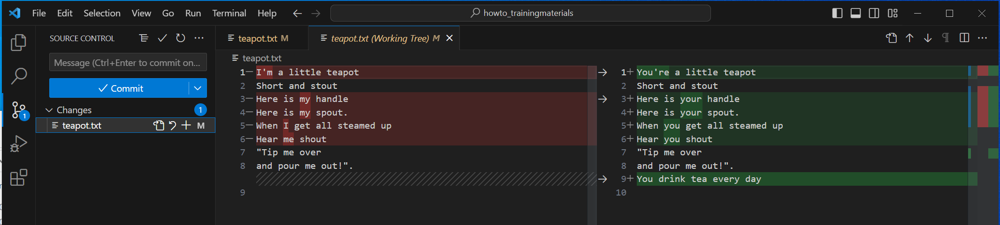

If we are not 100% sure about the changes we will now **stage**, that is prepare to be **committed**, we can open each file and see the differences per line. This might also give us a hint what we did if the last **commit** was a while back and we don't remember exactly why we changed the files.

### Mark Content Changes to be Included in the Version History

Let's tell Git that we are committed to our changes in the document `teapot.txt`:

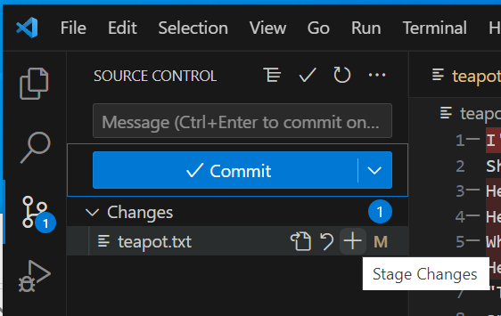

We put changes in the **staging area**, before we commit.

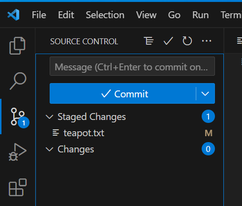

<SideNote type="note" title="Adding multiple files">
  We can add multiple files by selecting the names as usual using shift or ctrl or command and then hit the `+`.
</SideNote>

See our Git version control via command line guide to learn more about [adding files](/resource/posts/git-version-control-via-command-line#mark-content-changes-to-be-included-in-the-version-history).

### Bundle Changes into Meaningful Chunks and commit to Them

Including content changes in Git's version history involves a two-step process. First, related changes are added to create semantically meaningful units of changes. These changes wait in the staging area but it needs an extra step to propagate these changes and feed them into the documents.
Keep that in mind.

When all related changes have been added to the "staging area", we can save them together as a current snapshot of our data, a **commit**, with a **commit message** that briefly describes _why_ changes were made. This makes it easier to understand them later when viewing the version history. **Committing** means permanently recording a snapshot of contents at a specific point in time. In VS Code you use the `commit` button.

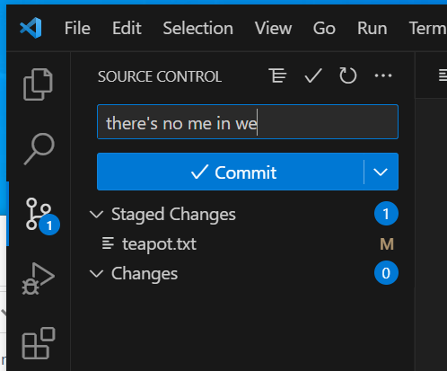

<SideNote type="note" title="Commit messages">
  Whether on the command line or in an editor, choose to write meaningful commit messages. This helps your work process when revisiting your changes.
</SideNote>

#### The Very First Commit Error

If you are on a new machine and/or just installed Git you will get an error. Here is how it looks:

<Tabs>
  <Tab title="Windows">
    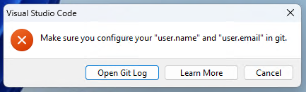
  </Tab>

  <Tab title="MacOS">
    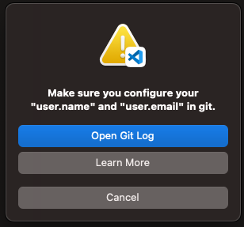
  </Tab>

  <Tab title="Linux">
    TBD
  </Tab>
</Tabs>

Whether you use `Learn More` or `Open Git log`, you will eventually see that Git just wants to know who commits here. We suggest to use `Open Git log` which shows a new set of controls at the bottom right.

<SideNote type="note" title="The tell me who you are - message">
  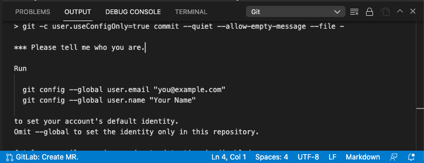

  Text for copying:

```text
*** Please tell me who you are.

Run

  git config --global user.email "you@example.com"
  git config --global user.name "Your Name"

to set your account's default identity.
```
</SideNote>

There is no graphical interface for this one time configuration. You need to copy the two suggested `git config` commands and fill in your own details and execute them in a terminal. Create a new text file with `File`->`New text file`, copy the above lines starting with `git config` and fill in your information. Use the Visual Studio Code tab `Terminal` at the bottom. Alternatively you can select "Terminal" and "New Terminal" from the menu bar.

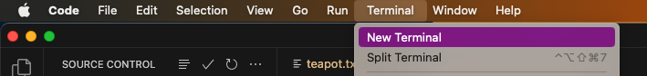

<SideNote type="note" title="Unfortunately this differs again between the three operating systems">
  <Tabs>
    <Tab title="Windows">
      ### Windows

      Unfortunately when you click on "Terminal" now you get a terminal that does not know `git` (yet). If you want to set your e-mail and name you need to click on the `V` next to the `+` next to `powershell`. This will open a `Git bash`.

      
    </Tab>

    <Tab title="MacOS">
      ### MacOS

      Only on MacOS as a first time user you are asked to configure your shell a little. You can either
      skip that or maybe look at the defaults and use them. The keys you need to type are listed.

      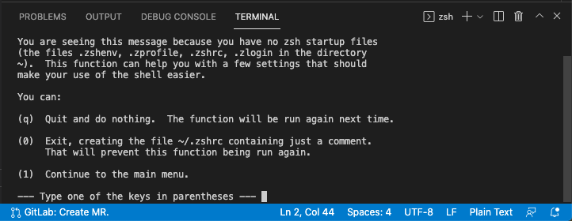
    </Tab>

    <Tab title="Linux">
      ### Linux

      This is the only OS where you can just type the two commands.
    </Tab>
  </Tabs>
</SideNote>

See our Git version control via command line guide to learn more about [bundle changes into meaningful chunks and commit to them](/resource/posts/git-version-control-via-command-line#bundle-changes-into-meaningful-chunks).

### Keeping repositories in sync: fetch, pull, push

To get our changes to the server, so other people in our team can fetch them to review or amend them, we now `push` what we `committed` on our machine to the server.

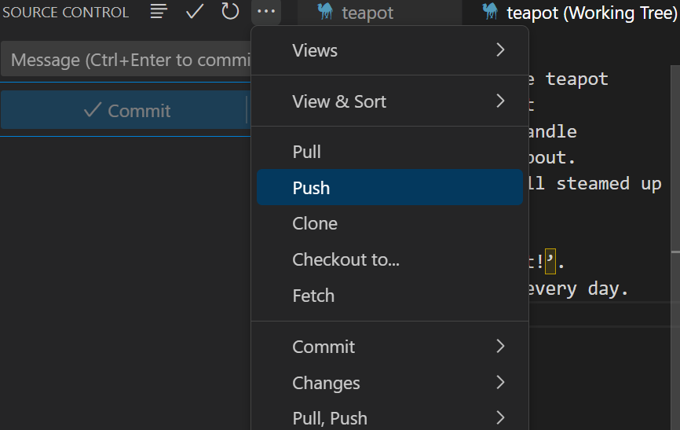

<SideNote type="note">
  <Tabs>
    <Tab title="Windows">
      When you push your first commit, GitHub will ask you to authenticate.

      

      We recommend to `Sign in with your browser`. A browser window will open for you to log in to GitHub. Once you're successfully authenticated, you can close the browser window.

      
    </Tab>

    <Tab title="MacOS">
      When you push your first commit, Visual Studio Code will ask you if you want to sign in with GitHub:

      

      This will open a dialog screen on GitHub.com:

      

      After providing your password the browser asks if it may communicate with Visual Studio Code. Please allow that:

      

      And also Visual Studio Code asks if it may accept the message from the browser. Please allow that too:

      
    </Tab>
  </Tabs>
</SideNote>

The opposite action is to `pull` from the server. This means getting all the changes accumulated there and integrating them (merging them with our local changes if any) in the files we see locally.

If we just want to download all change not integrating them at the same time we `fetch` from the server.

### Merging and Conflict Resolution

What happens if two people edit the same file? Well it depends:

1. If two people edit different lines in the file, then the changes can be `merged` automatically. That is a good solution in most cases and it saves a lot of time.
2. If two people edit the same line, then there is a `conflict` that needs to be `resolved.`

Conflicts are marked with these distinct lines:

```bash
<<<<<<<< ...
One change
--------
The other change
>>>>>>>> ...
```

Note that Visual Studio Code provides us with a few controls we can click to resolve the conflict.

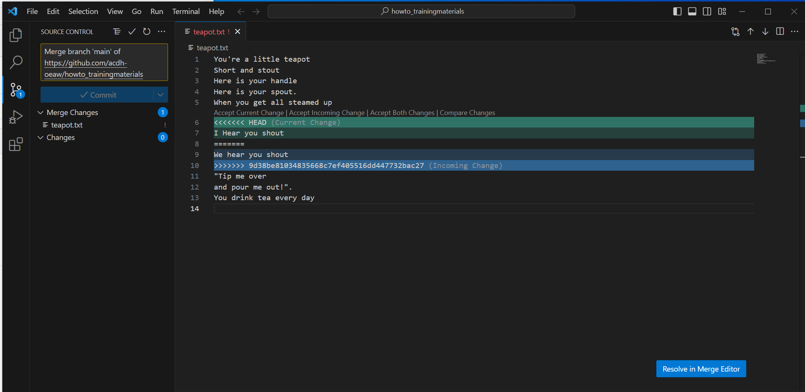

We now can decide which is the better change (or use both if applicable). Visual Studio Code shows you different options in a three-way-editor:

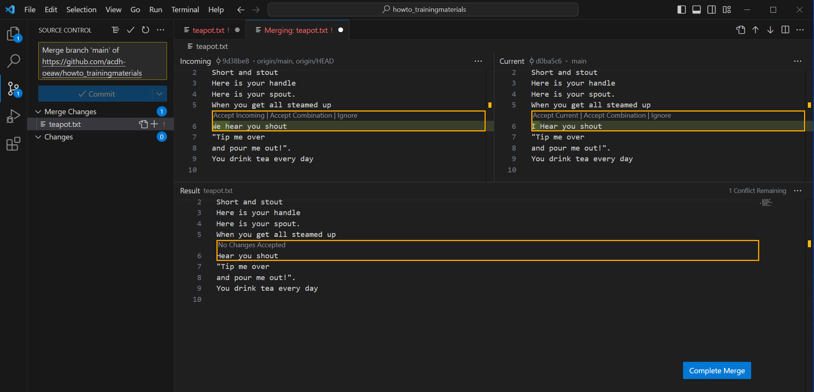

And for example, accept the incoming change.

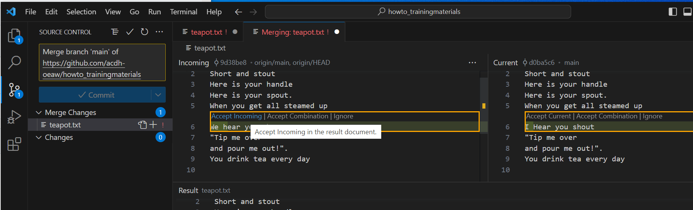

And after resolving **all** the conflicts we do a `merge commit` (the text is there automatically).

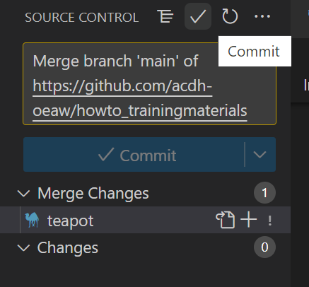

<SideNote type="danger" title="Resolve all conflicts">
  **Never** commit before resolving all conflicts, removing all conflict markers. You will make the maker lines permanent. They are made like this to break any programming language and XML.
</SideNote>

### Training Task

Open your code editor. Clone the repository [https://github.com/acdh-oeaw/howto_trainingmaterials](https://github.com/acdh-oeaw/howto_trainingmaterials) to your local work station. We used it in the **Git collaboration** - resource too.

Inspect the repository by checking its status, and **pull** all changes that have been created in the meantime. If you do this exercise on your own, there might be no changes - still, it's best practice to pull regularly.

Navigate to the test-file.mdx and open it. In it, you will find several sentences talking about **a particular breed** of dogs. Replace the current breed with another of your choosing and move all those new sentences to the very end of the document. Save your actions and commit them with a meaningful message.

Perform `git push`.

## Conclusion

VS Code provides a user-friendly interface for collaborating with Git across Windows, Mac, and Linux. By using this code editor, you can easily track changes, clone repositories, and push updates, streamlining the workflow for cross-platform collaboration. This makes managing version control accessible and efficient, enhancing teamwork and productivity in any development environment.

## End note

This resource was originally published to the ACDH-CH 'HowTo' internal training platform on 5th November 2023. The publication date of this present resource reflects the date it was migrated to DARIAH-Campus.
