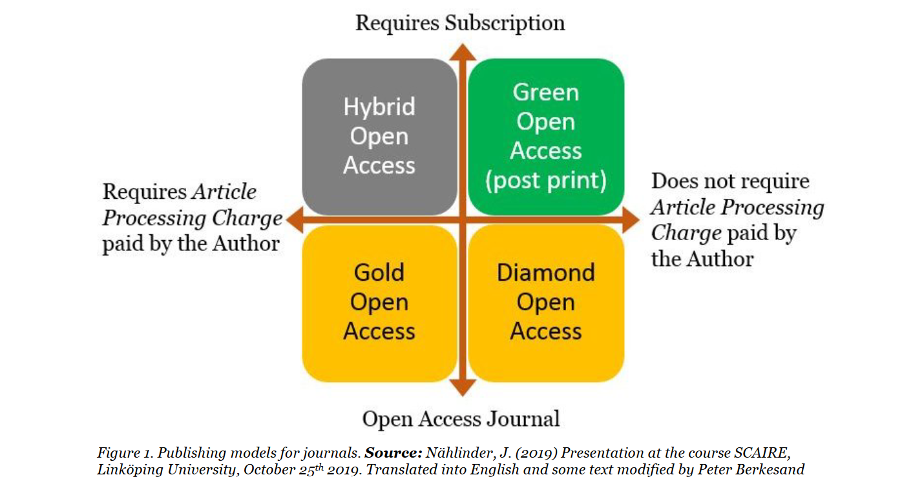

Open Access movement is quite complex because it has many elements and criteria, so an historical approach may enable you understand better the origins, shapes and objectives of the movement. Then, progressing through the milestones and pioneers of Open Access will show you how is structured the movement from both a political and economical perspective. Exploring the Open Access policy and strategy at an international level will give you keys to analise and decode Open Access framework from an international perspective.

## Learning outcomes

After completing this short lesson learners will:

- understand the historical context of Open Access movement (pioneers and milestones)
- identify the different Open Access models and their terminology and concepts
- understand Open Access policies & strategies (international framework)
- be able to apply best Open Access practices to their own research

## Historical context

### The large commercial publishers era (1950-1980): Knowledge clubs and commons

Between 1950 and 1980, the new model of large commercial publishers came to dominate numerous fields of scientific publishing in Western countries.

The small society presses, struggling to cope with a growing scale, where supported and then largely supplanted the 'Big 5' commercial presses: Elsevier, Wiley, Springer, Taylor & Francis and Sage. These newly empowered players brought an industrial approach to the publication and dissemination process. 

And we consider today that these commercial publishers represent 40% of global scientific publishing market and Elsevier is the first one of these publishers with 16% of the market.

### The foundations of Open Access (1990-2000)

This period is characterised with two origins. First one, the consequence of the unprecedented access afforded by online publishing and by Internet possibilities. And the second one, the reaction against the large corporate model that has come to dominate scientific publishing and the hyperinflation of subscription prices!

Since 2000, some specialised free software for scientific publishing are appearing, like [Open Journal Systems](https://en.wikipedia.org/wiki/Open_Journal_Systems) (OJS). They enable significant expansion of non-commercial Open Access journals facilitating the creation and administration of journal websites. 

During this period, many journals online are growing, as digital conversion of existing journals.

In addition, in the [Directory of Access Journal](https://doaj.org/) (DOAJ) the total number of online journals (without APC - Article Processing Charges) have increased from 100 to 800. 

_The concept "Article Processing Charges” corresponds to fees that an institution or an author must pay to publish; it's related to the Gold Open Access business model._ 

### Open Access Commons (2003-2012)

The distinctions between commercial and non-commercial forms of scientific publishing and community-driven or corporate-owned structures seldom appear, due to the lack of a viable business model for Open Access. 

Within Open Access, we recognise two important pioneers: **Stephen Harnad** and **Peter Seber**. Stephen Harnad is historically recognised as the founder of Open Access. He is a Canadian cognitive scientist based in Montreal and he created one of the first online archive: CogPrints (1997).

**Harnad** proposed a new classification scheme: 

> Articles directly made available by the publisher belong to "gold" open access and online archives are defined as "green" open access. 

There is no distinction between commercial and non-commercial publishers. 

**Peter Suber** is a philosopher specialised in the philosophy of law and Open Access to knowledge, Director of the Harvard Office for Scholarly Communication and Director of the Harvard Open Access Project (HOAP). 

> The "gold" model embraces both journals supported by APCs or by other means of funding, as well as volunteer-run journals.

### Diamond model (2012 - ...)

In 2012, a new model arrived, called **Diamond Open Access.**

**Marie Farge** is an important figure because she has created this Diamond Open Access concept that differs from the commercial and business model of Gold Open Access. 

> I have proposed to call this third way 'Diamond OA' by outbidding the 'Gold OA' terminology chosen by the publishers

Marie Farge is a French mathematician and physicist. She is also an Open Access activist and was involved in the Cost of Knowledge campaign led by **Timothy Gowers** against the excessive cost of scientific publishing.

You can also see that **Sandoval**, just after Marie Farge, published one of the first systematic definitions of Diamond Open access. It is a quite complete definition:

> Free of charge for readers and authors and does not allow commercial and for-profit re-use.

2013, **Fuchs and Sandoval** published one of the first systematic definition of diamond open access (2013):

> Diamond open access Model, not-for-profit, non-commercial organisations, associations or networks publish material that is made available online in digital format, is free of charge for readers and authors and does not allow commercial and for-profit re-use. 

### Open Access Diamond Study (2021)

The ["Diamond study”](https://www.coalition-s.org/diamond-unearthed-shining-light-on-community-driven-open-access-publishing/) was commissioned by cOAlition S in 2020 and published in 2021. It gives us some characteristics of this model, an overview of the Diamond open access landscape and helps identify the gaps and bottlenecks.

From this study, we can highlight the **collaborative dimension, bibliodiversity and multilingualism**, as important goals to achieve. OA Diamond Study gives an estimation of more than 29.000 Diamond OA journals in 2021, they make up for 73% of the OA journals registered on the DOAJ.

**Findings:**

- A wide archipelago of relatively small journals serving diverse communities
- OA diamond journals are on the road to full compliance with Plan S
- A mix of scientific strengths and operational challenges
- An economy that largely depends on volunteers, universities and government

The conclusion of the study calls for the realisation of the **OA Commons** as:

> a diverse, thriving, innovative and more interconnected and collaborative OA diamond journal ecosystem that supports bibliodiversity and serves many languages, cultures and domains in the future.

### Costs and international distribution of Diamond Open Access

In relative terms the Diamond study focuses on the fact that the Diamond model is especially prevalent in Latin America, with 95% of open access journals registered in the DOAJ while we have 81% in DOAJ for Eastern Europe.

The journals in this region are mostly supported by academic and public platforms as **REDALYC** or **SciELO** rather than APC model and based publishers. These platforms give a lot of power to the Latin American scientific publishing stakeholders and environment.

Arianna Becerril-García director of Redalyc:

> The Latin American region, as a result, owns an ecosystem characterised by the fact that "publishing" is conceived as acts of "making public", of "sharing", rather than the activity of a profit-driven publishing industry (…) Latin American academic journals are led, owned, and financed by academic institutions.

### Preservation issues

The lack of preservation mechanism for non-APC open access journals has been framed as a "tragedy of the commons".

57% of the journals state that:

>  to the best of their knowledge, they have no preservation policy in place.

Efforts are underway to solve this issue such as Project JASPER which is a project underway between the Directory of Open Access Journals, CLOCKSS, the Internet Archive, the KEEPERS Registry, and PKP-PN.

## Identification of Open Access routes

The four different publishing models are described in this diagram.

You can observe in the exterior of the diagram the economic aspect. You have “subscription” or “fees” on one way, and “free of charge” on the other way.

An **hybrid journal** is a subscription-based journal with a paid Open Access option. You must pay twice if we sum up the idea.

Another essential element to take into consideration within these models is the legal framework: authors rights preserved or transferred to the publisher and the evaluation process. Evaluation process is also a main aspect of the four routes.

## Open Access strategy & policy, international framework

The 2021 UNESCO recommendation for Open Science calls for:

> supporting not-for-profit, academic and scientific community-driven publishing models as a common good.

Diamond open access journals have long been overlooked by scientific policies and funding mechanisms. The launch of the cOAlition S initiative in 2018 made the recognition issue of Diamond journals more pressing. 

In March 2022, an Action Plan for Diamond Open Access was published with the support of the cOAlition S, Science Europe, OPERAS and the French National Research Agency. It aims to **"expand a sustainable, community-driven Diamond scholarly communication ecosystem."** 

### The Position of DARIAH in this international landscape

[Towards a Plan(HS)S: DARIAH’s position on PlanS ](https://www.dariah.eu/2018/10/25/towards-a-planhss-dariahs-position-on-plans/)

DARIAH propose some changes to better integrate disciplinary traditions in European-level policy planning in general.

Green Open Access and Gold Open Access (with reasonable fee, but not by the author) have always been more appropriate options for the open and transparent dissemination of research results and adapted to SSH communities.

We suggest complementing Plan S by a 5-year open monograph strategy that is flexible enough to stay compliant with the different national policies. 

DARIAH encourages the value of APC-free such as consortium funding mechanisms (Freemium Open Edition).

Investing more into the development and professionalisation of small-scale Open Access publishing services (Episciences) but also creating new Open Access publishing venues to satisfy topical diversity is a key step in the transition towards Open Access.

## Visualisation of Open Access routes

## Test your knowledge

<Quiz />

<Quiz>
  <Quiz.Card>
    <Quiz.MultipleChoice>
      <Quiz.Question>
        Which criteria correspond to the Diamond Open Access model ?
      </Quiz.Question>

      <Quiz.MultipleChoice.Option isCorrect>
        Free to publish
      </Quiz.MultipleChoice.Option>

      <Quiz.MultipleChoice.Option>
        Articles require paid subscription to access/read
      </Quiz.MultipleChoice.Option>

      <Quiz.MultipleChoice.Option isCorrect>
        Institutionally supported journal
      </Quiz.MultipleChoice.Option>

      <Quiz.MultipleChoice.Option>
        Author accepted manuscript
      </Quiz.MultipleChoice.Option>

      <Quiz.MultipleChoice.Option isCorrect>
        Free to read
      </Quiz.MultipleChoice.Option>

      <Quiz.MultipleChoice.Option isCorrect>
        Community driven journals
      </Quiz.MultipleChoice.Option>

      <Quiz.Message type="incorrect">

      </Quiz.Message>
    </Quiz.MultipleChoice>
  </Quiz.Card>

  <Quiz.Card>
    <Quiz.MultipleChoice>
      <Quiz.Question>
        Which criteria correspond to the Green Open Access model ?
      </Quiz.Question>

      <Quiz.MultipleChoice.Option isCorrect>
        Author accepted manuscript
      </Quiz.MultipleChoice.Option>

      <Quiz.MultipleChoice.Option>
        Pay to publish in a fully OA journal
      </Quiz.MultipleChoice.Option>

      <Quiz.MultipleChoice.Option isCorrect>
        Free to publish
      </Quiz.MultipleChoice.Option>

      <Quiz.MultipleChoice.Option isCorrect>
        Open Repository / Preprint
      </Quiz.MultipleChoice.Option>

      <Quiz.MultipleChoice.Option isCorrect>
        Free to read
      </Quiz.MultipleChoice.Option>
    </Quiz.MultipleChoice>
  </Quiz.Card>

  <Quiz.Card>
    <Quiz.MultipleChoice>
      <Quiz.Question>
        Which criteria correspond to the Gold Open Access model ?
      </Quiz.Question>

      <Quiz.MultipleChoice.Option>
        Institutionally supported journal
      </Quiz.MultipleChoice.Option>

      <Quiz.MultipleChoice.Option isCorrect>
        Pay to publish in a fully OA journal
      </Quiz.MultipleChoice.Option>

      <Quiz.MultipleChoice.Option isCorrect>
        Free to read
      </Quiz.MultipleChoice.Option>

      <Quiz.MultipleChoice.Option>
        Articles require paid subscription to access/read
      </Quiz.MultipleChoice.Option>

      <Quiz.MultipleChoice.Option isCorrect>
        Publisher journals
      </Quiz.MultipleChoice.Option>
    </Quiz.MultipleChoice>
  </Quiz.Card>

  <Quiz.Card>
    <Quiz.MultipleChoice>
      <Quiz.Question>
        Which criteria correspond to the Hybrid Open Access model ?
      </Quiz.Question>

      <Quiz.MultipleChoice.Option isCorrect>
        Article is made free to read
      </Quiz.MultipleChoice.Option>

      <Quiz.MultipleChoice.Option>
        Institutionally supported journal
      </Quiz.MultipleChoice.Option>

      <Quiz.MultipleChoice.Option isCorrect>
        Pay APC to publish the article as OA
      </Quiz.MultipleChoice.Option>

      <Quiz.MultipleChoice.Option isCorrect>
        Articles require paid subscription to access/read
      </Quiz.MultipleChoice.Option>

      <Quiz.MultipleChoice.Option>
        Author accepted manuscript
      </Quiz.MultipleChoice.Option>
    </Quiz.MultipleChoice>
  </Quiz.Card>
</Quiz>

## Conclusion

Open Access throughout the history of scientific publishing has taken many shapes. Analysing the historical steps and the people who have embodied the Open Access movement are essential to understand the economic features and highlights of each publishing model and route. In addition to the chronological overview of Open Access routes, both the organisational level and international dimension are also crucial to have a good understanding of how the publishing models featuring. This resource could support or help the preparation of a training module or a strategical position to convince stakeholders at an institutional level.

<SideNote type="note" title="Download Slides to a Presentation">
This short course is based on a presentation that was delivered in 2023.  Users can access the full presentation with a transcript at this [link](https://hal.science/hal-04631333) in the HAL Open Archive. 
</SideNote>
