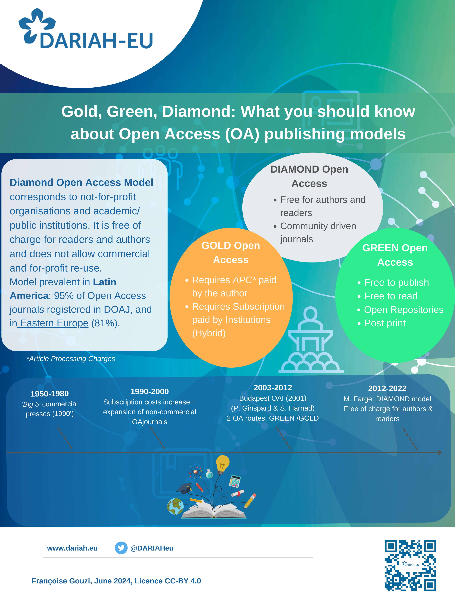

**Learning objectives:**

Historical context of Open Access movement

Open Access models' description

Terminology & concepts

Open Access policies & strategy (international framework)

Quiz

<Quiz />

<Quiz>
  <Quiz.Card>
    <Quiz.MultipleChoice>
      <Quiz.Question>
        Which criteria correspond to the Diamond Open Access model ?
      </Quiz.Question>

      <Quiz.MultipleChoice.Option isCorrect>
        Free to publish
      </Quiz.MultipleChoice.Option>

      <Quiz.MultipleChoice.Option>
        Articles require paid subscription to access/read
      </Quiz.MultipleChoice.Option>

      <Quiz.MultipleChoice.Option isCorrect>
        Institutionally supported journal
      </Quiz.MultipleChoice.Option>

      <Quiz.MultipleChoice.Option>
        Author accepted manuscript
      </Quiz.MultipleChoice.Option>

      <Quiz.MultipleChoice.Option isCorrect>
        Free to read
      </Quiz.MultipleChoice.Option>

      <Quiz.MultipleChoice.Option isCorrect>
        Community driven journals
      </Quiz.MultipleChoice.Option>

      <Quiz.Message type="incorrect">

      </Quiz.Message>
    </Quiz.MultipleChoice>
  </Quiz.Card>

  <Quiz.Card>
    <Quiz.MultipleChoice>
      <Quiz.Question>
        Which criteria correspond to the Green Open Access model ?
      </Quiz.Question>

      <Quiz.MultipleChoice.Option isCorrect>
        Author accepted manuscript
      </Quiz.MultipleChoice.Option>

      <Quiz.MultipleChoice.Option>
        Pay to publish in a fully OA journal
      </Quiz.MultipleChoice.Option>

      <Quiz.MultipleChoice.Option isCorrect>
        Free to publish
      </Quiz.MultipleChoice.Option>

      <Quiz.MultipleChoice.Option isCorrect>
        Open Repository / Preprint
      </Quiz.MultipleChoice.Option>

      <Quiz.MultipleChoice.Option isCorrect>
        Free to read
      </Quiz.MultipleChoice.Option>
    </Quiz.MultipleChoice>
  </Quiz.Card>

  <Quiz.Card>
    <Quiz.MultipleChoice>
      <Quiz.Question>
        Which criteria correspond to the Gold Open Access model ?
      </Quiz.Question>

      <Quiz.MultipleChoice.Option>
        Institutionally supported journal
      </Quiz.MultipleChoice.Option>

      <Quiz.MultipleChoice.Option isCorrect>
        Pay to publish in a fully OA journal
      </Quiz.MultipleChoice.Option>

      <Quiz.MultipleChoice.Option isCorrect>
        Free to read
      </Quiz.MultipleChoice.Option>

      <Quiz.MultipleChoice.Option>
        Articles require paid subscription to access/read
      </Quiz.MultipleChoice.Option>

      <Quiz.MultipleChoice.Option isCorrect>
        Publisher journals
      </Quiz.MultipleChoice.Option>
    </Quiz.MultipleChoice>
  </Quiz.Card>

  <Quiz.Card>
    <Quiz.MultipleChoice>
      <Quiz.Question>
        Which criteria correspond to the Hybrid Open Access model ?
      </Quiz.Question>

      <Quiz.MultipleChoice.Option isCorrect>
        Article is made free to read
      </Quiz.MultipleChoice.Option>

      <Quiz.MultipleChoice.Option>
        Institutionally supported journal
      </Quiz.MultipleChoice.Option>

      <Quiz.MultipleChoice.Option isCorrect>
        Pay APC to publish the article as OA
      </Quiz.MultipleChoice.Option>

      <Quiz.MultipleChoice.Option isCorrect>
        Articles require paid subscription to access/read
      </Quiz.MultipleChoice.Option>

      <Quiz.MultipleChoice.Option>
        Institutionally supported journal
      </Quiz.MultipleChoice.Option>
    </Quiz.MultipleChoice>
  </Quiz.Card>
</Quiz>
