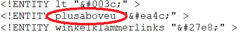

## Introduction

### Publish your dictionary data with Publex!

Publex is a software that allows anyone to publish his/her dictionary data annotated in XML. You can define the display of your dictionary individually.
For this, you do not need to be a professional. The application is very simple, as the program and the user instructions guide you through the entire process.
Moreover, no installation is required. Publex is accessed and operated via the web browser, and the data is stored and published on the Elexis server.

### Three steps to the publication of your dictionary:

**1.	Upload + Metadata**

Upload your XML dictionary data and provide the associated metadata.

Start [here](#creating-a-new-dictionary-and-importing-data).

**2. Configuration**

Specify the layout of your dictionary by defining formatting rules for the XML elements.

Learn about it [here](#define-your-styling-rules).

**3.	Publication**

Publish the dictionary on the Elexis server. It will have its own URL.

Learn about it [here](#publication).

## Let's get started

### Creating an account

To start with Publex directly, you first need to create a profile. For this, click on the register button on the \[link to publex page]. A form will open where you can enter your login credentials. Before completing the registration, you have to accept the terms of use and the privacy policy. Click the register button to complete the process.

### Login

If you already have a user account, you can log in to the home page with your registered e-mail address and your password. 

### Logout

Within Publex, you can log out of your profile at any time using the logout icon in the top menu bar.

### Forgot your password?

Click "Forgot Password" in the login form and you will be asked to enter the e-mail address you are registered with. Then you will receive an e-mail with instructions on how to create a new password.

### Changing your password and e-mail adress

Logged in to your account in the upper menu bar, the profile button takes you to the profile management, where you can change your account-related data such as your e-mail address and your password.

## Creating a new dictionary and importing data

### First: Preparing the data

#### 1. Data requirements

##### a) Dictionary entries

- The files are required to be provided in **valid XML**.
- Please make sure that every dictionary text you want to be printed is annotated as a text node. **Dictionary texts should not be encoded as an attribute value**.
- In case of large dictionaries, the files for the dictionary entries should be split into several files. The individual files should **not** be **larger than 16 MB**.

##### b) Use of non-unicode characters

If your dictionary contains special characters which are not available in the Unicode standard, it is possible to **use** our **self-defined entities of the [KompLett font](https://tcdh.uni-trier.de/en/projekt/komplett)**. To do this, proceed as follows:

1. Check in this overview \[link to table with name, code position, image to follow] whether your special characters are contained in the allEntities file.

Every entry in the allEntities file is structered as follows: the declaration of a new entry `<!ENTITY` followed by the name, the Unicode `position` (or position in the private used area) and a closing `>`.

Here you can see an example with the special character "u with superscripted plus":

2. If you want to use a specific entity from the allEntities file, replace the corresponding special character in the XML file with `&entity name;` (entity name = "plusaboveu" in the following example).

And this is how the character is finally displayed using the KomplettFont:

