This course introduces the legacy dictionary viewer Publex, a generic, modular dictionary publication tool for retrodigitized dictionaries.

## Learning Outcomes

After using this resource you should:

- decide whether a dictionary fulfills the requirements to be published with Publex
- configure the display of their dictionary in Publex
- use Publex to make a dictionary available in open access

## Introduction

### Publish your dictionary data with Publex!

Publex is a software that allows anyone to publish his/her dictionary data annotated in XML. You can define the display of your dictionary individually. For this, you do not need to be a professional. The application is very simple, as the program and the user instructions guide you through the entire process. Moreover, no installation is required. Publex is accessed and operated via the web browser, and the data is stored and published on the Elexis server.

### Three steps to the publication of your dictionary

**1. Upload + Metadata**

Upload your XML dictionary data and provide the associated metadata.

Start [here](#creating-a-new-dictionary-and-importing-data).

**2. Configuration**

Specify the layout of your dictionary by defining formatting rules for the XML elements.

Learn about it [here](#define-your-styling-rules).

**3. Publication**

Publish the dictionary on the Elexis server. It will have its own URL.

Learn about it [here](#publication).

## Let's get started

### Creating an account

To start with Publex directly, you first need to create a profile. For this, click on the register button under the login form on the publex page. A form will open where you can enter your login credentials. Before completing the registration, you have to accept the terms of use and the privacy policy. Click the register button to complete the process.

### Login

If you already have a user account, you can log in to the home page with your registered e-mail address and your password.

### Logout

Within Publex, you can log out of your profile at any time using the logout icon in the top menu bar.

### Forgot your password?

Click "Forgot Password" in the login form and you will be asked to enter the e-mail address you are registered with. Then you will receive an e-mail with instructions on how to create a new password.

### Changing your password and e-mail adress

Logged in to your account in the upper menu bar, the profile button takes you to the profile management, where you can change your account-related data such as your e-mail address and your password.

## Creating a new dictionary and importing data

### First: Preparing the data

#### 1. Data requirements

##### Dictionary entries

- The files are required to be provided in **valid XML**.
- Please make sure that every dictionary text you want to be printed is annotated as a text node. **Dictionary texts should not be encoded as an attribute value**.
- In case of large dictionaries, the files for the dictionary entries should be split into several files. The individual files should **not** be **larger than 16 MB**.

##### Use of non-unicode characters

If your dictionary contains special characters which are not available in the Unicode standard, it is possible to **use** our **self-defined entities of the [KompLett font](https://tcdh.uni-trier.de/en/projekt/komplett)**. To do this, proceed as follows:

1. Check in this overview \[link to table with name, code position, image to follow] whether your special characters are contained in the allEntities file. 

Every entry in the allEntities file is structured as follows: the declaration of a new entry `<!ENTITY` followed by the name, the Unicode position (or position in the private used area) and a closing `>`.

Here you can see an example with the special character “u with superscripted plus”:

2. If you want to use a specific entity from the allEntities file, replace the corresponding special character in the XML file with `&entity name;` (entity name = “plusaboveu” in the following example).

And this is how the character is finally displayed using the KomplettFont:

3. Next, download the allEntities file \[here] (link to follow). It must be uploaded with the dictionary files during import. How this works, you will find out [here](#import). To display the special characters in the published dictionary, it is necessary to select the KompLett font in the configuration. Details can be found in [this section](#define-your-styling-rules).

<SideNote type="note">
You _don't need_ the allEntities file if your special characters are all defined in the Unicode standard and if you encode all your special characters with hexadecimals codes. - If you have special characters in your dictionary that are **neither defined in the Unicode Standard nor in our allEntities**, please contact the Publex team \[klee@uni-trier.de].
</SideNote>

#### 2. Store the data in a Bitbucket repository

The data is imported into Publex from Bitbucket, a Git repository.

1. First of all, to upload data to Bitbucket, you need to **install Git** on your computer. If you don't already have it, please download and install it from [here](https://git-scm.com/downloads).
2. **Log in** to your bitbucket account. If you don't have an account yet, **register** [here](https://bitbucket.org/product/).
3. **Create a new repository**. To do this, click on "create repository" or the plus button next to "Recent repositories" on the welcome page of your account.

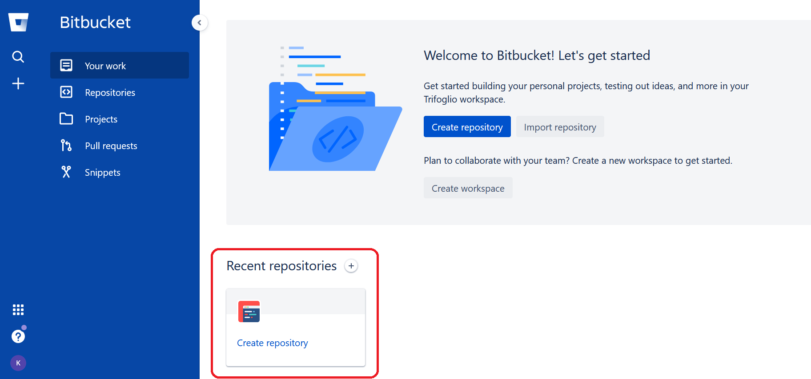

- Select a **project** to which the repo is to be assigned to. If you do not have any projects in your Bitbucket account yet, you can also create a new project at this point.
- Enter a **name** for the new repository, e.g. you can name it after your dictionary.
- Choose the **access level**. If you decide to make your repository **public**, all the data you store in it will be accessible online for everyone. If you do not want this to be possible, select **private**.
- You can include a **README** with a short information about the content of your repository, but this is not necessary for your upload to Publex.
- We recommend to choose 'main' as **default branch name** as suggested by Bitbucket.
- For the field "Include .gitignore?" you can simply use the default setting.
- Now you are ready to hit the "Create repository"-button.

This is how it looks now:

4. Now you can **upload your dictionary data to the repository**.

- To do this, you first have to **clone the repository** which means that you create a copy of it on your local system. When you click the "clone"-button in the right corner, a window will open, **copy the clone command** that appears.

If you prefer to use Bitbucket through a user-friendly interface, we recommend to download [Sourcetree](https://www.sourcetreeapp.com/). In the following, we describe how to perform the steps with the command line:

First open the terminal. This works differently depending on the platform you use:

a) using Windows: Hold down the Windows key on your keyboard and then press the "R" key. Now the "Run" tool will open in a new pop-up window. Type in "cmd" and hit "OK".

b) using Mac: To open terminal from your applications folder, click your desktop to bring "Finder" into focus. In the menu bar, click "Go" and select "Applications".

c) using Linux: Press Ctrl+Alt+T.

- Once opened the terminal window, change into the local directory where you want to clone your repository. `cd <path_to_directory>`
- Paste the command you copied from Bitbucket, e.g.: `git clone https://Trifoglio@bitbucket.org/Trifoglio/my_dictionary.git`
- Now a new sub-directory should appear on your local drive with the same name as the repository.
- In this directory, **create a new folder** which you call "data" for example.
- **Put all the files that belong to your dictionary into this folder**. Note: If you want to use entities from the KompLett font, you must also place the file allEntities.xml in this folder.
- Now you are almost finished. The final step is to transfer the locally added files to the remote Bitbucket Cloud repository. In your terminal window:

  - enter `cd <path_to_local_repo>`
  - enter `git add --all`
  - enter `git commit -m '<commit_message>'` with a commit message that describes your changes, e.g. `git commit -m 'upload dictionary data'`
  - enter `git push`

If everything worked fine, you should now see the files in your repository online in your Bitbucket account. Now we are prepared to create a new dictionary in Publex!

### Creating a new dictionary

1. To create a new dictionary, start on the Dictionary Overview page and click on **"New Dictionary"**.

2. A new window opens. Type in the **name** of your new dictionary and optionally a description.

3. Now you have two different options:

   a) You can create an empty dictionary first and import the data at a later time. Then click on "Create empty dictionary". The new dictionary will appear in the Dictionary Overview afterwards.

   b) You can import your dictionary data directly. Hit the button "Add Dictionary and go to XML file import". The dictionary is created and the import page opens.

### Import

1. There are two possible ways to get to the **import page**: a) You create a new dictionary and immediately go to the XML file import (see [here](#creating-a-new-dictionary)). b) In the Dictionary Overview, select a dictionary that has already been created and click on **"Edit Dictionary"**.

   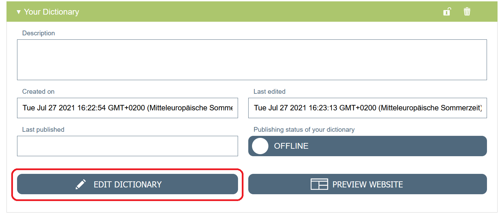

In the menu bar on the left, under **"Dictionary Management"**, select **"XML File Import"**.

2. Now you have to provide Publex with the information where to find your dictionary data.

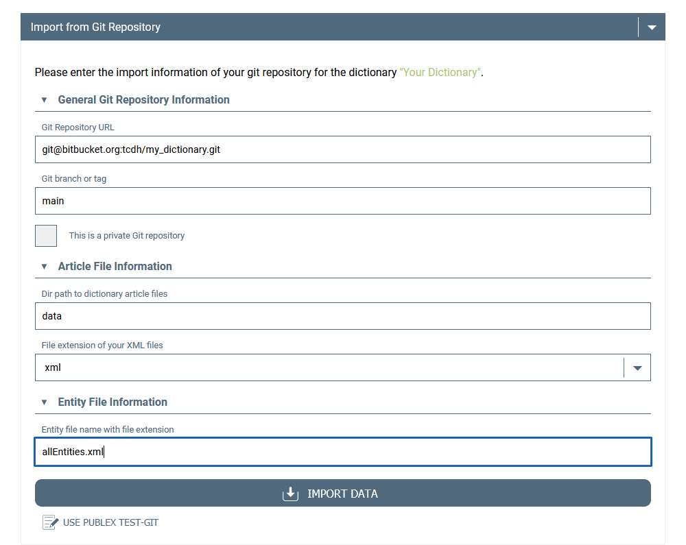

a) The **URL of the Bitbucket repository** where you stored the data. You get the URL by clicking on the clone-Button in your Bitbucket repository and choosing "SSH" in the dropdown menu in the right upper corner. The last part of the displayed string is the URL you need.

b) The **branch** in which the data is stored. It's the one you chose as default branch name when creating your Bitbucket repository (see [here](#store-the-data-in-a-bitbucket-repository)).

c) Tell Publex, whether your repository is public or private.

1. If your repository is public, no further settings are necessary for the import. If it is a private repository, please mark the checkbox "This is a private Git repository!".

   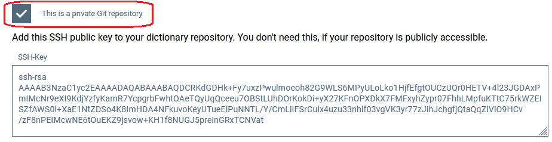
2. By activating the button, a SSH key becomes visible. Please add this key to your Bitbucket account.

- Copy the key.
- In your Bitbucket account, go to your personal settings (see the icon for your account in the left corner on the bottom).

  
- In personal settings, go to "SSH keys" and click on "Add key". A Window opens where you can paste your key you copied from Publex.

  

  d) The **name of the directory** you stored you dictionary files in, e.g. "data" as chosen in our example.

  e) The **file extension** of your files containing the dictionary data which should be **xml** as recommended.

  f) The **entity file name**: If you would like to use our self-defined entities to display non-unicode characters (see [here](#use-of-non-unicode-characters)), enter the file name **"allEntities.xml"** here. If not, the field should remain empty.

  Now you are ready to hit the button **Import Data**. The import starts now. It may take a couple of time depending on how large your data is. In the output window, you can follow the progress of the import and also see if problems or errors occur. If "Everything successfully imported." is displayed, the import was successful. Click "Go to Styling Rules" to continue with the [configuration](#define-your-styling-rules) of your dictionary.

#### Publex Test-Git

As assistance we offer a small dictionary test data set. Via the button "Use Publex Test-Git" the corresponding data are entered into the form and the test dictionary can be imported.

- 

### Deleting and locking a dictionary

A dictionary can be deleted by clicking on the delete button (bin symbol). Make sure that the status of the dictionary is "unpublished".

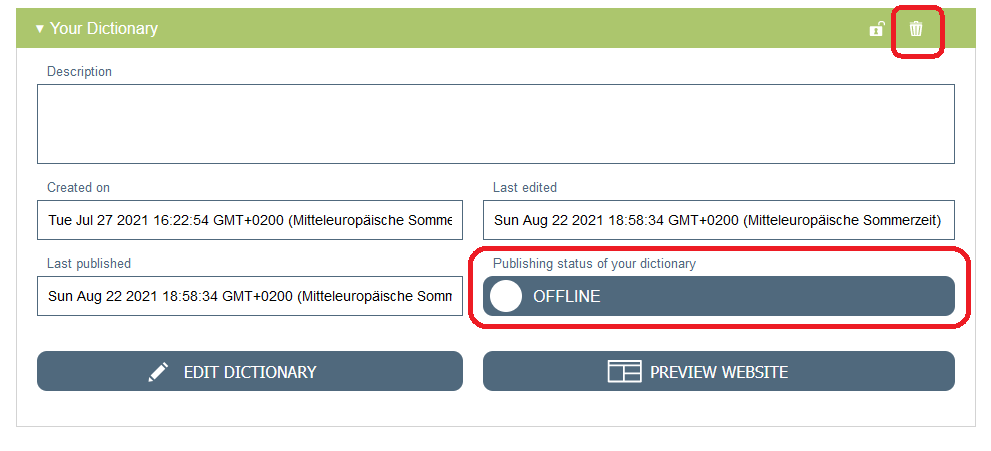

You have the possibility to lock a dictionary to protect it from unwanted changes. The lock icon changes the status to "not editable". Click the icon again to unlock.

### Metadata Management

The metadata for the dictionaries will appear later on the page of the published dictionaries.

To add and edit the metadata of your dictionary, choose your dictionary in the Dictionary Overview, hit the "Edit Dictionary"-Button and select **"Metadata"** from the left side menu.

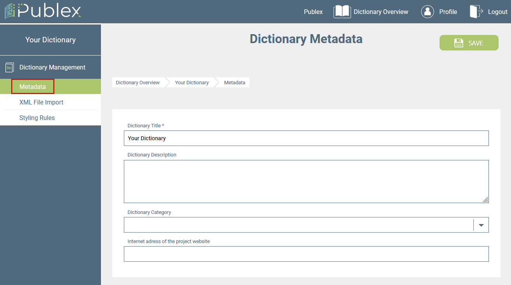

On this page, you are able to change the title and edit the dictionary description. You also can add a project website and classify your dictionary into one of the following categories:

- General language dictionary
- Multilingual dictionary
- Historical language dictionary
- Etymological dictionary
- Regional or dialect dictionary
- Foreign learners' dictionary
- Technical and terminological dictionary
- Authors' dictionary
- Unspecified

<SideNote type="warning">
  Don't forget to hit the "Save"-Button to make sure Publex records your
  changes.
</SideNote>

## Define your styling rules

The configuration module is the heart of Publex. Here you can define how each XML element should appear in the online dictionary. The following is a general explanation of how styling with Publex works. It becomes clearer and more concrete in the [example](#styling-a-dictionary:-an-example) below.

Go to the configuration page:

a) You will get here directly after importing your dictionary data by clicking "Next" after the import has been completed.

b) In the Dictionary Overview, select a dictionary that has already been added and click on **"Edit Dictionary"**. Then, in the menu bar on the left, under **"Dictionary Management"**, select **"Styling Rules"**.

<SideNote type="info" title="Defining styling rules">

There are a few basic things to keep in mind when defining the styling rules:

- The requirement for the publication of a dictionary is the presence of a **lemma rule** (i.e. for one of the rules, the field ["Add to lemma list"](#search-and-lemma-field) must be selected).
- The order of the rules is relevant: **Subordinate rules override the preceding ones**. For example: I want the font size of my entries to be 12 pt, so I define this feature in a rule for all `<entry>` elements. Thus, all the texts contained in `<entry>` will be formatted accordingly. However, the lemma (e.g. `<form type="lemma">`) should be bolded and displayed in a larger font. If I define this in a subordinate rule, the definition from the first rule is overwritten specifically for these elements. Therefore it is recommended: More general rules should be placed at the beginning of the list.

</SideNote>

- The order can be modified at any time using the arrow buttons.

  

<SideNote type="tip" title="Advice for the choice of font">
  It is recommended to use the [KompLett
  font](https://tcdh.uni-trier.de/en/projekt/komplett), as it contains more
  characters compared to other fonts and, therefore, the probability is higher
  that all characters can be displayed.
</SideNote>

### Adding a new rule

A new styling rule is created by using the "Add styling rule" button.

A window for defining a new styling rule is displayed.

### Naming the rule

Type in the name for the rule.

<SideNote type="tip">
Try to use meaningful names, e.g. "lemma", "definition" or "citation".

This helps you to keep a better overview of the rules. In addition, in the [dictionary look-up](#the-dictionary-look-up), the name serves as the label of the associated search field (if ["set as searchable field"](#searchable-field) is selected).

</SideNote>

### Choice of the element tag

The first step is to select the element tag the rule should apply to. When importing the data, Publex captures all the different tags, attributes and associated attribute values your dictionary is annotated with. When creating a styling rule, you are shown all the options to choose in a drop-down menu:

Now you have different options:

1. **You select only one element tag**. The rule then applies to all elements with this tag name, regardless of the attributes: 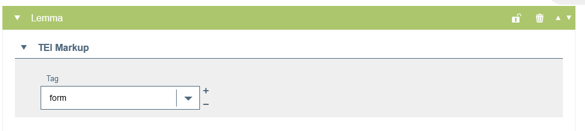
2. **You specify the selected tag by one or more attributes**, you do not prescribe which attribute values are present. To do this, click on the plus symbol to the right of the selected element and select "Add attribute to tag" here.

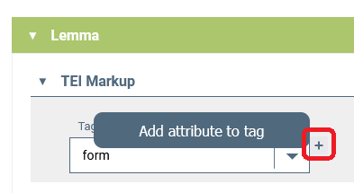 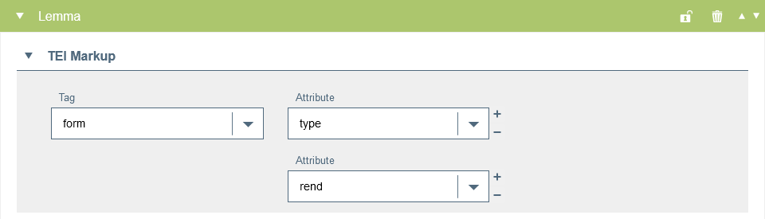

3. **Additionally, you define which values an attribute should have**. To do this, click on the plus symbol on the right of the selected attribute and select "Add value to attribute". Please note: You can only define one value per attribute.

 

Attributes and attribute values that have already been selected can be removed with the minus symbol on the right.

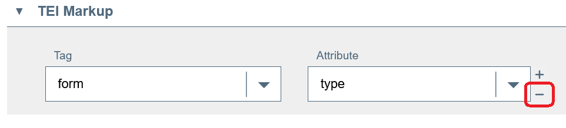

### Search and lemma field

For each rule, there are different options you can select in the settings:

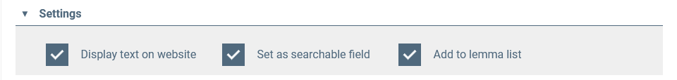

- **Display text on website** This checkbox is activated by default. You should only deactivate it if you do NOT want the text of the element to be displayed.
- **Set as searchable field** If you want the selected element to appear as a search field in the dictionary look-up, activate this field.
- **Add to lemma list** By activating this field, you define a so-called lemma rule. This means that the text contained in the element appears in the lemma list and makes the associated dictionary entries accessible. Note: At the same time, "Set as searchable field" is activated. Lemmas always form a search field.

### Define the styling

Finally, you can define the concrete layout. A wide variety of text formatting functions are available to you for this purpose:

### Save and discard

When you have defined a new rule or made changes, save them with the save button at the top of the right.

Single rules can be deleted via the bin button.

If you want to discard all changes since the last save, you can do this with the "Discard changes" button. This is hidden behind the "more" button next to the save button.

### Lock a styling rule

As an assistance in creating the styling rules, individual rules can be locked. This prevents them from being accidentally deleted and can serve as your own orientation to check which rules have already been created.

Clicking on the lock symbol locks a rule, clicking again unlocks it for editing.

### Export and import a configuration

You have the option of exporting the styling rules as a JSON file in order to save your results and re-import them later if required. This is particularly necessary if you want to [update the dictionary data](#file-management:-update-a-dictionary) at a later time. We, therefore, strongly recommend exporting and saving the configurations locally after making changes to the styling rules.

The buttons for the export and the import are hidden under the "more" button next to the save button at the top of the right.

#### Export

To export your styling rules, click on "Export configuration file". A window opens asking you to specify the local storage location of the file.

#### Import

To import exported styling rules, click on "Import configuration file". A window opens in which you have to copy the contents of the exported JSON file. To do this, you can open the JSON file in any text editor and select and copy the text it contains.

After clicking on "OK", the rules are imported and displayed.

<SideNote type="warning" title="Saving">
  Make sure to click on "Save" after importing the rules.
</SideNote>

## Styling a Dictionary: An Example

For a concrete demonstration of the different functions and the procedure, we use the dictionary entry _bluome_ from the _Mittelhochdeutsches Handwörterbuch_ by Matthias Lexer as an example in the following:

This is how the XML annotated entry looks like:

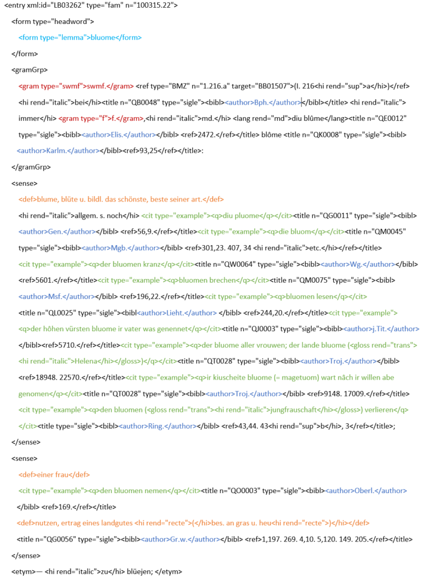

We first examine which information units have a special typographical representation and which XML elements correspond to them. In this example, we follow the print image, but use the additional advantages of the digital publication form: For example, we additionally display the citations in red and the authors in blue, which serves to improve the visual structuring of the document examples.

After these pre-considerations, the styling rules can now be defined.

Since the rules should be sorted from general to specific, we first define the basic layout for our entries.

#### The basic layout

The first rule, therefore, refers to the `entry` element. If not defined more specifically by further rules, the text of the dictionary entries shall be displayed in KomplettFont, font size 12 pt, font colour black and with no other special features:

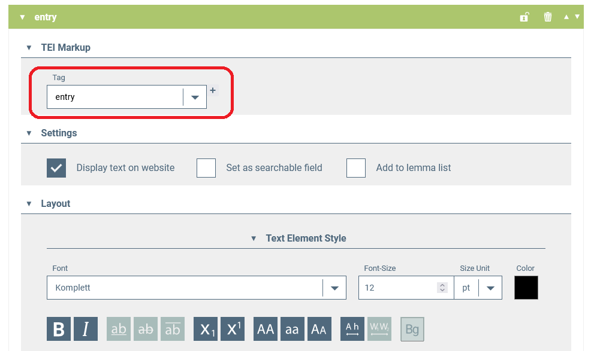

By activating the checkbox "Set as searchable field" here, we later enable a full-text search in the published dictionary.

Now we create more specific rules for individual entry parts that override the `entry` rule:

#### The lemma

Each dictionary should have a lemma. The tag for this is `<form type="lemma">`.

In contrast to the regular entry text, the lemma should appear in bold type in our example. To make it more distinctive, we also choose a larger font size of 16 pt. In addition, we have to activate the box "add to lemma list" so that the lemmas appear in the lemma list and are searchable in the dictionary look-up.

#### Grammatical information

The grammatical information contained in the `gram` tag is to be displayed in italics. We also want to enable a search for the grammatical indication in the dictionary and therefore activate the checkbox "Set as searchable field".

#### Definition

The text contained in `<def>` should also be set in italics. We additionally activate the checkbox "Set as searchable field".

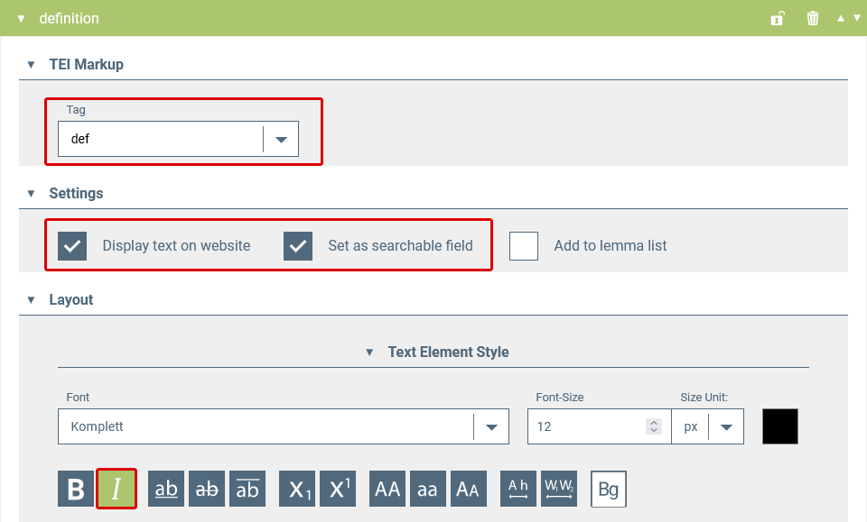

#### Citation

Quoted examples are coded with `<cit type="example">` and should be displayed in green.

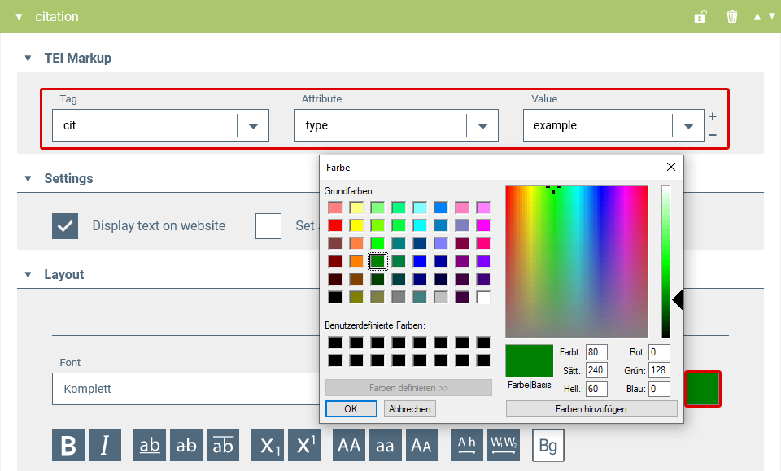

#### Source authors

The cited examples are followed by the source, which is annotated with `<author>` and which we want to display in blue font colour. The sources should also be a search field in the look-up.

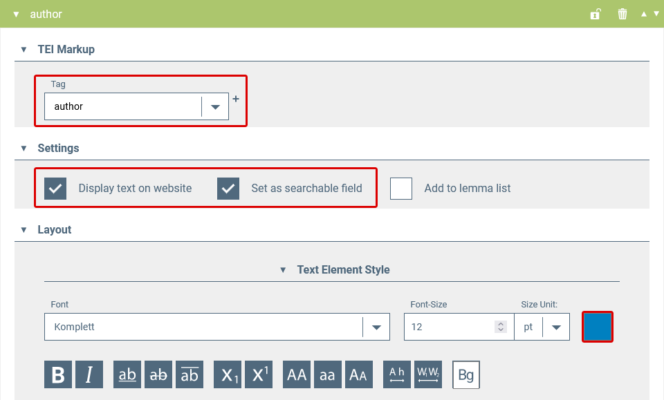

#### Recte and superscript

Finally, we define the rules for the elements that mark typographic features. In our example, these are italics, recte (used to mark punctuation marks as recte in a paragraph displayed italics) and superscript.

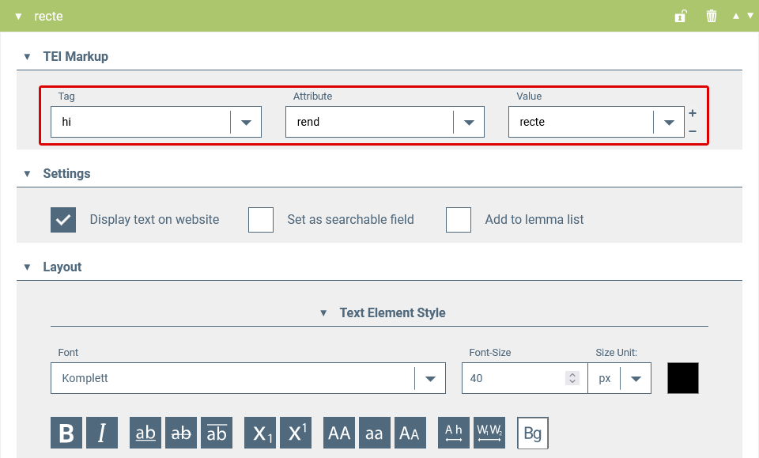

Now the styling for our example entry is defined. We save the rule with the "Save" button and create a backup copy by exporting the configuration as a JSON file.

<SideNote type="tip">
  In parallel with the creation of the styling rules, you can view a current
  representation of your dictionary in the [dictionary preview](#the-dictionary-viewer:-preview-your-dictionary).
</SideNote>

In the dictionary preview, our example entry _bluome_ now looks like this:

## The Dictionary Viewer: Preview your dictionary

In the Dictionary Viewer, the user can see how his/her published dictionary will look later. While defining the styling rules, the user can directly see how they will be implemented for the display of the dictionary entries. After each saved update in the Styling Rules, the changes become visible when reloading the page (e.g. with F5).

You can get there by clicking on "Preview Website" in the left side menu:

Or by going to your dictionary in the Dictionary Overview and click on "Preview Website":

A new tab opens in the browser with the preview:

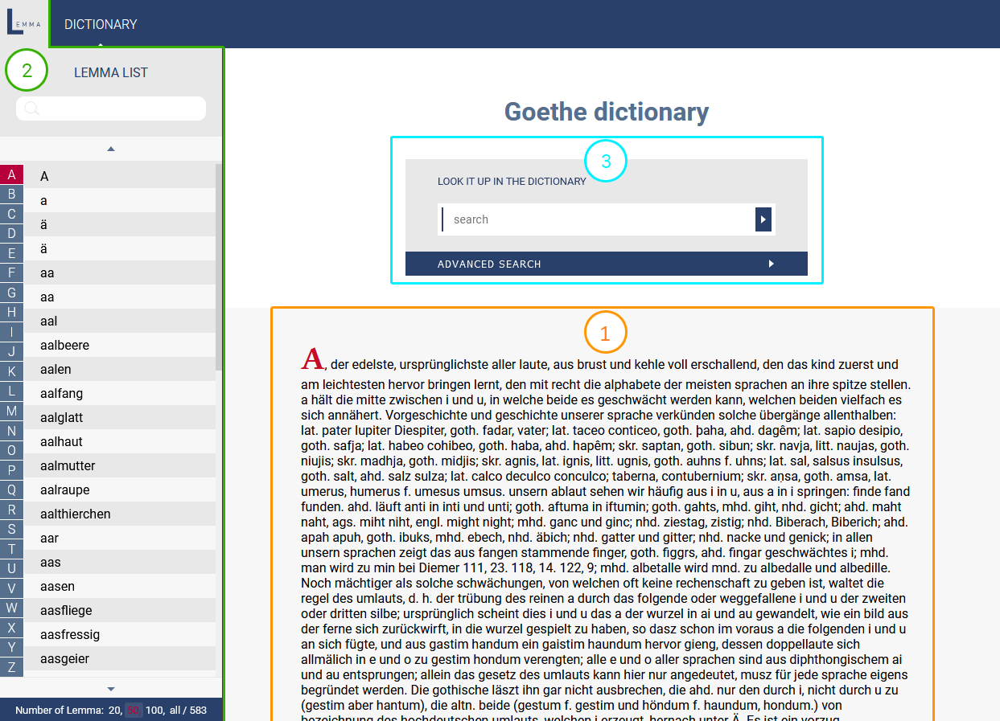

The viewer as well as the later published dictionary are divided into three parts:

1. the display of the entries
2. the lemma list
3. The dictionary look-up

### Display of the entries

Here, the dictionary entries are displayed as defined in the Styling Rules. Only one entry is visible at a time. The user can navigate to other entries using the lemma list.

### Lemma list

All fields a lemma rule has been defined in the styling rules for appear in the lemma list (see [here](#search-and-lemma-field)). Clicking on an item in the list displays the corresponding dictionary entry. The entries in the lemma list can be searched by using the search field. A truncated search is possible.

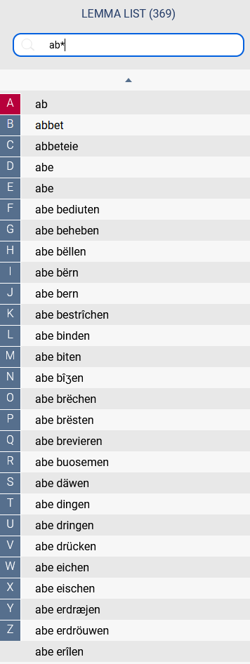

### The dictionary look-up

The dictionary look-up offers search options in all information fields the checkbox "set as searchable field" has been activated for in the styling rules (see [here](#search-and-lemma-field)). In our example configuration, these are the lemma, the grammatical information, the definition and the source information.

Further search fields can be added via the plus button. These can be linked with the logical operators AND, OR and NOT.

Upper and lower case are irrelevant for the entry. Special characters can be replaced by their basic characters in the search, e.g. diacritics do not have to be entered (ë = e).

A truncated search is possible. For example, _bach*_ returns all words beginning with this character string and _\*bach_ returns the words ending with this string.

When entering multi-word units, it is necessary to enclose the search string in inverted commas to search for the entered word sequence (e.g. _"laut und buchstabe"_), otherwise the word order will not be taken into account.

The search is started by pressing the enter key.

The search result appears as a list below the search mask. From here, the dictionary entries can be called up directly.

## Publication

#### Requirements

In order to publish a dictionary, the following requirements must be fulfilled:

1. The corresponding data must have been imported into Publex.
2. The styling rules must have been defined. At least a [lemma rule](#search-and-lemma-field) has to be defined.

#### How to publish?

- To publish your dictionary, go to the Dictionary Overview page, change the button with the label "Publishing status of your dictionary" from "unpublished" to "published".

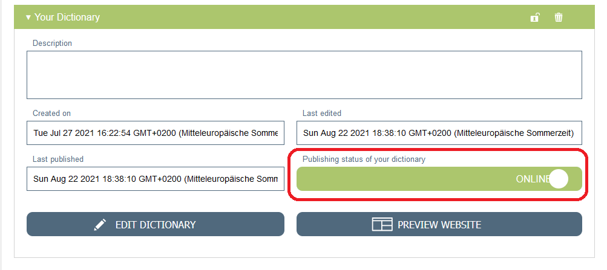

- Your dictionary is available online now. It appears on the overview page of all dictionaries published with Publex. You can also access this page via the "Published Dictionaries" button in the top menu bar:

The published dictionaries are displayed with basic metadata and can be accessed by clicking on the dictionary name in the blue box.

- Each published dictionary is also given its own persistent address it can be accessed through.

#### Reverse a publication

You can reverse a publication of your dictionary by changing the toggle button from "published" to "unpublished".

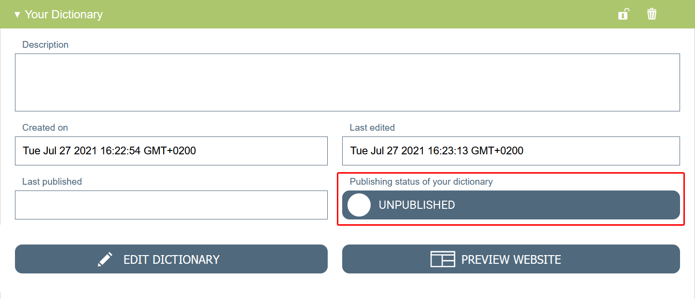

## File Management: Update a dictionary

You would like to update a dictionary that has already been published?

**Case 1) You want to change the display of your dictionary, but the content data remains unchanged.**

To do this, log in to Publex and call up the corresponding dictionary in the Dictionary Overview. Select "Edit dictionary" and change the styling rules of the dictionary. Click on "Save" to apply your changes to the published dictionary.

**Case 2) You want to update the dictionary data.**

If you want to publish your dictionary in a new edition, we recommend to create a new dictionary and publish the data in a new version under a different URL.

But you can also reimport the data for the existing dictionary. To do this, follow the steps below:

1. First, save the styling rules defined for the dictionary by exporting them and saving them locally (see [Export of styling rules](#export)).
2. Go to the Dictionary Overview and change the publication status to "Unpublished" (see [Reverse a publication](#reverse-a-publication)).
3. Go to the import page (see [Import](#import)), fill in the information where you stored the updated data and hit the "Reimport" button.
4. After the data import is done, you can reimport the locally stored styling rules (see [Import of styling rules](#import)). Please check if the rules still match the XML encoding.
5. Finally publish the dictionary (see [Publication](#publication)).