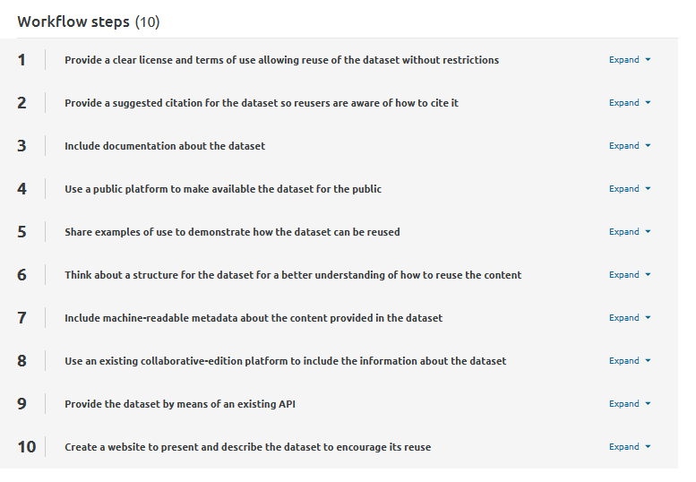

### What is the Collections as Data initiative?

Cultural heritage institutions have been exploring new ways to make their content available for decades. Cultural heritage material includes content such as text, images, video or audio, as well as metadata describing the content. In general, the content is made available in the form of a dataset, a structured collection of data that: i) usually relates to a particular topic, project or research question; ii) includes content in different formats and iii) facilitates computational analysis using digital methods. Furthermore, it is important to document such datasets by providing rich information or metadata describing the content, such as provenance information detailing the origins of the dataset, or information about how the dataset was created, such as selection criteria or methodological approach. 

**Exercise.** Spend some time thinking about a recent scenario where a researcher needed to use cultural heritage data. Could you describe what kinds of digital cultural heritage objects were part of the dataset? What sort of information was needed about the dataset? What, if any, obstacles did the researcher encounter in trying to reuse that dataset?

A dataset involves several aspects that not only refer to the content itself but also to the metadata and fields used to describe the records provided, the inclusion of proper provenance documentation stating how the dataset was created or the provision of a clear licence and terms of use. In this sense, there is a wide diversity of approaches to make the datasets available in terms of the requirements and needs of the community, and there is no single "one size fits all" solution. For example, previous work has developed [standardised processes to describe machine learning datasets](https://doi.org/10.5334/johd.124) in the cultural heritage sector in order to provide information concerning provenance, purposes and recommended uses, composition, as well as societal biases. In addition, international initiatives such as the [FAIR principles](https://www.nature.com/articles/sdata201618) which stands for findable, accessible, interoperable, and reusable, and aim at optimising the reuse of data, are complemented with the [CARE principles](https://www.gida-global.org/care) that focus on collective benefit, authority to control, responsibility and ethics in the use and sharing of data.

Lately, there have been new advances in technology that have paved the way to a new environment in which data has become essential for different purposes including the training of models and the application of Digital Humanities methods. Digital literacy has extensively increased thanks to the democratisation of programming and the use of cloud tools that can be run without the need to install additional software. However, the publication of digital collections can involve risks in terms of how the collections are used, the purpose and the transparency of the methods applied.

In this context, [Collections as Data](https://collectionsasdata.github.io/) is an initiative to promote the publication of digital collections suitable for responsible computational use. In the cultural heritage sector, computational use refers to the application of techniques such as computer vision, information retrieval, network analysis or named-entity recognition. Many institutions across the world have started to make available their content as collections as data. However, cultural heritage institutions face several challenges when making available digital collections for the public. Some problems involve the licence (e.g., when using copyrighted material), the structure of the dataset to facilitate its reuse (e.g., how to structure a folder with text and images content? What type of files should be included?) or the use of machine-readable vocabularies to describe the content and the dataset itself. More advanced approaches are based on the use of Application Programming Interfaces (APIs) that allow computers to access the data and facilitate its automation by using standard protocols of communication. Overall, in the particular case of small and medium-sized institutions, these issues are even more common due to the lack of resources and skills.

**Exercise.** If you are curious about Collections as Data, then _[50 Things](https://collectionsasdata.github.io/fiftythings/)_ could be a good place to start! It provides a list of actions that you can use to publish collections as data. You can start by identifying two or three actions (e.g., “17. Share sample projects with community partners to give them an idea of how their collections can be used”) in the list that can be easily applied to your institution. 

[Data spaces](https://digital-strategy.ec.europa.eu/en/policies/strategy-data) have recently emerged as an innovative way to publish and reuse digital collections, providing a secure environment to share the digital collections, ensuring data privacy and sovereignty, and enabling new business opportunities based on the data. Thanks to all these features, data providers are able to decide who uses their data as well as the establishment of data policies on a standardised basis.

### Examples

There are several examples of institutions making collections as data available including different types of content such as newspapers, text and metadata. Each of them uses different approaches in terms of the formats provided, the content or how they can be accessed. They can be useful as examples for other institutions willing to adopt the Collections as Data principles.

For example, the Data Foundry at the National Library of Scotland provides several digitised and metadata digital collections under public licences. Some examples include [A Medical History of British India](https://data.nls.uk/data/digitised-collections/a-medical-history-of-british-india/), the [National Bibliography of Scotland](https://data.nls.uk/data/metadata-collections/national-bibliography-of-scotland/) and the [Moving Image Archive](https://data.nls.uk/data/metadata-collections/moving-image-archive/), amongst others. In this case, the datasets are available in the form of downloadable files, instead of using an API, which makes it easier for less technical users.

The National Library of Luxembourg provides a digital collection based on [historical newspapers](https://data.bnl.lu/data/historical-newspapers/). It follows an innovative approach by making available the content in the form of several datasets in terms of size and content, according to the purpose such as getting started, and using machine learning and deep neural networks. Other initiatives such as the [Library of Congress](https://chroniclingamerica.loc.gov/), [Trove](https://trove.nla.gov.au/) in Australia, [Timarit.is](http://Timarit.is) in Iceland, the [Caribbean Newspapers](https://dloc.com/collections/cndl) and the [National Library of Spain](https://hemerotecadigital.bne.es) provide access to historical newspapers under licences that enable reuse and including full text. In addition, the [Berlin State Library](https://zenodo.org/records/13284442) published a metadata dataset for research purposes and the development of AI applications including an example of a datasheet describing the content provided.

In addition, museums such as the [Rijksmuseum](https://data.rijksmuseum.nl) and the [MoMA](https://api.moma.org/) provide bibliographic information concerning their catalogue by means of a public API. More advanced approaches provide bibliographic information in the form of Linked Open Data, a set of design principles to organise and connect machine-readable data so it can be easily shared and programmatically used by other services. Some examples include the [National Library of France](https://data.bnf.fr/), [National Library of Spain](https://datos.bne.es) and the [Library of Congress](https://id.loc.gov/), amongst others.

**Exercise.** Pick up your favourite example and try to identify the licence? Is it clear? Now try to identify how to access the content. Is there only metadata? What formats are used to describe the information? Can you find this dataset in a collaborative edition platform such as Wikidata? Is this dataset available in the form of an API?

It is important to keep in mind that there is no one way to make digital collections available for computational use. There are different features that can affect how the dataset is published such as purpose, licence, requirements, or even content. All these features will shape the structure of the dataset as well as how it can be accessed.

### How to publish collections as data?

Many questions appear when an institution is willing to adopt Collections as Data such as what licence to use or how to provide documentation about the dataset. There is useful documentation available such as the [50 Things](https://collectionsasdata.github.io/fiftythings/) report. However, the process can be cumbersome for small and medium-sized institutions since they may lack the knowledge and technical skills. 

In this sense, workflows can be useful to split the task in a set of individual steps, enabling adopters to identify and focus on one or more of them. A [workflow](https://marketplace.sshopencloud.eu/workflow/I3JvP6) has been developed in the context of the [common European data space for cultural heritage](https://pro.europeana.eu/page/common-european-data-space-for-cultural-heritage). Building on the Checklist to Publish Collections as Data in GLAM Institutions and tested and refined with the support of the International GLAM Labs Community, the workflow provides a set of ten steps focused on the publication of collections as data in GLAMs. Each step is described in terms of how it can be applied and why it is relevant, including a selection of relevant examples. This intends to provide guidelines and best practices that can be useful for institutions taking their first steps.

For example, let's have a look at Step 2, which refers to the provision of a suggested citation for the dataset. A suggestion for the citation promotes access, findability and reusability of data as well as helps reusers to properly cite the dataset (e.g., in the bibliographies of their publications). In addition, this gives credit, recognition and visibility to the culture heritage institution providing the dataset. As an example, the National Library of Scotland's Data Foundry provides a "Cite the data" section for each of its datasets, including a suggested citation.

In a similar way, Step 5 refers to the publication of examples of use concerning the datasets in order to inspire reusers. In this sense, Jupyter Notebooks have emerged as a means to combine textual documentation and reproducible code, providing not only prototypes but also contributing to the digital literacy of the audience. Other examples of use provided by institutions are based on the definition of research scenarios and the provision of prototypes. Some examples are provided by the[ Jupyter Notebooks to process the Europeana newspaper text resources](https://marketplace.sshopencloud.eu/training-material/duVII1) and the [International GLAM Labs Community](https://glamlabs.io/computational-access-to-digital-collections/).

Exercise. Spend some time analysing the steps provided by the [workflow](https://marketplace.sshopencloud.eu/workflow/I3JvP6). What would you say is the most relevant step? How would you apply it to your institution? Which are the steps you find most challenging? What conclusions can you draw about the order to follow when applying it? 

When you analysed the above steps provided by the workflow, you’ve probably also noticed that they provide a number per step. It is important to note that the workflow items are iterative in nature and there is no particular order to apply them. Each institution can choose which items to use. Priorities depend on the purpose, the context, the content, the intended use or target users of the dataset.

### What could you learn next?

If you are interested in learning more about the reuse of digital collections in innovative ways, check out the [workflow to publish Collections as data in the Social and Humanities Sciences Open Marketplace](https://marketplace.sshopencloud.eu/workflow/I3JvP6). By expanding each step of the workflow, you will see related items. You can also check the [Datasheets for Digital Cultural Heritage Datasets](https://doi.org/10.5334/johd.124) to provide proper documentation for datasets. In addition, you can join existing initiatives such as the [Collections as data interest group at the Research Data Alliance](https://www.rd-alliance.org/groups/collections-as-data-ig/). 

If, on the other hand, you want to learn about the examples of reuse, we suggest you the  [computational access section available at the International GLAM Labs website](https://glamlabs.io/computational-access-to-digital-collections/).

The Introduction to cultural heritage data, data modelling (especially EDM), and Europeana APIs serve as a good point of entry to strengthen your awareness of data reuse. FInally, check out what else may strike your fancy on [DARIAH-Campus](https://campus.dariah.eu/). Have fun exploring!

#### References:

- Alkemade, H., Claeyssens, S., Colavizza, G., Freire, N., Lehmann, J., Neudecker, C., Osti, G. and van Strien, D. (2023) ‘Datasheets for Digital Cultural Heritage Datasets’, Journal of Open Humanities Data, 9(1), p. 17. Available at: [https://doi.org/10.5334/johd.124](https://doi.org/10.5334/johd.124)
- Candela, G., Gabriëls, N., Chambers, S., Dobreva, M., Ames, S., Ferriter, M., Fitzgerald, N., Harbo, V., Hofmann, K., Holownia, O., Irollo, A., Mahey, M., Manchester, E., Pham, T.-A., Potter, A. and Van Keer, E. (2023), "A checklist to publish collections as data in GLAM institutions", Global Knowledge, Memory and Communication. [https://doi.org/10.1108/GKMC-06-2023-0195](https://doi.org/10.1108/GKMC-06-2023-0195)
- Candela, G., Chambers, S. and Irollo, A. (2024), " workflow to publish Collections as Data: the case of Cultural Heritage data spaces". [https://marketplace.sshopencloud.eu/workflow/I3JvP6](https://marketplace.sshopencloud.eu/workflow/I3JvP6)
- Candela, G., Chambers, S., & Sherratt, T. (2023). An approach to assess the quality of Jupyter projects published by GLAM institutions. Journal of the Association for Information Science and Technology, 74(13), 1550–1564. [https://doi.org/10.1002/asi.24835](https://doi.org/10.1002/asi.24835)
- Candela, G. (2024). Collections as data: Acceso computacional a colecciones digitales. Anuario ThinkEPI, 18. [https://doi.org/10.3145/thinkepi.2024.e18a06](https://doi.org/10.3145/thinkepi.2024.e18a06)
- Carroll, S.R., Garba, I., Figueroa-Rodríguez, O.L., Holbrook, J., Lovett, R., Materechera, S., Parsons, M., Raseroka, K., Rodriguez-Lonebear, D., Rowe, R., Sara, R., Walker, J.D., Anderson, J. and Hudson, M. (2020) ‘The CARE Principles for Indigenous Data Governance’, Data Science Journal, 19(1), p. 43. [https://doi.org/10.5334/dsj-2020-043](https://doi.org/10.5334/dsj-2020-043)
- Padilla, T., Allen, L., Frost, H., Potvin, S., Russey Roke, E., & Varner, S. (2019). 50 Things --- Always Already Computational: Collections as Data. Zenodo. [https://doi.org/10.5281/zenodo.3066237](https://doi.org/10.5281/zenodo.3066237)
- Wilkinson, M., Dumontier, M., Aalbersberg, I. et al. The FAIR Guiding Principles for scientific data management and stewardship. Sci Data 3, 160018 (2016). [https://doi.org/10.1038/sdata.2016.18](https://doi.org/10.1038/sdata.2016.18)
