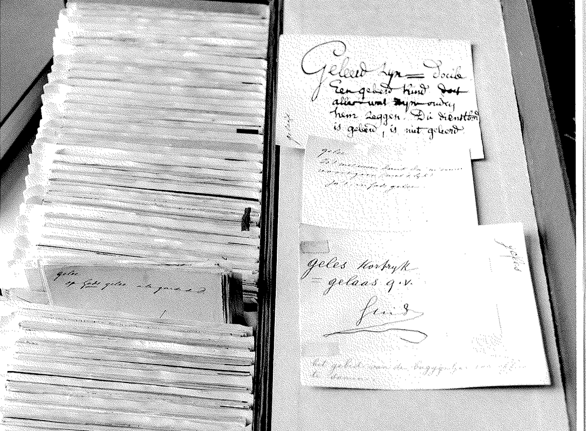

This course will explore the notion of lexicographic evidence and the limitation of subjective views on language by tracing the changes in lexicographic practice from the extensive use of manually selected citations to the employment of large language corpora. The course will introduce the fundamentals of corpus linguistics and corpus design, as well as the role played by various NLP tools such as taggers and parsers. At the end of this course, the students will have a basic understanding of how corpora can be used in dictionary writing, both for lemma selection, sense disambiguation, composing good definitions, choosing good examples and for automatic term and collocation extraction.

## Learning Outcomes

Upon completion of this course, students will be able to

- understand the fundamentals of corpus linguistics and corpus design
- determine the suitability of a corpus for a particular project
- understand the role of the corpus in lexicographic practice

### Dependencies

This course provides the theoretical background to using corpora in lexicographic practice. If you are interested in getting hands-on experience, we suggest continuing with the course LEX2: Mastering ELEXIS Corpus Tools for Lexicographic Purposes.

## Lexicographic evidence: from slips to corpora

_The craft of lexicography demands not only the ability to collect data, but also the ability to make sense of it.     SUE ATKINS_

Evidence-based lexicographic projects use authentic linguistic material as their primary source. Authentic refers to what McEnery and Wilson (2001) call “real life language use”.  This authentic linguistic material comes in various forms - data gained through introspection, citation files and corpora. In this chapter, we will explore and evaluate these different forms of lexicographic evidence and we will describe the changes in lexicographic practice from the extensive use of manually selected citations to the employment of large language corpora.

### Introspection

By introspection, we mean that the lexicographer gives an account of a word and its meaning by consulting his or her own mental lexicon (i.e. all the knowledge about words and language stored in his or her brain), and retrieving relevant facts about that word. Native speakers can do this. They are able to evaluate observed linguistic data independently and determine whether or not they are acceptable, correct, normal, frequent, etc. 

Introspection can also be the result of data collection from informants. Informants may be asked to determine the degree of acceptability of words and expressions presented to them or they may be asked to choose between different expressions. This method is used extensively in field linguistics for cataloging the vocabulary of languages that exist only in oral form. A revival of the method can be seen in various crowdsourcing efforts in lexicography. 

However, a certain amount of caution is in order when using data gained through introspection. Introspection can lead to subjective judgments influenced by the environment, education, geographical region, and personal belief of the person. For instance, English has some [750,000,000 speakers](https://en.wikipedia.org/wiki/English_language) and  [170,000 words](https://www.lexico.com/explore/how-many-words-are-there-in-the-english-language) (or 800,000 according to some sources). One expert or even a large group of experts cannot possess the knowledge of how these 750,000,000 users use all the 170,000 words. In addition, it is idiosyncratic uses of words that tend to catch the eye and tend to be noted and remembered by people creating additional biases in their judgment. For these reasons, introspection alone cannot form the basis of a reliable dictionary.

<SideNote type="note">
See also Hanks (2013:4): "The tradition of speculative approaches to the study of language through the invention of data is particularly regrettable because the focus on boundary cases supported by invented examples left linguistics drowning in a welter of imagined possibilities, while the central and typical norms of languages as systems were neglected - or were assumed to be so obvious that they were not worth studying."
</SideNote>

### Citation files

Citation files, also known as quotation slips, have a long history. For about two centuries they were the main form of empirical language data available to lexicographers. A citation is a short extract from a text which provides evidence for a word, phrase, usage, or meaning in authentic use (Atkins and Rundell 2008: 48) together with source information and other kinds of pertinent information (Svensen 2009:41).

Citations have conventionally been collected through reading programs, an “organized data-gathering exercise” (Atkins and Rundell 2008: 49) set up by a publisher where readers examine texts and excerpt from these texts lexical items which are considered for inclusion in the dictionary. Until the late 20th century, the excerpts would be written or typed on index cards (known as “slips”) following the specifications of the publisher. 

Samuel Johnson was the first English lexicographer to use citations “systematically” (Atkins and Rundell 2008: 48) as the basis for his dictionary of the English language published in 1755 (Hartmann 1983: 19). Johnson intended that all entries in his dictionary be supported by citations taken from “superior” literature (Jackson 2002: 44, 166).

The Oxford English Dictionary (OED) also draws upon millions of citations (Atkins and Rundell 2008: 49; Green 1996: 316-323; Jackson 2002: 48, 166). In contrast to Johnson, [James Murray](https://public.oed.com/history/chief-editors/#james-murray), the principal editor of the OED, intended that the citations should not come solely from eminent authors and prestigious literary works, but be drawn from all types of publications, even “low and trivial sources” (Read 1986: 28-29). 

Likewise, citations have been used extensively in the compilation of dictionaries in the Germanic tradition. Already in 1838, Wilhelm Grimm gave specific guidelines for the citations to be used for the Deutsches Wörterbuch (DWB):

> Ich wünsche dass die Excerpte zu dem Wörterb. auf einzelne kleine Duodezblättchen geschrieben werden, die man alle in Kasten werfen muss, u. zu deren endlicher alphabet \[...]. Das Wort muss jedesmal unterstrichen werden. Dies ist eine mühselige mechanische, aber an sich gar nicht schwierige Arbeit (Kirkness 1980, 68 cited in Wortel 1997).
>
> (I wish that the excerpts for the dictionary are written on individual small Duodez leaves, all of which have to be put into boxes, according to the alphabet \[...]. The word has to be underlined every time. This is tedious mechanical work, but not difficult in itself)

This was further refined: 

> alle auszüge müssen auf sedezblätter \[sedecimo], die man bequem ordnen kann, auf jedes blatt nur ein wort mit genauem citat, so dass die möglichst beste ausgabe gebraucht und in der einleitung vornen angegeben wird. der ausziehende darf sich nicht verdriessen lassen merkwürdige wörter zehnmal und mehr aufzuzeichnen und in dem zusammenhang der ganzen phrase, der redactor muss diese sicher und ohne nachzuschlagen verstehn können, wenn er von den zehn beispielen etwa nur zwei behält, die andern wegwirft (Kirkness 1980, 71 cited in Wortel 1997).
>
> (all excerpts must be on sedecimo sheets, which are easy to organize, only one word with an exact quotation on each sheet so that the best possible edition is used and given in the introduction. the person who excerpts should not get lost in writing down strange words ten times or more but should write down enough context such that the editor can understand the excerpts correctly and without further checking when he keeps about two of the ten examples and throws the others away.)

Following Grimm, De Vries, founder of the Dictionary of the Dutch Language (Woordenboek der Nederlandsche Taal ), specified that each word to be included in the dictionary had to be 'marked' on a separate sheet of 'Dutch writing paper', quarto format, with cut edges which were kept in specifically designed boxes. Where possible, these paper slips should also contain quotations and comments regarding etymology or grammar. This way everything that was needed for writing the dictionary entry was collected on those sheets saving a great deal of time because the entry could be edited 'almost completely without checking and comparing books' (De Vries, Verl. 1854, 14).

As one can imagine, excerption is laborious and time-consuming work. In addition, owing to the computerisation, citation files no longer form the primary source of evidence and have gradually been replaced by large corpora. However, excerption is sometimes still used as a way for users to contribute new words through special forms on dictionary publishers’ websites.

### Corpora

With the advances in computer technology, the exploitation of large corpora became feasible from 1960 onwards, but the big boom came in the 1980s. A ‘corpus’ can be defined as a collection of texts stored in electronic format. This distinguishes a corpus from the paper slips described in the previous section. Corpora are used for all sorts of purposes, many of them highly specialised. In this course, we focus on lexicographic corpora - collections of language data designed specifically for use in the creation of dictionaries. In the next chapter, we will introduce you to corpora and we will provide a basic introduction to corpus linguistics.

## Corpora

### What is a corpus?

At the end of the previous chapter, we defined a corpus as a collection of texts stored in electronic format. This is a fairly basic definition and various more elaborate definitions can be found in the literature, e.g.:

> a collection of texts held in machine-readable form and capable of being analysed automatically or semi-automatically in a variety of ways (Baker, 1995:225)
>
> a collection of pieces of language that are selected and ordered according to explicit linguistic criteria in order to be used as a sample of the language (EAGLES 1996)
>
> a collection of pieces of language text in electronic form, selected according to external criteria to represent, as far as possible, a language or language variety as a source of data for linguistic research (Sinclair 2005:16)
>
> \[…], the notion of “corpus” refers to a machine-readable collection of (spoken or written) texts that were produced in a natural communicative setting, and the collection of texts is compiled with the intention (1) to be representative and balanced with respect to a particular linguistic variety or register or genre and (2) to be analyzed linguistically. (Gries 2009:7)
>
> A collection of language material selected according to certain criteria and used as a basis for linguistic investigation. (Svensen 2009:43)

### What types of corpora are there?

A number of different types of corpora can be distinguished depending on their internal properties or their intended purpose(s), i.e.

- Language(s): monolingual, multilingual (comparable and parallel)
- Coverage: general, specialised
- Medium: spoken, written, multimedia, visual content
- Time: diachronic, synchronic
- Static vs Dynamic: open (monitor), closed

In this section, we will take a closer look at these properties and their purposes.

#### Language(s)

Corpora can contain texts in one language or texts in more than one language. 

Monolingual corpora are the most frequent, usually containing texts originally produced in one language. A well-known example of a monolingual corpus is the [British National Corpus](http://www.natcorp.ox.ac.uk/corpus/index.xml).

A multilingual corpus contains texts in more than one language. Two types of a multilingual corpus can be distinguished, i.e. parallel and comparable corpus. 

A parallel corpus is a corpus with the same texts in two or more languages, which are aligned, most often at the sentence level. A parallel corpus can be created: 

- automatically by aligning previous translations
- segment by segment by a translator during translation in a CAT (Computer-assisted translation) tool and stored in a TM (Translation Memory) database 

Parallel corpus data is generally quite difficult to obtain. Therefore parallel corpora have limited availability for many specific domains and rare languages. An example of a parallel corpus is the [EUROPARL](https://www.statmt.org/europarl/) corpus.

A comparable corpus is a collection of texts in two or more languages that are similar in their subject, domain, genre, or register. Comparable corpora are less demanding and less time-consuming to compile than parallel corpora. Examples of comparable corpora are:

- CHILDES TalkBank: [https://childes.talkbank.org/](https://childes.talkbank.org/) 
- International Corpus of English: [http://ice-corpora.net/ice/index.html](http://ice-corpora.net/ice/index.html) 

#### Coverage

In terms of coverage, two types of corpora can be distinguished, a general corpus and a specialised corpus. A general corpus is designed to be used for a wide variety of purposes. It will, therefore, generally be broad in scope containing a wide variety of text types, and be balanced according to genre and domain in order to represent as wide a range of the language as possible. A general corpus may also be seen as a “standard reference” for the language variety which it represents and may thus be referred to as a reference corpus. Many European countries have established large-scale projects to develop and maintain such national reference corpora, for example, the Polish National Corpus (see Przepiórkowski et al. 2010), the Czech National Corpus (SYN2005, Institute of Czech National Corpus, Charles University, Prague), or, in Germany, the DWDS corpus (see Geyken 2007) and the German Reference Corpus (DeReKo) (Kupietz et al. 2010). The already mentioned British National Corpus is also an example of a reference corpus. 

On the other hand, a specialised corpus is designed with a more specific purpose in mind than a general corpus. It is intended to represent a specific variety of language, genre, or domain that will be the object of study of a particular research project. For example, a specialised corpus can contain the works of one author or it can be a corpus of academic texts. A prominent type of specialised corpora are learner corpora, which contain texts produced by foreign or second language learners of a language. For an overview of available learner corpora, see [Learner Corpora around the World](https://uclouvain.be/en/research-institutes/ilc/cecl/learner-corpora-around-the-world.html) at the Centre for English Corpus Linguistics, Louvain-la-Neuve: Université catholique de Louvain. 

Web corpora that contain texts from the World Wide Web are also a type of specialised corpora. Examples include the Corpus of Contemporary American English (COCA) (Davies 2010), which is continuously updated, the [TenTen Corpus Family](https://www.sketchengine.eu/documentation/tenten-corpora/) and the more randomly sampled corpora developed in the context of the Web-as-Corpus initiative (cf. Baroni et al. 2009), like ukWaC for British English (2 billion words), deWaC for German, frWaC for French, and itWaC for Italian.

> Note: the texts of some specialised corpora can also be included in a general corpus.

#### Medium

Medium refers to the material manifestation - written, audio or visual. Corpora containing written material are most common, as this kind of material is the easiest to collect. Corpora can also contain audiovisual material. If the corpus contains data in more than one medium, we speak of a multimedia corpus. Examples of multimedia corpora are spoken corpora and sign language corpora.  A spoken corpus is a corpus constructed with the principal aim of investigating language as used in spoken interaction. [FOLK, the Research and Teaching Corpus of Spoken German](http://agd.ids-mannheim.de/folk.shtml) is an example of such a spoken corpus.

A sign language corpus is a corpus in which the focus is not on the acoustic/articulatory modality of a spoken language, but on the visual/gestural modality of a signed language. Transcription of sign language corpora is typically done with the help of specialized transcription systems for sign languages. The [British Sign Language Corpus](https://bslcorpusproject.org/) is a prototypical example of a sign language corpus.  For more information on multimedia corpora (their annotation and encoding) see [https://www.exmaralda.org/files/CLARIN_Standards](https://www.exmaralda.org/files/CLARIN_Standards). \[more recent LINK?]

#### Time

Another property is the time period during which the texts in the corpus were produced. Corpus builders have to decide how diachronic the corpus needs to be in order to support the kind of lexicography or linguistic research they are doing. A historical dictionary like the Oxford English Dictionary clearly requires a fully diachronic corpus, whereas dictionaries designed for learners deal mainly with contemporary language, so they need a broadly synchronic corpus that provides a snapshot of the language as it is used at the time of compilation.

> Note that there is a continuum between synchronic and diachronic.

#### Static versus dynamic

Another characteristic property of corpora is whether the corpus is static or dynamic. A static corpus will give a snapshot of language used at a given time. It is also called a closed corpus as no more material is being added to the corpus. A dynamic corpus, on the other hand, is an ever-growing corpus to which new material is constantly being added. Such a corpus can also be called an open corpus or a monitor corpus. 

The advantage of a static corpus is that it is easier to control and balance the content in the corpus, whereas in a dynamic corpus, it is more or less impossible to ensure balance. The disadvantage of a static corpus is that it may get out of date, especially as time passes, reducing the usefulness of the corpus. A dynamic corpus allows us to monitor language change over time and can provide an insight into new words and trends. An example of a dynamic corpus is the Corpus of Contemporary American English. An example of a static corpus is the British National Corpus.

#### Existing Corpora

Before constructing a corpus, it is advisable to double-check that a corpus with the required properties does not already exist. To find existing corpora, you can consult the [CLARIN Virtual Language Observatory](https://vlo.clarin.eu/) (VLO), the catalogue of the [European Language Resource Association](http://catalogue.elra.info/en-us/) (ELRA), and the catalogue of the [Linguistic Data Consortium](https://catalog.ldc.upenn.edu/) (LDC). Even if the desired corpus does not seem to be available, it might be useful to get in contact with one of the corpus centres that are listed in the CLARIN VLO. The corpus centre might know how an existing corpus could be re-licensed, if a comparable corpus is already being developed somewhere, and, if that is not the case, they might give hints on how to proceed.

> Consider that it might sometimes be more reasonable and valuable to re-use or improve an already existing corpus than to construct a new one from scratch. (Kupietz 2016)

### Corpus design and composition

#### Representativeness

The purpose of a corpus is to serve as an empirical basis for the study of language. Therefore, it is important that the corpus reflects the wide variety of ways in which language is used. In other words, the corpus should be representative. The following two quotes illustrate what representativeness means in corpus linguistics: 

> "A corpus is thought to be representative of the language variety it is supposed to represent if the findings based on its contents can be generalized to the said language variety"
>
> (Leech 1991)
>
> "For a corpus (a sample of language use) to be representative of a particular language, the distribution of linguistic phenomena (words, grammatical structures, etc.) would have to be identical to their distribution in the language as a whole (or in the variety under investigation)"
>
> (Stefanowitsch 2020:28)

Kilgarriff and Grefenstette (2003: 8) state that “representativeness” is a fuzzy notion and that outside very narrow, specialised domains, we do not know with any certainty what existing corpora might be representative of. Indeed, in most circumstances, a truly representative corpus is unattainable. Therefore corpus creators typically aim at the more modest goal of a balanced corpus. A balanced corpus is a corpus that systematically includes in the corpus different manifestations of the language it is meant to represent in proportions that reflect their incidence in the speech community in question. Thus, the very first step in building a corpus is to carefully identify which types of texts should be included in the corpus and in what proportions.

Example:

_If you want a corpus that is representative of general English, a corpus of newspapers will not do._

_If you want a corpus representative of English newspapers, a corpus containing only The Times will not do._

#### Corpus Size

Another important characteristic of corpora is their size. Corpus size is typically reported as the number of tokens in the corpus. 

> **Types and tokens**
>
> A token is the smallest unit that a corpus consists of.A type ...\[ADD]

For major languages like English, data sparseness is not an issue anymore and the size of corpora is still growing. In the 1960s, collecting a corpus of 1 million words was immensely ambitious and technically demanding (e.g. Brown corpus). In the 1990s corpora of 100 million tokens (BNC) had become the norm. These days we have gigaword corpora for languages such as English. But how large does a corpus need to be?

There is no easy answer to this question. What can be said in general, however, is that, even in the age of gigaword corpora, Robert Mercer’s claim ‘more data is better data’ ([Church and Mercer 1993](https://www-oxfordhandbooks-com.ezproxy.leidenuniv.nl/view/10.1093/oxfordhb/9780199691630.001.0001/oxfordhb-9780199691630-bibliography-1#oxfordhb-9780199691630-bibliography-1-bibItem-582)) still applies. The more data we have, the more we learn. This is especially important when items at the lower end of the frequency range are examined, be it a word, a meaning or a combination of words. You simply need a lot of data to yield enough instances of those rare items.

#### Constraints on corpus composition and size

In practice, the ideal corpus composition and size are often hampered by limitations on resources and other practical considerations. The texts that you would ideally like to include in your corpus, may not be available in digital format or they may be subject to some copyright protection or other restrictions on usage.  \[LINK TO MORE INFORMATION, E.G. DELIVERABLE 6.?]

### Corpus annotation

Minimally, a corpus consists of a large, diverse collection of files containing language samples as raw text, but more often than not, corpus texts are enriched with additional linguistic information, which we call corpus annotations. These annotations add value to a corpus and enable more advanced querying, e.g.  

- You will not only be able to search for a particular word form, but also for a lemma and retrieve all forms that occur for that lemma;
- You will be able to search for adjectives that occur frequently with a particular lemma;
- You will be able to search for syntactic constructions;
- You will be able to search for a lemma in one of its senses in your corpus.

In this section, we look at different types of corpus annotation and we will illustrate these on the basis of a short newspaper article from The [Guardian](https://www.theguardian.com/science/2022/mar/01/tyrannosaurus-rex-may-have-been-three-species-scientists-say) (The Guardian, Nicola Davis, 01-03-2022).

We start with tokenisation, then part-of-speech tagging, followed by lemmatisation, and then syntactic and semantic annotation. More annotation layers can be added, but these will not be discussed here. 

##### Tokenisation

Tokenisation means splitting the text into tokens and sentences. This is illustrated in the figure below for an extract from our example text. The text is split into tokens and each token is put on a separate line. The <s> tag marks the beginning and the end of a sentence.

Identifying the boundaries of word tokens and sentences may seem straightforward, but even for a language such as English or French, this is not at all trivial. Should forms such as aren’t in English or au (à le) in French be considered as one token or as two? 

> Note This tokenisation decision also affects how you need to search for them, i.e. as one token aren’t or as two are n’t (or are not?).

Tokenisation of the texts is a prerequisite for most of the other types of annotation.

##### Part-of-speech tagging

One of the most widely used types of corpus enrichment is part-of-speech (POS) tagging. As the name suggests, this means that the words are coded for their part-of-speech, i.e. the word class they belong to. Note that part-of-speech tags can contain more information than the conventional parts of speech. Additional features, such as singular and plural of nouns, person, and number of verbs, can also be encoded in these tags. 

The tags that can be used are defined in a tagset. Different tagsets exist \[ADD LINKS]:

- Brown tagset
- London-Lund corpus tagset
- Stuttgart-Tübingen tagset
- [Universal Dependencies tagset](https://universaldependencies.org/u/pos/)

Apart from the different names that are used for the tags, pos taggers can also differ in their approach, i.e. “functional” versus “lexical” tagging. For example, _walking_ in the sentence _(The) walking is good for your health_ will be tagged as a NOUN in a functional approach and as a VERB in a lexical approach. The UD annotation, for instance, is based on a lexicalist view of syntax.

To avoid surprises in the results from your corpus analysis, it is always wise to check the documentation of your corpus to see which tagset is used. 

For mainstream languages (e.g. English, German, French) tagging accuracy of up to 97-98% is achieved. For non-mainstream languages, this percentage is considerably lower. Despite the high accuracy in mainstream languages, there are still some tricky cases, e.g.:

- Multiword expressions (so that, in spite of)
- Variably spelled compounds (noticeboard, notice-board, notice board)

Some of these problems are illustrated in our example text. T rex is tokenised and tagged separately and rex is tagged as a plural noun.

Part of speech tagging provides the basis for further forms of analysis such as parsing and semantic annotation.

##### Lemmatisation

Lemmatisation means that each word form in the corpus is assigned to a lemma or "base form". For instance,

Forms: Do, does, did, done, doing →  Lemma: do

Forms: Corpus, corpora → Lemma: corpus

Again this is not as easy as it may seem. For instance, do diminutives form a separate lemma from the main form, how are variant forms lemmatised, e.g. noticeboard, notice-board, notice board, are accents kept or ignored, e.g. ca·fé.

The figure below shows the extract from our text, POS tagged and lemmatised:

##### Syntactic annotation

Syntactic annotation provides information about the grammatical structure of sentences. This is also called parsing. Two types of parsers can be distinguished, those annotating constituent structures and those annotating dependencies (Figure taken from Jurafsky et al. 2021, Chapter 14, p.2). Syntactically annotated corpora are called treebanks as syntactic structures are commonly visualised in the form of trees.For a more computational description of dependency and constituency parsing, see Chapters 13 and 14 from [Jurafksy et al. 2021](https://web.stanford.edu/~jurafsky/slp3/). 

Probably, the best-known example of dependency kind of treebanks are the universal dependency treebanks. Universal Dependencies (UD) is a framework for consistent annotation of grammar (parts of speech, morphological features, and syntactic dependencies) across different human languages. There are at the time of writing nearly 200 treebanks in over 100 languages. ([https://universaldependencies.org/#language-](https://universaldependencies.org/#language-) accessed March 2022)

The Figure below shows a sample UD annotation for English.

Each word line contains the following fields:

1. ID: Word index, integer starting at 1 for each new sentence; may be a range for tokens with multiple words.
2. FORM: Word form or punctuation symbol.
3. LEMMA: Lemma or stem of word form.
4. UPOS: [Universal part-of-speech tag](https://universaldependencies.org/docs/u/pos/index.html) drawn from our revised version of the Google universal POS tags.
5. XPOS: Language-specific part-of-speech tag; underscore if not available.
6. FEATS: List of morphological features from the [universal feature inventory](https://universaldependencies.org/docs/u/feat/index.html) or from a defined [language-specific extension](https://universaldependencies.org/docs/ext-feat-index.html); underscore if not available.
7. HEAD: Head of the current token, which is either a value of ID or zero (0).
8. DEPREL: [Universal Stanford dependency relation](https://universaldependencies.org/docs/u/dep/index.html) to the HEAD (root iff HEAD = 0) or a defined language-specific subtype of one.

Further information on Universal Dependencies can be found on the [UD website](https://universaldependencies.org/#language-).

##### Semantic annotation

The final layer of annotation that we discuss here, is semantic annotation. This refers to adding semantic information to the words in the corpus. Semantic annotation is less common, even for corpora of the major languages. The best-known semantically annotated corpora are the SemCor corpora that use a wordnet as their sense inventory. See, for instance, the English SemCor corpus which is available in the Sketch Engine.

Semantically annotated corpora are used in NLP for Word Sense Disambiguation (WSD).

> Within ELEXIS a parallel semantically annotated dataset in 10 languages has been created (ADD LINK)

##### Other types of annotation

Depending on the kind of research other types of annotation can be used or added, e.g. for discourse analysis and in multimedia corpora. For more information on these, we refer to the relevant literature \[ADD LINK TO LITERATURE]

#### Corpus Encoding and Metadata 

##### Encoding 

In order to make a corpus usable, for example, to include it in a corpus query system, one has to encode it in a well-defined format. Most corpus query systems support the so-called vertical format. That is a fairly basic format with one word plus annotations per line plus some structure encoding (e.g. document tags) as in the examples above.

If you want to adopt a standard, we recommend following the guidelines from the [Text Encoding Initiative. ](https://www.tei-c.org/release/doc/tei-p5-doc/en/html/CC.html)

> “The advantages of TEI are in particular: sophistication, expressive power, ease of document creation schemes, active development by a large community, and very detailed documentation. Because of its applicability to very different tasks and its expressive power it is, however, advisable to limit the total TEI inventory of elements to the subset that is likely to be needed in order to facilitate a consistent encoding.” (Kupietz 2016) 

##### Metadata

When building a corpus, corpus creators often record “extra info” about the corpus and the texts in it, such as titles of the texts, names of authors,  the size of a corpus, the recording date of a specific file, the purpose for which annotations were created, etc. We call this metadata, that is data about data. (See [CLARIN](https://www.clarin.eu/faq-page/273#t273n2850))

### Corpus query systems

In addition to a well-prepared corpus, lexicographers need access to a good corpus tool. A corpus can be provided with extensive metadata and annotation, but that is of little use if it is not available to lexicographers for interrogation in a good corpus tool. It is noteworthy that lexicographers are probably the most demanding corpus users – they require and regularly use the highest number of features in corpus tools. In fact, several features of corpus tools were originally designed especially for lexicographical purposes, only to be later found useful by linguists, teachers and others.

There are many corpus tools available, and a comprehensive up-to-date list of corpus tools can be found at [https://corpus-analysis.com/tag/concordancer](https://corpus-analysis.com/tag/concordancer). It should be noted that the list is missing the in-house corpus tools developed by some institutions. Corpus tools can be grouped into standalone, or computer-based tools, and online tools. Standalone tools are usually corpus-independent, i.e. they can be used for the analysis of any corpus stored on the user's computer. Some standalone tools work only on selected platforms (e.g. Windows), whereas others work on all platforms. The limitations of standalone tools are mainly in the amount of corpus data they can process (this can be related to the tool itself, and/or to the computer on which the tool is used), which significantly reduces their usefulness for lexicographers, considering the size of modern reference corpora. Online tools, on the other hand, can be either corpus-bound, so limited to a particular corpus or corpora, or corpus-independent. Examples of corpus-bound online tools include Mark Davies' tools at [https://www.english-corpora.org/](https://www.english-corpora.org/), KorpusDK at [https://ordnet.dk/korpusdk](https://ordnet.dk/korpusdk) (for accessing a reference corpus of Danish), and a corpus tool for accessing German corpora at the Berlin-Brandenburg Academy of Sciences and Humanities (https://www.dwds.de/r). The Sketch Engine is an example of a hybrid corpus-bound and corpus-independent tool, as it contains many pre-prepared corpora, but it also offers the users the option of uploading their own corpora. The main advantages of online corpus tools are that the users can access corpora from any computer and that they can provide quick searching of very large corpora. Moreover, because online tools can process more data, their developers can provide additional advanced features for corpus analysis. Consequently, online corpus tools are nowadays used in the majority of dictionary projects.

Features offered by corpus tools vary significantly, but all the tools offer at least the concordance, which is the main basic feature of corpus tools and represents the essence of corpus interrogation for lexicographers. As defined by Kosem (2016), “the concordance is a listing of the occurrences of a searched item, with each occurrence shown with a surrounding context.” Concordance lines can be displayed in two ways, as sentences, or in the KWIC (Key Word in Context) format, with the lines centred according to the searched item.” The differences between different corpus tools can be found at the level of complexity offered for conducting searches in the corpus. Other features offered by corpus tools involve some type of statistical calculation, for example, word lists, collocations, synonyms, and so forth (see the section on Corpora in lexicographic practice for more). Among the more advanced features highly, found in the Sketch Engine and in some other tools and highly valuable to lexicographers, are detailed collocation presentation, good dictionary example identification tool, definition extraction, word sense induction

## Getting to know your corpus

Despite everything that has been said up to now, it will be clear that there is no such thing as a ‘perfect’ corpus. As Atkins and Rundell (2008: 95) note, ‘natural language is just too diverse and too dynamic to allow us to think that we can create an impeccably representative sample of it’.

Therefore, it is recommended to spend some time familiarising yourself with a corpus before using it. The more you know about your corpus, the better you are placed to interpret the results from your corpus analysis. 

In this chapter, we will briefly describe how you can get to know your corpus and how you can evaluate whether a corpus is appropriate for your project. Furthermore, we will point out some known deficiencies that you should be aware of when using corpus data in your project.

### Is this corpus appropriate for my project?

Whether a corpus is ‘good’, depends critically on the uses to which the corpus will be put. To evaluate whether a corpus is adequate for your project, you need to have a look at the composition of the corpus and evaluate the extent to which that composition matches your target domain of interest. 

An easy way to familiarise yourself with the composition of a corpus is to read and critically examine any metadata and documentation provided by the corpus compilers. This enables you to learn about the texts that are included in the corpus (e.g. register, text length, transcription conventions), and whether these texts are distributed evenly across the different text types in the corpus. The documentation will generally also give you information on the levels of annotation available and how this annotation was done (automatic or manual).

Apart from looking at the metadata and the documentation, it is important to also have a close look at the actual texts in the corpus. A direct, practical, and fascinating way to explore the textual characteristics of corpora is by using keyword lists. Keywords are words and phrases typical for your corpus because they appear in your corpus more frequently than they would in general language.

In his paper ‘[getting to know your corpus](https://www.sketchengine.eu/wp-content/uploads/2015/07/Getting_to_know_2012.pdf)’, Adam Kilgarriff (2012) shows how keyword lists can be used to compare corpora and why this is useful for lexicographic purposes. We highly recommend reading it.

### Some notes of caution when using corpora

Most corpora that you will use, will contain various levels of linguistic annotation.  Although automatic corpus processing and annotation tools provide excellent results, they are not flawless. Contractions, for instance,  can sometimes be problematic in automatic processing. Is _aren’t_ considered as one token or as two, and if it is split into two tokens, which two - _are n't, or are not._ Different systems do different things. Compounds that can have different orthographic forms (i.e. written with or without a space or with a hyphen) can also cause problems.  For example, _website_ versus _web site_. Searching for _website_ will not normally return hits for _web site_ as automatic procedures do not lemmatise these to one and the same lemma form. Therefore you should always check how they are treated in your corpus. Finally, it is important to realise that we are dealing with authentic material and that this material may also contain errors or idiosyncratic instances. 

## Next steps

This course provided you with the necessary theoretical background to use corpora in lexicographic practice. If you are interested in getting hands-on experience, we suggest continuing with the course LEX2: Mastering ELEXIS Corpus Tools for Lexicographic Purposes.

## References

Atkins, S. and M. Rundell. (2008). The Oxford guide to practical lexicography. Oxford: Oxford University Press.

Baker, M. (1995). Corpora in Translation Studies. An Overview and Some Suggestions for Future Research. Target, 7. 223–243. https://doi.org/10.1075/target.7.2.03bak 

Baroni, M., S. Bernardini, A. Ferraresi and E. Zanchetta (2009). The WaCky Wide Web: A collection of very large linguistically processed web-crawled corpora. Language Resources and Evaluation. 43. 209-226.

Church, K.W. and R. L. Mercer (1993). Introduction \[to special issue on computational linguistics using large corpora], Computational Linguistics 19/1: 1–24.

Davies, M. (2010). The Corpus of Contemporary American English as the First Reliable Monitor Corpus of English, Literary and Linguistic Computing 25/4: 447–464.

EAGLES Evaluation Working Group (1996). Evaluation of Natural Language Processing Systems FINAL REPORT. Available at: [https://www.issco.unige.ch/en/research/projects/ewg96/ewg96.html](https://www.issco.unige.ch/en/research/projects/ewg96/ewg96.html) 

Geyken, A. (2007). The DWDS Corpus: A reference corpus for the German language of the 20th century. In C. Fellbaum (ed.) Idioms and Collocations: Corpus-based Linguistic and Lexicographic Studies. London: Continuum Press23–40.

Gries, S. (2009). [What is corpus linguistics?](https://stgries.info/research/2009_STG_CorpLing_LangLingCompass.pdf) Language and Linguistics Compass 3. 1-17.

Green, J. (1996). Chasing the sun; Dictionary-makers and the dictionaries they made. London: Pimlico.

Jackson, H. (2002). Lexicography; An introduction. London and New York: Routledge.

Hanks, P. (2013) Lexical Analysis: Norms and Exploitations. The MIT Press. Cambridge, Massachusetts, London, England.

Hartmann, R. R. K. (ed.). 1983. Lexicography; Principles and practice. London: Academic Press.

Jurafksy D. and D.H. Martin (2021). Speech and Language Processing (3rd ed. Draft) Available at: [https://web.stanford.edu/~jurafsky/slp3/](https://web.stanford.edu/~jurafsky/slp3/) (accessed 30 April 2022).

Kilgarriff A. and G. Grefenstette (2003). [Introduction to the Special Issue on Web as Corpus.](https://www.kilgarriff.co.uk/Publications/2003-KilgGrefenstette-WACIntro.pdf) Computational Linguistics 29 (3).

Kilgarriff, A. (2012). Getting to know your corpus. In Sojka, P., Horak, A., Kopecek, I., Pala, K. (eds) Proceedings Text, Speech, Dialogue (TSD 2012), Lecture Notes in Computer Science. 

Kosem, I. (2016). Interrogating a Corpus. In Philip Durkin (ed.) The Oxford Handbook of Lexicography. 

Frankenberg-Garcia, A. (2012). Learners’ Use of Corpus Examples. International Journal of Lexicography, 25.3: 273–296. 

Frankenberg-Garcia, A. (2014). The Use of Corpus Examples for Language Comprehension and Production. ReCALL, 26: 128–146.

Krishnamurthy, R. (2008). ‘Corpus-driven Lexicography’, International Journal of Lexicography 21/3: 231–242.

Kupietz, M., C. Belica, H. Keibel and A. Witt (2010). The German Reference Corpus DeReKo: A Primordial Sample for Linguistic Research. In  Proceedings of the International Conference on Language Resources and Evaluation, LREC 2010, 17-23 May 2010, Valletta, Malta.

Kupietz, M. (2016). Constructing a Corpus. In Philip Durkin (ed.) The Oxford Handbook of Lexicography. 

Leech, G. (1991). The state of the art in corpus linguistics. In K. Aijmer K. and B. Altenberg (eds.) English Corpus Linguistics: Studies in Honour of Jan Svartvik, 8-29. London: Longman.

McEnery, T. and A. Wilson (2001) Corpus Linguistics: An Introduction. Edinburgh University Press.

Metcalf, A. A. (2002). Predicting New Words. The secrets of their success. Houghton Mifflin.

Przepiórkowski, A., R. L. Górski, M. Łaziński, and P. Pęzik (2010). ‘Recent Developments in the National Corpus of Polish’, in N. Calzolari, K. Choukri, B. Maegaard, J. Mariani, J. Odjik, S. Piperidis, M. Rosner, and D. Tapias (eds) Proceedings of the Seventh Conference on International Language Resources and Evaluation (LREC’10). Paris: ELRA.

Read, A. W. (1986). The history of lexicography. In R. Ilson (ed.), Lexicography; An emerging international profession, 28-50. Manchester, UK and Dover N.H.: Manchester University Press in association with the Fulbright Commission, London.

Sinclair, J. (2005). Corpus and Text - Basic Principles. In M. Wynne (ed.) Developing Linguistic Corpora: a Guide to Good Practice. Oxford: Oxbow Books: 1-16.

Stefanowitsch, A. (2020). Corpus Linguistics. A guide to the methodology. Language Science Press.

Svensén, B. (2009). A Handbook of Lexicography. The Theory and Practice of Dictionary-Making. Cambridge University Press.

Vries, M, de, Verslag der Redactie van het Nederlandsch Woordenboek. Haarlem: Kruseman, 1854-1862.

Wortel, D. (1997). Het woordenboekcitaat in de oudste WNT-delen. In Voortgang. Jaarboek voor de Neerlandistiek, 17. 191-206. Available at: [https://www.dbnl.org/tekst/_voo004199701_01/_voo004199701_01_0009.php](https://www.dbnl.org/tekst/_voo004199701_01/_voo004199701_01_0009.php) (accessed 23 July 2021)