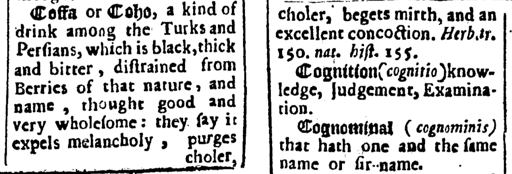
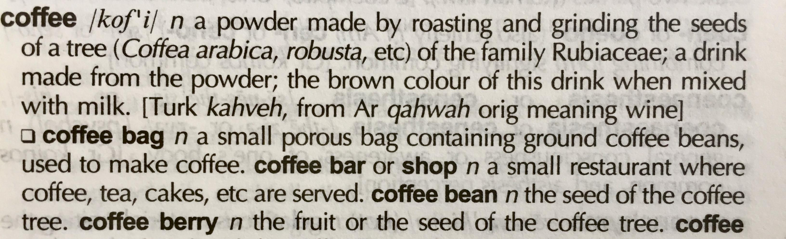
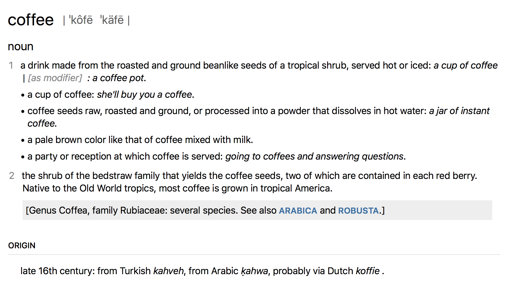

The goal of this course is to introduce a brief history of dictionaries as tools for the organization of knowledge about words and their meanings, and to analyze different ways of understanding and classifying the dictionary genre. In order to do so, the course will cover the constituent parts of a dictionary (macrostructure, microstructure and mediostructure) as well as different kinds of dictionary typologies, including those based on source and target languages (monolingual, bilingual, multilingual); types of language(s) and topic(s) covered (general language, encyclopedic, terminological); medium (print and electronic); semantic structure (onomasiological vs. semasiological dictionaries); and target audience (literate adults, language learners, language professionals). At the end of this course, students will have a fundamental understanding of the complexities of the dictionary genre as well as an appreciation of the role played by the medium in which the dictionary is compiled and consumed -- from clay tablets to computer screens.

## Learning Outcomes

Upon completion of this course, students will be able to

- appreciate the complexity of the dictionary genre and its history
- analyze the structure of a dictionary entry
- categorize dictionaries based on their content and/or target audience
- understand the role played by the medium in which the dictionary is compiled and consumed

## What is a dictionary?

- Complex object: a text, a model of language, a tool and a cultural artifact.  

<Video provider="youtube" id="ynhe5tsTMNs" caption="Why are dictionaries so complex? " />

## How dictionaries came to be

- Early history of lexicography (Middle East, Ancient China and Ancient Greece). Urra=hubullu (Summerian-Akkadian bilingual glossary): commercial and practical interests vs. literary traditions (Greece, China).
- Medieval glosses.
- Academic tradition in lexicography. \[Format: text]  
- Evidence-based lexicography (Johnson, sources)
- Standardization and nation-building (della Crusca, Académie française  etc.)

## What makes a dictionary dictionary?

- Semantic structure: semasiology vs. onomasiology.

### Macrostructure

- emergence of the alphabetic order

### Microstructure

- understanding dictionary entries.

### Mediostructure

- hypertext

## Dictionary typologies

- Target languages (monolingual, bilingual, multilingual)
- Types of language(s) and topic(s) covered (general language, encyclopedic, terminological)
- Standardization: prescriptive, descriptive
- Target audience (literate adults, language learners, language professionals).

## Carved in stone? The role of the medium

- From clay tablets to computer screens. How the material changed the way we compile, disseminate and use dictionaries.

Think of the way Thomas Blount defined _coffee_ (coffa) in his _Glossographia; or, a dictionary interpreting the hard words of whatsoever language, now used in our refined English tongue_, a very popular dictionary of its time, first published in 1656:

Was 17th century coffee more potent than the one we use today? Did it really rid people of debilitating depression and misanthropic cynicism? Why does Blount's definition feel and read differently than the ones provided by the modern lexicographic works such as _The Chambers Dictionary_ or _The New Oxford American Dictionary_?

**Exercise.** Spend some time analyzing the above three entries. What would you say were the main stylistic features of lexicographic prose? How would you describe the tone of Blount's entry when compared to _The Chambers_ or the NOAD? What conclusions can you draw from the fact that modern entries for  _coffee_ contain more lexical information? And yet Blount's definition addresses something that other definitions don't: coffee as a stimulant. What do you make of that?

Historical, legacy dictionaries remain valuable to humanists precisely because they provide culturally shaded insights into the lexical knowledge of a particular epoch — sometimes in contrast to contemporary experiences, attitudes or values. We study legacy dictionaries not because we need them for linguistic survival in a world of fauxhawks, twerking and jeggings, but because they have something important to teach us about language, about the people who wrote them and about the time in which they were written.

When you analyzed the above three entries, you've probably also noticed that they don't only sound different, they also _look_ different.

In terms of typography and layout, there are important differences not only between 17th and 21st century dictionaries, but also between the two modern dictionaries. _The Chambers_, for instance, is more compact: it doesn't number separate senses, it uses abbreviations (n for noun, Turk for Turkish, Ar for Arabic etc.). The _NOAD_, on the other hand, doesn't seem to be a fan of abbreviations; it uses much more whitespace, starts each example or subsense in a new line, and has a separate section for etymology ("Origin").  

These differences can be partly ascribed to the fact that  _The Chambers_ is a print dictionary, and the entry from the _NOAD_ comes from its  electronic edition. Print dictionaries are like prime real estate: space in them _is_ very expensive. To limit the costs of printing and make the end product manageable, easy to hold and browse through even for those of us who have not descended from giants, lexicographers have over time developed a set to conventions that they use to  structure, abbreviate and layout dictionary content in the most compact way possible. Some of those conventions, as we can see, are no longer strictly necessary when a dictionary is published electronically.

## Instead of a conclusion: where next?

This section will point in the direction of other courses in the ELEXIS Curriculum.