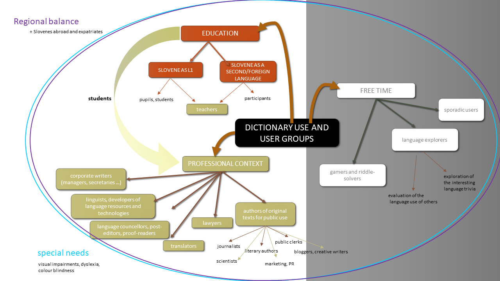
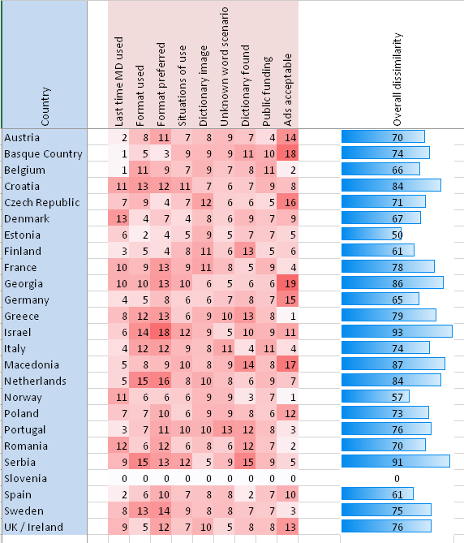
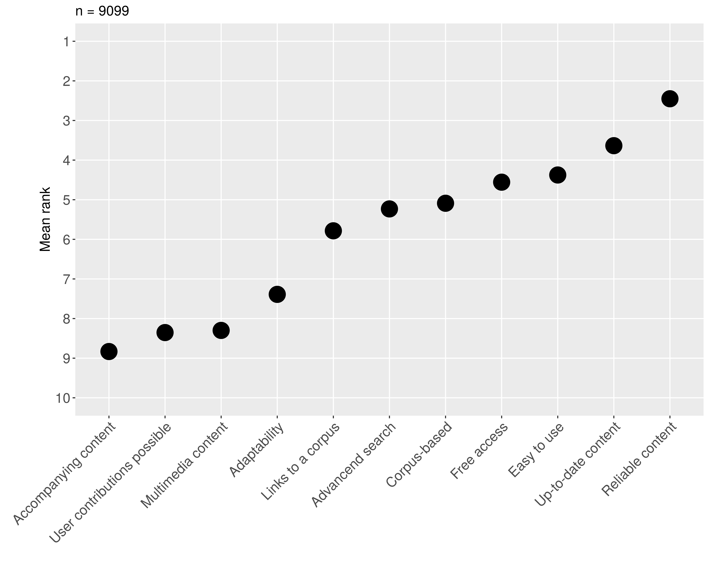
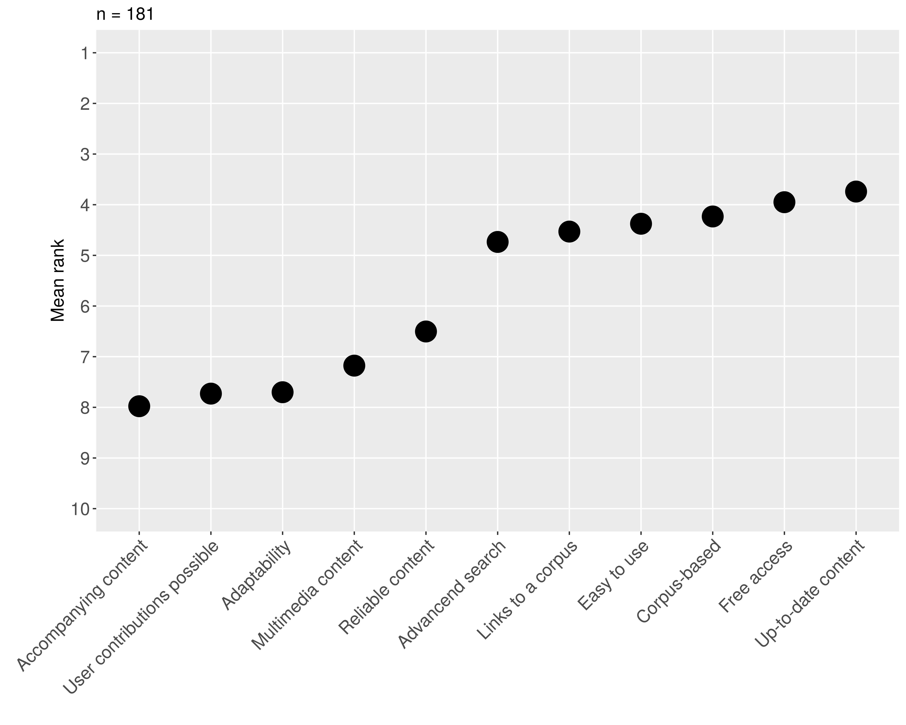
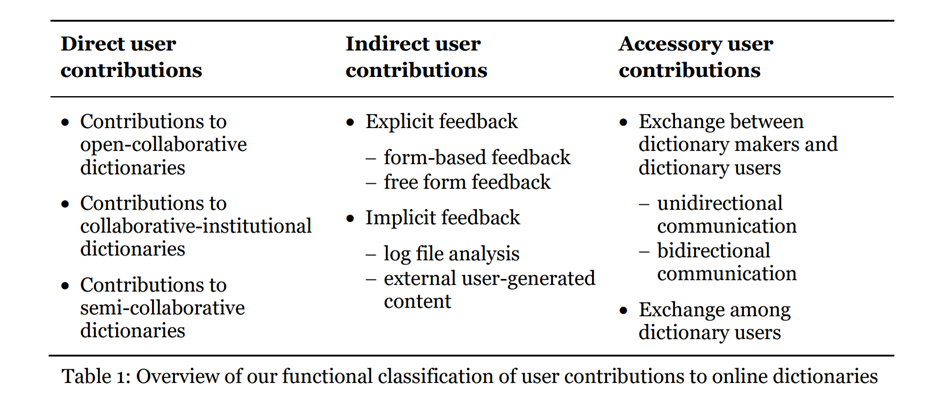

The goal of this course is to introduce students to the important role played by dictionary usage research when developing and implementing new dictionaries. The course will address the question of how different types of target users (in terms of age, language proficiency and pre-existing skills) or different types of use (encoding, decoding, translation etc.) influence the scope of the dictionary, the lemma selection process or the very structure of a dictionary entry. At the end of this course, students will have a fundamental understanding of the ways in which user research (both commercially and academically) can contribute to the tailoring of lexicographic content. Going beyond the realm of user-centered lexicography, the course will also explore possible user contributions in the creation of content and the increasing importance of crowdsourcing in lexicography.

## Learning Outcomes

Upon completion of this course, students will be able to:

- understand the role of users in dictionary-making process
- distinguish between different types of users, as well as understand some of the specifics of different user groups
- know different methods for conducting user research, including advantages of shortcomings of each of the method
- understand the concept of crowdsourcing and different techniques of using the method in dictionary compilation.

## Dictionary users and their role in making a dictionary

When starting to plan a compilation of a dictionary, one always has to consider its users. As Atkins and Rundell point out (2008: 32), in order to meet the needs of (most) users, one needs "to get the clearest possible picture of who these users are and what kinds of question they will ask of their dictionary". One of the first and most important tasks of dictionary editors and lexicographers is to prepare a profile of their user(s), and read up on the latest literature on dictionary use. In this course, we will look at different types of users, different methods used for conducting dictionary use research, and some recent developments on including users into dictionary-making process.

## Different types of dictionary users

There are various types of dictionary users, differing in age, education, language proficiency, contexts in which they will use a dictionary, and so forth. While a dictionary may attempt to target several different types of users, one group should be selected as the main target group. This will then have an effect on dictionary macrostructure and microstructure, for example on the amount of information provided (e.g. number of headwords), wording of the definitions and even data presentation (which features will be given more prominence).

## Example scenario

### Type of dictionary: General Bilingual Dictionary

There are many criteria that can be used to classify dictionaries. If we use form as a criteria, we can distinguish between monolingual, covering only one language, bilingual, covering two languages and multilingual, covering more than two languages. Many bilingual dictionaries are bidirectional which means they actually contain two dictionaries in one; of the two languages involved, one is once a source language and once a target language. Let us assume we are planning a general bilingual dictionary for Italian - German/ German-Italian.

### Expected users:

One of the main users groups of this dictionary are translators, as one of the purposes of the dictionary is assisting in translation tasks (this is also mentioned on the dictionary cover). Translators as a user group is a heterogeneous group and can be divided into two sub-user groups: translation students and professional translators.

**Translation students:** They have linguistic and cultural transfer skills in at least two working languages, in this case German and Italian. These skills include lexical, grammatical and pragmatic knowledge of both languages. One of the languages might their native language, or they have near-native competence of at least one of the two languages. However, translation students still have to improve their linguistic and cultural transfer skills and they have to acquire domain competences, i.e. knowledge in domain specific fields and domain-specific language. Translation students are expected to possess relevant dictionary skills such as how to consult dictionaries and search for external resources (e.g. corpora, encyclopedia etc.).

**Professional translators:** They have high language and cultural skills in at least two working languages. One of the languages might be their native language, or they have near-native competence of at least one of the working languages, in this case German and Italian. They have domain competences, i.e. knowledge in domain specific fields and domain specific language, or at least they are aware that additional knowledge is needed from external sources. Professional translators have high dictionary use skills.

Another potential user group are **language learners:**

**Learners of German:** Language learners of German (as L2) might be high school students or university students with Italian as their native language.

**Learners of Italian:** Language learners of Italian (as L1) might be high school students or university students with German as their native language.

### **What the users will use the dictionary for:**

Translation students will use the dictionary to:

- understand the source text
- find equivalents in the target language
- find contextual information
- translate from L1 to L2
- translate from L2 to L1

Professional translators will use the dictionary for:

- understand the source text
- find equivalents in the target language
- find contextual information
- translate from L1 to L2
- translate from L2 to L1 (less common, since professional translators are usually required to translate into their native language)

Language Learners of German will use the dictionary to:

- find pronunciation information of a German word
- find grammatical information of a German word
- understand a German text
- find the German equivalent of an Italian word
- produce a German text
- identify and recognise false friends, i.e. two words or expressions in different languages that have similar forms but different meanings, since false friends are included within notes in the dictionary

A good representation of the complexity of user groups is offered by Arhar et al. (2016); while their figure was prepared to show the Slovenian dictionary user typology, it can be regarded as quite universal and can be applied in other countries or language communities. Three broader user groups are distinguished according to situations of dictionary use: users in (formal) education, users in professional context, and users in spare time. Each group is quite heterogeneous; for example, users in the group using the dictionaries in the professional context range from those with linguistic education (linguists, proofreaders, translators) to those without but with frequent production of different types of texts (e.g. journalists, marketing people, lawyers).

Nonetheless, it is also important to consider that there are differences between user groups across different countries. These differences are a consequence of differences in user habits, and, sometimes relatedly, the level of development of lexicography in a particular country. The evidence of this has been provided by Kosem et al. (2018), a study using the data obtained in the European survey on dictionary use (Kosem et al. 2017). This was by far the largest-scale survey of dictionary users, with a focus on monolingual dictionaries. The survey was completed by 9,562 respondents, over 300 respondents per country on average. In Figure 2, we can see the comparison between the Slovenian dictionary users and dictionary users from 24 other countries in the way they replied to nine different questions on dictionary use and attitude towards dictionaries. The scores are available per question (see Kosem et al. 2018 for more details on the questions asked), for example we can see that on the question about whether they find ads on dictionary websites acceptable, the users from Greece, Norway, Belgium, Romania and Sweden replied were similarly to the Slovenian users. Overall similarities or dissimilarities are indicated by blue ribbons on the right, showing that especially Estonian, but also Norwegian, Finnish and Spanish users seem to exhibit most similarities in dictionary habits and preferences with the Slovenian users.

One of the questions excluded from above-mentioned comparison was a question on preferred characteristics of a monolingual dictionary. Overall, the users from different countries mainly share preferences, with reliable content being ranked as the most important feature, followed by up-to-date content, ease of use, and free access. However, there are countries such as North Macedonia that considerably deviate from the European average; as shown in Figures 3 and 4 below, North Macedonian dictionary users valued reliability of dictionaries much less than several other features.

## Dictionary use research

Research into dictionary use has become increasingly important in recent years. New findings in this area are presented every year, both at lexicographic conferences and in journals and books. Although the field has made impressive progress, three patterns are still predominant: a) many studies tend to focus on students and language professionals, rather than on the more general dictionary-using public (cf. Lew 2015b: 234); b) many studies focus on English, especially advanced learners' dictionaries, and relatedly c) dictionary use research is well-represented in a small number of countries, and still in its beginnings or non-existent in many countries.

These studies employ various methods of dictionary research such as questionnaires, log file analyses etc. For an overview of different studies, see Atkins (1998); Welker (2010); Lew (2011); Töpel (2014); Lew (2015a); Müller-Spitzer et al. (2018). Influential individual contributions include: Béjoint (1989); Benbow et al. (1990); Atkins and Varantola (1997); Nesi (2000); Tono (2000; 2001); Lew (2002); Jopling (2003); Boonmoh and Nesi (2008); Dziemianko (2011); Frankenberg-Garcia (2011); Nesi and Tan (2011); Dziemianko (2012); studies in Müller-Spitzer (2014); Müller-Spitzer et al. (2015); Dziemianko (2016). In the next section, we look at different methods in detail.

### Methods in dictionary use research

Methods into dictionary use can be divided into direct, i.e. the ones where the users are aware of being a subject of research, and indirect, where the user behaviour is monitored unobtrusively during dictionary use, or analysed after it. In Table 1 we present advantages and shortcomings of most commonly used methods in dictionary research.

**Direct Methods**

|  | Advantages | Shortcomings |
| --- | --- | --- |
| **questionnaire** | <ul><li>relatively easy to prepare</li><li>good for large scale studies</li><li>dissemination via the WWW possible (increases potential number of participants)</li></ul> | <ul><li>provides limited insight</li><li>tendency of user overreporting or misreporting</li><li>incomplete answers; users can stop answering at any time</li></ul> |
| **interview** | <ul><li>comprehensiveness: good for getting detailed insight into dictionary use</li><li>ability to ask users for clarification on their answers</li></ul> | <ul><li>more suitable for small scale studies</li><li>a great deal of analysis needed (transcription, coding)</li><li>good sampling difficult</li><li>generalisations on smaller groups less reliable</li></ul> |
| **think-aloud protocol** | <ul><li>insight into user thinking during dictionary use</li></ul> | <ul><li>suitable only for small scale studies</li><li>a great deal of analysis needed</li><li>findings difficult to generalize</li><li>unnaturalness: user not used to describing their work during dictionary use</li><li>thinking-aloud might increase cognitive effort of participants</li></ul> |
| **eye-tracking** | <ul><li>comprehensiveness: good for getting detailed insight into dictionary use</li><li>useful for dictionary design and information placement</li></ul> | <ul><li>very invasive</li><li>expensive equipment</li><li>extensive training for researchers needed</li><li>suitable only for small scale studies</li><li>requires experimental design</li><li>demanding analysis</li><li>findings might be difficult to generalize</li></ul> |
| **user evaluation/feedback** | <ul><li>useful info for a particular dictionary</li><li>observations during actual dictionary use</li></ul> | <ul><li>limited to a particular resource</li><li>data can be difficult to analyze</li></ul> |

**Indirect Methods**

|  | Advantages | Shortcomings |
| --- | --- | --- |
| **log file analysis** | <ul><li>unobtrusive, no additional effort from users needed</li><li>evidence of actual use</li></ul> | <ul><li>demanding analysis</li><li>difficult to identify context of dictionary use</li><li>findings relevant for a particular resource only</li><li>little control over sample structure (unless users have to register and provide personal info)</li><li>log file data often not available (or very hard to get) for proprietary resources (e.g., dictionaries from commercial publishers)</li></ul> |
| **user monitoring** | <ul><li>monitor actual use during a specific task</li></ul> | <ul><li>findings could be limited to a particular task</li><li>more suitable for small-scale studies</li></ul> |
| **language problems (learner corpus analysis, forums etc.)** | <ul><li>unobtrusive, no additional effort from users needed</li><li>actual language problems</li></ul> | <ul><li>unobtrusive, no additional effort from users needed</li><li>evidence of actual use relevance of findings for dictionaries may be low</li></ul> |

Another possible approach to dividing the methods could be live and non-live, i.e. methods that measure WHILE the process is taking place (e.g. eye-tracking, think-aloud) and methods that measure AFTER the process has already finished (e.g. interview, user evaluation & feedback).

In any case, there is no ideal method for researching dictionary use. Researchers must choose the one most suitable for their purposes, with the most useful findings provided by a combination of methods, e.g. a questionnaire and follow-up interviews. Of course, a purpose of your study can pre-select or at least narrow your selection of methods. For example, if you are starting a dictionary project, you will likely select a method like a survey that can reach as many users as possible and is not reliant on a particular resource; on the other hand, if you want to evaluate, and possibly improve, an existing dictionary, you will be able to choose between indirect methods like log file analysis (if they are available) and qualitative direct methods such as an interview.

It is important to note that the effort needed for a good dictionary use study should not be underestimated, and that the shortcomings of the selected method(s) are always kept in mind, and acknowledged when presenting the findings. One thing for researchers to also consider is previous research - for example, if many surveys with a particular user group already exist, it makes more sense to use other methods to obtain the information not yet available.

## Involving users in dictionary development

While research into dictionary use may be a relatively young discipline, users have been involved in dictionary development for much longer, with [Oxford English Dictionary Reading Programme](https://public.oed.com/history/reading-programme/) being the most known example. Nowadays, many dictionaries provide their users with options to provide feedback, suggestions for improvements, or even new content (for example new words or senses). In this respect, [Collins](<https://www.collinsdictionary.com/submissions/latest)>) is taking a step further as they provide the users not only with an option to submit new words or senses, but also with feedback (and in a way acknowledgment) on the status of their suggestion (Pending investigation, Under Review, Published, Rejected). Various forms of user contributions to dictionaries are summarized by Abel and Mayer (2013).

All these approaches to involving users in dictionary compilation can be seen as forms of **crowdsourcing**, i.e. a method where a large group of non-experts is asked to help in solving a larger problem, with the aim of coming up with an end results that benefits a wider community. It should be noted that crowdsourcing involves much more than collaborative dictionary compilation; it can be applied to small tasks that benefit lexicographers indirectly, e.g. improving corpus annotation, cleaning bad data and so forth.

An interesting combination of crowdsourcing and collaborative lexicography is Thesaurus of Modern Slovene (Krek et al. 2017), a resource that was built semi-automatically from English-Slovenian bilingual dictionary. The users can contribute in three ways: by voting on existing synonyms, by suggesting new synonyms, and by voting on user-suggested synonyms. The authors also continuously work on improving the dictionary data, including using user contributions, making this a truly collaborative undertaking.

Crowdsourcing does not always take place in a dictionary environment. Data can be also crowdsourced in seemingly unrelated activities where users (or perhaps not even dictionary users) perform some other task. A popular form of such data collection is **gamification**, where tasks are provided in a form of a game, offering the users an interactive experience without necessarily divulging the final purpose of the game, and often fulfilling a didactic purpose at the same time. Gamification is still relatively new in lexicography; in the ELEXIS project, two games (mobile apps) with a crowdsourcing purpose were developed: Game of Words, where the users play a game guessing collocations and synonyms, and Cross the word puzzle game. The games use automatically extracted data as input, and users replies are used to identify good and bad information, thus filtering the unwanted content for lexicographers (see Arhar et al. 2020 for more). There are still many challenges in implementing gamification in lexicography, with the main ones being how to efficiently design the games, and implement the results into lexicographic workflow.

## User research in the digital era: the way forward

The main message of this course is that when planning a dictionary, make sure you consider user needs and preferences in every decision. If not enough information on your target users is available, use one or more available research methods to obtain it. However, be aware of advantages and shortcomings of each method to avoid making wrong assumptions or generalizations about your users. Also, think of ways how to get user feedback (directly or indirectly) once publishing a dictionary as this can help you continuously improve your dictionary.

Research in dictionary use is on the rise, but much more work needs to be done. On the one hand, geographical gaps need to be filled as dictionary use in some countries and/or for languages is poorly studied or not studied at all. On the other hand, digital era has brought new challenges, changing user habits and needs, not only in using dictionaries but also in other activities. Dictionaries are yet to fully exploit all the potential of technological advancements, and it will be paramount to consider users when making these dictionaries of the future.

## References:

Arhar Holdt, Špela, Kosem, Iztok, Gantar, Polona. 2016. "Dictionary user typology: the Slovenian case". In: MARGALITADZE, Tinatin (ed.), MELADZE, George (ed.). _Lexicography and linguistic diversity: Proceedings of the XVII EURALEX International Congress_, 6-10 September, 2016. Ivane Javakhishvili Tbilisi State University. p.179-187.

Giacomini, Laura. 2018. "Dictionaries for Translation". In: Pedro A. Fuertes-Olivera (ed.) _The Routledge Handbook of Lexicography._
