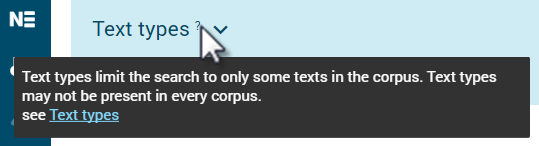

The course will introduce corpus tools available in ELEXIS and describe various ways in which they can be exploited in lexicographic research and for compiling dictionaries. At the end of the course, students will be able to build corpora, as well as evaluate their quality and suitability for the respective lexicographic task. Students will also acquire the skills necessary to work with the tools effectively to retrieve valid linguistic information from the corpus. Practical examples will simulate the use of these tools in the lexicographic workflow.

## Learning Outcomes

Upon completion of this course, students will be able to

- build a corpus in Sketch Engine
- use Sketch Engine for data analysis in the lexicographic workflow

## Introduction

Sketch Engine contains many screens, settings, controls and statistics. It is beyond the scope of this course to give detailed information about each one of them. The user will, however, find lots of useful information with links pointing to related resources directly in the interface in the form of tooltips. Please pay attention to the question marks in the interface.

## Building a corpus

The ELEXIS tool used for building corpora is Sketch Engine [www.sketchengine.eu](http://www.sketchengine.eu). Sketch Engine has a built-in module allowing the user to build their own corpora without the need for any specific technical or IT knowledge. Any user with a general computer skills is able to use the module and build corpora successfully.

The module supports two main approaches:

- building a corpus from the data that the user has (documents, texts, papers, articles in electronic format) 
- building corpus by having Sketch Engine download specific pages or websites from the web or even having Sketch Engine search for the relevant content first and then download it.

A corpus can be built by either method and even by combining both methods.

### From user's own data (data upload)

This methods assumes that the user has texts in a common electronic format such as doc, docx, txt, html or pdf. The texts should be uploaded in a similar manner as uploading documents in any web service. Once the documents are uploaded, they will be tokenized, lemmatized and tagged automatically and processed into a corpus. 

To learn to build a corpus by uploading your own data, use these resources:

Web: [https://www.sketchengine.eu/guide/create-corpus-from-files/](https://www.sketchengine.eu/guide/create-corpus-from-files/)

YouTube: [https://youtu.be/gMicxJAS024](https://youtu.be/gMicxJAS024)

<Video provider="youtube" id="gMicxJAS024" />

Metadata linked to the whole documents can be added prior to uploading or later using the built-in document annotation tool [https://www.sketchengine.eu/guide/document-annotation-tool/](https://www.sketchengine.eu/guide/document-annotation-tool/). Metadata related to smaller segments (phrases, sentences etc.) must be inserted only prior to uploading. They cannot be inserted after the data have been uploaded. The annotation tool cannot be used.

### From the web (web search, web scraping, web harvesting)

The corpus building module also supports automatic collection of linguistically valuable text data from the web. There are 3 modes:

- web search\
  The user must specify at least 3 keywords (or key phrases) that define the desired topic of the future corpus. Sketch Engine uses interact with the Bing search engine to find the most relevant web pages corresponding to the keywords. 
- URLs\
  The user must supply a list of urls pointing to concrete webpages that should be downloaded. A virtually unlimited number of urls can be supplied. Links found on the pages will not be followed.
- website\
  The user must specify one website that should be downloaded. Links found on the pages will be followed. Links pointing to other websites will not be followed.

Use the tooltips in the interface to learn about the different options and their basic and advanced settings.

In all three modes, the pages are downloaded, cleaned, deduplicated, tokenized, tagged for parts-of-speech, lemmatized and processed into a corpus.

To learn to build a corpus from the web, use these resources:

Web: [https://www.sketchengine.eu/guide/create-a-corpus-from-the-web/](https://www.sketchengine.eu/guide/create-a-corpus-from-the-web/)

YouTube: [https://youtu.be/VjHC4lMop-s](https://youtu.be/VjHC4lMop-s)

<Video provider="youtube" id="VjHC4lMop-s" />

To learn about the process of cleaning and deduplication: [https://www.sketchengine.eu/blog/build-a-corpus-from-the-web/](https://www.sketchengine.eu/blog/build-a-corpus-from-the-web/)

### Making the corpus bigger

The process can be repeated as many times as required to make the corpus bigger. The same corpus can be build by combining the two approaches: data upload and texts downloaded from the web.

When downloading texts from the web, each web page will only be included in the corpus once even if the user tries to add the same page again or of a different web search finds the same page again. 

## Evaluate the quality and suitability for the lexicographic task

link to course Introduction to Corpus-Based Lexicographic Practice - 

## Using corpus tools to extract lexicographic information from corpora: 

### Headword list

The headword list can be obtained in several ways depending on the purpose of the dictionary. The list of the most common words in the corpus should be obtained using the wordlist tool. This will list words sorted by their frequency. This approach is suitable for a general-purpose dictionary where the aim is to include all words based on their frequency of use rather than on their other qualities.

To learn to use the wordlist, use these resources:

Web\
[https://www.sketchengine.eu/quick-start-guide/word-list-lesson/](https://www.sketchengine.eu/quick-start-guide/word-list-lesson/)

[https://www.sketchengine.eu/guide/wordlist-frequency-lists/](https://www.sketchengine.eu/guide/wordlist-frequency-lists/)

YouTube: [https://youtu.be/nqpCIICCEdw](https://youtu.be/nqpCIICCEdw)

<Video provider="youtube" id="nqpCIICCEdw" />

### Keyword/Term list

When the aim of the dictionary is to provide information about domain-specific words or specialized terminology, the headword list should be generated by using the keyword and term extraction tool. This also assumes that a specialized domain-specific corpus is used. The keyword and term extraction tool will automatically eliminate general vocabulary and will only return words which are specific of the corpus, typically nouns, adjectives and noun phrases. 

Because the extraction of keywords and terms requires a domain-specific corpus, it is common for the user to have to build their own copora. Therefore, the procedure of extracting terminology is included in the videos about corpus building:

[https://youtu.be/VjHC4lMop-s](https://youtu.be/VjHC4lMop-s)

[https://youtu.be/gMicxJAS024](https://youtu.be/gMicxJAS024)

Related web resources

[https://www.sketchengine.eu/quick-start-guide/keywords-and-terms-lesson/](https://www.sketchengine.eu/quick-start-guide/keywords-and-terms-lesson/)

[https://www.sketchengine.eu/guide/keywords-and-term-extraction/](https://www.sketchengine.eu/guide/keywords-and-term-extraction/)

### Frequency information

Frequency information is the basic statistic displayed in all Sketch Engine tools. There are, however, different types of frequency. Frequencies can be displayed by adjusting the view options accessible via an icon above the search results of each screen.

Absolute frequency – (also called number of hits) The most frequently used frequency, available in all tools in Sketch Engine. It shows how many times a word or phrase was found in the corpus. It cannot be used for comparing frequencies obtained from different corpora of uneven sizes. [https://www.sketchengine.eu/my_keywords/frequency/](https://www.sketchengine.eu/my_keywords/frequency/)

frequency per million – (also called normalized frequency or relative frequency) It indicates the number of hits in 1 million words. Frequencies obtained form corpora of uneven sizes should be compared using this frequency. [https://www.sketchengine.eu/my_keywords/freqmill/](https://www.sketchengine.eu/my_keywords/freqmill/)

ARF – (average reduced frequency)  ARF is a modified frequency whose calculation prevents the results from being excessively influenced by a high concentration of a token in only one or more small parts of the corpus. If the token is distributed evenly in the corpus, ARF and absolute frequency have similar or identical values. [https://www.sketchengine.eu/documentation/average-reduced-frequency/](https://www.sketchengine.eu/documentation/average-reduced-frequency/)

Document frequency – It indicates how many documents contain a word or phrase. [https://www.sketchengine.eu/my_keywords/document-frequency/](https://www.sketchengine.eu/my_keywords/document-frequency/)

The tools to that should be used to get the frequency of:

| **frequency required for**                                                                          | **use this tool**                                                 |
| --------------------------------------------------------------------------------------------------- | ----------------------------------------------------------------- |
| tokens (words)                                                                                      | wordlist                                                          |
| keywords or terms                                                                                   | keywords                                                          |
| collocations                                                                                        | word sketch or the frequency distribution tool in the concordance |
| multiword expressions (n-grams)                                                                     | n-grams or the frequency distribution tool in the concordance     |
| phrases, grammatical and lexical structures and also any other information contained in the corpus" | frequency distribution tool in the concordance                    |

#### Resources to learn to use the tools

Wordlist

[https://www.sketchengine.eu/quick-start-guide/word-list-lesson/](https://www.sketchengine.eu/quick-start-guide/word-list-lesson/)

[https://www.sketchengine.eu/guide/wordlist-frequency-lists/](https://www.sketchengine.eu/guide/wordlist-frequency-lists/)

[https://youtu.be/nqpCIICCEdw](https://youtu.be/nqpCIICCEdw)

Keywords and terms

[https://www.sketchengine.eu/quick-start-guide/keywords-and-terms-lesson/](https://www.sketchengine.eu/quick-start-guide/keywords-and-terms-lesson/)

[https://www.sketchengine.eu/guide/keywords-and-term-extraction/](https://www.sketchengine.eu/guide/keywords-and-term-extraction/)

Word Sketch (collocations)

[https://www.sketchengine.eu/quick-start-guide/word-sketch-lesson/](https://www.sketchengine.eu/quick-start-guide/word-sketch-lesson/)

[https://youtu.be/tKdEa1E-p2Y](https://youtu.be/tKdEa1E-p2Y)

Frequency distribution in the concordance

[https://youtu.be/GP5p8XEvwfM](https://youtu.be/GP5p8XEvwfM)

[https://www.sketchengine.eu/quick-start-guide/concordance-lesson/](https://www.sketchengine.eu/quick-start-guide/concordance-lesson/)

[https://www.sketchengine.eu/guide/concordance-a-tool-to-search-a-corpus/](https://www.sketchengine.eu/guide/concordance-a-tool-to-search-a-corpus/)

## Part of speech information

Part of speech (POS) information can be retrieved from the corpus and can be used in searches and analysis provided the corpus is tagged for parts of speech. The corpus info page gives information about it and also lists the most frequent tags and contains a link to the full tagset. See: [https://www.sketchengine.eu/guide/corpus-info-page/](https://www.sketchengine.eu/guide/corpus-info-page/)

POS is indicated on the result screen of many tools such as the word sketch:

The most comprehensive POS information including the full POS tag can be found in the concordance. Use View options to configure which information should be displayed together with the concordance lines. Watch this video to learn how to configure what you see in the concordance: [https://youtu.be/EnDLYycJLHs](https://youtu.be/EnDLYycJLHs)

## Collocations

Word sketch

The main tool to analyse collocations in Sketch Engine is the word sketch. It identifies the most typical collocations. Use these resources to understand how the word sketch works and to learn to use it.

Web

[https://www.sketchengine.eu/quick-start-guide/word-sketch-lesson/](https://www.sketchengine.eu/quick-start-guide/word-sketch-lesson/)

[https://www.sketchengine.eu/guide/word-sketch-collocations-and-word-combinations/](https://www.sketchengine.eu/guide/word-sketch-collocations-and-word-combinations/)

YouTube [https://youtu.be/tKdEa1E-p2Y](https://youtu.be/tKdEa1E-p2Y)

<Video provider="youtube" id="tKdEa1E-p2Y" />

For an easy to understand introduction for non-mathematicians, use this link to understand how Sketch Engine defines typicality and identifies typical collocations: [https://www.sketchengine.eu/blog/most-frequent-or-most-typical-collocations/](https://www.sketchengine.eu/blog/most-frequent-or-most-typical-collocations/)

Concordance - Collocations

Another way of detecting and analysing collocations is the Collocation tool in the concordance. It should be used for collocations which cannot be identified by the word sketch, for example collocations of long phrases or collocations of function words or phrases consisting of function words.

The concordance collocation tools allows setting the left and/or right context and also the attribute that should be counted. The following screenshot shows the settings that will calculate the frequency of lemmas on the 2nd and 3rd position to the left of KWIC (=the search phrase). The collocations of a phrase such as to be about to are not possible to analyse using the word sketch.

## Example sentences

Tools in Sketch Engine are interlinked so that it is possible to jump from one tool directly to the result in another tool. The available links depend on the concrete tools but all tools are always linked to the concordance so that the user can display the source sentences from which the search result or the statistics were obtained. Such sentences can be used as dictionary examples but the concordance has a dedicated tool called GDEX which stands for Good Dictionary EXamples. The tool will analyse the specified number of concordance lines and will sort them by the GDEX score which indicates how well the sentence fulfils the criteria for a good dictionary example. Refer to the Introduction to Corpus-Based Lexicographic Practice course for more details on this. To learn how the tool works, refer to [https://www.sketchengine.eu/guide/gdex/](https://www.sketchengine.eu/guide/gdex/)

## Word senses

A corpus annotated for word senses can be easily used for analysis and statistics where word senses are taken into account because the word sense information will be included as metadata in the corpus. However, the most typical situation is that a corpus is not annotated in such a way. If this is the case, these approaches can be used to identify word senses:

### Word sketch

A mere look at the collocation in the word sketch can give the first idea about the different senses a word can have. For example, party (social event), party (political group), party (person/people involved in something)

Sometimes clustering the collocations can make the senses even more noticeable. The clustering option is available in the view options found on the result screen. Here it is easy to see the three senses: bar (place to drink), bar (in computer interface), bar (food).

### Concordance

The concordance allows annotating and sorting the concordance lines according to any criteria the user chooses and, therefore, can also be used for grouping the lines by the senses.

After concordance lines are annotated, they can be analyses further or subcorpora based on senses can be created from them. Once subcorpora are created, other Sketch Engine tools can be used to analyse them. 

Learn to use the annotation tool here [https://www.sketchengine.eu/guide/manual-annotation-skema/](https://www.sketchengine.eu/guide/manual-annotation-skema/)

## Syntactic patterns

There are several ways of to explore syntactic patterns of a word.

### N-grams for discovering patterns

Generating n-grams of different sizes that contain the word can show preposition and other function words frequently found before and after the word. The ADVANCED tab of the n-gram tools lets the user specify various search options and restricting conditions.

See also https://www.sketchengine.eu/my_keywords/n-gram/

Learn to use n-grams here https://www.sketchengine.eu/guide/n-grams-multiword-expressions/

### Word sketches for discovering patterns

Word sketches contain some grammatical relations specifically designed to identify the typical patterns, such as prepositions before and after the word or usage patterns:

Use these resources to learn to use the word sketch:

YouTube [https://youtu.be/tKdEa1E-p2Y](https://youtu.be/tKdEa1E-p2Y)

Web guide\
[https://www.sketchengine.eu/quick-start-guide/word-sketch-lesson/](https://www.sketchengine.eu/quick-start-guide/word-sketch-lesson/)

[https://www.sketchengine.eu/guide/word-sketch-collocations-and-word-combinations/](https://www.sketchengine.eu/guide/word-sketch-collocations-and-word-combinations/)

### Concordance for discovering patterns

Using the concordance for discovering patterns involves mainly two concordance tools:

- sorting the concordance lines
- frequency distribution

Sorting

Sorting is only practical when the number of concordance lines is very small, typically a few dozen. Therefore, sorting has a very limited use and is generally unsuitable for multi-billion-word corpora which typically produce thousands of hits even when searching for rare phenomena.

Frequency distribution

Frequency distribution refers to a function that operates like a calculator of concordance lines. It produces counts of words, lemmas, tags and other attributes in specific positions of a concordance line. This frequency distribution shows the frequency of the POS attribute following a/the total of. It is easy to see that a total of has a strong tendency to be followed by a number (e.g. a total of 15 people) while the total of is frequently followed by noun. A close look at the actual lines would reveal that other (x) and adjective (j) refers to a determiner followed by a noun or adjective followed by a noun.

A similar technique can be used to analyse the left or right context or of other lexical or grammatical structures.

## Translations

### Parallel concordance

A parallel corpus is required for translation lookup. 

This example shows segments in English and their translations into French and German. The yellow highlighting indicates the most probable place in the translated segment where the translation of the word could be located. The highlighting does not claim to be a direct translation.

To learn to use the parallel concordance, use these resources:

https://www.sketchengine.eu/quick-start-guide/parallel-concordance-lesson/

https://www.sketchengine.eu/guide/parallel-concordance-searching-translations/

YouTube [https://youtu.be/vklUWMRV1ew](https://youtu.be/vklUWMRV1ew)

<Video provider="youtube" id="vklUWMRV1ew" />

### Bilingual word sketch

A very convenient way of looking up translations of collocations is the bilingual word sketch. A parallel corpus is not required. Two corpora in two languages will suffice. The result will be more relevant if the two corpora are comparable corpora. The tool will display the word sketches for the same lemma in two languages next to each other. Although this does not use any specific algorithms or statistics and it is only a different way of displaying the two word sketches, it makes it easy to locate the translation in the other language. 

## Neologisms

The tool to identify neologisms is called Trends. It requires time-stamped data to identify lexical items whose frequency of use changes in time. It will, therefore, identify neologisms, but also other words whose use increased or decreased over time because a certain topic started to be talked about frequently or because they are going out of use as outdated language or a topic with decreasing level of importance or interest.

It is important to understand that the tool only takes into the change of the frequency in time. It does not perform any analysis whether the item  in question is a valid word or a neologism in the lexicographic sense of the word. Therefore, the result will always include many other tokens whose frequency changed in time but are not necessarily neologisms or legitimate words at all. Despite the high number of unwanted items, the result is still extremely useful. Although it still requires the user to go through the list and identify the real neologisms,  it may only take a couple of hours to go through a list of several thousand items and end up with a few dozen neologism candidates. When compared to the traditional, completely non-automated procedure of simply reading texts, it speeds the process up immensely. Months of searching are reduced to mere hours.

Use this resource to learn the details: https://www.sketchengine.eu/guide/trends/

## Thesaurus

The tool to identify synonyms and words belonging to the same semantic field is called the Thesaurus in Sketch Engine. It uses a fully automatic process that evaluates lemmas in the corpus based on the collocations they form. The words that frequently co-occur with similar collocates are identified as similar in meaning. 

Visit this link to understand better how the identification of synonyms works [https://www.sketchengine.eu/blog/automatic-thesaurus-synonyms-for-all-words/](https://www.sketchengine.eu/blog/automatic-thesaurus-synonyms-for-all-words/)

The quality of the thesaurus is heavily influenced by the size of the corpus. For best results, both the headword and the synonyms should have a sufficient frequency, ideally thousands of hits or preferably much more. This means that  the largest possible corpus should be used.

Use these resources to understand and learn to use the thesaurus:

YouTube [https://youtu.be/kLsNUdTrTLk](https://youtu.be/kLsNUdTrTLk)

<Video provider="youtube" id="kLsNUdTrTLk" />

Web guide:

[https://www.sketchengine.eu/quick-start-guide/thesaurus/](https://www.sketchengine.eu/quick-start-guide/thesaurus/)

[https://www.sketchengine.eu/guide/thesaurus-synonyms-antonyms-similar-words/](https://www.sketchengine.eu/guide/thesaurus-synonyms-antonyms-similar-words/)

## Concordance annotation tool

Although Sketch Engine offers a multitude of options to generate the required result automatically, it is sometimes inevitable to process concrete hits (concordance lines) manually and divide them into groups or label them before the required analysis can be performed. This is typical in the case of corpora with a limited amount of metadata or when working with word senses or with phenomena that cannot be distinguished automatically.

For this reason, Sketch Engine contains a concordance annotation tool which can be used to assign labels to concordance lines. 

All tools  in Sketch Engine are linked to the concordance. It is therefore always possible to display the hits (the concrete concordance lines) which produced the concrete result and process them further manually.

Use this link to learn to use [https://www.sketchengine.eu/guide/manual-annotation-skema/](https://www.sketchengine.eu/guide/manual-annotation-skema/)

## CQL - Concordance advanced search

The Corpus Query Language is a special code or query language used in Sketch Engine to search for complex grammatical or lexical patterns or to use search criteria which cannot be set using the standard user interface. CQL can make use of any information contained in the corpus such as the attribute (word form, lemma, tag…), text types, token positions, structure beginnings and ends (sentence, paragraph, dcoument…) and combine them into the same search query. 

CQL can be used to construct simple as well as enormously complex search queries. 

To learn to use CQL, it is best to start by watching these instructional videos: [https://www.youtube.com/playlist?list=PLPVgp0Xm6hWBLZzD7haCVbhC9pSfWZk1S](https://www.youtube.com/playlist?list=PLPVgp0Xm6hWBLZzD7haCVbhC9pSfWZk1S)

<Video provider="youtube" id="playlist?list=PLPVgp0Xm6hWBLZzD7haCVbhC9pSfWZk1S" />

**A detailed web guide can be found here: [https://www.sketchengine.eu/documentation/corpus-querying/](https://www.sketchengine.eu/documentation/corpus-querying/)**