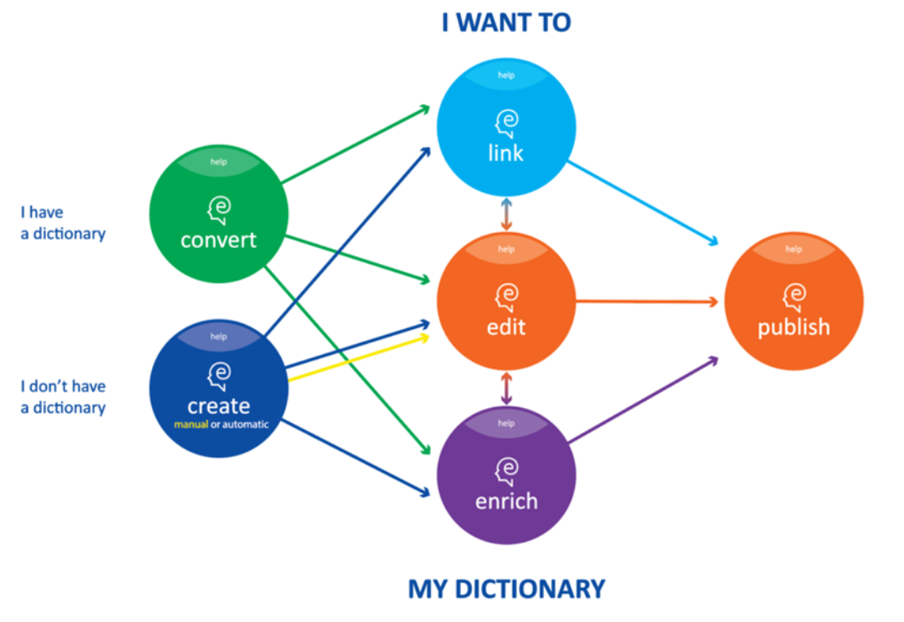

This course introduces Elexifier, a cloud-based dictionary service for the conversion of legacy XML and PDF dictionaries into a shared data format based on the ELEXIS Data Model. 

## Learning Outcomes

Upon completion of this course, students will be able to:

- convert XML or PDF dictionaries into TEI-compliant XML in line with the specification described in the ELEXIS Data Model.

## Prerequisites

This course requires basic knowledge of XML, which can be acquired from the cours[e Capturing, Modeling and Transforming Lexical Data: An Introduction](https://elexis.humanistika.org/resource/posts/capturing-modeling-and-transforming-lexical-data-an-introduction). Especially the part on Modeling lexicographic data (with XML) is essential. In addition to this, we recommend doing the course [Extracting Lexical Data: XPath for Dictionary Nerds](https://elexis.humanistika.org/resource/posts/xpath-for-dictionary-nerds) if you want to grasp the finer details of defining transformation in Elexifier. For transforming PDF dictionaries, basic knowledge of Lexonomy is recommended. For this, check out the course [Lexonomy: Mastering the ELEXIS Dictionary Writing System](https://elexis.humanistika.org/resource/posts/lexonomy-mastering-the-elexis-dictionary-writing-system). Finally, if you want to learn more about the Dictionary Matrix, we suggest you do the course [Mastering LEX1: The Dictionary Matrix](https://elexis.humanistika.org/resource/posts/mastering-lex1-the-dictionary-matrix).

## Introduction

### What is Elexifier?

Elexifier is a cloud-based dictionary conversion service for conversion of legacy XML and PDF dictionaries into a shared data format so that it can be integrated in the ELEXIS infrastructure. It takes as input an XML or PDF dictionary and produces a TEI-compliant XML file in line with the specifications of the Elexis Data Model. The figure below shows the position of the Elexifier tool (the green circle) in relation to the complete set of the ELEXIS Dictionary Tools. 

Dictionaries that have been transformed using Elexifier, can be edited further in Lexonomy or can be imported into the Dictionary Matrix.

Elexifier is easy to use, as the interface and the user instructions guide you through the entire process. Moreover, no installation is required. Elexifier is accessed and operated via the web browser, and the data is stored on the Elexis server.

### What is the ELEXIS Data Model?

[This section will be added in spring 2022. If you already want to read more about the ELEXIS Data Model, see e.g. [Towards the ELEXIS data model: defining a common vocabulary for lexicographic resources](https://elex.link/elex2021/wp-content/uploads/2021/08/eLex_2021_03_pp56-77.pdf) and the ongoing work on [LEXIDMA](https://www.oasis-open.org/committees/tc_home.php?wg_abbrev=lexidma).]

## Let’s get started

### Accessing Elexifier

Elexifier can be accessed at: [https://app.elexifier.elex.is](https://app.elexifier.elex.is) 

### Create a user account and log in

See [user guide](https://elexifier.elex.is/help/) on how to.

For a quick introduction to Elexifier, check out the following video.

<Video provider="youtube" id="kqYLWdGR_Qo" />

## Transforming an XML dictionary

In the custom XML scenario, XPath formalisms are used for identifying the core elements in the original dictionary data and transforming these to a TEI Lex-0 compliant format. All information contained in the original dictionary is kept, and only the core elements are transformed to the shared format. The supported core elements are the same as those defined in the ELEXIS common vocabulary \[ADD LINK].

See the [user guide](https://elexifier.elex.is/help/#XMLtransformation) for detailed instructions on how to use the XML transformation.

## Transforming a PDF dictionary

In the PDF scenario a more complex process is needed. The PDF is first transformed in a flat structure using a pdf2xml conversion script (based on [https://github.com/kermitt2/pdf2xml](https://github.com/kermitt2/pdf2xml)). Then, a chunk of the resulting XML file is sent to [Lexonomy](https://lexonomy.elex.is/)  ([Měchura 2017](https://www.lexonomy.eu/docs/elex2017.pdf)), the online dictionary editing tool for manual annotation. Approximately 4 pages need to be annotated.  The annotated text is then used as the training material for machine learning algorithms that produce the entire dictionary converted to TEI Lex-0 compliant format. 

See the [user guide](https://elexifier.elex.is/help/#PDFtransformation) for detailed instructions on how to use the PDF transformation.

## Hands-on exercise

\[Exercise will be available in April 2022]

## Next steps 

#### Importing your dictionary into the Dictionary Matrix

The ELEXIS Dictionary Matrix is one of the main results of the ELEXIS project. It is a universal repository of linked senses, meaning descriptions, collocations, phraseology, translation equivalents, examples of usage and other types of lexical information found in existing lexicographic resources, monolingual, multilingual, modern, historical etc.. In the course **[Mastering LEX1: The Dictionary Matrix](https://elexis.humanistika.org/resource/posts/mastering-lex1-the-dictionary-matrix)** you can find out more about the Dictionary Matrix.

#### Editing your dictionary in Lexonomy

Lexonomy is a cloud-based, open-source platform for writing and publishing dictionaries. In the course **[Lexonomy: Mastering the ELEXIS Dictionary Writing System](https://elexis.humanistika.org/resource/posts/lexonomy-mastering-the-elexis-dictionary-writing-system)** you learn how to use Lexonomy.

## Read More

[Deliverable 1.4 ELEXIS Conversion Tools](https://elex.is/wp-content/uploads/2021/05/ELEXIS_D1_4_ELEXIS_Conversion_Tools.pdf) The appendix of this deliverable contains examples from dictionaries from ELEXIS partners, showing the input format together with the transformed output from Elexifier.