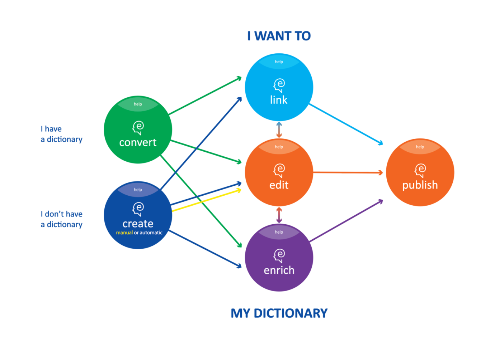

This course introduces Elexifier, a cloud-based dictionary service for the conversion of legacy XML and PDF dictionaries into a shared data format based on the ELEXIS Data Model.

## Learning Outcomes

Upon completion of this course, students will be able to:

- convert XML or PDF dictionaries into TEI-compliant XML in line with the specification described in the ELEXIS Data Model.

## Prerequisites

This course requires basic knowledge of XML, which can be acquired from the course [Capturing, Modeling and Transforming Lexical Data: An Introduction](/resource/posts/capturing-modeling-and-transforming-lexical-data-an-introduction). Especially the part on Modeling lexicographic data (with XML) is essential. In addition to this, we recommend doing the course [Extracting Lexical Data: XPath for Dictionary Nerds](/resource/posts/xpath-for-dictionary-nerds) if you want to grasp the finer details of defining transformations in Elexifier. For transforming PDF dictionaries, basic knowledge of Lexonomy is recommended. For this, check out the course **[Lexonomy: Mastering the ELEXIS Dictionary Writing System](/resource/posts/lexonomy-mastering-the-elexis-dictionary-writing-system)**. Finally, if you want to learn more about the Dictionary Matrix, we suggest you do the course **[Mastering LEX1: The Dictionary Matrix](/resource/posts/mastering-lex1-the-dictionary-matrix)**.

## Introduction

### What is Elexifier?

Elexifier is a cloud-based dictionary conversion service for conversion of legacy XML and PDF dictionaries into a shared data format so that these dictionaries can be integrated into the ELEXIS infrastructure. It takes as input an XML or PDF dictionary and produces a TEI-compliant XML file in line with the specifications of the Elexis Data Model. The figure below shows the position of the Elexifier tool (the green circle) in relation to the complete set of the ELEXIS Dictionary Tools.



Dictionaries that have been transformed using Elexifier, can be edited further in Lexonomy or can be imported into the Dictionary Matrix.

Elexifier is easy to use, as the interface and the user instructions guide you through the entire process. Moreover, no installation is required. Elexifier is accessed and operated via the web browser, and the data is stored on the Elexis server.

### What is the ELEXIS Data Model?

In each and every European country, elaborate efforts are put into the development of lexicographic resources describing the language(s) of the community. Although confronted with similar problems relating to technologies for producing and making these resources available, cooperation on a larger European scale has long been limited. As a consequence, many lexicographic resources are typically encoded in their own custom data format. This forms a major obstacle if we want to link, edit, enrich and publish data from various sources reliably as envisaged in the ELEXIS infrastructure (see Figure Graphic guide to the ELEXIS Dictionary Tools above). For this, semantic interoperability between the different lexicographic datasets is needed.

> “semantic interoperability exists when two systems have the ability to automatically interpret exchanged information meaningfully and accurately in order to produce useful results via deference to a common information exchange reference model”.  [Ide and Pustejovsky (2010)](http://www.cs.vassar.edu/~ide/papers/ICGL10.pdf)

Thus what is labelled as ‘example’ in one lexicographic resource should be the same as an element labelled ‘example’ in another lexicographic resource. To realise semantic operability among the ELEXIS lexicographic resources, the ELEXIS data model has been developed which aims to a) streamline the integration of lexicographic data into the infrastructure (using the ELEXIFIER tool), b) enable reliable linking of the data in the Dictionary Matrix, and c) provide a basic template for the creation of new lexicographic resources (e.g. in Lexonomy).

The aim of the ELEXIS Data Model is to ensure semantic interoperability in the ELEXIS infrastructure between lexicographic resources by focussing on a set of core elements. These core elements are the elements that are considered useful for linking dictionary data in the Dictionary Matrix and these are also the elements that you can extract and transform from your custom XML or PDF data using Elexifier.

The following core elements are distinguished and can be transformed in Elexifier:

| Core element       | Description                                                                                                                                                                                            |
| ------------------ | ------------------------------------------------------------------------------------------------------------------------------------------------------------------------------------------------------ |
| entry              | part of a lexicographic resource which contains information related to at least one headword.                                                                                                          |
| headword           | organising element of an entry in a lexicographic resource. Note: In printed dictionaries typically at the top of an entry.                                                                            |
| secondary headword | headword-like lexical item occurring within an entry in a lexicographic resource, for example derived forms, feminine forms, multiword expressions. Often an organising element of a part of an entry. |
| variant headword   | lexical item representing one of the alternative forms of the headword, for example spelling variation or regional variation.                                                                          |
| inflected form     | form of the inflectional paradigm of the headword.                                                                                                                                                     |
| part of speech     | any of the word classes to which a lexical item may be assigned, e.g. noun, verb, adjective, etc.                                                                                                      |
| sense              | part of an entry which groups together information relating to a meaning of a headword (or secondary headword), for example definitions, examples, and translations.                                   |
| sense indicator    | short statement that gives an indication of a meaning and permits its differentiation from other meanings within a sense structure of an entry.                                                        |
| definition         | statement that describes a meaning and permits its differentiation from other meanings within a sense structure of an entry.                                                                           |
| example            | instance of a lexical item's usage in a specific sense.                                                                                                                                                |
| translation        | equivalent in another language of any element in an entry. In Elexifier you can have a translation of the headword and of the example.                                                                 |
| label              | item from a controlled vocabulary indicating some kind of restriction on the use of the lexical item, for example, time, region, domain, register.                                                     |
| note               | free text remark that can accompany any element in a lexicographic resource.                                                                                                                           |
| cross-reference    | element providing any kind of link or reference to another element within or outside the lexicographic resource.                                                                                       |

Table 1. ELEXIS core elements that can be transformed using Elexifier.

If you already want to read more about the ELEXIS Data Model, see [Towards the ELEXIS data model: defining a common vocabulary for lexicographic resources](https://elex.link/elex2021/wp-content/uploads/2021/08/eLex_2021_03_pp56-77.pdf) and the ongoing work on [LEXIDMA](https://www.oasis-open.org/committees/tc_home.php?wg_abbrev=lexidma).

## Let’s get started

### Accessing Elexifier

Elexifier can be accessed at: [https://app.elexifier.elex.is](https://app.elexifier.elex.is)

### Create a user account and log in

To get started, you need to create a user account and log in. See [user guide](https://elexifier.elex.is/help/) on how to do this.

For a quick introduction to Elexifier, check out the following video.

<Video provider="youtube" id="kqYLWdGR_Qo" />

### Transforming an XML dictionary

In the custom XML scenario, XPath formalisms are used for identifying the core elements in the original dictionary data and transforming these to a TEI-compliant format. All information contained in the original dictionary is kept, and only the core elements are transformed into the shared format. The supported core elements are the same as those defined in the ELEXIS common vocabulary (see above in the section on the ELEXIS Data Model).

See the [user guide](https://elexifier.elex.is/help/#XMLtransformation) for detailed instructions on how to use the XML transformation.

### Transforming a PDF dictionary

In the PDF scenario a more complex process is needed. The PDF is first transformed in a flat structure using a pdf2xml conversion script (based on [https://github.com/kermitt2/pdf2xml](https://github.com/kermitt2/pdf2xml)). Then, a chunk of the resulting XML file is sent to [Lexonomy](https://lexonomy.elex.is/)  ([Měchura 2017](https://www.lexonomy.eu/docs/elex2017.pdf)), the online dictionary editing tool for manual annotation. Approximately 4 pages need to be annotated.  The annotated text is then used as the training material for machine learning algorithms that produce the entire dictionary converted to TEI-compliant format.

See the [user guide](https://elexifier.elex.is/help/#PDFtransformation) for detailed instructions on how to use the PDF transformation.

## Hands-on exercise: Transforming an XML dictionary with Elexifier

In this exercise you are going to transform a Sample Dictionary encoded in custom XML using Elexifier so that the dictionary can be integrated in the ELEXIS infrastructure.

The Sample Dictionary is an extract from the GLOBAL French Portuguese Dictionary © K Dictionaried Ltd. It contains two entries (‘boire’ and ‘café’) and can be found [here](https://github.com/elexis-eu/elexifier/blob/master/docs/examples/ElexifierSampleDictionary-v2-input.xml).

### Check out the XML of the Sample Dictionary

First, have a look at the input XML and see if you understand its structure. An extract of the XML of the entry for café ‘coffee’ is given below.


Figure: Extract from GLOBAL French Portuguese Dictionary © K Dictionaried Ltd

<Quiz>
  <Quiz.Card>
    <Quiz.MultipleChoice>
      <Quiz.Question>
        See if you can identify in this extract the name of the XML tag that is used for the entry element.
      </Quiz.Question>

      <Quiz.MultipleChoice.Option>
        EntryCtn
      </Quiz.MultipleChoice.Option>

      <Quiz.MultipleChoice.Option isCorrect>
        Entry
      </Quiz.MultipleChoice.Option>

      <Quiz.MultipleChoice.Option>
        DictionaryEntry
      </Quiz.MultipleChoice.Option>
    </Quiz.MultipleChoice>
  </Quiz.Card>
</Quiz>


### Transform the Sample Dictionary using Elexifier

Now we are going to transform the data using Elexifier.  What do you need to do?

#### 1. Login to Elexifier

To login to Elexifier, go to: [https://elexifier.elex.is/](https://elexifier.elex.is/)

#### 2. Import the Sample Dictionary file into Elexifier

How to import a file into Elexifier?

- Select the xml icon on the left-hand side of the screen and click “upload a dictionary”
- choose the file you want to upload and complete the template.


What do you need to fill in?

**TITLE**  the name of the dictionary that you uploaded

**ACRONYM** the acronym of the dictionary

**PUBLISHER** if you know who published the dictionary you should type the name of the publisher here. 

Only the acronym is obligatory as it is used to create unique identifiers for different elements in the transformation.

Under **CREATE A TRANSFORMATION** you need to complete the values for:

**ENTRY ELEMENT** This is the name of the XML tag that contains the entries in the dictionary that you are uploading

**HEADWORD ELEMENT** This is the name of the XML tag that contains the headwords in the dictionary that you are uploading

**TRANSFORMATION NAME** The name of your transformation, e.g. the name of the dictionary, e.g. SampleTransformation-v1

> Note: You should have already identified these elements in the original XML when you had a detailed look at the XML structure of the entry for ‘coffee’.

Your data is uploaded and on the screen you will see two panes one above the other. The top one contains the original imported XML file and the bottom one shows a preview of the transformed data.


As you can see in the bottom pane on your screen, the entry and headword elements have already been transformed to the TEI Lex-0 format, i.e. 

```
<entry>
  <form type="lemma">
     <orth>boire</orth>
  </form>
</entry>
```

All the elements which have not yet been transformed, are encoded in between **dictScrap** and **seg** tags. You can gradually edit your transformation, as we will show in the next section.

> **dictScrap & seg**
>
> dictScrap and seg are TEI elements that are used to enclose elements of the original dictionaries which do not have a defined transformation mapping. In other words, if you do not define a transformation mapping for an element of the original dictionary, it will be transformed into a dictScrap or seg element.
>
> You can learn more about TEI Lex-0 in the course Modelling Dictionaries in TEI Lex-0 (ADD LINK)

#### 3. Define the transformation

We are now going to define a complete transformation of the Sample Dictionary, transforming as many elements in the input as possible. 

To edit your transformation, you need to click edit.


The transformation already contains three elements, i.e. entry, headword and sense. 


> Note: It is recommended to add the language of the headwords in your dictionary to the entry element. 

The first two elements were already specified when uploading the XML file; sense is given a ‘dummy’ value by default. You need to define it and set it to the name of the XML tag which contains the sense information in the input.


You can now start identifying the other elements in the data using simple XPATH expressions, selecting an element with a specific name and if needed the path to the element. 

> Note: You can learn more about XPATH in the course Extracting Lexical Data: XPath for Dictionary Nerds (ADD LINK)

To add an element, click on “ADD CORE ELEMENT” and add for instance “DEFINITION” and specify the element that contains the definition element in the input.


After you have done this, you can click on Update. In the bottom pane, you can inspect the result of the current version of the transformation. Note that at the top of this pane you have the option to strip off namespaces and dictScrap elements. 

> Namespaces:
>
> Elexifier can encode original dictionary information in a dedicated namespace. Assume that in a German dictionary the headword is encoded in a tag called **Stichwort**. Elexifier encodes this original tagname in a dedicated namespace in the transformed file. By using the Strip namespaces checkbox, you can remove these elements resulting in a clean TEI Lex-0 file.
>
> dictScrap:
>
> The Strip dictScrap checkbox removes all elements that do not have a defined mapping (and are therefore transformed into either dictScrap or seg element) which makes it easier for the users to see what was transformed.

Ticking these boxes will make your output more understandable.


So far so good. Let’s now look at “PART OF SPEECH”. 

Transforming the Part of Speech tag is a little more difficult in our Sample Dictionary as the part of speech value is stored in an attribute of the PartOfSpeech tag.To transform the Part of Speech, you first need to specify the tag name, i.e. PartOfSpeech and then you need to select the value of the attribute. You do this by selecting the option ‘attribute value’ from the dropdown menu.


In the box behind ATTRIBUTE VALUE, you can then type the name of the attribute that contains the content you want to extract, e.g. value in this case.


##### Mapping POS labels to Universal Dependencies

Under PART OF SPEECH you also have the option to map the Part of Speech label occurring in the XML file with the tags from [Universal Dependencies](https://universaldependencies.org/u/pos/index.html). It is recommended that you do this as this will make it easier to link your data more reliably to other lexicographic resources in the ELEXIS infrastructure. In our Sample Dictionary, the Part of Speech labels that are used are already compatible with Universal Dependencies.


Try to add the following core elements to your transformation:

- Sense indicator
- Headword Translation
- Example
- Example Translation

> Note: It is recommended to add language to Headword Translation and Example Translation.


If your dictionary contains an example translation you want it to occur inside the example tag in your output. You do this by adding ADOPT SELECTOR in the **example** element.


You then set the path to the example translation element. 


What this expression does is ask the algorithm to move one level up, to find all Translation elements, and to move them within the **example** element. In the preview pane, you will the changed position of the example translation. after you have updated your transformation.

## Export the data for later use

Once you are done with the transformation, you can download the data for later use, by clicking on “Download”. You need to close the transformation editing pane, by clicking on the name of your dictionary on the left-hand side. Then the Download option will appear again.


You can then choose to download with or without namespaces. 


A download with namespaces of the transformed data that we prepared for these two entries can be found [here](https://github.com/elexis-eu/elexifier/blob/master/docs/examples/ElexifierSampleDictionary-v2-SampleTransformation-v2-full_without-nmspcs-output.xml). 

For more help on Elexifier, click on Help: [https://elexifier.elex.is/help/](https://elexifier.elex.is/help/)

## Next steps 

#### Importing your dictionary into the Dictionary Matrix

The ELEXIS Dictionary Matrix is one of the main results of the ELEXIS project. It is a universal repository of linked senses, meaning descriptions, collocations, phraseology, translation equivalents, examples of usage and other types of lexical information found in existing lexicographic resources. In the course **[Mastering LEX1: The Dictionary Matrix](/resource/posts/mastering-lex1-the-dictionary-matrix)** you can find out more about the Dictionary Matrix.

#### Editing your dictionary in Lexonomy

Lexonomy is a cloud-based, open-source platform for writing and publishing dictionaries. In the course **[Lexonomy: Mastering the ELEXIS Dictionary Writing System](/resource/posts/lexonomy-mastering-the-elexis-dictionary-writing-system)** you learn how to use Lexonomy.

## Read More

[Deliverable 1.4 ELEXIS Conversion Tools](https://elex.is/wp-content/uploads/2021/05/ELEXIS_D1_4_ELEXIS_Conversion_Tools.pdf) The appendix of this deliverable contains examples from dictionaries from ELEXIS partners, showing the input format together with the transformed output from Elexifier.