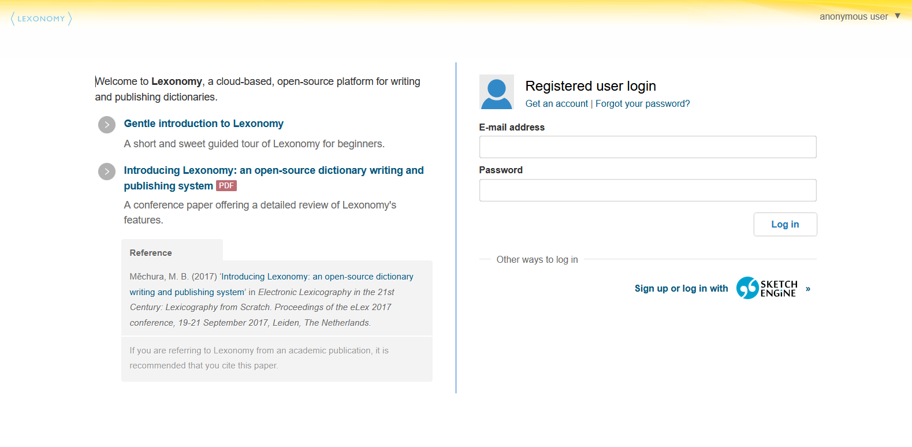

The course will explore how software tools for dictionary production (so-called dictionary writing systems, or DWS) can be used to streamline and facilitate the structural coherence and quality assurance in a dictionary project by focusing on Lexonomy, a dictionary-writing system developed as part of ELEXIS. At the end of this course, the students will know how to use Lexonomy in various stages of the lexicographic workflow, from creating a dictionary, selecting a suitable data model, and setting up different configuration options, to using advanced features such as workflow monitoring, and preparing the dictionary for publication. Selected existing projects will be used as case studies.

## Learning Outcomes

Upon completion of this course, students will be able to

- assess DWS in general
- create a dictionary in Lexonomy (monolingual and bilingual)
- set up different configuration options (including defining the entry structure)
- set up and use the Sketch Engine API for pulling data
- use advanced features such as workflow monitoring
- upload/download a dictionary
- prepare the dictionary for publication
- (link to other dictionaries)

### Introduction

In this short course, we will first look into software-led dictionary creation through dictionary writing systems (DWS) in general, and with the use of Lexonomy more specifically. The course contains guidance on creating dictionaries in Lexonomy from scratch and from an automatically generated draft. Then, we focus on editing a dictionary in preparation for publication, and finally, we present \_\_\_\__, which serves as a case study to demonstrate several of the featured actions and what can be achieved.

- ### What is DWS

A dictionary writing system (DWS) is a type of specialised software used by lexicographers, publishers, researchers and individuals for compiling dictionaries and other lexical resources, such as a thesaurus, ontology, vocabulary, or a glossary. The topic of the current course, Lexonomy, is an "off the shelf" dictionary writing system. This means that the software is standardised, can be used immediately, and provides a broad range of features that a wide range of users will find useful. Other examples of such software are XML editors such as iLEX, TLex, IDM DPS, SDL MultiTerm, Xmetal and many more. However, many organisations use their own, dedicated DWS that had been developed exclusively for their purposes, and which are dependent on their own internal databases.

Generally, the main aim of a DWS is to provide an efficient, ergonomic and customisable dictionary writing platform, through which production time and costs can be reduced. Many of these software enable collaboration by sharing a central database that hosts the project in some way, for example, by using an online collaborative workspace.

- ### Introducing Lexonomy

Lexonomy is a free, cloud-based, open-source dictionary writing and publishing system that is part of the ELEXIS project infrastructure. It aims to provide an easy, standardised, straightforward platform for dictionary creation. The tool is highly scalable, so it can be used for large dictionary projects as well as small glossaries or terminology resources. Since its introduction in 2017, over 5000 dictionaries were created in Lexonomy by more than 2500 users, hosting more than 34 million entries. Lexonomy is compatible with Sketch Engine, enabling already existing dictionary data to be imported, edited, and published through Lexonomy.

### Let’s get started

First, you will need to create a Lexonomy account. To do this, click _[Get an account](https://www.lexonomy.eu/signup/)_ on the home page and enter your email address. The password will then be sent to you via email. You can change the generated password by clicking on your user name (same as your email address) in the top right corner, selecting _Your profile_ and setting up a password at the bottom of the page. Now, to go back to the _Home_ page, you can click the Lexonomy logo in the top left corner or select _Home_ in the top right corner under the user name menu.

- ### Creating a new dictionary from scratch

On the Home page, you will see a section called _Your dictionaries_. To create a dictionary, click _Create a dictionary_, set a title, an URL and select a template if you want to use one. Using a template is highly recommended if this is your first time experimenting with Lexonomy - the tool provides a _simple monolingual_ _dictionary_ or a _simple bilingual dictionary_ template in a drop-down list. You can also use your own XML schema by selecting none in the template drop-down list and then configuring your dictionary.

Don't worry, these basic settings can all be changed later in the _Configure settings_ page, in case you change your mind. Once you are ready, click the URL to go to the home page of your newly created dictionary.

By clicking the _Edit_ button on the home page of the dictionary, you can access Lexonomy's editing interface (image below). 

On the left-hand side, you see a list of the entries in the dictionary. A few entries will be automatically created for you if you select a dictionary template while creating your dictionary. Automatically generated sample entries can be deleted just like any other entry. The number of entries is unlimited in Lexonomy. To access an entry, just select it from the list.

Now you can see what the entry would look like if you decided to publish your dictionary through the Lexonomy server right away. This is also where you can create and modify the entries in your dictionary: you can edit the entry (by clicking _Edit_) or delete it (by clicking _Delete_), or change the ID of the entry. You can also create new entries by clicking _New_. 

If you click edit, you will see the underlying structure of the entry in XML. There are two editing views: the Nerd view (more advanced) and the Laic view (less advanced) - you can switch between them by clicking on the icons at the bottom of the editing screen.

- ### Creating a new dictionary from an automatically generated draft

r

### Editing a dictionary

### Publishing a dictionary

- ### setting up the dictionary for publishing

### A case study

### Where to go next