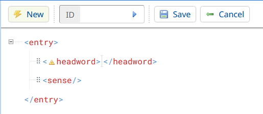

The course will explore how software tools for dictionary production (so-called dictionary writing systems, or DWS) can be used to streamline and facilitate the structural coherence and quality assurance in a dictionary project by focusing on Lexonomy, a dictionary-writing system developed as part of ELEXIS. At the end of this course, the students will know how to use Lexonomy in various stages of the lexicographic workflow, from creating a dictionary, selecting a suitable data model, and setting up different configuration options, to using advanced features such as workflow monitoring, and preparing the dictionary for publication. Selected existing projects will be used as case studies.

## Learning Outcomes

Upon completion of this course, students will be able to

- assess DWS in general
- create a dictionary in Lexonomy (monolingual and bilingual)
- set up different configuration options (including defining the entry structure)
- set up and use the Sketch Engine API for pulling data
- use advanced features such as workflow monitoring
- upload/download a dictionary
- prepare the dictionary for publication
- (link to other dictionaries)

### Introduction

In this short course, we will first look into software-led dictionary creation through dictionary writing systems (DWS) in general, and with the use of Lexonomy more specifically. The course contains guidance on creating dictionaries in Lexonomy from scratch and from an automatically generated draft. Then, we focus on editing a dictionary in preparation for publication, and finally, we present \_\_\_\__, which serves as a case study to demonstrate several of the featured actions and what can be achieved.

- ### What is a DWS

A dictionary writing system (DWS) is a type of specialised software used by lexicographers, publishers, researchers and individuals for compiling dictionaries and other lexical resources, such as a thesaurus, ontology, vocabulary, or a glossary. The topic of the current course, Lexonomy, is an "off the shelf" dictionary writing system. This means that the software is standardised, can be used immediately, and provides a broad range of features that a wide range of users will find useful. Other examples of such software are XML editors such as iLEX, TLex, IDM DPS, SDL MultiTerm, Xmetal and many more. However, many organisations use their own, dedicated DWS that had been developed exclusively for their purposes, and which are dependent on their own internal databases.

Generally, the main aim of a DWS is to provide an efficient, ergonomic and customisable dictionary writing platform, through which production time and costs can be reduced. Many of these software enable collaboration by sharing a central database that hosts the project in some way, for example, by using an online collaborative workspace.

- ### Introducing Lexonomy

Lexonomy is a free, cloud-based, open-source dictionary writing and publishing system that is part of the ELEXIS project infrastructure. It aims to provide an easy, standardised, straightforward platform for dictionary creation using XML (Extensible Markup Language). The tool is highly scalable, so it can be used for large dictionary projects as well as small glossaries or terminology resources. Since its introduction in 2017, over 5000 dictionaries were created in Lexonomy by more than 2500 users, hosting more than 34 million entries. Lexonomy is compatible with Sketch Engine, enabling already existing dictionary data to be imported, edited, and published through Lexonomy.

### Let’s get started

First, you will need to create a Lexonomy account. To do this, click _[Get an account](https://www.lexonomy.eu/signup/)_ on the home page and enter your email address. The password will then be sent to you via email. You can change the generated password by clicking on your user name (same as your email address) in the top right corner, selecting _Your profile_ and setting up a password at the bottom of the page. Now, to go back to the _Home_ page, you can click the Lexonomy logo in the top left corner or select _Home_ in the top right corner under the user name menu.

- ### Creating a new dictionary from scratch

On the Home page, you will see a section called _Your dictionaries_. To create a dictionary, click _Create a dictionary_, set a title, an URL and select a template if you want to use one. Using a template is highly recommended if this is your first time experimenting with Lexonomy - the tool provides a _simple monolingual_ _dictionary_ or a _simple bilingual dictionary_ template in a drop-down list. You can also use your own XML schema by selecting none in the template drop-down list and then configuring your dictionary.

Don't worry, these basic settings can all be changed later in the _Configure settings_ page, in case you change your mind. (If you wish to read more about general dictionary settings, just scroll down to the Dictionary settings header!) Once you are ready, click the URL to go to the home page of your newly created dictionary.

By clicking the _Edit_ button on the home page of the dictionary, you can access **Lexonomy's editing interface** (image below). 

On the left-hand side, you see a list of the entries in the dictionary. A few entries will be automatically created for you if you select a dictionary template while creating your dictionary. Automatically generated sample entries can be deleted just like any other entry. The number of entries is unlimited in Lexonomy. To access an entry, just select it from the list.

Now you can see what the entry would look like if you decided to publish your dictionary through the Lexonomy server right away. This is also where you can create and modify the entries in your dictionary: you can edit the entry (by clicking _Edit_), duplicate it (by clicking _Clone_) and delete it (_Delete_). Note that you cannot modify the ID of the entry, the ID bar is only for finding entries.

If you click edit, you will see the underlying structure of the entry in XML. There are two editing views: the Nerd view (more advanced) and the Laic view (less advanced) - you can switch between them by clicking on the icons at the bottom of the editing screen.

Let's create a **new entry**! If you click _New_, Lexonomy will generate a new, basic XML structure for your new entry - this is the backbone of dictionary creation. Every entry in Lexonomy is a small XML document that consists of elements, such as a headword and one or multiple senses. For example, the headword is an element of your entry in XML. It starts with the opening tag `<headword>` and ends with the closing tag `</headword>`. The content of the element (the headword itself) comes between these two - that is how the system recognises what constitutes which part of an entry.

To create an entry, you will need to define the headword in the XML structure (that is, to add a word between the opening and the closing tag) and then click on _Save_. An entry minimally requires a headword and one sense (this can even be empty), deleting any of these from the structure will cause errors. Lexonomy displays a little yellow warning triangle in the opening tag for any element that contains crucial errors. If you click the triangle, you can read a description of the error.

You can do the same with element names as well: a menu will appear listing all the actions you can perform on that element. An important feature of Lexonomy is that it only allows decisions that "make sense" according to the dictionary structure you have selected or defined (more on this later).  This helps you to maintain consistency. For example, if you work with any of the set Lexonomy dictionary templates, you will only be able to add a new `example` element to an entry within a `sense`, and nowhere else. This is because of the entry structure defined by the template: examples always belong to a sense first and only then to the headword. Similarly, sometimes, when you click on a piece of text between tags, you will be given a choice from a list instead of a free-form textbox. This is because Lexonomy knows what is supposed to go inside each element and acts accordingly.

- ### Creating a new dictionary from an automatically generated draft

Upload 

External data sources

Collocations

ThesaurusItems

Definitions

### Editing a dictionary

Click the _Configure_ link and Lexonomy will take you to its configuration interface. This is where you can set up various things that affect the entire dictionary, i.e. **Dictionary settings**, **Entry settings**, **Publishing**, **External data sources**.

First, let's see the entry settings under _Configure_ - _Entry structure_. You can change the structure of the entries here, and Lexonomy will adjust its warning messages (what elements are allowed where, what content can go inside an element, etc.) to these settings. 

Note that once your dictionary already contains some entries (i.e. it is not empty), you will need to be careful with what you do here. It is easy to make changes that will render your existing entries full of warning triangles - after all, they followed different rules when you created them. An easy way to navigate this is if you only add to the existing rules but do not take away. On the other hand, feel free to play around with these settings as much as you want if you have an empty dictionary: you can rename elements, change the hierarchy of elements, and so on, to make Lexonomy a better fit for your purposes.

#### Changing dictionary settings

The Name and description setting allows you to change the name of your dictionary, and provide its description (e.g. size, last time of update, authors, how to reference it etc.). You can use more advanced presentation format with MarkDown. Don't forget to click the _Save_ button if you change anything here!

**Granting access**

Of course, creating a dictionary involves lots of work by many people. You can give access to other users to make changes to your dictionary if you click _Users_ on the top menu. Here, you will see a list of email addresses - and, in the beginning, only yours. These are all the users of Lexonomy that currently have access to the dictionary you have been working on so far. To add another user, type the e-mail address they used to sign up to Lexonomy into the text box and click _Add_. You can also specify the level of access you want to give to them:

- Edit: they will be able to edit the dictionary entries.
- Configure: they will be able to enter Configure options.
- Download: they will be able to download dictionary entries.
- Upload: they will be able to upload new entries.

If you have a team of people working on the dictionary, generally, it is a good idea to only have one person with permission to Configure. This way, while your co-workers will be able to contribute to the dictionary, they won't be able to accidentally remove you from the dictionary or modify other users' access permissions. It is also possible to add someone with view-only access (in case of a private dictionary), in this case, you need to add them without selecting any of the above options, and then click _Save_.

### Publishing a dictionary

- ### setting up the dictionary for publishing

entry formatting

public acess

### A case study

### Where to go next

paper on Lexonomy

other courses