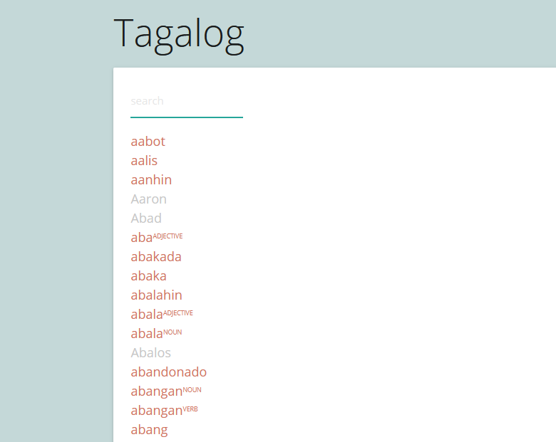
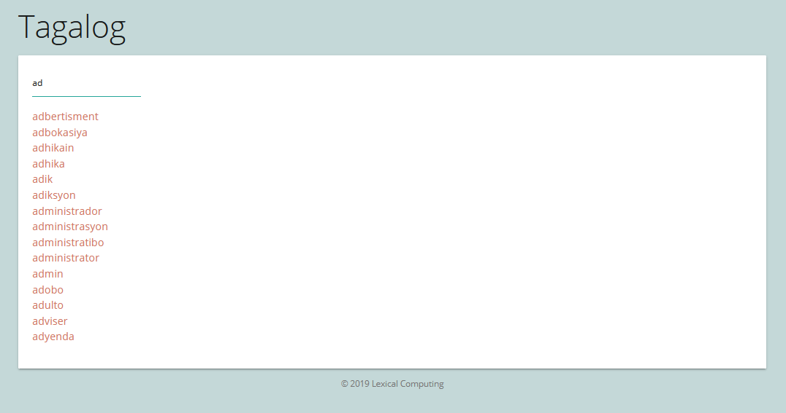
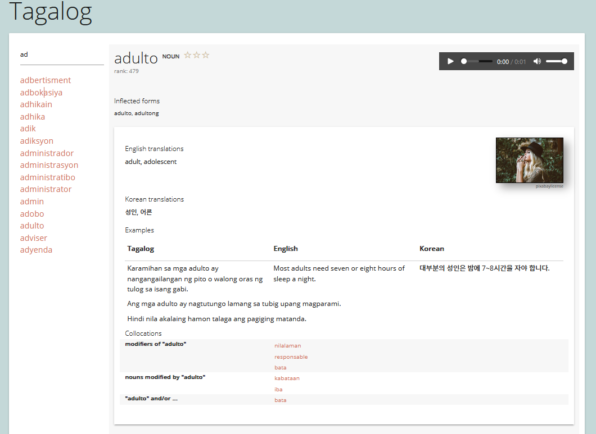
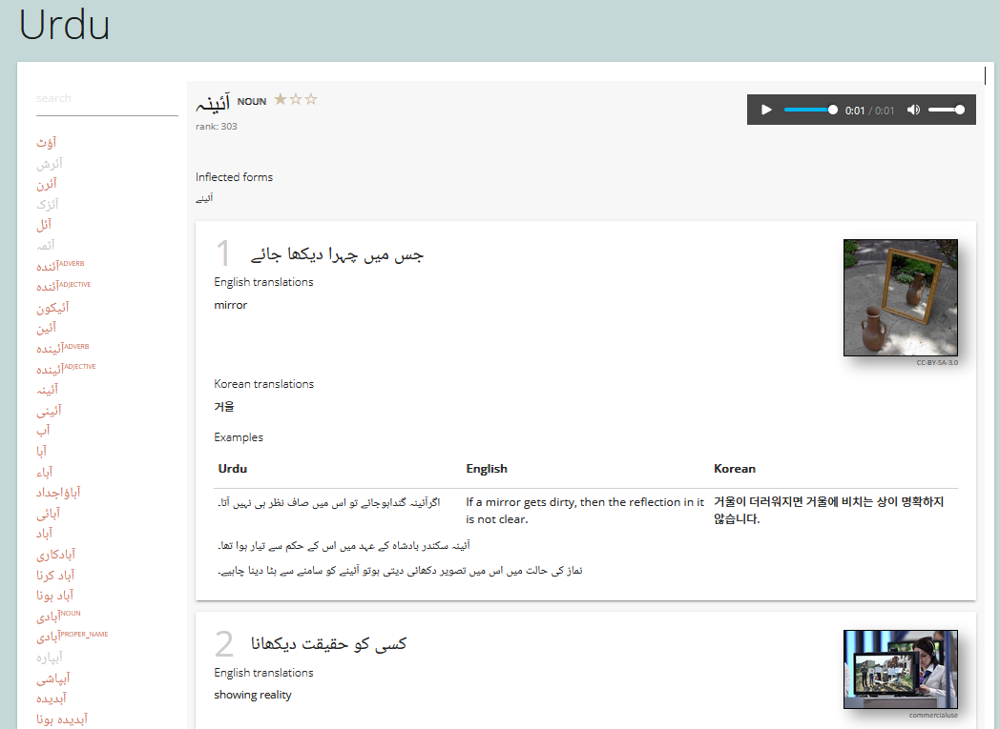
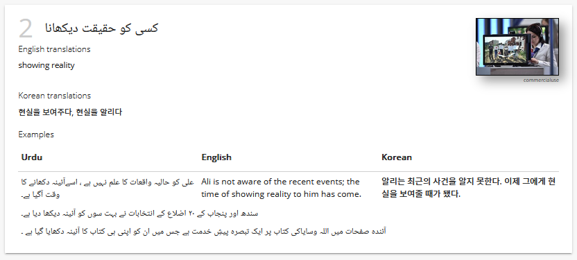

The course will explore how software tools for dictionary production (so-called dictionary writing systems, or DWS) can be used to streamline and facilitate the structural coherence and quality assurance in a dictionary project by focusing on Lexonomy, a dictionary-writing system developed as part of ELEXIS. At the end of this course, the students will know how to use Lexonomy in various stages of the lexicographic workflow, from creating a dictionary, selecting a suitable data model, and setting up different configuration options, to using advanced features such as workflow monitoring, and preparing the dictionary for publication. Selected existing projects will be used as case studies.

## Learning Outcomes

Upon completion of this course, students will be able to

- assess DWS in general
- create a dictionary in Lexonomy (monolingual and bilingual)
- set up different configuration options (including defining the entry structure)
- set up and use the Sketch Engine API for pulling data
- use advanced features such as workflow monitoring
- upload/download a dictionary
- prepare the dictionary for publication
- (link to other dictionaries)

### Introduction

In this short course, we will first look into software-led dictionary creation through dictionary writing systems (DWS) in general, and then more specifically through Lexonomy. The course contains guidance on creating dictionaries in Lexonomy from scratch and from an automatically generated draft. Then, we focus on editing a dictionary in preparation for publication, and finally, we present \_\_\_\__, which serves as a case study to demonstrate several of the featured actions and what can be achieved.

- ### What is a DWS

A dictionary writing system (DWS) is a type of specialised software used by lexicographers, publishers, researchers and individuals for compiling dictionaries and other lexical resources, such as a thesaurus, ontology, vocabulary, or a glossary. The topic of the current course, Lexonomy, is an "off the shelf" dictionary writing system. This means that the software is standardised, can be used immediately, and provides a broad range of features that a wide range of users will find useful. Other examples of such software are XML editors such as iLEX, TLex, IDM DPS, SDL MultiTerm, Xmetal and many more. However, many organisations use their own, dedicated DWS that had been developed exclusively for their purposes, and which are dependent on their own internal databases.

Generally, the main aim of a DWS is to provide an efficient, ergonomic and customisable dictionary writing platform, through which production time and costs can be reduced. Many of these software enable collaboration by sharing a central database that hosts the project in some way, for example, by using an online collaborative workspace.

- ### Introducing Lexonomy

Lexonomy is a free, cloud-based, open-source dictionary writing and publishing system that is part of the ELEXIS project infrastructure. It aims to provide an easy, standardised, straightforward platform for dictionary creation using XML (Extensible Markup Language). The tool is highly scalable, so it can be used for large dictionary projects as well as small glossaries or terminology resources. Since its introduction in 2017, over 5000 dictionaries were created in Lexonomy by more than 2500 users, hosting more than 34 million entries. Lexonomy is compatible with Sketch Engine, enabling already existing dictionary data to be imported, edited, and published through Lexonomy.

### Let’s get started!

First, you will need to create a Lexonomy account. To do this, click _[Get an account](https://www.lexonomy.eu/signup/)_ on the home page and enter your email address. The password will then be sent to you via email. You can change the generated password by clicking on your user name (same as your email address) in the top right corner, selecting _Your profile_ and setting up a password at the bottom of the page. Now, to go back to the _Home_ page, you can click the Lexonomy logo in the top left corner or select _Home_ in the top right corner under the user name menu.

- ### Creating a new dictionary from scratch

On the _Home_ page, you will see a section called _Your dictionaries_. To create a dictionary, click _Create a dictionary_, set a title, an URL and select a template if you want to use one. Using a template is highly recommended if this is your first time experimenting with Lexonomy - the tool offers a _simple monolingual_ _dictionary_ and a _simple bilingual dictionary_ template in a drop-down list. You can also use your own XML schema by selecting none in the template drop-down list and then configuring the XML structure by yourself (more on this later - see _Structure_ under the _Entry settings_ header).

Don't worry, these basic settings can all be changed later on the _Configure_ page, in case you change your mind about anything. (If you wish to read more about general dictionary settings, just scroll down to the _Configuring a dictionary_ header!) Once you are ready, click the URL to go to the home page of your newly created dictionary.

By clicking the _Edit_ button on the home page of the dictionary, you can access **Lexonomy's editing interface** (image below). 

On the left-hand side, you see a list of the entries in the dictionary. A few entries will be automatically created for you if you select a dictionary template while creating your dictionary. Automatically generated sample entries can be deleted just like any other entry. To access an entry, just select it from the list. 

> Note: The number of entries is unlimited in Lexonomy. 

Now you can see what the entry would look like if you decided to publish your dictionary through the Lexonomy server right away. This is also where you can create and modify the entries in your dictionary: you can edit the entry (by clicking _Edit_), duplicate it (by clicking _Clone_) and delete it (_Delete_). Note that you cannot modify the ID of the entry, the ID bar is only for finding entries.

If you click edit, you will see the underlying structure of the entry in XML. There are two editing views: the Nerd view (more advanced) and the Laic view (less advanced) - you can switch between them by clicking on the icons at the bottom of the editing screen.

Let's create a **new entry**! If you click _New_, Lexonomy will generate a basic XML structure for your new entry - this is the backbone of dictionary creation. 

> Every entry in Lexonomy is a small XML document that consists of elements, such as a headword and one or multiple senses. 

For example, in XML, the headword is an element of your entry. It starts with the opening tag `<headword>` and ends with the closing tag `</headword>`. The content of the element (the headword itself) comes between these two - that is how the system recognises what constitutes which part of an entry.

To create an entry, you will need to add a headword to the XML structure (that is, to add a word between the opening and the closing tag) and then click on _Save_. If you work with one of the templates of Lexonomy, an entry minimally requires a headword and one sense (this can even be empty). Deleting any of these from the structure will cause errors. 

> _Warning messages appear in the form of little yellow warning triangles. If you click on the triangle, you can read a description of the error._

You can do the same with element names as well: if you click on an element, a menu will appear listing all the actions you can perform on it. 

> An important feature of Lexonomy is that it only allows decisions that "make sense" according to the dictionary structure you have selected or defined. This promotes consistency. 

For example, if you work with any of the set Lexonomy dictionary templates, you will only be able to add a new `example` element to an entry within a `sense`, and nowhere else. This is because of the entry structure defined by the template: examples always belong to a sense first and only then to the headword. Similarly, sometimes, when you click on a piece of text between tags, you will be given a choice from a list instead of a free-form textbox. This is because Lexonomy knows what is supposed to go inside each element and acts accordingly.

- ### Creating a new dictionary from an automatically generated draft

Lexonomy provides the option to upload existing data instead of creating all entries by hand. You can do this by clicking _Upload_ in the top menu. Keep in mind, however, that this is an advanced feature that needs careful attention. 

> The XML data you are uploading must match the entry structure of the dictionary in Lexonomy, or you need to upload your own XML schema as well. 

You can choose to remove everything from your dictionary by ticking the _purge before upload_ box, in which case all data that is currently in your dictionary will be permanently deleted as you upload your new data.

Lexonomy can be used together with **Sketch Engine**, a popular corpus query system. Everything related to Sketch Engine can be reached under the Sketch Engine menu in _Configure_. You can "pull" example sentences and other data (even an entire pre-generated dictionary) from a Sketch Engine corpus into Lexonomy.

This can be done by configuring your connection with Sketch Engine. This happens in two steps. First, click on your email address in the top right corner, and select _Your profile_. Here, you will need to link your Lexonomy account to your Sketch Engine account. You will be redirected to the Sketch Engine website. Second, open the _Configure_ menu, and click _Connection_. This will lead you to the _Connection_ page. Here, you need to fill in the _Sketch Engine URL_, _Sketch Engine API URL_ and _Corpus name_ mandatory fields. Note that the _Corpus name_ field will only be available once you have completed step one and linked your Sketch Engine account to your Lexonomy profile.

Now, we move to the specific things you can do once you have linked your Sketch Engine and Lexonomy profiles. In Lexonomy, **pulling example sentences** (picture below) works just as **pulling collocations, thesaurus items, and definitions** from Sketch Engine. In all of these cases, you need to select the element in which every example will be put (wrapped), then provide a general XML template for every example, collocation, thesaurus item or definition that will be inserted into your entries. In the case of examples, you can select the element that marks the headword in the entries, if relevant. 

### Configuring a dictionary

Click the _Configure_ link in the top menu bar and Lexonomy will take you to its configuration menu. This is where you can set up various things that affect the entire dictionary. There are four main groups of actions: 

- _Manage dictionary_: dictionary settings such as the name, URL, and description of the dictionary, the users that can edit it, and the option to make it public.
- _Entry settings_: settings to change the entry structure, to format how it appears, how headwords are displayed and what is searchable.
- _Expert settings_: entry editor, setting up flags and auto-numbering, linking entries, creating subentries, and so on. 
- _Sketch Engine_: settings related to Sketch Engine, such as establishing the connection between Lexonomy and Sketch Engine, and pulling various items such as example sentences, collocations, and more.

##### Manage dictionary

We have already explored the Sketch Engine settings, so now let's see the first group, _Manage dictionary_. Here, the _Description_ setting allows you to change the name of your dictionary, and provide its description (e.g. size, last time of update, authors, how to reference it etc.). You can use a more advanced presentation format with MarkDown. Don't forget to click the _Save_ button if you change anything here! 

> Of course, creating a dictionary involves lots of work by many people. You can give access to other users to make changes to your dictionary if you click _Users_ in the Configure menu. 

Here, you will see a list of email addresses - and, in the beginning, only yours. These are all the users of Lexonomy that currently have access to the dictionary you have been working on so far. To add another user, type the e-mail address they used to sign up to Lexonomy into the text box and click _Add_. You can also specify the level of access you want to give to them:

- Edit: they will be able to edit the dictionary entries.
- Configure: they will be able to enter Configure options.
- Download: they will be able to download dictionary entries.
- Upload: they will be able to upload new entries.

> If you have a team of people working on the dictionary, generally, it is a good idea to only have one person with permission to Configure the dictionary.

This way, while your co-workers will be able to contribute to the dictionary, they won't be able to accidentally remove you from the dictionary or modify other users' access permissions. It is also possible to add someone with view-only access (relevant for a private dictionary), in this case, you need to add them without selecting any of the above options, and then click _Save_.

##### Entry settings

Now, let's see the **Entry settings**. If you click _Structure_, you can change the structure of the entries here, and Lexonomy will adjust its warning messages (what elements are allowed where, what content can go inside an element, etc.) to these settings. 

> Note that once your dictionary already contains some entries (i.e. it is not empty), you will need to be careful with what you do with the entry structure. It is easy to make changes that will render your existing entries full of warning triangles - after all, they followed different rules when you created them. An easy rule that could help you navigate this is to remember that you should only add to the existing rules and avoid taking away anything. 

On the other hand, feel free to play around with these settings as much as you want if you have an empty dictionary: you can rename elements, change the hierarchy of elements, specify searchable elements, and so on, to make Lexonomy a better fit for your purposes. Now let's move on to exploring these!

Under **Headword list**, you can **configure the headword list** and its display, and select the element that contains the entry's headword - normally, it is the headword element, but you can change this too. You can also change how the entry list is sorted, just specify the element that should be used for sorting (e.g. part-of-speech, source, sense). You can also sort these items in a descending order. If you wish, you can display additional content besides the headword in the entry list, for example, part-of-speech labels or homograph numbers. This is also the place where you can look up any language and select its alphabet for sorting items in alphabetical order. 

You may wish to reach additional information about an entry and not only its headword. To **change the search box settings**, just select _Searching_ in _Configure_, and tick the elements you want to be able to search for.

##### Some expert settings

Now that we have covered creating and editing a dictionary and its entries, and using Sketch Engine with Lexonomy, it's time to look into some more advanced features. 

> Some of these Expert settings really require expertise with JavaScript or CSS, while others are just extra ways to make dictionary creation even smoother for you. This course won't cover all of these in depth; however, if you decide to read what follows, you will get a basic understanding of every option you see in the menu.

You can change the default setting of the entry editor (Nerd or Laic mode) on the **Entry editor** page. The size of the editor can also be set to either a single-line or a multi-line view. The page also contains some options to customise the entry editor for yourself using JavaScript and CSS (Cascading Stylesheets).

With **Flags**, you can flag entries to monitor their status, and thus to have a straightforward way to **monitor the workflow for dictionary creation**. Do this by adding an element such as `<status>` with workflow values, such as "AE", "L", and "C", standing for "automatic entry not yet checked", "checked by lexicographer" and "confirmed by the editor". Then, if you select this element in the Flags section, you can specify the values the flags should consult, their labels, and how they will be visualised (colours). If you click on the flag circle next to an entry, you can see its status label and change it.

Entry elements can be numbered automatically using **Auto-numbering**. You can see detailed instructions about this on the Auto-numbering page. Note that this is not the same as generating the ID of the dictionary entry. 

It is also possible to create links between entries (cross-reference) using **Linking**. You can read more about how this works on the Linking page.

Under **Download settings**, you can set an XSLT transformation that will apply automatically when the dictionary is downloaded. This is not required to download the dictionary. If your XSLT input is not valid in this editor, no transformation will be applied.

You can select the elements you want to function as subentries on the **Subentries** page. These will be the sections of the XML that are 'shareable', that is, these are the pieces of XML that are allowed to appear in several entries simultaneously. Shareable subentries have a shaded background in the editing interface of Lexonomy, and are followed by a button that tells you the number of entries that make use of the subentry besides the current one. 

If you want your dictionary to have pictures or text-to-speech, use the **Multimedia API** page. Here, select the licence type you want your pictures to have in the dictionary. Pictures can come from websites such as Google search or Pixabay. For text-to-speech, you will need to insert your VoiceRSS API key also on this page to enable TTS. 

The **KonText** page can be used to pull data via the KonText corpus query interface and corpus data intergration platform. If you are not familiar with KonText already, you will not need this option.

### Publishing a dictionary

Now, we can explore how to set up the dictionary for publishing. Click _Formatting_ in _Configure._ This is where you can fine-tune how you would like your entries to appear to the public. You can change the colours, the fonts, and so on. If you are familiar with CSS or XSL (Extensible Stylesheet Language), this will be especially easy for you, but if not, don't worry either: you can work with the provided templates, or you can try and explore the appearance features by yourself.

To publish your dictionary, go into the _Configure_ menu, click _Publishing_, and select "Public". From the moment you click _Save_, your dictionary will be visible to anyone who knows its URL. If you decided to change your mind, you can turn it into private again whenever you want.

However, if you decide to stick with your published dictionary, you will notice that its webpage has changed: it now contains a search box and a few other things that allow people to search and browse the dictionary.

One thing you need to be aware of is that when making a dictionary public, you're making it available under a permissive open-source licence. This allows other people to reuse your data freely, without the restrictions of copyright. The only thing they are legally required to do is acknowledge you publicly as the author of the data.

> Don't forget that Lexonomy does not have any backups of your dictionary - if you wish to have one, you have to manually download the XML file by clicking _Download_ in the menu bar on the top of the page. This will lead you to a page showing nameofyourdictionary.xml. If you click on the file name, the XML file of your dictionary will automatically download in your browser.

### A case study

It's time to see some example entries from actual dictionaries built and published in Lexonomy, using the Sketch Engine tools.

Visitors are presented with the displayed name of the dictionary, a search bar and the first words of the dictionary. If you start to type in a word, words will gradually reduce so that you will only see entries that start with the same letters as those typed into the search bar. Let's see words that start with 'ad'...

Now, we can select any entry we are interested in. This time, we click on 'adulto'.

This is a full example entry in this dictionary. First, you can see the headword, the part of speech it belongs to, and its inflected forms. There is an audio file of the word and a picture for the entry as well.

As this a Tagalog - English - Korean dictionary, you can see the English and Korean translation of the word and the same example sentence in three languages. Dictionary creators can specify the number of example sentences that appear here. For this dictionary, we see the first example sentence in three languages, and two others only in Tagalog. 

This part of the entry is then followed by Collocations - namely, the modifiers of the headword, nouns modified by the headword, and its antonym, 'bata', which is the Tagalog word for 'child'.

But what happens if a word has multiple meanings? Let's look at an example from the Urdu - English - Korean dictionary. In Urdu, ' آئینہ ' is the word for 'mirror' in the literal sense but the word form is also used in a more abstract sense for 'showing reality'. You can see the two entries for the word below.

If we scroll down, we see that both sense are embedded under the same headword, and the audio file and the inflected forms only appear once. However, each sense has its own translations in English and Korean followed by one example sentence translated into both languages and two other example sentences only in Urdu.

These examples demonstrate that Lexonomy (used separately or together with Sketch Engine) is a powerful tool for dictionary creation and publication - we have quickly developed our simple and easy-to-use XML formula into an impressive dictionary with example sentences, pictures and audio files. 

### Where to go next

Congratulations, you have now arrived at the end of this course! 

Now, here's a list of some of the next things you could do:

- move on to the next course of the ELEXIS curriculum titled _[Automating the Process of Dictionary Creation](https://elexis.humanistika.org/resource/posts/automating-the-process-of-dictionary-creation)_. It builds on the material covered in this course and in _[LEX2: Mastering ELEXIS Corpus Tools for Lexicographic Purposes](https://elexis.humanistika.org/resource/posts/lex2-mastering-elexis-corpus-tools-for-lexicographic-purposes)_ that taught you how to create a corpus in Sketch Engine. 
- read more about Lexonomy in the paper _[Introducing Lexonomy: an open-source dictionary writing and publishing system](https://www.lexonomy.eu/docs/elex2017.pdf)_.
- go to the [Lexonomy website](https://www.lexonomy.eu/) and explore it further yourself!