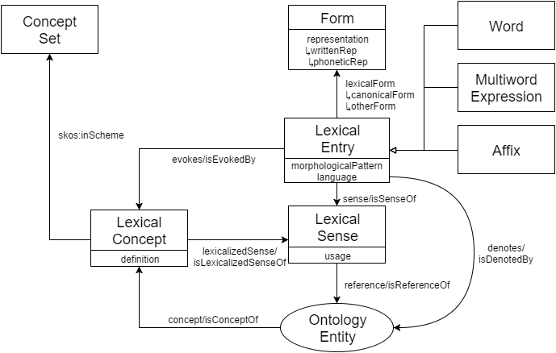

This course describes the OntoLex-Lemon model, a recent standard for the representation of lexical information on the Web as linked data. In addition to providing a basic introduction to linked data and the Resource Description Framework (RDF), the course will cover the core model of OntoLex and how to represent basic lexical information. Additional modules of the OntoLex module for the description of syntax, term decomposition, variation & translation, metadata, lexicography, morphology and corpus information will also be described. At the end of the course, students should be able to express lexicons as linked data using the model.

## Learning Outcomes

Upon completion of this course, students will be able to

- Understand how lexical data can be represented as linked data
- Describe the benefits of linked data for lexicography
- Use the OntoLex-Lemon module to model lexical information
- Design a schema based on OntoLex-Lemon to represent a specific lexical resource

# Introduction

OntoLex-lemon is a vocabulary developed by the [OntoLex Community Group](https://www.w3.org/community/ontolex/) of the W3C for the representation of dictionaries as [RDF](https://www.w3.org/RDF/) data. The model has a modular architecture which means that you can select the modules which are relevant to your specific data. The original design goals of the model were also focused on the development of lexical information for ontologies, however modules have been developed to represent all kinds of lexical resources. This course assumes some familiarity with RDF, in particular in the Turtle syntax, for those unfamiliar with this we suggest that you look at the primer here: https://www.w3.org/2007/02/turtle/primer/

## History of the model


The model has been developed over a long period and originates with three models that were developed independently, the [LingInfo](http://lrec.elra.info/proceedings/lrec2006/workshops/W14/Ontolex06.pdf#page=32) model developed by Paul Buitelaar, the [LexOnto](https://citeseerx.ist.psu.edu/viewdoc/download?doi=10.1.1.73.1056&rep=rep1&type=pdf) model developed by Philipp Cimiano and the[ Linguistic Information Repository (LIR) ](https://www.cambridge.org/core/services/aop-cambridge-core/content/view/BBB120E33DBD895791136BDB61A8A228/S1351324910000082a.pdf/enriching-ontologies-with-multilingual-information.pdf)developed by Elena Montiel and colleagues. Realising the common overlap of these models, these researchers came together to develop first the [LexInfo](https://lexinfo.net/) model and the _[lemon](https://lemon-model.net/)_ (Lexicon Model for Ontologies) models. The model was then opened to a wider community by means of the founding of the community group, which developed the first version of the model, with the final specification being released in 2016 and a further module focused on representing lexicographic resources was released in 2019.

## Model Requirements

When the OntoLex-lemon model was first developed the following requirements were seen as key goals of the model

1. **OWL and RDF Model:** The goal of the model was to develop a model for the Semantic Web, built on the standards developed by the W3C. As such, the model can take advantage of the powerful formalisms for the representation of knowledge graphs, including the use of URIs to ensure global uniqueness of identifiers, and the powerful reasoning facilities provided by OWL
2. **Multilingualism:** The second key requirement was that the model should aim to support lexicography in all languages and in particular we wanted to avoid making any specific restrictions such as the number of part-of-speech values or specific issues like gender, which may be difficult to apply to other languages.
3. **Semantics by Reference:** Meaning in this model should be represented by means of reference to ontologies, ensuring the representation methods from knowledge graphs, in particular OWL, can be used to represent the semantics. As such, this means that senses in an OntoLex-lemon model are defined by the elements in the ontology they refer to.
4. **Openness:** The OntoLex-lemon model is an open model in several senses. Firstly, it is free both in the sense that there are no finanical costs associated with any documentation of the model (free as in 'free beer') but also free to be extended and worked with (free as in 'free speech'). Further, the community group is open to anyone and all discussions on mailing lists are openly available on the web.
5. **Reuse standards:** The model should wherever possible reuse vocabulary and modelling from standards in order to avoid reinventing the wheel. In particular, we are reusing models such as OWL, RDF, SKOS, Dublin Core, the Lexical Markup Framework (LMF) and the Terminological Markup Framework.

# Motivation

The OntoLex-lemon model was introduced due to the observation that ontologies contain very little information about how words are represented in natural language. The basic model of OWL allows for a linguistic label to be added to a ontology entity with a language tag given by the BCP-74 standard, for example we can describe the concept [Q315](https://www.wikidata.org/wiki/Q315) in the Wikidata as follows:

```turtle
<https://www.wikidata.org/wiki/Q315> rdfs:label "language"@en ,
  "Sprache"@de, "teanga"@ga, "言語"@ja .
```

However, this representation is very limited and does not cover how the label is used in real language. For example, the Irish term "teanga" may appear in a very different form such as in "Cuairt Liteartha do **Theangacha** Mionlaigh san Eoraip" (Literary tour of minority languages in Europe), which would be very difficult to identify from the lemma alone, and other key information such as readings of the Japanese lemma cannot easily be represented.

Another issue is the large number of synonyms that exist for many terms both in language and in ontologies. For example, the term "edema" is a medical condition that can be represented by many identifiers for example Q152234 in Wikidata, D00487 in the Medical Subject Headings (MeSH), C0013604 in the Unified Medical Language System (UMLS) and R60.9 in the International Classification of Diseases (ICD). Moreover, we may have several terms that can be used to refer to this, including the irregular plural form "edemata" and alternative terms such as "dropsy". Linking all of these together could be very complex as shown in the image below:


Instead, it makes sense to introduce an element between the lexical forms and the knowledge graph elements, which we can term a lexical entry. In this way we can simplify the modelling and group related forms such as "edema" and "edemata":


### Lexical Entries

Lexical entries are the core part of a dictionary model, however the exact definition of a lexical entry often varies between different dictionaries. As OntoLex-lemon aims to be a model that can support natural language processing applications, we need a clear definition of what constitutes a lexical entry. The definition given in the specification is:

> A lexical entry represents a unit of analysis of the lexicon that consists of a set of forms that are grammatically related and a set of base meanings that are associated with these forms. Thus, a lexical entry is a word, multiword expression or affix with a single part-of-speech, morphological pattern, etymology and set of senses.

For example, the following distinctions are made in an OntoLex-lemon model:

- All inflected forms of a word, e.g., **work** and **works**, are part of the same lexical entry.
- Derived forms such as **worker** are different lexical entries to the base form (**work**).
- Words of different part-of-speech are different lexical entries (such as work as a **verb** and a **noun**)
- Words that have the same written lemma or different morphology are different entries. For example, **lead** can be read as /lɛd/ or /liːd/ and should be different lexical entries. Similarly, the German noun **Band** should be different lexical entries for the neuter noun with plural **Bänder** (meaning 'ribbon') and the feminine noun with plural **Bands** (the loan word from English meaning a musical group). In this case both gender and plurals are reasons to seperate the entries.
- Homographs are modelled as different lexical entries even if they have no difference in pronunciation, morphology or syntax. For example, **bank** (meaning financial institute and derived from the Italian 'banca') is a distinct entry to **bank** (meaning side of a river and derived from the Old English 'hōbanca'). These words are homographs as they have a different etymology.

### Lexical Forms

In RDF, it is not possible to describe properties of a string directly. Instead if we wish to provide descriptions of a form, for example saying that **edemata** is a plural form, it is necessary to introduce an identifier for the form that can be described as follows:


### **Lexical Senses**

Similarly, there are often reasons to be able to describe the connection between a lexical entry and a knowledge graph. As such, it is necessary to introduce a named element between the meaning of the word and its lexical entry. We call this element a **lexical sense**, although it should be noted that this term is specific in meaning to this model. A lexical sense is used for properties that are dependent on **both** a specific meaning and a specific word. For example, definitions are typically given on the knowledge graph elements as they can be shared between synonyms, where as usage examples are typically attached to the lexical sense as they show the usage of a particular word with a particular meaning. In the example, below we indicate that 'dropsy' is an antiquated term for the disease. This cannot be marked in the knowledge graph as other terms for the disease are not antiquated, nor can it be marked on the lexical entry as the term is still in use for other diseases (e.g., a disease of fish).


# The OntoLex-lemon Model

## The core model



The core model describes how we can represent lexical entries relative to ontologies. For example a simple modelling of a lexical entry for the word **cat** would be as follows:

```turtle
@prefix ontolex: <http://www.w3.org/ns/lemon/ontolex#> .
@prefix skos: <http://www.w3.org/2004/02/skos/core#> .

<#cat> a ontolex:Word ;

  ontolex:canonicalForm [
     ontolex:writtenRep "cat"@en ] ;

  ontolex:denotes [
    skos:definition "A four-legged, furry animal"@en ] .
```

We first give the relevant prefixes including the URL for the core model which is `http://www.w3.org/ns/lemon/ontolex#`. We then describe our entry as a word with a lemma and a reference to an ontology entity. Note that we use the `denotes` property to link the entry directly to the knowledge graph entity and thus we do not have any lexical sense in this modelling.

We can now add some more specific grammatical information to this entry. For this we will use the LexInfo ontology, which is maintained by the OntoLex community and is aligned with the model.

```turtle
@prefix ontolex: <http://www.w3.org/ns/lemon/ontolex#> .
@prefix skos: <http://www.w3.org/2004/02/skos/core#> .
@prefix lexinfo: <http://www.lexinfo.net/ontology/2.0/lexinfo#> .

<#cat> a ontolex:Word ;
  lexinfo:partOfSpeech lexinfo:noun

  ontolex:canonicalForm [
     ontolex:writtenRep "cat"@en ;
     lexinfo:number lexinfo:singular ] ;

  ontolex:otherForm [
     ontolex:writtenRep "cats"@en ;
     lexinfo:number lexinfo:plural ] ;

  ontolex:denotes [
    skos:definition "A four-legged, furry animal"@en ] .
```

We have now added an inflected ('other') form and we can add properties from LexInfo to describe the forms as a singular and plural form.

For most models, we also require lexical senses in order to capture some properties. For example, we can model the terms **bulrush** and **cattail** as referring to the same concept in the ontology, a plant of genus **Typha**, as follows:

```turtle
@prefix ontolex: <http://www.w3.org/ns/lemon/ontolex#> .
@prefix dbpedia: <http://dbpedia.org/resource/> .
@prefix dbo: <http://dbpedia.org/ontology/> .

<#bulrush> a ontolex:Word ;
  ontolex:sense [
    ontolex:reference dbpedia:Typha ;
    ontolex:usage [ rdf:value "British English" ] ] ;
  ontolex:denotes dbpedia:Typha .

<#cattail> a ontolex:Word ;
  ontolex:sense [
    ontolex:reference dbpedia:Typha ;
    ontolex:usage [ rdf:value "American English" ] ] ;
  ontolex:denotes dbpedia:Typha .
```

Note we can specify the usage of these terms, as British or American English, using the `usage` property. We also link to the concept of Typha using both the `denotes` property and the chain of two properties `sense` and `reference`. These are equivalent and most resources will use only one of these options.

## Syntax and Semantics


The synsem (syntax and semantics) module allows us to represent the syntax of entries and how this maps to structures in our knowledge graphs. This is primarily done by the creation of `SyntaticFrame`s. For example, we can model **know** as a transitive verb as follows:

```turtle
@prefix ontolex: <http://www.w3.org/ns/lemon/ontolex#> .
@prefix synsem: <http://www.w3.org/ns/lemon/synsem#> .
@prefix lexinfo: <http://www.lexinfo.net/ontology/2.0/lexinfo#> .

<#know> a ontolex:Word ;
  synsem:synBehavior <#know/transitive> .

<#know/transitive> a synsem:SyntacticFrame ;
  lexinfo:subject <#know/subject> ;
  lexinfo:directObject <#know/directObject> .
```

In this example we say that **know** is associated with a frame with a (syntactic) subject and direct object. We may want to link this to the knowledge graph by associating it with a property such as `foaf:knows`. Properties in knowledge graphs have a subject (source) value and an object (target) value, so we may say that `John_McCrae foaf:knows Fahad_Khan`. It is not necessarily the case that the knowledge graph subject corresponds to the syntactic subject, so we need to make this explicit with a mapping object as follows:

```turtle
prefix ontolex: <http://www.w3.org/ns/lemon/ontolex#> .
@prefix synsem: <http://www.w3.org/ns/lemon/synsem#> .
@prefix lexinfo: <http://www.lexinfo.net/ontology/2.0/lexinfo#> .
@prefix foaf: <http://xmlns.com/foaf/0.1/>.
@prefix rdfs: <http://www.w3.org/2000/01/rdf-schema#> .

<#know> a ontolex:Word ;
  ontolex:sense <#know/sense> ;
  synsem:synBehavior <#know/transitive> .

<#know/sense> a ontolex:LexicalSense , synsem:OntoMap ;
  synsem:ontoMap <#know/sense> ;
  ontolex:reference foaf:knows ;
  synsem:subjOfProp <#know/subject> ;
  synsem:objOfProp <#know/directObject> .

foaf:knows a rdf:Property ;
  rdfs:domain foaf:Person ;
  rdfs:range foaf:Person .


```

In this case the frame can also act as ontology mapping and is typed as being an `OntoMap`, which is a common design pattern. We can also use ontological information on the knowledge graph, such as  that `foaf:knows` relates two `Person`s to model selectional preferences.

## Decomposition


The decomposition module is used to represent how multiword or compound expressions are composed of single word terms. There are two main ways of doing this: either simply by means of the subterm property which relates two lexical entries, or by the means of constituents which can capture the order and specific properties of the decomposition. 

```turtle
@prefix ontolex: <http://www.w3.org/ns/lemon/ontolex#> .
@prefix decomp: <http://www.w3.org/ns/lemon/decomp#> .

<#summer_school> a ontolex:MultiWordExpression ;
  decomp:subterm <#summer>, <#school> .

<#école_d’été> a ontolex:MultiWordExpression ;
  decomp:constituent <#école_d’été/école> , 
                     <#école_d’été/de> ,
                     <#école_d’été/été> ;
  rdf:_1 <#école_d’été/école> ;
  rdf:_2 <#école_d’été/de> ;
  rdf:_3 <#école_d’été/été> ;

<#école_d’été/de> a decomp:Component ;
  decomp:correspondsTo <#de> ;
  lexinfo:lexTermType lexinfo:contraction .
```

In the above example, we see that the English term **summer school** is indicated as being composed of the words **summer** and **school** by means of the `subterm` property. For the French example **école d'été**, we go for a more complex representation capturing the order of the words and creating identifiers including `<#école_d’été/de>`, which indicate the usage of the word **de** within the multiword expression and allow us to indicate properties, in this case that the word is in a contracted form.