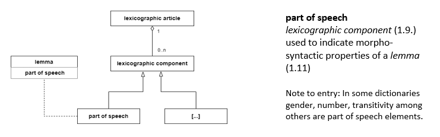
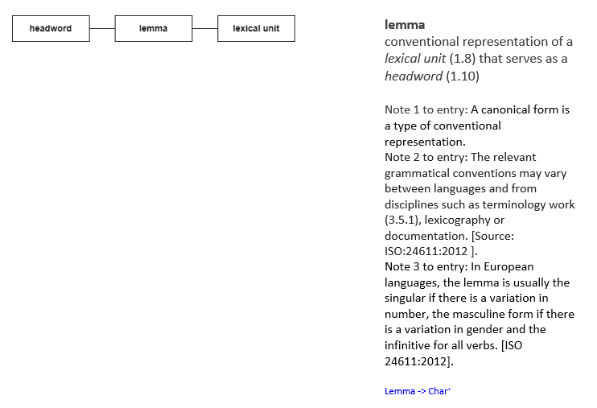

This course is intended for trainees. It focuses on the importance of standards to facilitate the cooperation among lexicographers in a multilingual and multicultural context by addressing a relevant _de facto_ standards such as Text Encoding Initiative (TEI), TEI Lex-0, models such as OntoLex-Lemon, and International Organization for Standardization (ISO) standards such as _Presentation/representation of entries in dictionaries – Requirements, recommendations and information_ or ISO 1951 (2007) and _Lexical markup framework_ (LMF) or ISO 24613 (2019, 2020, 2021).

The most widely used standards and models in the lexicographic community will be approached according to their aims:

1. those dealing with linguistic content; 
2. those that are used for annotation purposes; 
3. those that handle representation purposes; 
4. those addressing interoperability issues. 

At the end of the course, students will be familiar with the principles and procedures involved in writing, editing, or compiling dictionaries, considering standards in different parts of their lexicographic workflows.[^1]

[^1]: For more information, see _D1.2 Best practices for lexicography – intermediate report, 31.01.2020 (Tiberius et al., 2020).

This course is divided into two main parts.

In Part 1, Standards and Formats, we describe the standards and the formats we use in this document in order to become familiar with the best practices for representing lexical data. The use of the same example from different language dictionaries, the lexicographic article ‘fly’, will illustrate the uses of these standards and models.

In Part 2, we propose a core vocabulary that defines the minimal set of concepts necessary for lexicographic work. The main objective is to present the formal and natural language definitions of the core concepts, putting them side by side, to facilitate the understanding to a larger community dealing with dictionaries, traditional lexicographers, but also NLP and ontology communities. The set of definitions is expressed by resorting to context-free grammar and to ISO 704 (2009) best practices such as the UML notation for defining concepts or ISO 24156-1 (2014).

**Learning outcomes**

Upon completion of this course, students will be able to:

- appreciate the importance of the standards for the lexicographic work; 
- understand the purpose of the diversity of the standards;
- know the different formats used for interoperability matters;
- apply the standards to the digital dictionary-making; 
- understand how to model a dictionary entry in different standards;
- prepare data for operationalization needs;
- apply the acquired knowledge to concrete examples.

# Part 1: Standards and Formats

In this section, we give an overview of the most well-known and widely used standards and formats within the lexicographic universe aimed at creating lexicographic resources as a result of print, retro-digitalised or born-digital resources.

ISO/TC37 ‘Language and terminology’[^2] plays a key role in enabling language for computing environments. It creates standards for structuring language resources. ‘Structurable’ language resources include terminologies, lexical resources (dictionaries, lexicons, etc.), language‐based commercial data (names, properties, catalogues, etc., of products and services), signs and symbols, codes and formulae, corpora (text, speech, audio), taxonomies and ontologies.

[^2]: [https://www.iso.org/sites/outage/](https://www.iso.org/sites/outage/)

According to the ISO, ‘A standard is a document that provides requirements, specifications, guidelines or characteristics that can be used consistently to ensure that materials, products, processes and services are fit for their purpose’[^3]. Standards are seen as ‘a formula that describes the best way of doing something’[^4]. Concerning lexicography, standards provide a common vocabulary, establish specifications and procedures to guarantee the material’s reliability and interoperability and to facilitate the representation of lexicographic data. Formats (ex. TEI) are in these contexts schemas to represent structured data and models (ex. OntoLex Lemon) are abstractions of structured systems.

[^3]:[https://www.iso.org/standards.html](https://www.iso.org/standards.html)
[^4]:[https://www.iso.org/standards.html](https://www.iso.org/standards.html)

Different kinds of standards, formats, and models are created by a wide variety of organisations and working groups to promote good practices in lexicographic work. In this course, we work with standards produced by TEI consortium, ISO TC 37 and W3C.

## 1. Text Encoding Initiative

### 1.1 TEI

The **Text Encoding Initiative**[^5] **(TEI)** is a recognised international _de facto_ standard for the digital representation of textual resources (ranging from books and manuscripts to mathematical formulae, culinary recipes, music notation, among many other types) in the scholarly research community. Despite not having the legal status of a standard, it is widely used by the communities working in the context of humanities, for instance by the lexicographic community in several dictionary projects for digitally created lexicographic data (e.g., Budin, Majewski & Mörth, 2012) or retro-digitised projects (e.g., Bohbot et al., 2018) (e.g. Costa et al., 2021).

[^5]:[https://tei-c.org/](https://tei-c.org/)

The **TEI Guidelines**[^6] comprise comprehensive documentation and define a markup language to represent structural and conceptual characteristics of text documents. Their first draft (P1) was published in 1990, and the current version, P5, was published in 2007 and has been updated regularly.

[^6]:[https://tei-c.org/release/doc/tei-p5-doc/en/html/index.html](https://tei-c.org/release/doc/tei-p5-doc/en/html/index.html)

The guidelines provide the formal modelling of text in documents through categories that bring together related XML elements called modules. The P5 version of the standard comprises 21 modules, three to mark almost any text, with the ninth being dedicated to dictionary encoding.

All TEI documents must include a metadata section, named _TEI header_, and share a set of common annotation features defined as the core module in the standard. This set includes structural elements such as paragraphs, lists or bibliographical references.

From the very beginning, the TEI Guidelines have had a module explicitly focused on the encoding of dictionaries. For dictionaries, Chapter 9 of the TEI Guidelines starts by defining the dictionary structure as a book, namely front matter, body or back matter. The elements defined in this module are mainly intended to encode human-oriented dictionaries but can also help encoding computational lexicons.

The TEI Guidelines[^6] provide solutions to encoding the original layout of a dictionary page, i.e., how the entries are organised visually (typographic view), the properties of a text modelled as a sequence of tokens (editorial view) and the underlying lexical structures concerned with the conceptual or linguistic content of a dictionary (lexical view) (Tasovac, Salgado & Costa, 2020), revealing a more abstract and focused perspective for dealing with linguistic content (Ide & Véronis, 1995).

TEI is a descriptive recommendation that does not enforce a single form to encode a specific document. However, the overall flexibility, which raises the possibility of individual lexicographic phenomena being encoded in multiple ways, has been a cause of concern from the point of view of interoperability (Salgado et al., 2019). This freedom, together with its widespread adoption among lexicographers who have their own background and views on the logical structure of a dictionary, has produced an array of encoding solutions. Ironically, a standard that was supposed to unify the encoding formats under the umbrella of a common structure may sometimes appear as an uncontrolled modelling space. Flexibility, therefore, is both a virtue and a shortcoming of TEI. This extreme flexibility of the TEI Guidelines in structuring data characterises offers the possibility of several types of encoding for the same components. For interoperable reasons, the flexibility offered needs to be restricted. To reduce this freedom and define a specific format for dictionaries, forcing dictionary encoders to follow the same structural rules, the lexicographic and dictionary-encoding communities are currently discussing a new format with a particular focus on retro-digitised dictionaries. This is known as TEI Lex-0 (Tasovac, Romary et al., 2018; Romary & Tasovac, 2018; Bański, Bowers & Erjavec, 2017), which is a TEI-compliant but streamlined format to facilitate interoperability.

### 1.2 TEI Lex-0

**TEI Lex-0**[^7] is a subset of TEI that aims for a stricter representation of heterogeneous TEI-based lexical resources. Its goal is to establish a baseline encoding and a target format to facilitate the interoperability of heterogeneously encoded lexical resources. Some of the experiments on TEI Lex-0 in digital lexical databases can already be referred to, e.g., the studies by Bohbot et al. (2019), Bowers et al. (2021), Khan et al. (2020) and Salgado et al. (2019).

[^7]:[https://dariah-eric.github.io/lexicalresources/pages/TEILex0/TEILex0.html](https://dariah-eric.github.io/lexicalresources/pages/TEILex0/TEILex0.html)

In the context of the ELEXIS project, TEI Lex-0 has been adopted, together with OntoLex (McCrae et al., 2017), as one of the baseline formats for the ELEXIS infrastructure (McCrae et al., 2019).

TEI Lex-0 was launched in 2016, and it is led by the DARIAH Working Group on Lexical Resources[^8], made up of experts in lexical resources. Its goal is to define a clear and versatile annotation structure, but one that is not too permissive, to facilitate the interoperability of heterogeneously encoded lexical resources. Keep in mind that TEI Lex-0 should not be seen as a replacement for the TEI Dictionary Module. It should be first considered as a ‘format that existing TEI dictionaries can be unequivocally transformed to in order to be queried, visualised, or mined uniformly’ (Tasovac, Romary et al., 2018, para. 3). While TEI Lex-0 is being developed, some of its best-practice recommendations are also changing the recommendations of the TEI Guidelines themselves.

[^8]: [https://www.dariah.eu/activities/working-groups/lexical-resources/](https://www.dariah.eu/activities/working-groups/lexical-resources/)

The TEI Lex-0 imposes different types of restrictions compared with the TEI, as follows:

- It reduces the number of elements available (e.g., the TEI Lex-0 uses only `<entry>`, while TEI has several elements for the basic microstructure unit of the dictionary). These are `<entry>` (a single structured entry in any kind of lexical resource), `<entryFree>` (a single structured entry), `<superEntry>` (a single unstructured entry), `<re>` (an entry related to a lemma within an entry), and `<hom>` (homograph within an entry). While the document precisely describes when each should be used (entry forces a structure) (Bański, Bowers & Erjavec, 2017), `<entryFree>` provides a flat representation and allows unstructured entries that should be avoided but may be necessary for some dictionaries, and `<superEntry>` is a mechanism that can group other entries, such as homonyms). This freedom makes it difficult for different authors to keep their dictionaries coherent in terms of structure.
- It makes certain attribute values required (e.g., `xml:lang` and `xml:id` in `<entry>`).
- It reduces the number of possible attribute values on specific elements (such as `<usg>`).
- It applies additional syntactic constraints (e.g., `<def>` can only appear within a `<sense>`) or, when necessary, allows for new syntactic constructions (e.g., necessary entries).

## 2. ISO Standards related to lexicography

**ISO**[^9] is an international non-governmental organisation composed of several national standardisation bodies that develop and publish a wide range of standards. The international standards are the result of the work carried out through ISO Technical Committees, generally compounded by specialists and governmental and non-governmental international organisations.

[^9]:\[https://www.iso.org/home.html](https://www.iso.org/home.html]

International standards related to lexicography are the ones developed by the TC 37, ‘Language and terminology’, namely the Subcommittee 2 (SC2)[^10] and Subcommittee 4 (SC4)[^11], ‘Language and resource management’. ISO 1951 (2007) is an ISO TC37, SC2 standard that ‘specifies a formal generic structure independent of the publishing media and it proposes means of presenting entries in print and electronic dictionaries’ (ISO 1951, 2007, p. 1). The purpose of the standard is “to facilitate the production, merging, comparison, extraction, exchange, dissemination and retrieval of lexicographical data in dictionaries” (_ibidem_). The standard, right under a revision process, starting in 2022.

[^10]:[https://www.iso.org/committee/48124.html](https://www.iso.org/committee/48124.html)
[^11]:[https://www.iso.org/committee/297592.html](https://www.iso.org/committee/297592.html)

According to ISO 1951 (2007), the information contained in each dictionary entry is organised following three mechanisms (‘compositional elements’):

- containers or ‘compositional element used to supply additional information about one single specific data element by the means of other elements’ (ISO 1951, 2007, p. 2) (e.g., a headword container is used for giving the pronunciation);
- blocks or ‘compositional element used to factorise elements that are shared as refiners by many instances of a specific element’ (_ibidem_) (e.g., a punctuation such as comma or semicolon to separate meanings, square brackets for contexts);
- groups or ‘compositional element used to aggregate several independent elements’ (_ibidem_) (e.g., a sense is described by a group of elements such as definition, usage labels).

There are, however, other ISO standards developed as high-level specifications that are also relevant to this document as follows:

**ISO 1087 (2019):** ‘Terminology work and terminology science – Vocabulary’. This standard defines the fundamental concepts of terminology work, also emphasising the meaning of concept relations and concept systems.

**ISO 704 (2009):** ‘Terminology Work – Vocabulary – Principles and Methods. It establishes the basic principles and methods for preparing and compiling terminologies and describes the terminological representation that we adopted in this research.

**ISO 24613 (2019, 2020, 2021):** The Lexical Markup Framework (LMF) is a de jure multi‐part standard within ISO 24613 (ISO 24613-1, 2019; ISO 24613-2, 2020; ISO 24613-3, 2021; ISO 24613-4, 2021; ISO 24613-5, 2021) that provides a common standardised structure to have a flexible specification platform for lexical data, mainly for NLP applications with an extension to represent lexical resources and machine-readable dictionaries (MRD). This standard has been prepared and maintained by the technical subcommittee ISO/TC37/SC4/WG4. The main classes are Lexical Resource, Global Information, Lexicon, Lexical Entry, Lemma and Word Form. The UML specification can be somewhat abstract for the lexicographers community, who are not used to formalising data structures.

**ISO 24156-1 (2014):** This standard ‘gives guidelines for using a subset of UML symbols independent of their normal UML meaning, to represent concepts in concept models that result from concept analysis. It describes how UML symbols can be used for that. A UML profile designed for this purpose is used to represent concepts and concept relations in terminology work’ (p. 1).

## 3. W3C Standards

W3C develops technical specifications and guidelines for the standardisation of web technologies.

**OntoLex-Lemon**[^12] is a ‘vocabulary for publishing lexical data as a knowledge graph, in an RDF format and/or as Linguistic Linked Open Data’ developed by the W3C Ontology-Lexica Community Group[^13] (Cimiano, McCrae, & Buitelaar, 2016) based particular particularly on a Ontology Web Language – OWL (McGuinness & van Harmelen, 2004) and the Lexicon Model for Ontologies, also known as lemon model (McCrae et al., 2012).

[^12]:[https://www.w3.org/2016/05/ontolex/](https://www.w3.org/2016/05/ontolex/)

[^13]:[https://www.w3.org/community/ontolex/](https://www.w3.org/community/ontolex/)

OntoLex-Lemon has become widely known for the representation of lexical data on the semantic web, including Princeton WordNet and FrameNet, and has gradually acquired the status of a _de facto_ standard[^14]. Concerning the conversion of lexicographic resources into linked open data (LOD)[^15], this model is the preferred choice of many researchers (Klimek & Brümmer, 2015; Declerck et al., 2019; Abromeit et al., 2016; Bosque-Gil et al., 2016; McCrae et al., 2019).

[^14]:[https://en.wikipedia.org/wiki/Knowledge_graph;https://www.w3.org/community/ontolex/](https://en.wikipedia.org/wiki/Knowledge_graph;https://www.w3.org/community/ontolex/)

[^15]:[https://www.w3.org/standards/semanticweb/data#summary](https://www.w3.org/standards/semanticweb/data#summary)

OntoLex-Lemon modelling is based on RDF triplets[^16]: subject, predicate and object. The (ISO 24613-1, 2019) Lexical Markup Framework (LMF) standard also played an important role in defining OntoLex-Lemon – the LMF directly inspired this module in defining lexical entries as the core element of the lexicon. Trying to overcome some OntoLex-Lemon limitations when modelling lexicographic information as linked data, the OntoLex community developed the lexicography module (lexicog), a model to encode existing dictionaries as Linguistic Linked Open Data. This module operates in combination with the OntoLex core module. Nevertheless, Lexicog is not a W3C Standard, nor is it on the W3C Standards Track, the reason why, we are going to stick to the OntoLex core module.

[^16]: [https://www.w3.org/RDF/](https://www.w3.org/RDF/)

# Part 2: Formal Representation of Lexical Data

In this section, we will present definitions of concepts designated by the terms that make up the core vocabulary to lexicographic work. After defining the concept in formal language using UML diagrams followed by definitions in natural language, we illustrate a lexicographic article modelled with Ontolex Lemon, TEI/TEI Lex-0 and LMF.

The core vocabulary will be presented following a logical approach. In this context, we do not follow alphabetical order, but we start with generic concepts moving towards the more specific ones.

Each one of the domination starts with a concept diagram based on ISO 24156-1 (2014), ‘Graphic notations for concept modelling in terminology work and its relationship with UML — Part 1: Guidelines for using UML notation in terminology work’ in accordance with the principles of ISO 704 (2009) and the vocabulary of ISO 1087 (2019). In the footnotes, we present the definitions written with context-free grammar whose purpose is to provide a simple mechanism to validate the correctness of the linguistic formulations.

## 1. Core vocabulary to lexicographic work

The main body of a dictionary has three structures: _macrostructure_, _microstructure_, and _mediostructure_ (Figure 1).

")

We are going now to define core vocabulary that helps the lexicographer structure a lexicographic article of a dictionary. The definitions we present below correspond to the basic knowledge one must have to perform lexicographic work.

### 1.1 dictionary

### 1.2 lexicographic article

### 1.3 dictionary structure

### 1.4 macrostructure

### 1.5 microstructure

### 1.6 mediostructure

### 1.7 lexicon

### 1.8 lexical unit

### 1.9 lexicographic component

### 1.10 headword

### 1.11 sense

### 1.12 part of speech

### 1.13 canonical form

### 1.14 lemma

### 1.15 sense component

### 1.16 lexicographic definition

### 1.17 label

### 1.18 note

## 2. Lexicographic article

According to the core vocabulary we have defined, we propose a minimal microstructure of a lexicographic article. 

Having this minimal microstructure of a lexicographic article in mind we will now identify the structured set of lexicographic components related to the headword ‘fly’ (English), ‘mouche’ (French), ‘mosca’ (Portuguese).

The lexicographic articles used below serve to illustrate the minimal structure.

### 2.1 English lexicographic article: fly

")

### 2.2 French lexicographic article: mouche

")

### 2.3 Portuguese lexicographic article: mosca

")

## 3. Modelling and encoding lexicographic article

### 3.1 OntoLex Lemon

The two core classes of the lexicon ontology model are the class `Lexical Entry`and the class `Lexical Sense`. The `Lexical Entry` represents ‘a unit of analysis of the lexicon that consists of a set of forms that are grammatically related and a set of base meanings that are associated with all of these forms’. The `LexicalSense` represents ‘sense represents the lexical meaning of a lexical entry when interpreted as referring to the corresponding ontology element’ (Cimaino, McCrae, Buitelaar, 2016).

The following Turtle code is an example for the lexical entry of ‘fly':

### 3.2 TEI LEx-0

### 3.3 LMF

## References

Abromeit, F., Chiarcos, C., Fäth, C., & Ionov, M. (2016). Linking the tower of Babel: modelling a massive set of etymological dictionaries as RDF. In J. McCrae et al. (Eds.), _Proceedings of the 5th Workshop on Linked Data in Linguistics (LDL-2016): Managing, Building and Using Linked Language Resources_, Portoroz, Slovenia (pp. 11–19). Retrieved from http://www.lrec-conf.org/proceedings/lrec2016/workshops/LREC2016Workshop-LDL2016_Proceedings.pdf.

Bański, P., Bowers, J., & Erjavec, T. (2017). TEI Lex-0 guidelines for the encoding of dictionary information on written and spoken forms. In Kosem, I., Tiberius, C., Jakubíček, M., Kallas, J., Krek, S., & Baisa, V. (Eds.), _Electronic Lexicography in the 21st Century: Proceedings of eLex 2017 Conference_ (pp. 485–494). Brno: Lexical Computing CZ s.r.o.

Bohbot, H., Frontini, F., Luxardo, G., Khemakhem, M., & Romary, L. (2018). Presenting the Nénufar Project: A diachronic digital edition of the Petit Larousse Illustré. In _GLOBALEX 2018 – Globalex workshop_ at LREC2018, May 2018, Miyazaki, Japan (pp. 1–6). Retrieved from https://hal.archives-ouvertes.fr/hal-01728328.

Bosque-Gil, J., Gracia, J., & Gómez-Pérez, A. (2016). Linked data in lexicography. _Kernerman Dictionary News_, _24_:19–24. Retrieved from https://lexicala.com/wp-content/uploads/2021/03/kdn24_2016.pdf.

Bowers, J., Herold, A., Romary, L., Tasovac. T. (2021). TEI Lex-0 Etym – Towards terse recommendations for the encoding of etymological information. Preprint. Retrieved from https://halinria.fr/hal-03108781.

Budin, G., Majewski, S., & Mörth, K. (2012). Creating lexical resources in TEI P5. A schema for multi-purpose digital dictionaries. _Journal of the Text Encoding Initiative_ \[Online], 3. doi:10.4000/jtei.522.

Cimiano, P., McCrae, J. P., & Buitelaar, P. (2016). _Lexicon Model for Ontologies: Community Report_. W3C Community Group Final Report. Retrieved from https://www.w3.org/2016/05/ontolex/.

Costa, R., Salgado, A., Khan, A., Carvalho, S., Romary, L., Almeida, B., Ramos, M., Khemakhem, M., Silva, R., & Tasovac, T. (2021). MORDigital: the advent of a new lexicographical Portuguese project. In I. Kosem et al. (Eds.), Electronic lexicography in the 21st century: post-editing lexicography. _Proceedings of the eLex 2021 conference_ (pp. 312–324). Brno: Lexical Computing CZ. ISSN 2533-5626.

Declerck, T., McCrae, J., Navigli, R., Zaytseva, K., & Wissik, T. (2019). ELEXIS – European lexicographic infrastructure: Contributions to and from the linguistic linked open data. In Kernerman, I., & Simon, K (Eds.), _Proceedings of the 2nd GLOBALEX Workshop. GLOBALEX (GLOBALEX-2018) Lexicography & WordNet located at 11th Language Resources and Evaluation Conference (LREC 2018)_, Miyazaki Japan (pp. 17–22). Paris: ELRA. Retrieved from https://www.dfki.de/fileadmin/user_upload/import/9709_elexis-european-lexicographic.pdf.

Ide, N. M., & Véronis, J. (1995). _Text Encoding Initiative: Background and Contexts_. Cambridge, MA: The MIT Press.

Khan, A., Romary, L., Salgado, A., Bowers, J., Khemakhem, M., & Tasovac, T. (2020). Modelling etymology in LMF/TEI: The Grande Dicionário Houaiss da Língua Portuguesa Dictionary as a use case. In _Proceedings of the 12th Language Resources and Evaluation Conference_ (LREC 2020), 11–16 May (pp. 3172–3180). France: Marseille.

ISO 1087. (2019). _Terminology Work – Vocabulary – Part 1: Theory and Application_. Geneva: International Organization for Standardization.

ISO 1951. (2007). _Presentation/representation of entries in dictionaries – Requirements, recommendations and information_. Geneva: International Organization for Standardization.

ISO 24156-1. (2014). _Graphic notations for concept modelling in terminology work and its relationship with UML – Part 1: Guidelines for using UML notation in terminology work_. Geneva: International Organization for Standardization.

ISO 24613-1. (2019). _Language resource management – Lexical markup framework (LMF) – Part 1: Core model_. Geneva: International Organization for Standardization.

ISO 24613-2. (2020). _Language resource management – Lexical markup framework (LMF) – Part 2: Machine Readable Dictionary (MRD) model_. Geneva: International Organization for Standardization.

ISO 24613‐3. (2021). _Language resource management – Lexical Markup Framework (LMF) – Part 3: Etymological Extension_. Geneva: International Organization for Standardization.

ISO 24613‐4. (2021). _Language resource management – Lexical Markup Framework (LMF) – Part 4: TEI serialisation_. Geneva: International Organization for Standardization.

ISO 24613‐5. (2018). _Language resource management – Lexical markup framework (LMF) – Part 5: Lexical base exchange (LBX) serialization_. Geneva: International Organization for Standardization.

ISO 704. (2009). _Terminology work – Principles and methods_. Geneva: International Organization for Standardization.

Klimek, B. & Brümmer, M. (2015). Enhancing lexicography with semantic language databases. _Kernerman Dictionary News_, 23, 5–10. Retrieved from https://www.kdictionaries.com/kdn/kdn23_2015.pdf.

McCrae, J. P., de Cea, G. A., Buitelaar, P., Cimiano, P., Declerck, T., Gómez-Pérez, A., Gracia, J., Hollink, L., Montiel-Ponsoda, E., Spohr, D., & Wunner, T. (2012). Interchanging lexical resources on the Semantic Web. _Language Resources and Evaluation_, 46(6), 701–709. doi:10.1007/s10579-012-9182-3.

McCrae, J. P., Bosque-Gil, J., Gracia, J., Buitelaar, P. & Cimiano, P. (2017). TheOntoLex-Lemon Model: development and applications. In _Proceedings of eLex 2017_, pages 587–597.

McCrae, J. P., Tiberius, C., Khan, A. F., Kernerman, I., Declerck, T., Krek, S., Monachini, M., & Ahmadi, S. (2019). The ELEXIS interface for interoperable lexical resources. In Proceedings of the eLex 2019 conference. _Biennial Conference on Electronic Lexicography (eLex-2019) Electronic lexicography in the 21st century_. October 1–3 Sintra Portugal (pp. 642–659). Brno: Lexical Computing CZ, s.r.o. Retrieved from https://elex.link/elex2019/wp-content/uploads/2019/09/eLex_2019_37.pdf.

McGuinness, D.L. & van Harmelen, F. (2004). OWL Web Ontology Language Overview. W3C Recommendation.

Romary, L., & Tasovac, T. (2018). TEI Lex-0: A target format for TEI-Encoded dictionaries and lexical resources. In _Proceedings of the 8th Conference of Japanese Association for Digital Humanities_ (pp. 274–275). Retrieved from https://tei2018.dhii.asia/AbstractsBook_TEI_0907.pdf.

Salgado, A. (2021). Terminological Methods in Lexicography: Conceptualising, Organising and Encoding Terms in General Language Dictionaries. (Doctoral dissertation).

Salgado, A., Costa, R., Tasovac, T., & Simões, A. (2019). TEI Lex-0 In Action: Improving the encoding of the Dictionary of the Academia das Ciências de Lisboa. In I. Kosem et al. (Eds.), Electronic lexicography in the 21st century. _Proceedings of the eLex 2019 conference_, 1-3 October 2019 (pp. 417–433). Sintra, Portugal. Brno: Lexical Computing CZ, s.r.o.

Tasovac, T., Salgado, A., & Costa, R. (2020). Encoding polylexical units with TEI Lex-0: A case study. _Slovenščina 2.0: Empirical, Applied and Interdisciplinary Research, 8_(2), 28–57. doi:10.4312/slo2.0.2020.2.28-57. e-ISSN 2335-2736.

Tasovac, T., Romary, L., Bański, P., Bowers, J., Does, J. de, Depuydt, K., Erjavec, T., Geyken, A., Herold, A., Hildenbrandt, V., Khemakhem, M., Petrović, S., Salgado, A., e Witt, A. (2018). TEI Lex-0: A baseline encoding for lexicographic data. Version 0.8.5. _DARIAH Working Group on Lexical Resources_. Retrieved from https://dariah-eric.github.io/lexicalresources/pages/TEILex0/TEILex0.html.

Tiberius, C., Costa, R., Erjavec, T., Krek, S., McCrae, J., Roche, C., Tasovac, T. (2020). D1.2. Best practices for lexicography – intermediate report. 50 p.  Report H2020-INFRAIA-2016-2017 Grant Agreement No. 731015 ELEXIS – European Lexicographic Infrastructure.