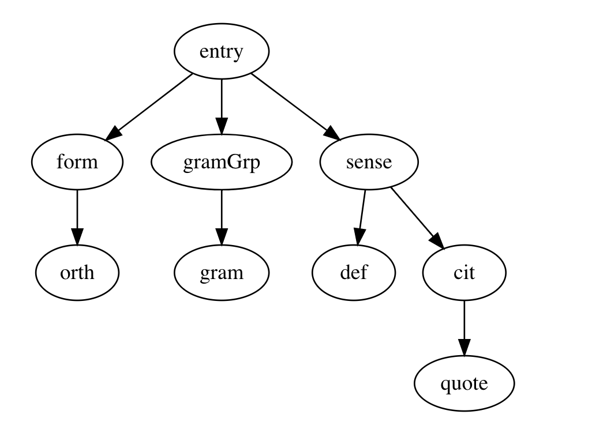
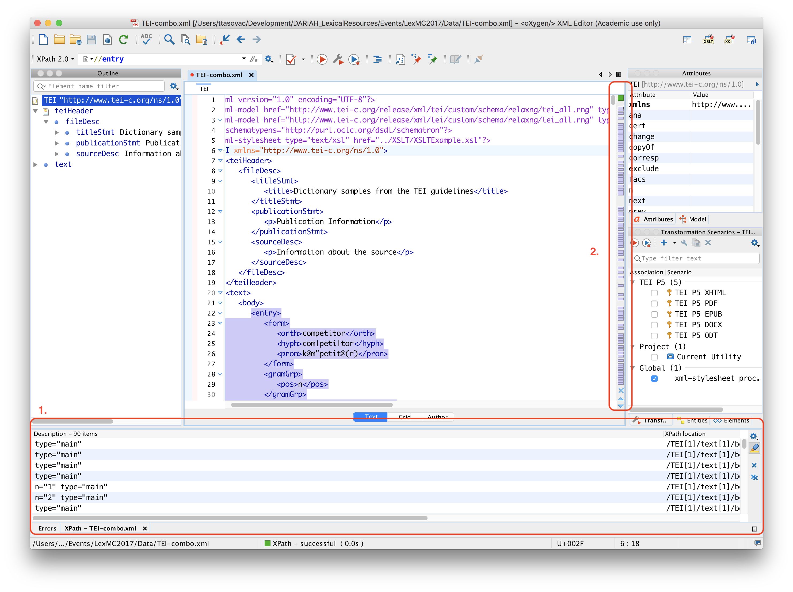
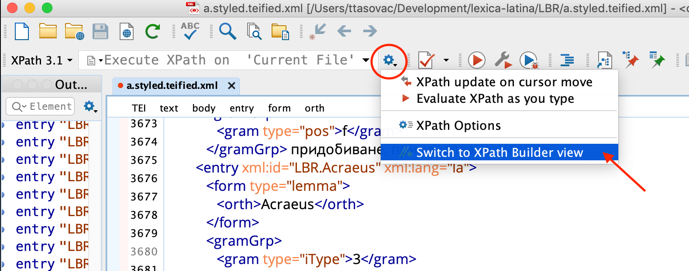
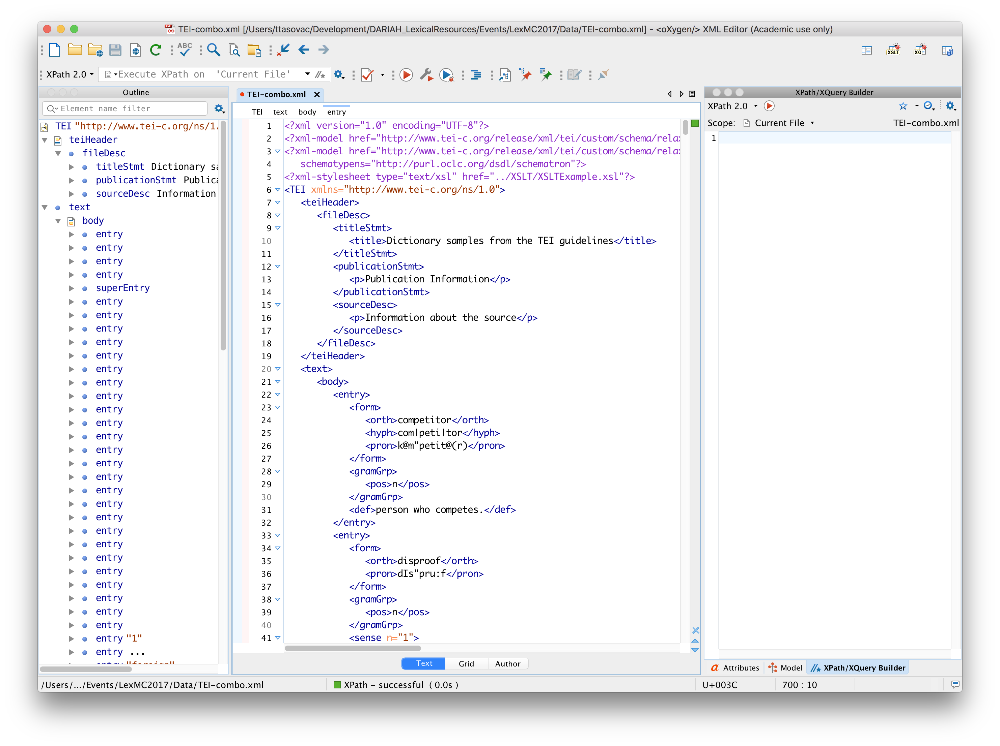

## Introduction

### What is XPath?

XPath (XML Path Language) is a standard query language for selecting nodes from XML documents.

In this tutorial, you will learn how to write XPath expressions in order to navigate around our XML-encoded dictionaries and select only those bits of data that you are interested in.

### Prerequisites

#### Tree structure

You should already be familiar with the fundamentals of the XML tree structure:

- The **root** element forms the basis of the XML tree and all other element nodes, attribute nodes and text nodes reach out like branches and leaves from this topmost element

- Moreover, various relationships between elements exist. In the **child-parent relationship** one element (the child) is nested inside another element (the parent). In the following example, the element `<orth>` is nested in the element `<form>`. Consequently, `<orth>` is the child of `<form>` and `<form>` the parent of `<orth>`:

  ```xml
  <form type="lemma">
    <orth>lexicographer</orth>
  </form>
  ```

- A **sibling** relationship means that elements (the siblings) have the same parent element. For instance, in the following example, the elements `<form>`, `<gramGrp>` and `<sense>` have the same parent element and are hence siblings to each other:

  ```xml
  <entry>
    <form type="lemma">
      <orth>lexicographer</orth>
    </form>
    <gramGrp>
      <gram type="pos">noun</gram>
    </gramGrp>
    <sense>
      <def>A harmless drudge.</def>
      <cit type="example">
        <quote>Some lexicographers are mad!</quote>
      </cit>
    </sense>
  </entry>
  ```

- `<def>` is a child element of `<sense>` and a sibling of `<cit>` etc.

#### Different ways of representing the tree structure

To best understand the tree structure, you should find a way to visualize it that makes the most sense to you.

##### 1. The world upside down

Tree-structures resemble trees, but in a world turned upside-down: the root of the tree is at the top, and the branches are at the bottom. The root element has one or more children. Children with the same parent (there can be only one parent in XML) are siblings etc.



##### 2. Little boxes made of ticky-tacky

A different way of imagining the tree structure is to think of a series of boxes of different sizes. There is one giant box at the top, which contains a number of smaller boxes. Each of these can have one or more boxes inside. The boxes that live in the same bigger box are siblings etc.


##### 3. A folder, a folder, my kingdom for a folder!

Yet another way is to think of the tree structure as a bunch of folders on your computer. The root folder contains all the other folders. The folders that live inside the same folder are siblings to each other etc.


#### Types of nodes in XML

You should already be familiar with the basics of XML notation:  and different types of nodes in XML:

- **element**
- **attribute**
- **text**
- **namespace**
- **processing-instruction**
- **comment**
- **document**

### Another language? Why, oh why?

You may wonder why you need to learn yet another language to query your dictionary data. XML is, after all, a text format. You can open an XML-encoded dictionary in any text editor and search for strings in it using your editor's basic search functions.

The trouble with plain-text searches on XML data is that they are not _context-aware_. In a plain-text search, all strings are considered equal and the edtior will return all the hits containing the search string, regardless of its position in the dictionary hierarchy.

This can be ok for quick-and-dirty searches, but it can also produce a lot of noise, if we are looking for something really specific.

Say you have a large, XML-encoded dictionary and you are interested in:

- finding all the entries whose definition starts with or contains a particular word;
- extracting all the entries that have a particular translation equivalent in the target language;
- exploring all the polysemous entries in a dictionary;

in all of the above cases, succinct XPath expressions will help you get to the specific data that fits your search criteria in a way that plain-text search could never do.

In addition to being useful for studying dictionaries and extracting data from them, XPath is essential to know if you're planning to use XSLT - a language for _transforming_ XML documents. XSLT is applied to XML documents when we want to change them from one format to another (for instance, XML to HTML) or when we want to change something across dictionary (for instance, changing all `entry` elements to `entryFree` etc.)

### What do I need to work with XPath?

In order to work with XPath, you will need:

- XML structured data
- an XPath-aware editor

XPath expressions are applied to XML data. So in order to query your dictionaries and get interesting results out of them, you have to have them encoded in XML. And you have to use an editor that lets you work with XPath.

XPath can't magically produce results that are not based on the actual structure and actual content of your dictionary. The usefulness of XPath searches is directly proportionate to the granularity at which you encoded your dictionary data: the more markup you have, the more interesting your searches can get.

To help you complete this tutorial, we have prepared a file which contains all the dictionary examples from the TEI Dictionary Chapter plus some.

Before proceeding, make sure to:

1. have oXygen XML Editor running on your computer
2. create a new XML file in oXygen and delete the xml declaration that will appear on the first line of the new file by default
3. copy the contents of the dictionary samples from [here](https://raw.githubusercontent.com/DARIAH-ERIC/lexicalresources/master/Events/LexMC2018/Resources/XPATH/DictionarySamplesFromTEIGuidelines.xml) into the oXygen file you just created
4. save the file somewhere on your computer.

## XPath in oXygen

Before learning the basics of XPath, let's make sure we know how to use oXygen for making XPath queries.

### XPath Input Field

Open the dictionaries file you've just created in oXygen and look for the XPath input field in the upper left corner of the window.


Now, type `//entry` into the XPath input field and press return on your keyboard.

You should be seeing something like this:



1. In the lower part of the oXygen window, you will see the beginning of a list containing all the results that correspond to your query. Clicking on individual rows will select the corresponding result (in this case a dictionary entry) in the main window. _Try it yourself._
2. On the right-hand side of the main window, you will also see a navigation bar containing visual clues (purple rectangles), each of which represents one match of your XPath query. _Try clicking on different rectangles to see what happens._

### XPath Builder

If you need to write complex XPath expression, the XPath input field will probably be too small. Not seeing the beginning or the end of the XPath expression can be a pain.

oXygen also offers an XPath/XQuery Builder -- a separate window pane where you can write longer expressions.

#### Launching the XPath Builder

To launch the XPath Builder:

1. go to the main menu and select Window > Show View > XPath/XQuery Builder; or
2. click the Switch to XPath Builder view button which looks like this `//★` and is positioned in the right-hand corner of the XPath input, or
3. in the newer versions of oXygen, click on the icon next to the XPath input field and select the "Switch to XPath Builder View" from the dropdown menu, like this:



Once you launch the XPath Builder View, you should be seeing something like this:



If your screen doesn't look exactly like this, feel free to close some of the smaller window panes, since you won't be needing them. You should probably leave the Outline pane (on the left-hand side as shown above) so that you can easily study the structure of your XML document.


#### Executing XPath from the Builder

To apply an XPath query from the XPath/XQuery Builder, it is not enough to press `return` as was the case with the XPath Input Field. Because the XPath/XQuery Builder is a multi-line text area. Pressing `return` will simply add a new line to the builder.

To execute an XPath from the XPath/XQuery Builder, you have two options:

1. Click on the small red "play" icon inside the Builder area; or
2. Press `⌘-return` (Mac) or `ctrl-return` (Windows).

TODO: check if ctrl is the META character on Windows.

## XPath Expressions

XPath uses so-called _path expressions_ to select nodes in a tree by means of a series of steps.

Each step is defined in terms of:

1. An _axis_, which describes the relationship to be followed in the tree (for instance: selecting child nodes, ancestor nodes, attributes etc.)
2. A _node test_ which defines what kind of nodes are required
3. Zero or more _predicates_ which provide the ability to filter the nodes according to various selection criteria.

You will get to know all of these as we go through various examples.

### Examples

In the following examples, we'll be working with the file you downloaded earlier on. Before we start inspect the file so that you become familiar with its structure.

#### Selecting nodes

| Expression | Description |
| --- | --- |
| _nodename_ | Selects all nodes with the name "_nodename_" |
| `/` | Selects from the document node |
| `//` | Selects nodes in the document from the current node that match the selection no matter where they are |
| `.` | Selects the current node |
| `..` | Selects the parent of the current node |
| `@` | Selects attributes |

What does that mean concretely when applied to our dictionary file? Try all of the following in the XPath Builder:

| Expression | Selects                                   |
| ---------- | ----------------------------------------- |
| `/`        | the document node                         |
| `/TEI`     | `<TEI>` which is the root node            |
| `/entry`   | nothing because `<entry>` is no root node |
| `//entry`  | all entries, no matter where they are     |

Double-slash is your friend. `//entry` will select all entry nodes no matter where in the dictionary hierarchy they are. As you can see in the document outline pane, most entries in this document are children of `/body` but some are also children of `superEntry`.


| Expression    | Selects                                  |
| ------------- | ---------------------------------------- |
| `//form/orth` | all orth nodes that are children of form |


| Expression  | Selects                                               |
| ----------- | ----------------------------------------------------- |
| `//pron`    | all pron nodes no matter where they area              |
| `//pron/..` | parents of all pron elements no matter where they are |


| Expression | Selects                              |
| ---------- | ------------------------------------ |
| `//@type`  | all type attributes, no matter where |

#### Selecting predicates

Predicates are your friends. They are used for selecting specific nodes or nodes that contain specific values.

Predicates are always written in _square brackets_.

| Expression | Selects |
| --- | --- |
| `//body/entry[1]` | first entry |
| `//body/entry[last()]` | last entry |
| `//body/entry[last()-1]` | penultimate entry |
| `//body/entry[position() < 4]` | first three entries |
| `//body/entry[position() > last() - 3`] | last three entries |
| `//cit[@type]` | all cit nodes with type attribute |
| `//cit[not(@type)]` | all cit nodes without type attribute |
| `//cit[@type='translation']` | all cit nodes of type translation |
| `//form[orth="competitor"]` | all forms whose orth = competitor |

Now, as you can see, it's easy to select a node such as `form` whose child (`orth`) is of a particular value. But what if you want to select the entire `entry` whose orthographic form is of a particular value? Let's take this in three steps:

| Expression                      | Selects                             |
| ------------------------------- | ----------------------------------- |
| `//entry`                       | all entries                         |
| `//entry[.//orth]`              | all entries that contain orth       |
| `//entry[.//orth="competitor"]` | all entries whose orth="competitor" |

As you noticed in `//form[orth="competitor"]`, the first node that you put in the square brackets is always the child of the node before the square brackets. `//entry[orth="competitor"]` would return no results from our document because there is no `entry` that has `orth` as its child: `orth` is the child of `form` and `form` is the child of `entry`, which makes `orth` the descendant of `entry`.

That's why we had to do something else: in `//entry[.//orth="competitor"]`, the dot inside the square brackets represent the "current node", i.e. the child of entry, without specifically naming it. It is followed by double slashes to indicate that we are looking for orth _anywhere_ down the tree starting from the current node.

Of course, since orth is the child of form, we could have also written `//entry[form/orth="competitor"]` and the result would have been the same.

**Exercise**

Write XPath expressions to select:

1. all inflected forms in the dictionary file
2. all entries containing translation into French
3. all entries that contain etymological (`etym`) information
4. all senses that come with usage (`usg`) information
5. all entries with pronunciation (`pron`) information

#### Selecting unknown nodes

| Wildcard | Matches                          |
| -------- | -------------------------------- |
| `*`      | any element node                 |
| `@*`     | any attribute node               |
| `node()` | any node (including text nodes ) |

#### Selecting more than one path

To select more than one path, we use the or operator (`|`). For instance:

| Expression | Selects |  |
| --- | --- | --- |
| `//form/orth` | selects all orths |  |
| `//form/pron` | selects all prons |  |
| `//form/orths \| //form/pron` | selects all orths and all prons (by selecting either orths or prons) |  |


#### XPath Axes

Remember, how we said that `//entry[.//orth="competitor"]` would select all the `orth` nodes with value competitor that are descendants of entry, no matter where entry appears in the document?

XPath offers numerous ways of selecting axes, i.e. node sets that are in relation to the current node. A different, more explicit, way of writing the above expression would be: `//entry[descendant::orth="competitor"]`. Note the `::` which separates the axis name (`descendant`) from the node name (`orth`).

| AxisName | Result |
| --- | --- |
| ancestor | Selects all ancestors (parent, grandparent, etc.) of the current node |
| ancestor-or-self | Selects all ancestors (parent, grandparent, etc.) of the current node and the current node itself |
| attribute | Selects all attributes of the current node |
| child | Selects all children of the current node |
| descendant | Selects all descendants (children, grandchildren, etc.) of the current node |
| descendant-or-self | Selects all descendants (children, grandchildren, etc.) of the current node and the current node itself |
| following | Selects everything in the document after the closing tag of the current node |
| following-sibling | Selects all siblings after the current node |
| namespace | Selects all namespace nodes of the current node |
| parent | Selects the parent of the current node |
| preceding | Selects all nodes that appear before the current node in the document, except ancestors, attribute nodes and namespace nodes |
| preceding-sibling | Selects all siblings before the current node |
| self | Selects the current node |

So, what does mean in practice? Let's see one example in three individual steps:

| Expression                          | Selects                               |
| ----------------------------------- | ------------------------------------- |
| `//orth`                            | all orths, no matter where they are   |
| `//orth/following-sibling::pron`    | all prons that follow orths           |
| `//orth/following-sibling::pron[1]` | all the first prons that follow orths |
| `//orth/following-sibling::*`       | all elements that follow orth         |
| `//orth/following-sibling::*[1]`    | all the immediate siblings of orth    |

Now, the interesting thing about the last expression is that it will also select this particular case:


As we learned above, `*` selects any element node, and if you look for `//orth/following-sibling::*` you will also match orths that follow orth. If this is not what you want, you could rewrite the expression in such a way to select any element node which follows orth but which is itself _not_ orth. That would look like this:

| Expressions | Selects |
| --- | --- |
| `//orth/following-sibling::*[not(self::orth)]` | non-orth elements that follow orth |


TODO: Add more examples, especially explaining the difference between the first occurrence of a sibling and the immediate sibling.

**Exercise**

1. Select all elements that are immediate siblings of orth other than pron and hyph
2. We haven't specifically covered this, but let's see if we can figure out the following expression: `//entry[count(sense)>1]`
3. What is the difference between `//entry[count(sense)>1]` and `//entry[count(.//sense)>1]`?
4. What is the difference between `//entry[count(child::sense)>1]` and `//entry[count(descendant::sense)>1]`?
