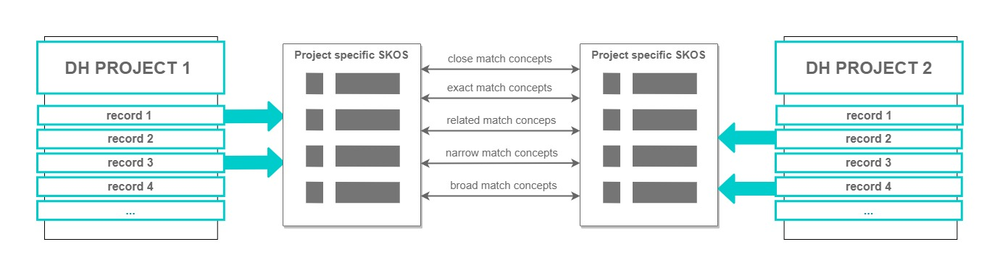
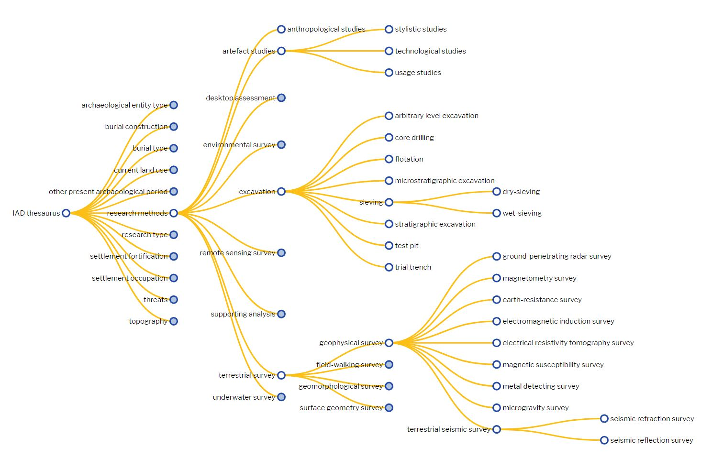
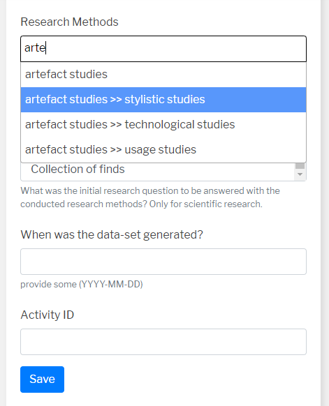
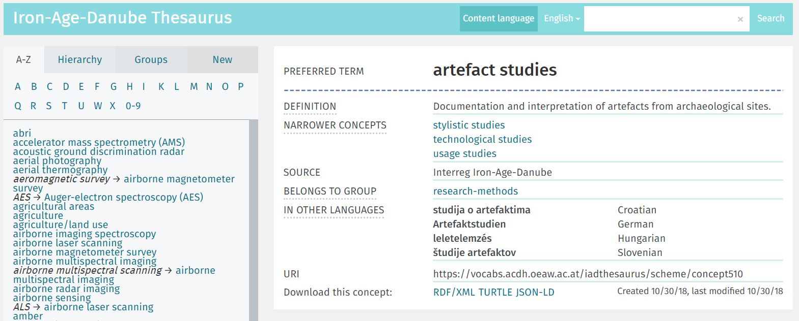

# Introduction to Controlled Vocabularies and their role in Digital Humanities

## What are Controlled Vocabularies?

Controlled vocabularies are knowledge organization systems that contain (optionally) structured set of concepts / terms for organizing and classifying data in order to ensure its future access and retrieval. The concepts / terms are data descriptors related to each other via explicit relationships (hierarchical or associative). These data descriptors are used to distinguish and define the characteristics of knowledge resources in a specific domain. Using controlled vocabularies the resources can be queried, retrieved, analysed and linked to other relevant information objects.

Patricia Harpring [^1] introduced the following definition for CV:
> “A controlled vocabulary is an organized arrangement of words and phrases
> used to index content and/or to retrieve content through browsing or
> searching. It typically includes preferred and variant terms and has a 
> defined scope or describes a specific domain.” (Harpring, P., 2010)


There are many different types of controlled vocabularies, the most common among them are:

- Thesaurus - a type of controlled vocabulary used in information systems that organizes concepts in hierarchical and / or associative relationships and provides their semantic definitions
- Classification schema - a system that based primarily of classifying things or concepts into groups or classes with detailed explanation of those classification methods
- Subject heading list - a list of terms describing subjects in information system
- Taxonomy - a system that organizes things and concepts in groups based on their common characteristics and / or differences
- Terminology - a list of terms used to describe concepts in a certain domain
- Glossary - an alphabetical list of terms with their explanation used in a specific context

The diagram 1. below shows how controlled vocabularies are embedded in data architecture of an information system (the example is derived from DEFC  controlled vocabulary [^2]). In the example below, the Archeological site is a Universal abstract class, whereis Athens is an instance of Archaeological site class and a Particular that represents the exact and real archaeological site studied and described in the system.  Athens can be of one or many types that are defined in a controlled vocabulary, for example, it can be a type of ‘Hillside’. 


Controlled vocabularies (CVs) are prominently used in many domains of research and industry:
- On the Web, vocabularies are often used in building the information architecture for websites, data repositories, the architecture of information systems, thereby providing terms for indexing and retrieval of information objects.
- CVs are widely used in biology for classification of living organisms (e.g. taxonomies of living organisms, classifications of cross-species anatomical entities).
- Public health and medicine have CVs in various forms (terminologies, thesauri, ontologies) for defining categorizations and classifications for biomedical investigations, diseases, symptoms, medical errors, etc.
- International organizations actively use CVs to standardize terms and translations in international affairs. The most notable examples are the United Nations terminologies that translated into six main languages of the UN to eliminate ambiguity in terms used in international communication.
- GLAM (Galleries/Libraries/Archives/Museums) use CVs for a very long time to describe their objects and resources, build catalogues and information systems.
- The fields of Computer Science as data mining, knowledge extraction, conversation AI  use CVs to classify entities and objects in text or speech recognition (Named Entity Recognition and Named Entity Disambiguation, e.g. CVs used to categorize intent in conversion with a robot).

Thereby the CVs are used :
- to organize large volumes of data (group, categorize)
- to ensure future retrieval/search functionality
- to simplify user experience and navigation on the website
- to have a common understanding of used terms (reduce the ambiguity of words)
- for data interoperability and dataset integration (contributing to Open data and Open science)
- to facilitate an exploration process in information systems
- as a base for recommendation systems
- in question answering systems


## Role of CVs in Semantic web

The main idea of Semantic Web is to enrich data with its semantics / meaning that not only humans but also machines could use, interpret and infer new knowledge from. CVs provide and document data semantics.

Tim Berners Lee in his fundamental paper “The Semantic Web” (2001) says that on Semantic Web “information is given well-defined meaning” [^3]. CVs are one of the tools used for this mission.

W3C developed specifications and standards to support usage of CVs in the context of the Semantic Web in order to express knowledge in machine readable format that can be used by computer applications to interpret it. SKOS (Simple Knowledge Organization System) is a standard schema to represent CVs using Resource Description Framework (RDF) which is a standard model for data exchange on the Web [^4]. Usage of RDF for CVs representation allows metadata to be shared and retrieved across different applications.

## CVs in Digital Humanities context

The Digital Humanities are dealing with the production of digital objects which on its own can be data resources (e.g. 3D models, TEI [^5] documents, data visualizations) as well as with production of metadata for real world objects (e.g. archaeological finds, historical manuscripts). In both cases it involves creation of digital assets. CVs are used to describe, group and distinguish these resources.

_Why CVs are important in DH projects?_

DH data is highly interpretational and often observational. To a certain extent and in certain DH disciplines (e.g. literary studies) it is shaped by a researcher’s worldview and opinion. This makes more difficult to standardize and develop a common understanding of the used terminology. Nevertheless, CVs are an attempt to make the conceptualisations explicit and thus understandable to recipients.

Moreover, the DH is one of the domains that adopting Open data and Open science initiative actively in the last years. This makes it even more crucial to design and publish CVs and link them to external authoritative reference resource to allow data interoperability and linking with data from other DH projects.

There are different approaches how CVs can be reused or made interoperable with each other in order to facilitate data integration.

The diagram 2. Below shows how different projects use one controlled vocabulary to describe their data. Booth projects data can be queried with terms from this vocabulary. This is probably the best case scenario that can happen because it ensures full data interoperability.


The other approach (diagram 3) shows how different projects use their own project specific controlled vocabularies. The vocabularies are linked to each other through established relationships among concepts in both of them. Therefore we can refer to data in Project 1 using matching concepts from Controlled Vocabulary of Project 2. The linking happens on a level of a concept description when the statement is encoded that the concept is exact / related / close match (etc.) as a concept from another CV or from a large semantic network like, e.g. Dbpedia [^6].





There are also meta-vocabularies developed with a primary goal to be a high level overarching vocabulary for more domain specific CVs. Therefore making it easier to connect local CVs and establish relationships among them through common meta-level concepts. Backbone Thesaurus [^7] is one of the examples in DH domain that has as its purpose to allow interdisciplinary CVs development and integration.


# SKOS Standard

## About SKOS

SKOS is a Simple Knowledge Organization System, a common data model for sharing and linking knowledge organization systems via the Web.

SKOS is based on RDF and is a machine-readable format and can be exchanged between software applications and published on the Web.

Informative guide SKOS Primer [^8] https://www.w3.org/TR/skos-primer/  .

Normative guide SKOS Reference [^9] intended for users who have a good understanding of Semantic Web technology, especially RDF and OWL SKOS Reference  https://www.w3.org/TR/skos-reference/ .

## SKOS Basics

### Concept and its labels

The central element of SKOS is a Concept.
> "Concepts exist in the mind as abstract entities which are independent of
> the terms used to label them." [SKOS Primer]

How to assert that resource is a Concept:
1. create Uniform Resource Identifier (URI) - to uniquely identify the concept
2. identify URI  with rdf:type skos:Concept

```
@prefix skos: <http://www.w3.org/2004/02/skos/core#> .
@prefix rdf: <http://www.w3.org/1999/02/22-rdf-syntax-ns#> .
@prefix ex: <http://www.example.com/> .

ex:cat rdf:type skos:Concept.
```

#### Labels

The Concept is defined by a label in natural language.
SKOS provides three properties to attach labels to a concept:
- skos:prefLabel  - preferred label for a concept, only one unique prefLabel per language is allowed;
- skos:altLabel - alternative labels for a concept, e.g. synonyms, abbreviations and acronyms (can be many);
- skos:hiddenLabel - misspellings and other variants, the label string is accessible for text indexing by applications but not visible otherwise.

```
@prefix skos: <http://www.w3.org/2004/02/skos/core#> .
@prefix rdf: <http://www.w3.org/1999/02/22-rdf-syntax-ns#> .
@prefix ex: <http://www.example.com/> .

ex:cat rdf:type skos:Concept;
    skos:prefLabel “cat”@en;
    skos:prefLabel “Katze”@de;
    skos:altLabel “kitten”@en;
    skos:hiddenLabel “katze”@de.
```

### Semantic relationships

There are two types of relationships between concepts that can be established in a vocabulary:

- Hierarchical via properties skos:broader, skos:narrower
  - SKOS model doesn’t state that broader & narrower are transitive but it doesn’t imply that these properties are intransitive (Note on transitivity: the relationship is transitive if concept A is related to concept B. Concept B is related to concept C. That implies that concept A is related to concept C.)
  - For explicit transitivity use skos:broaderTransitive and skos:narrowerTransitive

- Associative via property skos:related
  - is not defined as a transitive property

Important to not mix hierarchical and associative relationships: if two concepts are in broader/narrower relationships between each other then they are explicitly in hierarchical relationships therefore don’t need to be related via skos:related property. Similarly, if two concepts are related via skos:related property we can infer that they are related in some other distinct from hierarchical relationships way (e.g. a concept representing a tangible object is related to a concept describing a method that uses that object).

```
@prefix skos: <http://www.w3.org/2004/02/skos/core#> .
@prefix rdf: <http://www.w3.org/1999/02/22-rdf-syntax-ns#> .
@prefix ex: <http://www.example.com/> .

ex:cat rdf:type skos:Concept;
  skos:prefLabel “cat”@en;
  skos:prefLabel “Katze”@de;
  skos:altLabel “kitten”@en;
  skos:narrower ex:wildcat.

ex:wildcat rdf:type skos:Concept;
  skos:prefLabel “wildcat”@en;
  skos:broader ex:cat.

```

### Documenting concepts

SKOS  defines properties to add human-readable documentation about concept.
It is strongly recommended to add documentation properties for a concept.

The following properties can be used:

- skos:note - general documentation purposes
- skos:scopeNote - partial information about the intended meaning of a concept
- skos:definition - complete explanation of the intended meaning of a concept
- skos:example - example of the use of a concept
- skos:historyNote - significant changes to the meaning or the form of a concept
- skos:editorialNote - administrative information for editors
- skos:changeNote - changes for the purposes of administration and maintenance


```
@prefix skos: <http://www.w3.org/2004/02/skos/core#> .
@prefix rdf: <http://www.w3.org/1999/02/22-rdf-syntax-ns#> .
@prefix ex: <http://www.example.com/> .

ex:cat rdf:type skos:Concept;
  skos:prefLabel “cat”@en;
  skos:prefLabel “Katze”@de;
  skos:altLabel “kitten”@en;
  skos:hiddenLabel “katze”@de;
  skos:definition “A small carnivorous mammal with soft fur, a short snout, and retractable claws.”@en;
  skos:editorialNote “Review this term after merge.”@en;
  skos:changeNote “Added hidden label.”@en.

```

### Concept Scheme

As it is mentioned above CV forms a schema of data descriptors therefore SKOS introduces a Concept Scheme class to express the notion of CV itself. Concepts are compiled in one Concept Scheme with an explicitly defined scope.

The following statements define the purpose and usage of Concept Scheme class:

- skos:ConceptScheme is a class for representing a controlled vocabulary.
- Concepts have to be linked to ConceptScheme via skos:inScheme  property.
- skos:hasTopConcept is used to define entry points of a hierarchy.
- Metadata about Concept Scheme can be expressed using Dublin Core properties such as dct:creator, dct:contributor, dct: title, dct:rightHolder …


```
@prefix skos: <http://www.w3.org/2004/02/skos/core#> .
@prefix rdf: <http://www.w3.org/1999/02/22-rdf-syntax-ns#> .
@prefix ex: <http://www.example.com/> .
@prefix dct: <http://purl.org/dc/terms/> .


ex:animalsVocabulary rdf:type skos:ConceptScheme;
  dct:title “Animals Vocabulary”@en;
  skos:hasTopConcept ex:animals.

ex:animals rdf:type skos:Concept;
  skos:prefLabel “animals”@en;
  skos:prefLabel “Tiere”@de;
  skos:inScheme ex:animalsVocabulary;
  skos:topConceptOf ex:animalsVocabulary.

```

### Grouping concepts within one vocabulary

- SKOS provides a class of Collection for the purposes of grouping concepts based on their shared characteristics.
- Class skos:Collection/skos:OrderedCollection is used to group concepts into meaningful collections within Concept Scheme.
- Concepts are added to Collection via skos:member or skos:memberList property.


```
@prefix skos: <http://www.w3.org/2004/02/skos/core#> .
@prefix rdf: <http://www.w3.org/1999/02/22-rdf-syntax-ns#> .
@prefix ex: <http://www.example.com/> .

ex:wildCatsInEurope rdf:type skos:Collection;
  skos:prefLabel “Wild cats in Europe”@en;
  skos:member ex:europeanWildcat;
  skos:member ex:eurasianLynx;
  skos:member ex:iberianLynx.

ex:europeanWildcat rdf:type skos:Concept;
  skos:prefLabel “European wildcat”@en.

ex:eurasianLynx rdf:type skos:Concept;
  skos:prefLabel “Eurasian lynx”@en.

ex:iberianLynx rdf:type skos:Concept;
  skos:prefLabel “Iberian lynx”@en.     

```

## Advanced SKOS

### Mapping concepts to external LOD resources and vocabularies

Concepts can be semantically reconciled to concepts in different Concept Schemes (=vocabularies) or LOD resources on the Web for the purposes of data interoperability and integration.

SKOS provides the following properties to link concepts with external resources:

- skos:exactMatch - the local term is an exact match to a term in an external vocabulary
- skos:closeMatch - not exact but close match to a term in an external vocabulary
- skos:broadMatch - the local term has a broader match in an external vocabulary
- skos:narrowMatch - the local term has a narrower term in an external vocabulary
- skos:relatedMatch - the related term in an external vocabulary


```
@prefix skos: <http://www.w3.org/2004/02/skos/core#> .
@prefix rdf: <http://www.w3.org/1999/02/22-rdf-syntax-ns#> .
@prefix ex: <http://www.example.com/> .

ex:europeanWildcat rdf:type skos:Concept;
    skos:prefLabel "European wildcat"@en;
    skos:exactMatch <https://www.wikidata.org/wiki/Q148833>;
    skos:broadMatch <https://www.wikidata.org/wiki/Q43576 >.

```

### SKOS-XL

Sometimes it is required to describe relationships among lexical labels representing concepts.
For this SKOS provides an extension SKOS-XL - SKOS eXtension for Labels - to identify, describe and link lexical labels.


- Each label is defined as skosxl:Label class and assigned a URI
- The lexical form is stored via skosxl:literalForm property
- Labels relations are expressed via skosxl:labelRelation

```
@prefix skos: <http://www.w3.org/2004/02/skos/core#> .
@prefix rdf: <http://www.w3.org/1999/02/22-rdf-syntax-ns#> .
@prefix ex: <http://www.example.com/> .
@prefix skosxl: <http://www.w3.org/2008/05/skos-xl#> .

ex:europeanWildcat rdf:type skos:Concept;
  skosxl:prefLabel ex:europeanWildcatLabel1;
  skosxl:altLabel ex:europeanWildcatLabel2.

ex:europeanWildcatLabel1 rdf:type skosxl:Label;
  skosxl:literalForm “European wildcat”@en.

ex:europeanWildcatLabel2 rdf:type skosxl:Label;
  skosxl:literalForm “Felis silvestris”@la.

ex:europeanWildcatLabel1 skosxl:labelRelation ex:europeanWildcatLabel2.

```

## SKOS Quiz


## SKOS vocabulary quality

### SKOS checklist

The future retrieval and search functionality will directly depend on the quality of CV therefore it is important to follow W3C recommendations for SKOS and check a vocabulary against the most common errors before using it in an application or publishing on the Web.
The most common errors and bad practices are the following:

1. Omitted or invalid language tags (e.g.: skos:prefLabel "stone"@english, "Stein")
2. Label conflicts (e.g. two concepts have the same preferred lexical label in a given language when they belong to the same concept scheme)
3. Orphan concepts (e.g. concepts without any associative or hierarchical relationships)
4. Undocumented concepts (concept should have one of the documentary notes)
5. Valueless associative relations
6. Omitted top concepts => no starting points of the concept hierarchy
7. Top concept having broader concepts
8. Creating a new concept for each synonym
9. Ambiguous label for a concept
10. Flat data (no hierarchy and associative relationships among concepts)

_Above material is derived from the following work:_
Mader, Christian, Bernhard Haslhofer, and Antoine Isaac. "Finding quality issues in SKOS vocabularies." In International Conference on Theory and Practice of Digital Libraries, pp. 222-233. Springer, Berlin, Heidelberg, 2012.


## Task: Model Music styles vocabulary

There are many music styles used to categorize music.
Consider the following styles: pop music, alternative rock, electronic music, punk rock, techno, rock, heavy metal.

1. Structure/draw your own vocabulary called "Music styles"

2. Model this vocabulary in a SKOS record:

    - model in RDF turtle format
    - add at least one of documentary notes for each concept
    - add labels in other languages
    - feel free to add more music styles
    - establish relationships to external LOD resources (dbpedia, wikidata)
    - save file in .ttl format

3. Visualize "Music styles" using web tool [SKOS play](http://labs.sparna.fr/skos-play/upload). Try different visualization types.


# Controlled vocabulary as a backbone of information architecture

## CV in data management web application

Controlled vocabularies provide data descriptors for future data retrieval. This directly impacts search and data discovery. CV is a building block in database design and is a part of information architecture in user interface. The following examples show how one CV is used in different parts of the web application.
The following examples are taken from Iron-Age-Danube [^10] project's data management system.


Picture 1. Visualization of IAD Thesaurus [^11]



- Database values: CVs are closed lists in user interface represented as dropdown lists when creating or annotating a record.

Picture 2. CV in data curation interface




- Context information: when exploring data it is important to provide user with an explanation of used terms in interface.

Picture 3. CV in user interface


- Faceted search based on CVs: dropdowns and autocompletes

Picture 4. CV in faceted search interface


Picture 5. CV in faceted search interface


- CVs are building blocks of Linked Open Data and used for connecting distributed datasets via concepts persistent URIs. Each concept has a unique stable and resolvable URI that can be reused by other projects to refer to this concept. The reference can be done by using directly URI or by retrieving URI using API of vocabulary repository.

Picture 6. IAD Thesaurus in Vocabs repository




# Open source tools for vocabulary management

Creating a vocabulary is a lengthy and time-consuming process.
Usually it involves conceptual thinking stage. The vocabulary refinement stage can last until the end of the project.

Vocabulary can be integrated in a project's software on a database architecture level or retrieved via API from the third-party applications.
There are different open source tools exist for managing controlled vocabularies.

## Editing and browsing

SKOS editors are tools for creating SKOS vocabulary in a user-friendly interface:

- [iQvoc](http://iqvoc.net/)
- [VocBench](http://vocbench.uniroma2.it/)
- [TemaTres](https://www.vocabularyserver.com/)
- [Themas](https://github.com/isl/THEMAS/)
- [Vocabs editor](https://vocabseditor.acdh.oeaw.ac.at/)

Most of the tools allow SKOS data import and export.

- [OpenRefine](https://openrefine.org/) with [RDF extension](https://github.com/stkenny/grefine-rdf-extension)
- [Karma](https://usc-isi-i2.github.io/karma/)
- [SKOS play](http://labs.sparna.fr/skos-play/)
- SKOS file can be also be programmed, for example, using Python [rdflib](https://rdflib.readthedocs.io/) package - a package to work with RDF data

[SKOSMOS](http://skosmos.org/) is a vocabulary repository and browser which queries data via SPARQL endpoint and provides a REST API to allow for linked data.

## Validation

Validation tools are very important to detect any inconsistencies in SKOS data architecture.

- [Skosify](https://github.com/NatLibFi/Skosify) - corrects errors and adds missing symmetric statements; can be used as a command line script or python library.

- [SKOS Testing tool](http://labs.sparna.fr/skos-testing-tool/) - provides a validation report on quality of submitted SKOS file; based on qSKOS.

## Visualization

[SKOS Play ](http://labs.sparna.fr/skos-play/)- renders and visualizes SKOS vocabularies (alphabetical index, hierarchical tree, interactive tree/square/circle visualization, autocomplete form).

## ACDH Vocabs services

ACDH provides a suite of service for collaborative creation, maintenance and sharing of vocabularies of any kind. Some services adapt existing open source tools to the needs of users and some are developed at the ACDH.

ACDH vocabs contains four major services covering different aspects of vocabulary usage:

1. [Vocabs repository](https://vocabs.acdh.oeaw.ac.at/en/) is a services based on open source tool SKOSMOS [^12] to allow publication, reuse and retrieval of controlled vocabularies. It provides an API endpoint in order to integrate vocabulary terms in a web applications.

2. [Vocabs editor](https://vocabs.acdh.oeaw.ac.at/en/about#editor) is a web-based tool for collaborative development of controlled vocabularies of small and medium size. The editor follows the SKOS data model for the main elements of a vocabulary. The Dublin core schema is used to capture the metadata (such as date created, date modified, creator, contributor, source and other) about each element. Each concept scheme as well as each individual concept can be downloaded in RDF/XML and Turtle format. The user management system allows a user to share a concept scheme she/he created with other users (called 'curators') to create new, edit and delete concepts and collections within this concept scheme. Each user can find a summary of their latest activity on user's page. The tool also provides an API to retrieve the data.

3. [Vocabs SPARQL](https://vocabs-sparql.acdh.oeaw.ac.at/) is an interface for querying vocabularies triple store with SPARQL queries. It is developed on top of Jena Fuseki [^13] triple store and uses YASGUI [^14] interface to access the endpoint.

4. Vocabs visualize is a data visualization service developed to show the relationships between concepts in multiple vocabularies and see how the represented topics are connected.


# Controlled Vocabularies in Digital Humanities domain

Various domains Controlled vocabularies registry - [BARTOC](https://bartoc.org/en)

*Category: General*

- [GEMET - General Multilingual Environmental Thesaurus](http://www.eionet.europa.eu/gemet/en/themes/)
- [UNESCO Thesaurus](http://skos.um.es/unescothes/CS000/html)
- [EuroVoc](http://eurovoc.europa.eu/drupal/?q=navigation&cl=en)
- [Backbone Thesaurus](https://vocabs.acdh.oeaw.ac.at/backbone_thesaurus/en/)

*Category: Resource type*

- [Controlled Vocabulary for Resource Type Genres](http://vocabularies.coar-repositories.org/documentation/resource_types/)
- [Thesaurus for Graphic Materials](http://www.loc.gov/pictures/collection/tgm/)

*Category: Digital Humanities*

- [TaDiRAH - Taxonomy of Digital Research Activities in the Humanities](http://tadirah.dariah.eu/vocab/)

*Category: Geosciences*

- [GBA Thesaurus](http://resource.geolba.ac.at/)

*Category: Cultural Heritage*

- [The Forum on Information Standards in Heritage (FISH) Linked Data Vocabularies for Cultural Heritage](http://www.heritagedata.org/blog/vocabularies-provided/)
- [Getty Art & Architecture Thesaurus](http://www.getty.edu/research/tools/vocabularies/aat/index.html)
- [Travel digital thesaurus](https://vocabs.acdh.oeaw.ac.at/traveldigital_thesaurus/en/)
- [Iconclass](http://www.iconclass.nl/home)

*Category: Archaeology*

- [Archaeological Objects Thesaurus Scotland](http://vocabulary.locloud.eu/Archeological_Objects/index.php)
- [iDAI.vocab](http://thesauri.dainst.org)
- [DEFC Thesaurus](https://vocabs.acdh.oeaw.ac.at/defc_thesaurus/en/)
- [Iron-Age-Danube Thesaurus](https://vocabs.acdh.oeaw.ac.at/iad_thesaurus/en/)


## References

[^1] Harpring, Patricia. Introduction to controlled vocabularies: terminology for art, architecture, and other cultural works. Getty Publications, 2010.

[^2] DEFC Thesaurus https://vocabs.acdh.oeaw.ac.at/defc_thesaurus/en/

[^3] Berners-Lee, Tim, James Hendler, and Ora Lassila. "The semantic web." Scientific american 284, no. 5 (2001): 28-37.

[^4] https://www.w3.org/RDF/

[^5] DariahTeach: Text encoding and the Text Encoding Initiative https://teach.dariah.eu/course/view.php?id=23

[^6] https://wiki.dbpedia.org/

[^7] Backbone Thesaurus https://www.backbonethesaurus.eu/

[^8] SKOS Primer https://www.w3.org/TR/skos-primer/

[^9] SKOS Reference https://www.w3.org/TR/skos-reference/

[^10] https://www.iron-age-danube.eu/

[^11] IAD Thesaurus https://vocabs.acdh.oeaw.ac.at/iad_thesaurus/en/

[^12] http://skosmos.org/

[^13] https://jena.apache.org/documentation/fuseki2/

[^14] https://triply.cc/docs/yasgui