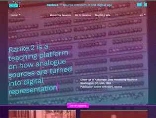

---
title:
  'Doing source criticism in the digital age: presenting the ranke.2 platform'
date: 2020-12-03
categories:
  - dariah
tags:
  - training-education
  - digital-source-criticism
  - source-criticism
  - digital-history
  - digital-literacy
  - digital-archives
abstract:
  Ranke.2 is an open-source teaching platform for history lecturers that offers
  lessons on how to apply source criticism to digitised and digital born
  historical sources. Ranke.2’s objective is to offer accessible information
  about digital technology to lecturers and students of history so that a new
  generation of hybrid historians can be trained who know their way around a
  traditional archive as well as the web.

type: training module
authors:
  - stefania-scagliola
  - daniele-guido
  - andreas-fickers
contributors:
  - gerben-zaagsma
  - frederic-weiss
  - cristina-garcia-martin
  - alexandre-germain
  - sarah-cooper
  - maria-cristina-piticco
  - estelle-bunout
  - marten-during
  - sidney-wiltgen
  - jordan-ricker
  - emmanuel-decker
  - ilaria-comes
editors:
  - stefania-scagliola
  - gerben-zaagsma
licence: CCBY 4.0
toc: false
targetGroup: Domain researchers, Lecturers
domain: History and Humanities
version: 1.0.0
---

[Ranke.2](https://ranke2.uni.lu) is an open-source teaching platform for history
**lecturers** that offers lessons on how to apply source criticism to digitised
and digital born historical sources. Ranke.2’s objective is to offer accessible
information about digital technology to lecturers and students of history so
that a new generation of hybrid historians can be trained who know their way
around a traditional archive as well as the web.

Each lesson covers a particular type of digital information – such as web
archives or the digitization of newspapers - and consists of modules of three
different sizes: the small module offers an animation and a short quiz, the
medium module provides a series of assignments, and the large module gives a
suggestion for a workshop. The content is ideal for bachelor students of history
and is interdisciplinary by design, combing history, archival studies, ancillary
sciences, information science, and computer science. Designed to be used by
lecturers independently, Ranke.2 is not a MOOC and thus offers lecturers the
opportunity to determine how to best integrate the content into their own
teaching by offering information about the time required for assignments, key
words, and learning outcomes.

[Explore Ranke.2 now!](https://ranke2.uni.lu)

<figure style="width:100%; position:relative">
  
  

</figure>
Low resolution gif of ranke.2 landing page
