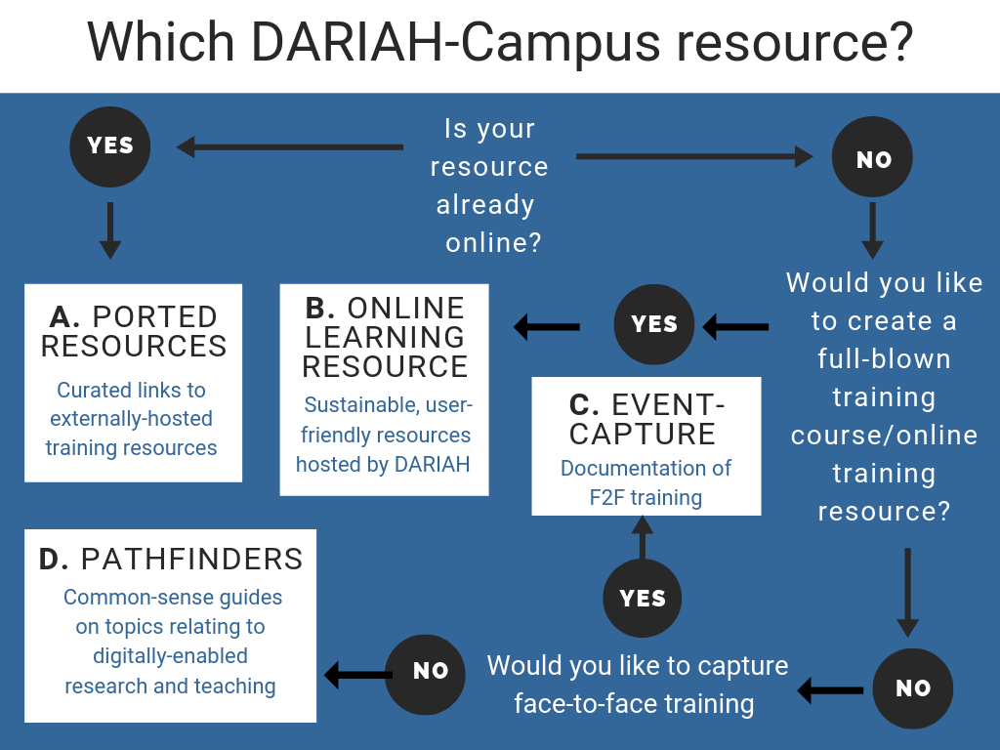

The goal of DARIAH-Campus (D-C) is to widen access to open, inclusive, high-quality learning materials that aim to enhance creativity, skills, technology and knowledge in the digital arts and humanities.

We recognise the breadth and experience of our community and hope that DARIAH-Campus resources will reflect that. As trainers, we are all also learners. Thus, we are open to the creativity and ideas of our contributors. However, we also believe in the importance of creating learning resources that are inclusive; discoverable; useful and re-usable; visually and stylistically appealing; and sustainable. To ensure that we achieve this blend of attributes consistently, we have created a set of guidelines. We hope that a sense of prescribed structure will also make the process of creating resources more straightforward, efficient, and effective.

<Panel>

Any recommendations and/or questions about the flexibility of these guidelines—or general enquiries about the process of creating a learning module—are welcome, and can be directed to DARIAH’s [Training and Education Officer](info@dariah.eu).

</Panel>

## 1. Suggesting a DARIAH-Campus Resource

D-C can link to and host a wealth of different types of training and educational resources, and welcomes new additions to each. To help with the process of deciding which to suggest, we have provided the simple diagram below:

### A. LINKS TO RESOURCES

D-C acts as a discovery layer for learning resources, which includes curated links to lessons, courses, tutorials and other resources in the places where they ‘live’. Currently, we aim to link to resources that have a connection with DARIAH through clear branding to either DARIAH-EU or the national nodes; that are contributions from our members; and/or that have a connection with the DARIAH Working Groups. We will only link to resources that are openly available for use and re-use, in order to promote and uphold the principles of open science. Do you know of a course, lesson, or tutorial that should be included in our discovery layer? If so, [contact us](info@dariah.eu), including the name of the resource, a link, and a brief description.

### B. HOSTED LEARNING RESOURCES

DARIAH-Campus hosts and version-controls new online learning resources designed for use both by online users and in future face-to-facing training events. These are hosted in our GitHub repository, with an elegant website build upon it. Types of material can include, but are not limited to: training courses, individual lessons, and/or tutorials. We ask that authors/contributors write the material in Markdown according to the instructions provided below. We welcome proposals for new content from individuals and groups based at institutions in our member and co-operating partner countries. In addition, we encourage contributions from independent scholars, cultural heritage professionals, and other research and/or teaching professionals without a formal affiliation.
To propose a new hosted course, module, or tutorial for D-C, [contact us](info@dariah.eu) in advance, providing a structured abstract with the following information:

<Panel>

**Title.** Title of the resource.
**Brief description (<300 words).** A description of the resource in fewer than 300 words.
**Author.** The author(s) of the resource.
**Contributors.** Any other contributors to the resource.
**Keywords.** As many keywords as are relevant for the resource.
**Domain.** A field of science or expertise covered by the resource.
**Competence level.** Beginner, Intermediate, Advanced.
**Technology requirements.** Any specific technology or software needed to create/use the resource.
**Anticipated time of delivery.** An estimated time for the completion of the resource to help with the planning process.

</Panel>

This information will be used to generate the most accurate possible metadata and tags for the course in DARIAH-Campus. Upon receiving this information, we will get in touch to discuss the development of your proposed material and to invite you to submit.

### C. EVENT CAPTURE

DARIAH-Campus can host documentation of face-to-face training and educational events and workshops. This can include programmes, slides, videos, speaker biographies and much more. For this, we have designed a special workflow and a template to compile and structure the content in a meaningful and learner-friendly way. Please see the separate document entitled: ["Capturing Face-to-Face Events"](link).

### D. PATHFINDERS

Pathfinders are specially-produced, humanist-friendly common-sense guides on a variety of topics relating to digitally-enabled research and teaching. Their purpose is to provide curated information and access to existing learning resources that extend beyond those created by members of the DARIAH network. We welcome proposals for new Pathfinders from individuals and groups based at institutions in our member and co-operating partner countries and beyond. In addition, we encourage contributions from scholars, cultural heritage professionals, and other research and/or teaching professionals without a formal affiliation. If you would like to contribute a DARIAH-Campus Pathfinder, please [contact us](info@dariah.eu) with a brief description of your proposed resource. Specific guidelines for the Pathfinders are found [here](link).

## 2. Writing your DARIAH-Campus resource

DARIAH-Campus materials are hosted and version-controlled in a GitHub repository and delivered to the user as an elegant Gatsby-based overlay website. The editorial team are committed to making the process of providing and editing materials as simple as possible, and so have provided the following practical technical guidelines:

### Writing in Markdown

Gatsby converts Markdown into HTML pages, and so we ask you to write your content in Markdown. This can seem intimidating if you have not done it before, but there are many online guides to getting started with Markdown. For instance, Programming Historian have an excellent introduction, [Getting Started with Markdown](https://programminghistorian.org/lessons/getting-started-with-markdown).

Text must be provided in a text editor such as Atom, TextWrangler, TextEdit, or Notepad++ rather than in a word processor such as MS Word.

To help with the process, we have created a DARIAH-Campus template. We are happy to provide guidance with using this at any stage of the preparation and submission process:

**Link to Sample Resource that functions as Markdown template**

### Images, Videos, Quizzes/exercises, and other Multimedia

#### Images

Learning resources benefit from images to break up the text and for illustrative and instructive purposes. The exact nature and content of these images is flexible according to the type and topic area of your learning resource. They can range from photographs; to infographics; diagrams; maps; screenshots and more. These images should be incorporated into the body of your resource using the following code:

**CODE for images**

We ask authors to use intelligible file names that either indicate the content of the image (data-reuse-diagram.png) or indicate which figure it is within the module (research-infrastructures-fig-1.png). Prepare either .png or .jpg and upload at largest possible size. Check image reuse rights and choose content in the public domain and under Creative Commons licenses. Provide a descriptive figure caption, including source for third-party images, and other information such as shelfmark where relevant.

#### Videos

Videos are welcomed, since they provide vital contextual information on a subject and/or step-by-step guidance to complete exercises and practical task. To include a video as part of your material, you can upload it to the DARIAH-Campus YouTube channel, or link to the video on your own channel. These videos are included into the body of your material using the following code:

**CODE for videos**

Any video published on the DARIAH-Campus YouTube Channel is covered by a Creative Commons Attribution-NonCommercial-ShareAlike 4.0 International (CC BY-NC-SA 4.0). We ask that any externally-hosted videos that you produce as part of your materials are also licenced for reuse.

If linking to third-party videos, insert the video using the above code, and provide the full details as a caption in your course text, in the following format: "Title, Source, URL (Licence)".

#### Self-assessment activities

Self-assessment activities enliven the learning process; address different learning styles; and provide opportunities to expand upon the course content in the classroom or independently. These can include quizzes; exercises; assignments; questions to consider in a group discussion; practical step-by-step tutorials guiding learners through a task; and much more. Since the technical guidelines for including this kind of material will vary according to their nature, the [D-C editorial team](link) will be happy to discuss your requirements as you develop your resource.

### Language and readability

Where writing in English, keep an international audience in mind and avoid idioms and colloquialisms where possible. We are open to submissions in languages other than English.. We are committed to inclusiveness, and welcome new additions to the editorial and reviewing team, in order to expand our reach. Please [contact us](info@dariah.eu) if you would like to contribute.

### Accessibility

Resources aim to be open and accessible to all. With that in mind, please think about learners with disabilities as you create your course. The editor will help with this (e.g. providing alt tags for images when creating the module). However, in order to help, please consult BCcampus’s helpful [Open Education Accessibility Toolkit](https://opentextbc.ca/accessibilitytoolkit/) when writing your module and compiling the accompanying resources. At the very least, please provide transcripts for all videos and pay attention to creating sections and subsections with a clear hierarchy.

### Notes and Referencing

Authors can provide both endnotes and a bibliography, which should be formatted using the Chicago Manual of Style. Bibliographical items will be presented as links to the [DARIAH-Campus Zotero bibliography](https://www.zotero.org/groups/744474/dariah).

## 3. Submitting the resource using GitHub

**instructions**

## 4. Openness and Licencing

D-C learning materials are licensed under a Creative Commons CC BY-SA licence. This ensures that they are available for free; can be re-mixed and repurposed; and are easy to combine with other materials and courses. The integrity of the resource is ensured under the ‘Attribution’ requirement, whereby re-users must give appropriate credit, provide a link to the license, and indicate if changes were made.

## 5. The DARIAH-Campus Post-Publication Peer Review System

**MORE DETAILS**

## 6. Contact Us

All queries are welcomed, and can be sent to the DARIAH-Campus team via the [DARIAH Training and Education Officer](link)

## 7. Acknowledgements

The DARIAH-Campus editorial team would like to acknowledge the work of the [Programming Historian team](https://programminghistorian.org/lessons/getting-started-with-markdown). We recognise the trailblazing work done by their volunteer-driven team in advancing Open Educational Resources, and their carefully-crafted Author Guidelines have served as inspiration for own guidelines.
