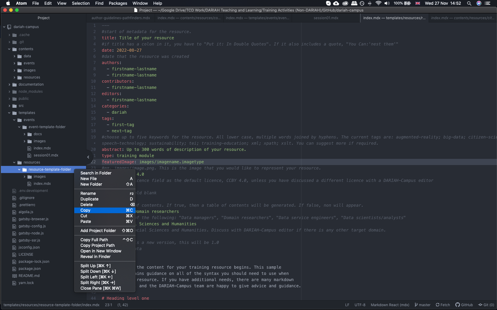
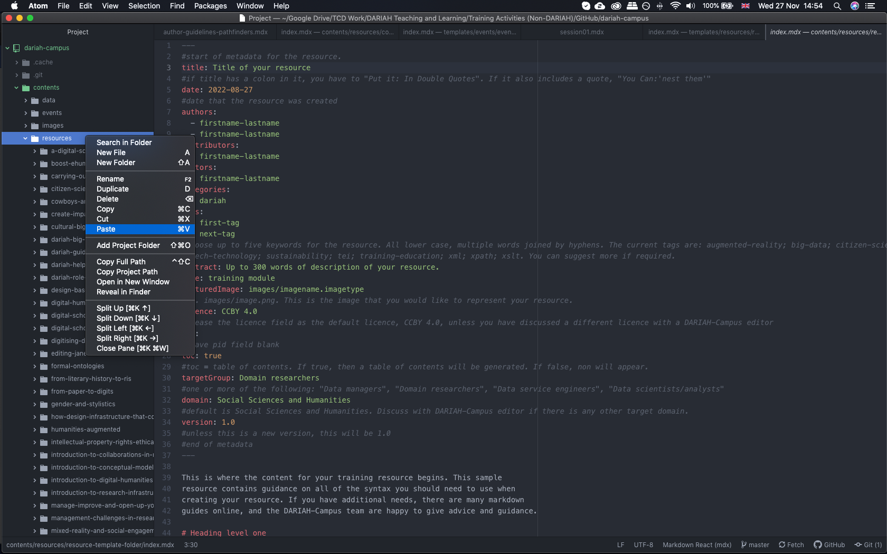
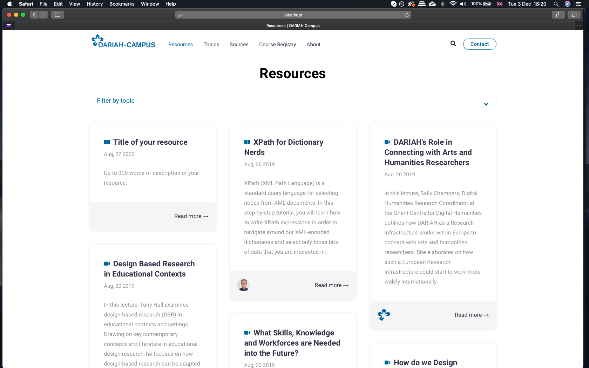
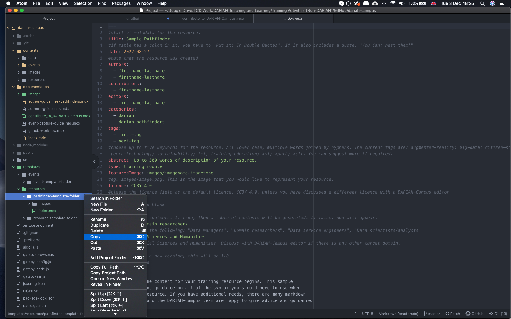
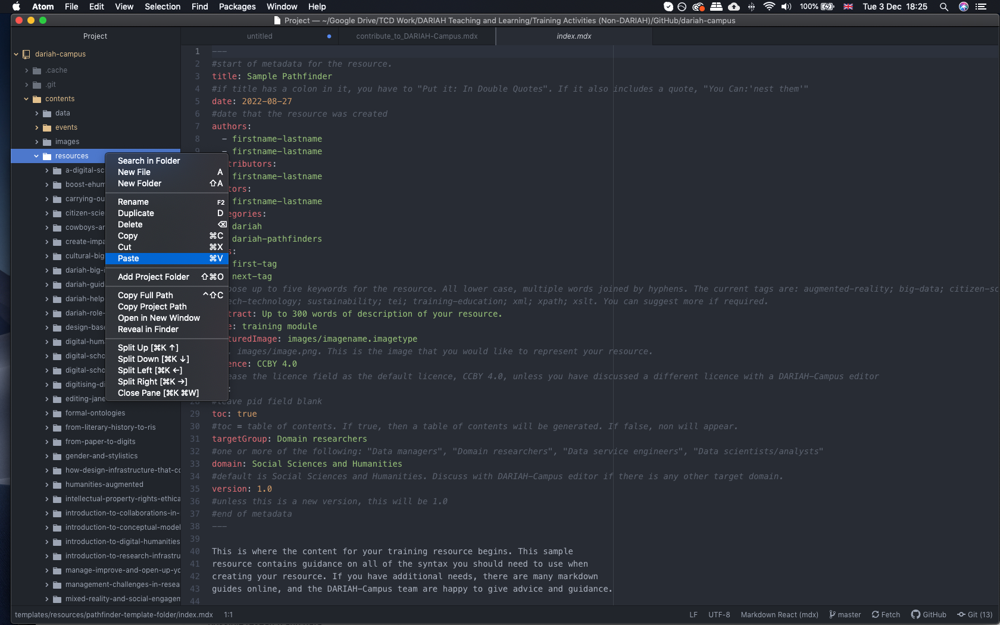
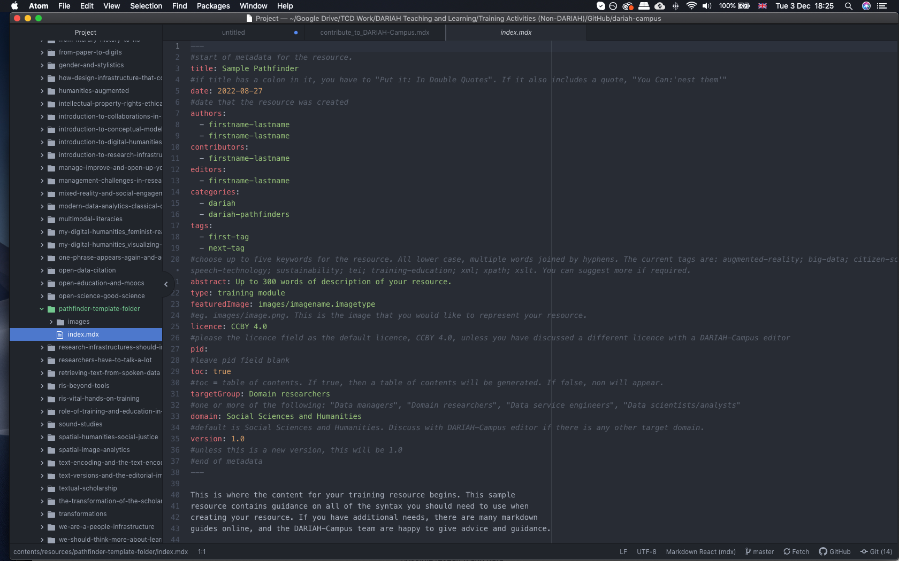
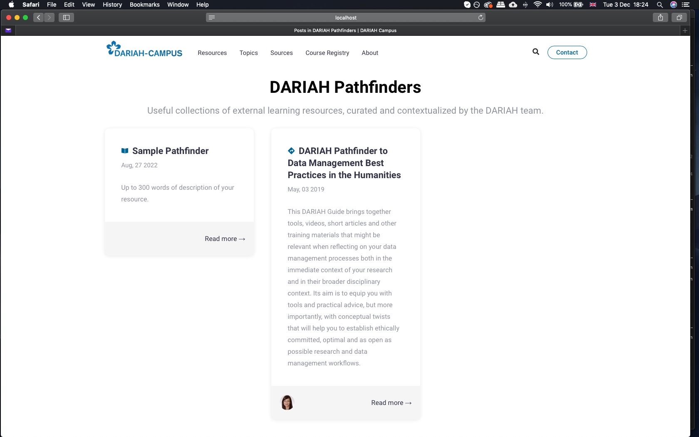
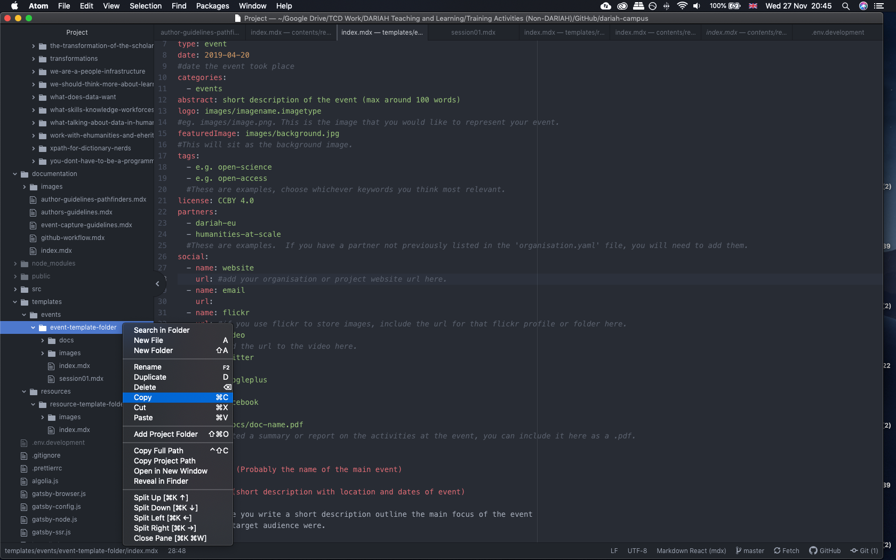

If you have training materials, or events that you would like to contribute to
DARIAH Campus, you can do so in a number of ways.

View the flowchart below to see what kind of resource you want to contribute.

Once you know what kind of contribution you’d like to make, you can click to the
appropriate instructions in the navigation panel in this section.

## Guidelines for Contributing a Learning Resource

### Suggesting an External Resource to DARIAH-Campus

#### Step 1

Many projects now develop training and education materials as part of their
outputs. If your project developed and published online training materials that
you would like to be made available via the DARIAH-Campus discover layer, then
we ask you to provide a structured abstract with the following information:

<Panel>

**Title:** Title of the resource.  **Date:** Date of publication. 
**Teaser description (<100 words):** A short description of the resource in
fewer than 100 words.  **Detailed description (<300 words):** A description
of the resource in fewer than 300 words.  **Author:** The author(s) of the
resource.  **Contributors:** Any other contributors to the resource. 
**Editors:** Any editors (if required)  **Lead project / Lead institution:**
The name of the project or lead institution that created the resource. 
**Keywords:** As many keywords as are relevant for the resource. 
**Domain:** A field of science or expertise covered by the resource. 
**Competence level:** Beginner, Intermediate, Advanced.

</Panel>

This information will be used to generate the most accurate possible metadata
and tags for the external resource in DARIAH-Campus.

#### Step 2

Your External Resource will be reviewed, and once approved by the DARIAH-Campus
team, it will be published on DARIAH-Campus.

### Proposing a DARIAH-Campus Hosted Resource

#### Step 1

If you have a set or compilation of training materials that you would like to be
hosted on DARIAH-Campus, then we’d love to hear from you. As a first step, we
ask you to provide a structured abstract with the following information:

<Panel>

**Title:** Title of the resource.  **Detailed description (<300 words):** A
description of the resource in fewer than 300 words.  **Author:** The
author(s) of the resource.  **Contributors:** Any other contributors to the
resource.  **Editors:** Any editors (if required).  **Lead project /
Lead institution:** The name of the project or lead institution that created the
resource.  **Keywords:** As many keywords as are relevant for the
resource.  **Domain:** A field of science or expertise covered by the
resource.  **Competence level:** Beginner, Intermediate, Advanced. 
**Technology requirements:** Any specific technology or software needed to
create/use the resource.  **Anticipated time of delivery:** An estimated
time for the completion of the resource to help with the planning process.

</Panel>

This information will be used to generate the most accurate possible metadata
and tags for the course in DARIAH-Campus.

#### Step 2

Upon receiving this information, we will get in touch to discuss the development
of your proposed material and to invite you to submit. However, before starting
in GitHub, it is perhaps useful to compile your materials and determine the
content needed for your learning resource. The editorial team are available
on-hand to make the process of providing and editing materials as simple as
possible.

**If you are NOT familiar with GitHub**, we recommend you follow the steps in
the GitHub Workflow to help get you set up and guide you through the initial
stages of creating content.

**[Go to GitHub Workflow](./docs/github-workflow)**

**If you ARE familiar with GitHub**, and already have DARIAH-Campus set up, you
can use the `resource-template-folder`, which contains a template index.mdx file
for you to copy and edit according to your needs.

You can find this template folder in your GitHub editor in the ‘templates’
folder i.e

`dariah-campus > templates > resources > resource-template-folder`

**Copy** (do not ‘drag and drop’) the entire folder, and then **paste** it into
the ‘resources’ folder in your fork

When you have these templates in your local ‘resources’ fork, you can start
editing. You can see an example of the edited `index.mdx` file here:

Within this file, you will write all the content you want to include in your
resource. If you need a little more assistance in how to format this, or to
include certain elements, such as videos, images, or tables, please take a look
at our ‘Writing in Markdown’ guide in the ‘GitHub Workflow section.

When you have your content in the index.mdx file, save it (although we also
recommend saving this iteratively in your GitHub editor as a matter of course),
and if you are running a local version of DARIAH-Campus in your browser you
should see your event appear in the ‘Resources’ page, as in here:

Once you are happy with your draft hosted resource, you can ‘commit’ it via
GitHub to the DARIAH-Campus team.

### Proposing a new Pathfinder

#### Step 1

If you would like to contribute a Pathfinder, please contact us via the DARIAH
Helpdesk with a structured abstract, including the following information:

<Panel>

**Title:** Title of the Pathfinder.  **Detailed description (<300 words):**
A description of the resource in fewer than 300 words.  **Author:** The
author(s) of the resource.  **Contributors:** Any other contributors to the
resource.  **Editors:** Any editors (if required)  **Keywords:** As many
keywords as are relevant for the resource.  **Domain:** A field of science
or expertise covered by the resource.  **Anticipated time of delivery:** An
estimated time for the completion of the resource to help with the planning
process.

</Panel>

The DARIAH-Campus team will then get back to you with any comments and/or
questions and a formal invitation to submit your material for review.

#### Step 2

DARIAH-Campus operates a community review system for our Pathfinders in order to
bring the broadest possible range of perspectives to each topic. Authors are
asked to send their Pathfinder to the DARIAH-Campus team as a Word document, and
it will be uploaded to GoogleDocs for comments from the community. Each
Pathfinder will remain open for four weeks, or until the author(s) are satisfied
that the review process is complete. There is no prescribed format for
DARIAH-Campus Pathfinders: both the form and content will be determined by their
topic, function, and audience. However, we ask that your review document:

- Provides the **basic metadata**: provide the title, author(s) and
  contributor(s) name(s), and keywords at the top of the document (as outlined
  above).
- Has an **introduction**: stating the purpose of the resource and what kinds of
  tools, information, bibliographical material, websites, etc that it brings
  together. Outline the structure of the resource and make it clear what the
  reader should learn from/get from it.
- Is **broken down into manageable sections**, organised under structuring
  headings, with a table of contents provided. Each section should provide
  **curated links** to relevant tools; websites; readings; and other resources,
  with contextualising interpretation, explanation, and/or narration.

#### Step 3

Once any reviews or revisions have been completed, the Pathfinder will be hosted
and version-controlled in a GitHub repository, and available on DARIAH-Campus.

We ask you to convert your Pathfinder into Markdown for publication. Text must
be provided in a text editor such as Atom, TextWrangler, TextEdit, or Notepad++
rather than in a word processor such as MS Word.

**If you are NOT familiar with GitHub**, we recommend you follow the steps in
the GitHub Workflow to help get you set up and guide you through the initial
stages of creating content.

**[Go to GitHub Workflow](./docs/github-workflow)**

**If you ARE familiar with GitHub**, and already have DARIAH-Campus set up, you
can use the `resource-template-folder`, which contains a template index.mdx file
for you to copy and edit according to your needs.

You can find this template folder in your GitHub editor in the ‘templates’
folder i.e.

`dariah-campus > templates > resources > resource-template-folder`

**Copy** (do not ‘drag and drop’) the entire folder, and then **paste** it into
the ‘resources’ folder in your fork

When you have these templates in your local ‘resources’ fork, you can start
editing. You can see an example of the edited `index.mdx` file here:

Within this file, you will write all the content you want to include in your
resource. If you need a little more assistance in how to format this, or to
include certain elements, such as videos, images, or tables, please take a look
at our ‘Writing in Markdown’ guide in the ‘GitHub Workflow section.

When you have your content in the index.mdx file, save it (although we also
recommend saving this iteratively in your GitHub editor as a matter of course),
and if you are running a local version of DARIAH-Campus in your browser you
should see your event appear in the ‘Resources’ page, as in here:

Once you are happy with your draft Pathfinder, you can ‘commit’ it via GitHub to
the DARIAH-Campus team.

## Guidelines for contributing a ‘Captured’ Event

In a recent report, it was found that the majority of the training contributions
made to DARIAH by its members were events (face-to-face workshops, lectures,
university courses or summer schools). DARIAH-Campus can support the ‘capture’
of events such as these and host the outputs from them to ensure they are
available for future users.

To help with this process, we have provided below some guidelines for making
training materials for face-to-face events available online with DARIAH-Campus.

### Step 1 - Capturing and Curating the Event Outputs

We encourage contributions of digital materials from face-to-face training that
are of maximum use to learners, whether they were in attendance at the event or
not. Slideshows, photographs, and videos, whilst forming a record of an event’s
existence, can lack vital contextualising information. Thus, they often lose
some of their effectiveness online. With this in mind, for summer schools;
conferences; and other larger-scale events we have created a template that
situates these materials within as much contextual information as possible (such
as abstracts; collaboratively-taken notes; other multimedia; contact details
etc).

We recommend that you draft up the structure and content of the contextualising
information in Word or Google Docs before moving to Step 2, unless you are very
comfortable with writing directly in Markdown.

### Step 2 - Preparing the Event for Publication on DARIAH-Campus

We ask you to convert your Event Outputs into Markdown for publication. Text
must be provided in a text editor such as Atom, TextWrangler, TextEdit, or
Notepad++ rather than in a word processor such as MS Word.

If you are NOT familiar with GitHub, we recommend you follow the steps in the
GitHub Workflow to help get you set up and guide you through the initial stages
of creating content.

**[Go to GitHub Workflow](./docs/github-workflow)**

If you are familiar with GitHub, and already have DARIAH-Campus set up, you can
use the `event-template-folder`, which contains a template `index.mdx` file for
you to copy and edit according to your needs.

You can find this template folder in your GitHub editor in the ‘templates’
folder i.e.

`dariah-campus > templates > events > event-template-folder`

**Copy** (do not ‘drag and drop’) the entire folder, and then **paste** it into
the ‘resources’ folder in your fork.

When you have these templates in your local ‘resources’ fork, you can start
editing. You can see an example of the edited `index.mdx` file here:

Within this file, you will write all the content you want to include in your
captured event. If you need a little more assistance in how to format this, or
to include certain elements, such as videos, images, or tables, please take a
look at our ‘Writing in Markdown’ guide in the ‘GitHub Workflow section.

When you have your content in the index.mdx file, save it (although we also
recommend saving this iteratively in your GitHub editor as a matter of course),
and if you are running a local version of DARIAH-Campus in your browser you
should see your event appear in the ‘Events’ page, as in here:

Once you are happy with your 'Captured Event', you can ‘commit’ it via GitHub to
the DARIAH-Campus team.

## Elements you may wish to include in your Learning Resource or Captured Event

Training materials can vary in how they are presented, and what is included.
DARIAH-Campus is not prescriptive in this regard, and we try to accommodate as
many forms of training materials as possible. Below are a few suggestions for
elements you may wish to include. To find out how to include these different
elements in Markdown, please refer to our ‘Writing in Markdown” document.

### Videos and Images

You may wish to include video lectures or short ‘explainer’ videos that you have
created, or that a third party has created that you find particularly useful.
You can do soon DARIAH-Campus, although **please note our Licensing Requirements
below**.

### Self-assessment activities

Self-assessment activities such as online tests or quizzes enliven the learning
process; address different learning styles; and provide opportunities to expand
upon the course content in the classroom or independently. These can include
quizzes; exercises; assignments; questions to consider in a group discussion;
practical step-by-step tutorials guiding learners through a task; and much more.
Since the technical guidelines for including this kind of material will vary
according to their nature, the DARIAH-Campus editorial team will be happy to
discuss your requirements as you develop your resource.

## Licensing, Citation and Accessibility

### Language and readability

Where writing in English, keep an international audience in mind and avoid
idioms and colloquialisms where possible. We are open to submissions in
languages other than English. We are committed to inclusiveness, and welcome new
additions to the editorial and reviewing team, in order to expand our reach.
Please contact us via the DARIAH Helpdesk, if you would like to be a part of
this team.

### Accessibility

Resources aim to be open and accessible to all. With that in mind, please think
about learners with disabilities as you create your course. The editor will help
with this (e.g. providing alt tags for images when creating the module).
However, in order to help, please consult BCcampus’s helpful Open Education
Accessibility Toolkit when writing your module and compiling the accompanying
resources. At the very least, please provide transcripts for all videos and pay
attention to creating sections and subsections with a clear hierarchy.

### Notes, Citations and Referencing

Authors can provide both endnotes and a bibliography, which should be formatted
using the Chicago Manual of Style. Bibliographical items will be presented as
links to the DARIAH-Campus Zotero bibliography.

### Openness and Licencing

D-C learning materials are licensed under a Creative Commons CC BY-SA licence.
This ensures that they are available for free; can be re-mixed and repurposed;
and are easy to combine with other materials and courses. The integrity of the
resource is ensured under the ‘Attribution’ requirement, whereby re-users must
give appropriate credit, provide a link to the license, and indicate if changes
were made.
