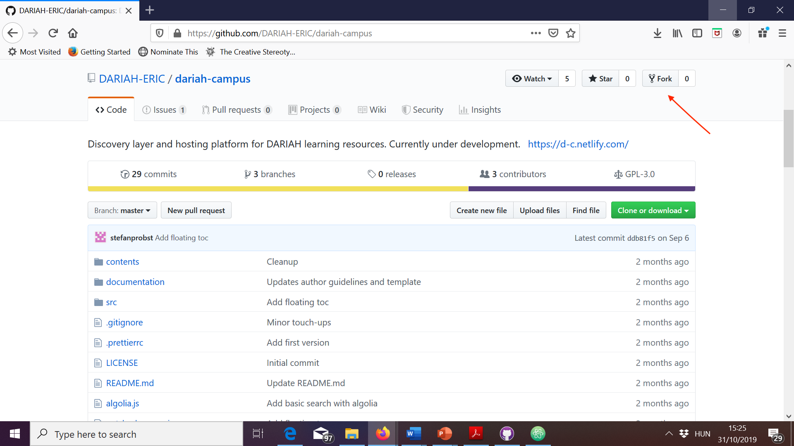
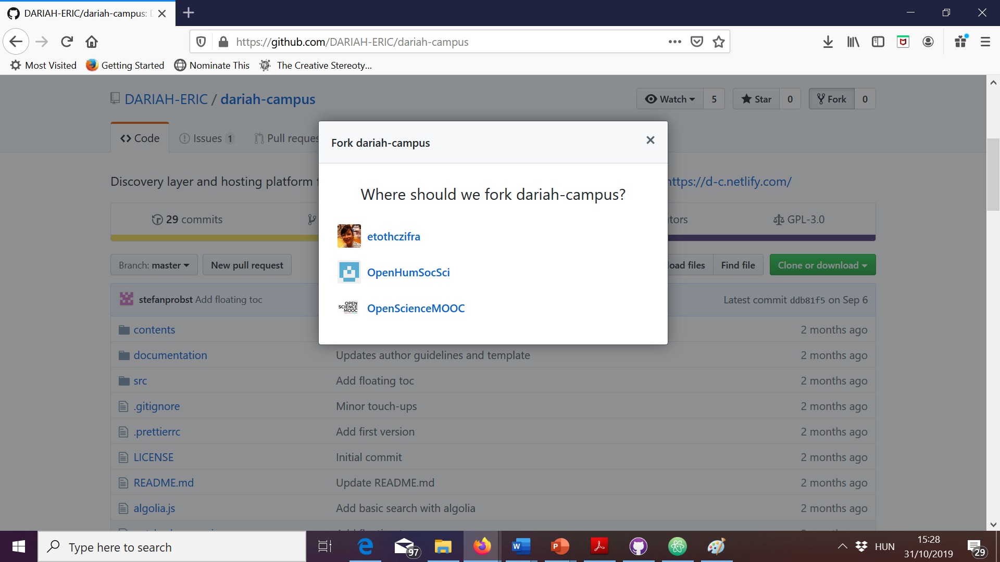
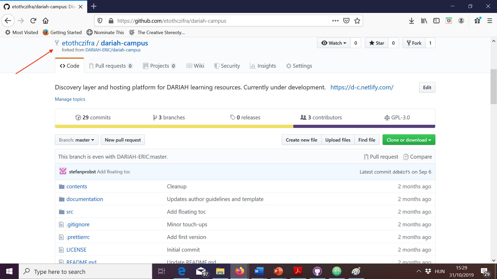
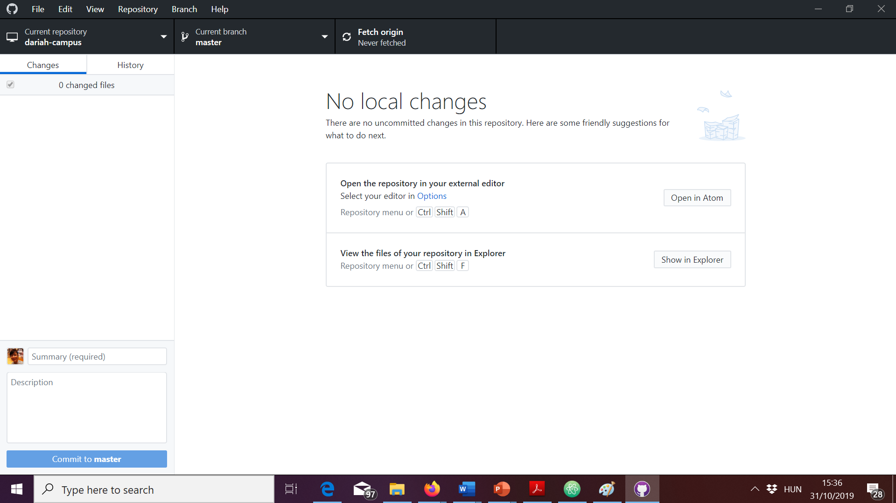
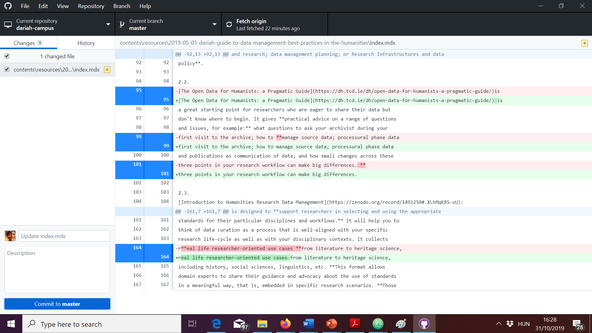
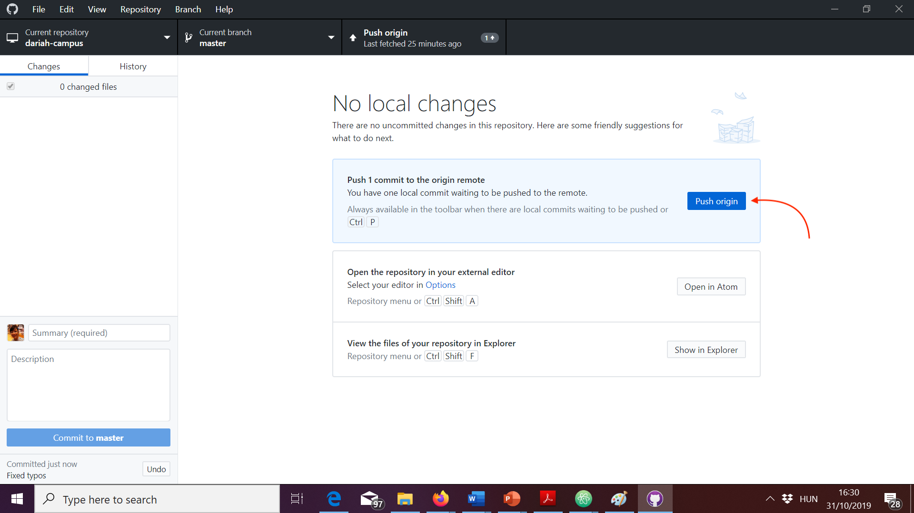
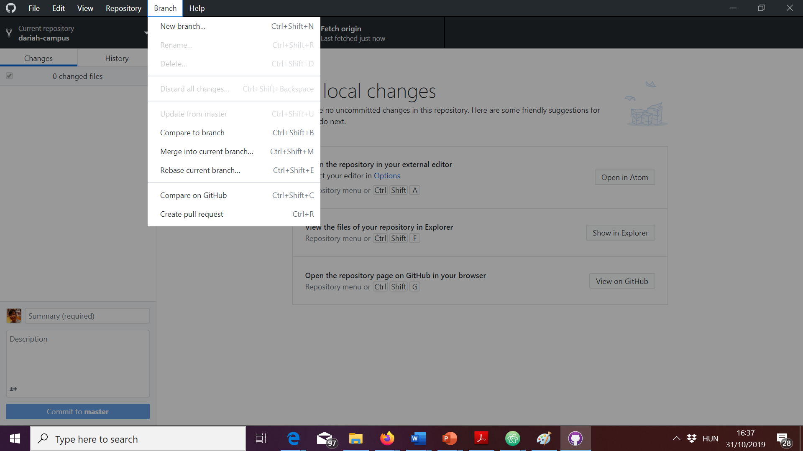

DARIAH-CAMPUS learning resources are

- written in **Markdown**, a lightweight markup language with easy-to-learn,
  plain-text formatting syntax; and
- hosted on **GitHub**, a popular repository hosting service based on the
  open-source version control software called git.

To submit content to DARIAH-CAMPUS, you should:

- use a text editor that supports Markdown. If you don't already use one, we
  recommend Atom.
- be familiar with our GitHub submission and editing workflow.

## Setting up DARIAH-Campus locally

1. If you haven't used GitHub before, make sure you
   [sign up](https://github.com/join) for a free account before you proceed.
2. Make sure you're logged in on GitHub.com.
3. Download and install [GitHub Desktop](https://desktop.github.com) on your
   computer.
4. Open GitHub Desktop on your computer.
5. Authenticate your GitHub Desktop application with your GitHub credentials by
   following these
   [instructions](https://help.github.com/en/desktop/getting-started-with-github-desktop/authenticating-to-github).
6. In your browser, go to
   [https://github.com/DARIAH-ERIC/dariah-campus](https://github.com/DARIAH-ERIC/dariah-campus)
   and click on "fork". 
7. If you are a contributor to various organizational repositories, GitHub may
   ask you to select where you would like to fork dariah-campus. Make your
   choice. 
8. Once the forking finishes, you will be taken to your own personal fork of
   DARIAH-CAMPUS. To make sure you are in the fork, check out that your user
   name (or the name of the organizational repository youo selected in step 7
   above) is displayed in the upper left corner.
   
9. Click on "Clone or download", then select "Open in Desktop".
   
10. In GitHub Desktop, choose where you want to save the cloned DARIAH-CAMPUS
    fork on your computer. 
11. The first you do this, it may take a couple of minutes, but don't despair,
    things will be quicker after the initial clone. Once you finish cloning your
    fork, you should see something like this:
    
12. To get to the folder with DARIAH-CAMPUS on your computer, click on Open in
    Atom (or your preferred editor, if you already set it up).

## Drafting your contribution

When you work on your own learning resource, you will work locally, on your
computer, in the locally cloned fork of DARIAH-CAMPUS.

Make sure you get into the habit of regularly syncing your local clone with the
remote clone and the original repository, as well as committing (saving) your
work both to your local clone and your remote server.

This may sound coumplicated, but is actually quite logical. Once you have done
it several times, it will become like second nature to you:

1. **Fetch origin**. Before you start a working session on your computer, make
   sure you "fetch origin":  This
   will update your local fork with possible changes you've made to your
   "origin", i.e. your fork on GitHub.com. This is important if you're, for
   instance, working on more than one computer.
2. **Merge from upstream**. Also, before you start your working session, you
   should merge from upstream by going to Branch > Merge into current branch >
   Select upstream/master and then clicking on "Merge upstream/master into
   master"  This will update your
   local fork with the changes that may have been submitted to the "upstream"
   DARIAH-CAMPUS, i.e. the original repository owned by DARIAH.
3. Do your work. On how to set up a new learning resource see USING TEMPLATES.
   TODO!
4. Save changes in Atom
5. Go to GitHub Desktop. You can see your recent changes are reflected in the
   Changes Tab: 
6. Write a short commit message for the changes you want to submit. You can
   leave the Description field emtpy: 
7. **Commit your work.** Click on "commit to master". This will save your
   initial work to _your_ fork _locally_.
8. **Push to your fork.** Click on "Push origin". This will save your work to
   _your_ fork _remotely_.  After you push,
   you can go to your fork on GitHub and click on "Commits". You will see that
   your changes have been committed to your fork on GitHub.com.

You can repeat the above as many times as you want while working on your
learning resource. None of the changes you commit and push as described above
will be submitted to the DARIAH-CAMPUS editors.

## Submitting your contribution

Once you're ready to submit, follow these steps:

1. Open GitHub Desktop and make sure you have no uncommitted changes in the
   Changes tab.
2. **Create a pull request.** Go to Branch > Create Pull Request.
   
   - A new window will open in your Browser. Click on the green button "Create
     pull request" 
   - If necessary, change the commit message. You don't have to leave a comment.
     Click on the green button "Create pull request".
      This will alert the
     editors that you have submitted a contribution for publication.
