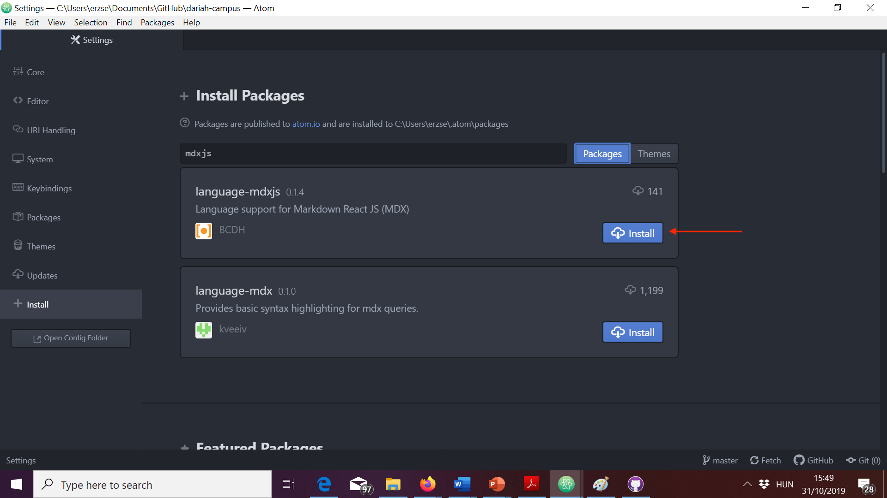
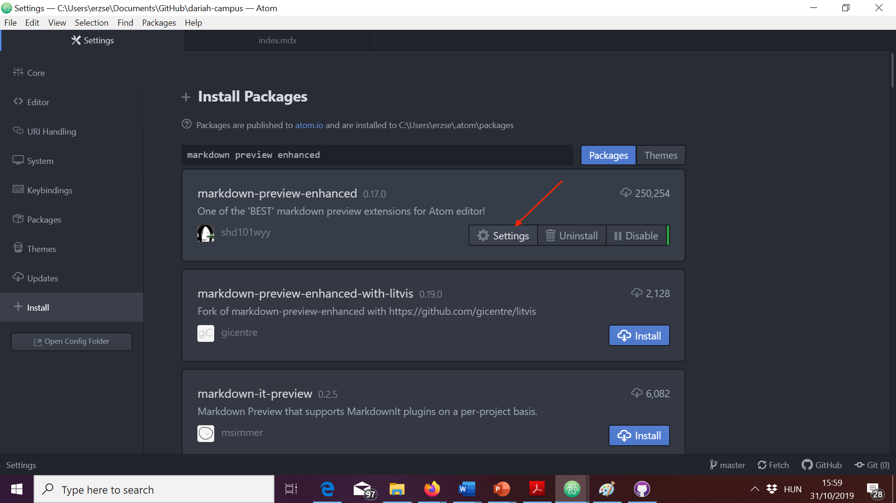
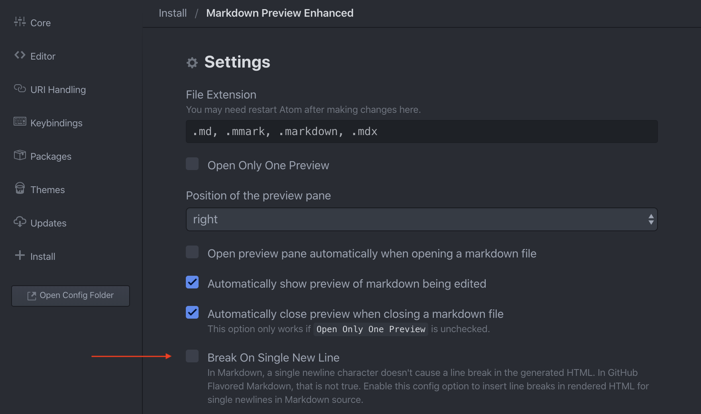

## What is Markdown?

DARIAH-Campus content needs to be written in Markdown. This can seem
intimidating if you have not done it before, but there are many online guides to
getting started with Markdown. For instance, Programming Historian have an
excellent introduction,
[Getting Started with Markdown](https://programminghistorian.org/lessons/getting-started-with-markdown).

Text must be provided in a text editor such as Atom, TextWrangler, TextEdit, or
Notepad++ rather than in a word processor such as MS Word.

To help with the process, we have created a DARIAH-Campus resources template,
which can be found in `/templates/resources/resource-template-folder/index.mdx`.
You can explore this file either on
[GitHub](https://github.com/DARIAH-ERIC/dariah-campus/blob/master/documentation/Sample-resource.mdx),
or locally, once you fork and clone the DARIAH-Campus repository. For
instructions on how to do that, see the documentation of our
[GitHub Workflow](/docs/github-workflow).

We are happy to provide guidance with using this at any stage of the preparation
and submission process.

## Setting up Atom

If you don't already use a Markdown-enabled text editor but wish to create
content for DARIAH-CAMPUS, you may want to use Atom, a customizable,
cross-platform open-source text editor.

If you already use a Markdown-enabled editor, you should continue to do so.
We're providing the instructions how to set up Atom only for those who are new
to Markdown. You should stick to the tools you know (and hopefully like).

1. Download and install [Atom](https://atom.io).
2. Open Atom.
3. Go to Atom > Preferences (if you are on a Mac) or File > Settings (if you are
   on Windows). Then click on Install: 
4. Make sure the "Packages" tab next to the search field is selected. Then type
   "mdxjs" in the search field and wait for results to show up. You should see a
   package called language-mdxjs in the results. Click on install.
   
5. In the search field, type: "Markdown Preview Enhanced". Install
   markdown-preview-enhanced.
6. Once the install finishes, click on Settings:
   
7. Once you open the settings for Markdown Preview Enhanced, you should see
   something like this: 
8. Click on the File Extension input field in Settings and type `, .mdx` after
   `.markdown` like this: 
9. Uncheck the check box next to "Break On Single New Line":
    You don't need to hit save.
10. Finally, go back to "Install", search for and install "Toolbar Markdown
    Writer".
11. Atom will ask you if you want to install dependencies, click on "Yes":
    

You should now have a functioning environment in Atom for your work on new
DARIAH-CAMPUS learning resources.

## Multimedia

### Images

Learning resources benefit from images to break up the text and for illustrative
and instructive purposes. The exact nature and content of these images is
flexible according to the type and topic area of your learning resource. They
can range from photographs; to infographics; diagrams; maps; screenshots and
more. These images should be incorporated into the body of your resource using
the following code:

``

The path or URL to the image asset is in parentheses. The text in square
brackets is the alt text.

To add a link to an image, enclose the Markdown for the image in brackets, and
then add the link in parentheses.

`[](https://linktotheimage.eu)`

We ask authors to use intelligible file names that either indicate the content
of the image (data-reuse-diagram.png) or indicate which figure it is within the
module (research-infrastructures-fig-1.png). Prepare either .png or .jpg and
upload at largest possible size. Check image reuse rights and choose content in
the public domain and under Creative Commons licenses. Provide a descriptive
figure caption, including source for third-party images, and other information
such as shelfmark where relevant.

### Videos

Videos are welcomed, since they provide vital contextual information on a
subject and/or step-by-step guidance to complete exercises and practical task.
To include a video as part of your material, you can upload it to the
DARIAH-Campus YouTube channel, or link to the video on your own channel. These
videos are included into the body of your material using the following code:

To insert a YouTube video, use the following code:

     ```jsx
     <VideoCard
       title="Title of the Video"
       id="SI3u9nu7YEY"
       image="images/imagename.jpg"
     />
     ```

- the "id" is the part of the url after "v=" and before "&". So, for
  "https://www.youtube.com/watch?v=SI3u9nu7YEY&t=164s" it is: "SI3u9nu7YEY".
- "image" allows you to choose a screenshot that will appear until the learner
  clicks the play button.

There are other options for inserting videos; guidance for these can be found in
the [Sample-resource template](link)

Any video published on the DARIAH-Campus YouTube Channel is covered by a
Creative Commons Attribution-NonCommercial-ShareAlike 4.0 International (CC
BY-NC-SA 4.0). We ask that any externally-hosted videos that you produce as part
of your materials are also licenced for reuse.

If linking to third-party videos, insert the video using the above code, and
provide the full details as a caption in your course text, in the following
format: "Title, Source, URL (Licence)".
